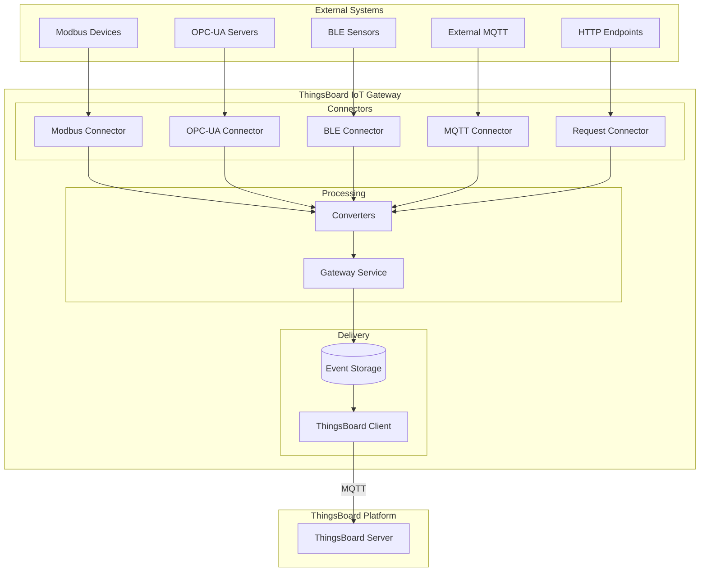
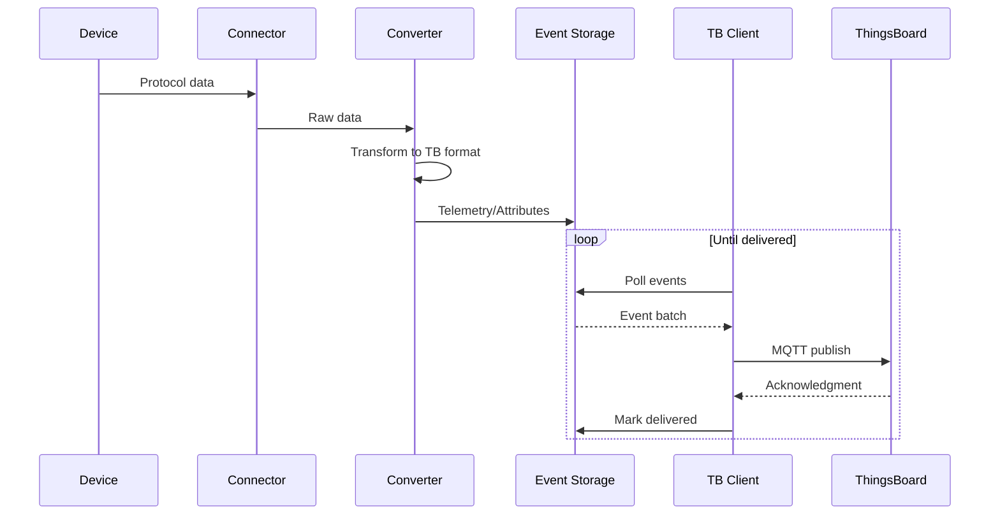
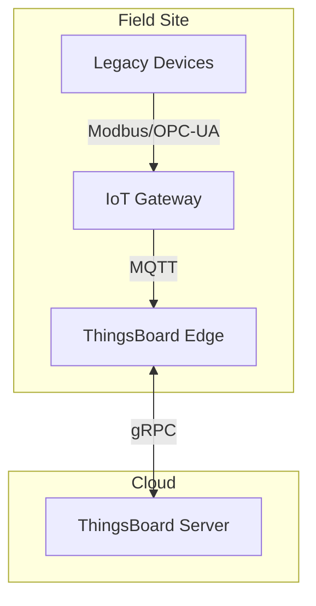

# IoT Gateway

## Overview

The ThingsBoard IoT Gateway is a Python-based software component that bridges legacy and third-party systems with the ThingsBoard platform. It connects to devices using industrial protocols (Modbus, OPC-UA, BACnet), wireless protocols (BLE, MQTT), and other interfaces, converting data to ThingsBoard's unified format. The gateway handles protocol translation, data buffering, and reliable delivery to the platform.

## Contents

| Document | Description |
|----------|-------------|
| [Gateway Architecture](./gateway-architecture.md) | Components, data flow, and deployment patterns |
| [Connectors Overview](./connectors-overview.md) | Available connector types and selection guide |

## Key Concepts

- **Connectors**: Protocol-specific modules that interface with external systems or devices
- **Converters**: Transform data between protocol-specific and ThingsBoard formats
- **Event Storage**: Buffers data locally to ensure delivery during network outages
- **ThingsBoard Client**: MQTT client that communicates with the platform
- **Gateway Service**: Orchestrates connectors, storage, and platform communication

## Architecture Overview



## Supported Connectors

| Connector | Protocol | Use Case |
|-----------|----------|----------|
| **Modbus** | Modbus TCP/RTU | Industrial sensors, PLCs, meters |
| **OPC-UA** | OPC Unified Architecture | Industrial automation, SCADA |
| **MQTT** | MQTT 3.1.1/5.0 | External MQTT brokers |
| **BLE** | Bluetooth Low Energy | Wireless sensors, beacons |
| **BACnet** | BACnet/IP | Building automation |
| **CAN** | CAN bus | Automotive, industrial |
| **Request** | HTTP/HTTPS | REST API endpoints |
| **REST** | HTTP server | Receive incoming HTTP data |
| **SNMP** | SNMP v1/v2c/v3 | Network equipment |
| **Socket** | TCP/UDP | Raw socket communication |
| **ODBC** | ODBC databases | Database polling |
| **FTP** | FTP/SFTP | File-based data collection |
| **XMPP** | XMPP protocol | Messaging systems |
| **OCPP** | OCPP 1.6/2.0 | EV charging stations |
| **KNX** | KNX protocol | Building automation |
| **Custom** | Any | User-defined connectors |

## Data Flow



## Deployment Options

| Deployment | Description |
|------------|-------------|
| **Standalone** | Direct installation on Linux (Python 3.7+) |
| **Docker** | Containerized deployment |
| **With Edge** | Gateway feeding data to ThingsBoard Edge |

### Gateway with Edge



## Hardware Requirements

| Deployment | RAM | CPU | Storage |
|------------|-----|-----|---------|
| Minimum | 256 MB | 1 core | 1 GB |
| Recommended | 512 MB | 2 cores | 4 GB |
| Heavy load | 1+ GB | 4 cores | 10+ GB |

Supported platforms:
- Raspberry Pi 3/4
- Industrial gateways
- Any Linux system with Python 3.7+

## Configuration Structure

```
/etc/thingsboard-gateway/config/
├── tb_gateway.json        # Main configuration
├── logs.json              # Logging configuration
├── modbus.json            # Modbus connector config
├── mqtt.json              # MQTT connector config
├── opcua.json             # OPC-UA connector config
└── ...                    # Other connector configs

/var/lib/thingsboard_gateway/extensions/
├── modbus/                # Custom Modbus converters
├── mqtt/                  # Custom MQTT converters
└── ...                    # Other custom extensions
```

## Common Pitfalls

Deploying and operating ThingsBoard IoT Gateway in production requires careful attention to runtime dependencies, platform connectivity, and configuration management. Teams commonly encounter issues in three areas: initial deployment (dependency conflicts, permission problems), platform communication (authentication errors, network configuration), and operational setup (configuration syntax, storage management). The pitfalls below represent real-world integration challenges that can impact gateway reliability, data delivery, and troubleshooting efficiency.

### Gateway Deployment

| Pitfall | Impact | Detection | Solution |
|---------|--------|-----------|----------|
| Runtime dependency version mismatch | Gateway fails to start, connector modules fail to load | Import errors in logs, "ModuleNotFoundError" messages | Use virtual environment with pinned dependency versions. Verify runtime version compatibility (3.7-3.11) before deployment |
| Insufficient file system permissions | Cannot access serial devices, cannot write to config/log directories | "Permission denied" errors, connector startup failures | Configure appropriate user permissions for serial ports, config directories. Use udev rules for device access |
| Under-provisioned hardware resources | Slow data processing, connector polling delays, OOM crashes | High CPU (>90%), memory exhaustion, slow telemetry delivery | Profile workload: connector count × poll frequency × data rate. Use Recommended specs (512MB RAM, 2 cores) for production |

### Platform Connectivity

| Pitfall | Impact | Detection | Solution |
|---------|--------|-----------|----------|
| Authentication credential format errors | Gateway cannot connect to platform, no data delivery | "Authentication failed" errors, connection refused | Use platform-provided access token (not routing key). Verify token format and validity in platform UI |
| Network firewall blocking communication | Connection timeouts, intermittent disconnects | "Connection timed out" errors, no established MQTT connection | Verify outbound access to platform on ports 1883 (MQTT) or 8883 (MQTTS). Check TLS certificate chain if using encrypted connection |
| Connection instability from high latency | Frequent disconnects/reconnects, duplicate data, queue buildup | Connection state flapping every few minutes, growing event queue | Tune keepalive interval (default 60s). Implement exponential backoff for retries. Consider platform deployment closer to gateway |

### Initial Setup

| Pitfall | Impact | Detection | Solution |
|---------|--------|-----------|----------|
| Configuration file syntax errors | Gateway fails to start, connectors not loaded | JSON parse errors in logs, gateway exits on startup | Validate JSON syntax before deployment. Use JSON linter or schema validator. Check for trailing commas, unmatched brackets |
| Event storage path misconfiguration | Cannot buffer data during outages, immediate data loss on disconnect | "Cannot write to storage" errors, no offline resilience | Verify storage path exists and has write permissions. Monitor disk space (alert at >80% full). Use dedicated partition for storage |
| Connector initialization failures | Specific protocol devices not connected, partial gateway functionality | Connector not in "CONNECTED" state, specific device data missing | Check connector-specific dependencies installed. Verify connector configuration parameters. Enable debug logging for connector troubleshooting |

**Detailed Example 1: Runtime Version Compatibility Issues**

**Problem**: Gateway deployed on system with incompatible runtime version (e.g., system runtime 3.6 when gateway requires 3.7+) experiences module import failures, particularly for connector modules requiring modern language features or specific library versions.

**Why This Happens**: ThingsBoard Gateway and its connector modules use language features and dependencies that may not be available in older runtime versions. System package managers often install older, stable versions that lack required functionality. Connectors like OPC-UA and Modbus may require specific versions of protocol libraries (e.g., `asyncua>=0.9`, `pymodbus>=2.5`) that have runtime version requirements.

**Detection**:
- Gateway logs show `ModuleNotFoundError` or `ImportError` during startup
- Specific connector logs show "module 'X' has no attribute 'Y'" errors
- Gateway process starts but connectors fail to initialize
- System check shows runtime version: `python3 --version` outputs 3.6.x or earlier

**Solution**:
1. **Immediate**: Install compatible runtime version (3.7-3.11) using distribution package manager or build from source
2. **Best practice**: Use virtual environment to isolate gateway dependencies from system runtime:
   ```bash
   python3.9 -m venv /opt/tb-gateway/venv
   source /opt/tb-gateway/venv/bin/activate
   pip install thingsboard-gateway
   ```
3. **Long-term**: Document runtime requirements in deployment guide. Use containerized deployment (Docker) with pinned runtime version to ensure consistency across environments

**Configuration Example**:
```json
{
  "thingsboard": {
    "host": "thingsboard.example.com",
    "port": 1883,
    "security": {
      "type": "accessToken",
      "accessToken": "YOUR_GATEWAY_ACCESS_TOKEN"
    }
  },
  "storage": {
    "type": "file",
    "data_folder_path": "/var/lib/tb-gateway/data"
  }
}
```

**Detailed Example 2: Event Storage Disk Exhaustion**

**Problem**: Gateway deployed with insufficient disk space for event storage experiences catastrophic data loss when platform connectivity is interrupted for extended periods. The local event queue fills the available disk space, causing the gateway process to crash and lose all buffered data.

**Why This Happens**: During network outages, the gateway buffers all telemetry, attributes, and RPC responses in local storage (file-based or memory-based). File-based storage can grow indefinitely if the outage duration exceeds capacity planning. A gateway handling 100 devices sending telemetry every 5 seconds generates ~17,000 events per minute. With average payload size of 500 bytes, this produces ~500MB per hour. A 4-hour outage can fill a 2GB partition.

**Detection**:
- Gateway logs show "No space left on device" or "Disk quota exceeded" errors
- Storage directory size growing rapidly: `du -sh /var/lib/tb-gateway/data`
- Gateway process terminates unexpectedly during outage
- Platform shows gap in telemetry timeline corresponding to outage duration
- Disk usage at 100%: `df -h` shows storage partition full

**Solution**:
1. **Immediate**: Clear old event storage files to free space (data loss occurs):
   ```bash
   rm /var/lib/tb-gateway/data/events_*.db
   systemctl restart tb-gateway
   ```
2. **Short-term**: Implement storage monitoring with alerts (>80% usage triggers investigation)
3. **Long-term**: Right-size storage capacity:
   - Calculate: `devices × msg/sec × payload_size × max_outage_hours × safety_factor(3x)`
   - Example: 100 devices × 0.2 msg/sec × 500 bytes × 24 hours × 3 = ~13GB minimum
   - Use dedicated partition for storage to prevent system-wide failures
   - Configure storage rotation or maximum queue depth to prevent unbounded growth

**Configuration Example**:
```json
{
  "storage": {
    "type": "file",
    "data_folder_path": "/var/lib/tb-gateway/data",
    "max_file_count": 100,
    "max_records_per_file": 10000
  }
}
```

**Detailed Example 3: Authentication Token Format Errors**

**Problem**: Gateway attempts to connect to platform using wrong credential format (e.g., using device credentials, routing key, or malformed token), resulting in authentication failures and complete inability to deliver any data to the platform.

**Why This Happens**: ThingsBoard platform supports multiple authentication mechanisms (access tokens, X.509 certificates, username/password) across different entity types (devices, gateways, edge). Gateways require specific access tokens provisioned through the Gateway entity in the platform UI. Users commonly confuse gateway access tokens with device access tokens (which have different scopes) or attempt to use routing keys (for Edge-Cloud communication) or provisioning credentials. Copy-paste errors can introduce whitespace or truncate tokens.

**Detection**:
- Gateway logs show "Connection refused" or "Authentication failed" errors
- MQTT connection never reaches "CONNECTED" state
- Platform audit logs show failed authentication attempts from gateway IP
- Gateway status in platform UI shows "DISCONNECTED" persistently
- Telemetry and connectivity events never appear in platform

**Solution**:
1. **Immediate**: Retrieve correct gateway access token from platform:
   - Navigate to Gateways → Select Gateway → "Copy Access Token"
   - Verify token format: alphanumeric string with no whitespace
   - Update gateway configuration with exact token string
2. **Verification**: Test authentication with platform connectivity check before full deployment
3. **Prevention**: Document token provisioning process. Use configuration management tools to deploy tokens securely. Implement validation checks in deployment scripts

**Configuration Example**:
```json
{
  "thingsboard": {
    "host": "thingsboard.example.com",
    "port": 1883,
    "security": {
      "type": "accessToken",
      "accessToken": "A1B2C3D4E5F6G7H8I9J0K1L2M3N4O5P6"
    }
  }
}
```

**Common Token Format Mistakes**:
- ❌ Using device access token instead of gateway token
- ❌ Including whitespace or newlines: `"A1B2C3...\n"`
- ❌ Using routing key from Edge configuration
- ❌ Truncated token from copy-paste error
- ✅ Correct: Clean alphanumeric string matching platform UI exactly

## See Also

- [Device Entity](../02-core-concepts/entities/device.md) - Device data model
- [Transport Layer](../05-transport-layer/README.md) - Platform transport protocols
- [Edge Computing](../12-edge/README.md) - Edge deployment
- [MQTT Protocol](../05-transport-layer/mqtt.md) - MQTT transport details
