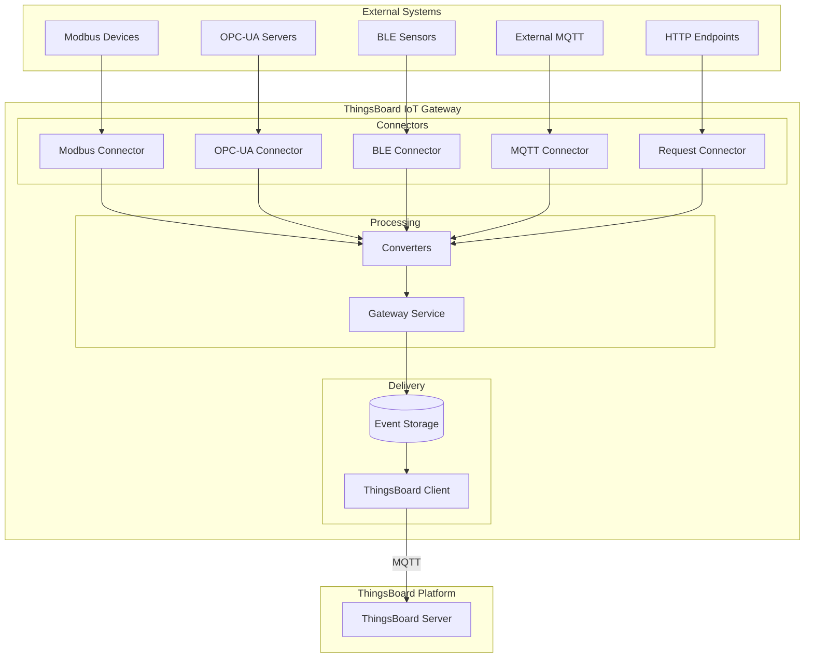
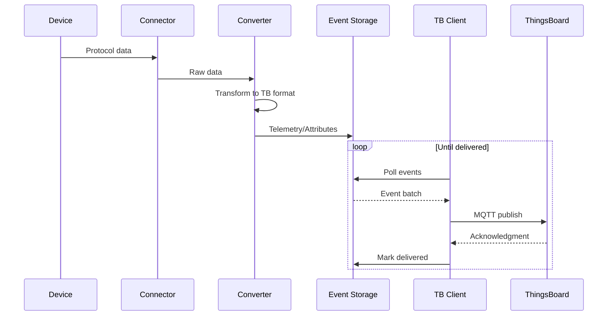
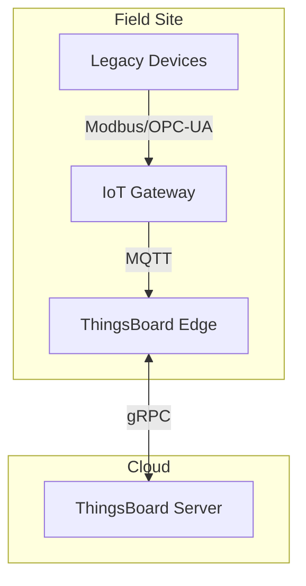

# IoT Gateway

## Overview

The ThingsBoard IoT Gateway is a Python-based software component that bridges legacy and third-party systems with the ThingsBoard platform. It connects to devices using industrial protocols (Modbus, OPC-UA, BACnet), wireless protocols (BLE, MQTT), and other interfaces, converting data to ThingsBoard's unified format. The gateway handles protocol translation, data buffering, and reliable delivery to the platform.

## Contents

| Document | Description |
|----------|-------------|
| [Gateway Architecture](./gateway-architecture.md) | Components, data flow, and deployment patterns |
| [Connectors Overview](./connectors-overview.md) | Available connector types and selection guide |

## Key Concepts

- **Connectors**: Protocol-specific modules that interface with external systems or devices
- **Converters**: Transform data between protocol-specific and ThingsBoard formats
- **Event Storage**: Buffers data locally to ensure delivery during network outages
- **ThingsBoard Client**: MQTT client that communicates with the platform
- **Gateway Service**: Orchestrates connectors, storage, and platform communication

## Architecture Overview



## Supported Connectors

| Connector | Protocol | Use Case |
|-----------|----------|----------|
| **Modbus** | Modbus TCP/RTU | Industrial sensors, PLCs, meters |
| **OPC-UA** | OPC Unified Architecture | Industrial automation, SCADA |
| **MQTT** | MQTT 3.1.1/5.0 | External MQTT brokers |
| **BLE** | Bluetooth Low Energy | Wireless sensors, beacons |
| **BACnet** | BACnet/IP | Building automation |
| **CAN** | CAN bus | Automotive, industrial |
| **Request** | HTTP/HTTPS | REST API endpoints |
| **REST** | HTTP server | Receive incoming HTTP data |
| **SNMP** | SNMP v1/v2c/v3 | Network equipment |
| **Socket** | TCP/UDP | Raw socket communication |
| **ODBC** | ODBC databases | Database polling |
| **FTP** | FTP/SFTP | File-based data collection |
| **XMPP** | XMPP protocol | Messaging systems |
| **OCPP** | OCPP 1.6/2.0 | EV charging stations |
| **KNX** | KNX protocol | Building automation |
| **Custom** | Any | User-defined connectors |

## Data Flow



## Deployment Options

| Deployment | Description |
|------------|-------------|
| **Standalone** | Direct installation on Linux (Python 3.7+) |
| **Docker** | Containerized deployment |
| **With Edge** | Gateway feeding data to ThingsBoard Edge |

### Gateway with Edge



## Hardware Requirements

| Deployment | RAM | CPU | Storage |
|------------|-----|-----|---------|
| Minimum | 256 MB | 1 core | 1 GB |
| Recommended | 512 MB | 2 cores | 4 GB |
| Heavy load | 1+ GB | 4 cores | 10+ GB |

Supported platforms:
- Raspberry Pi 3/4
- Industrial gateways
- Any Linux system with Python 3.7+

## Configuration Structure

```
/etc/thingsboard-gateway/config/
├── tb_gateway.json        # Main configuration
├── logs.json              # Logging configuration
├── modbus.json            # Modbus connector config
├── mqtt.json              # MQTT connector config
├── opcua.json             # OPC-UA connector config
└── ...                    # Other connector configs

/var/lib/thingsboard_gateway/extensions/
├── modbus/                # Custom Modbus converters
├── mqtt/                  # Custom MQTT converters
└── ...                    # Other custom extensions
```

## See Also

- [Device Entity](../02-core-concepts/entities/device.md) - Device data model
- [Transport Layer](../05-transport-layer/README.md) - Platform transport protocols
- [Edge Computing](../12-edge/README.md) - Edge deployment
- [MQTT Protocol](../05-transport-layer/mqtt.md) - MQTT transport details
