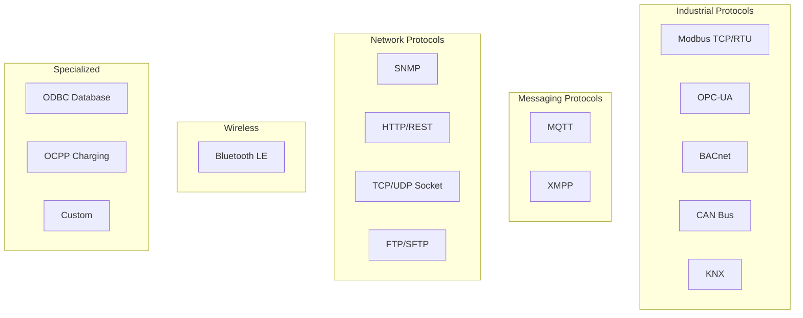
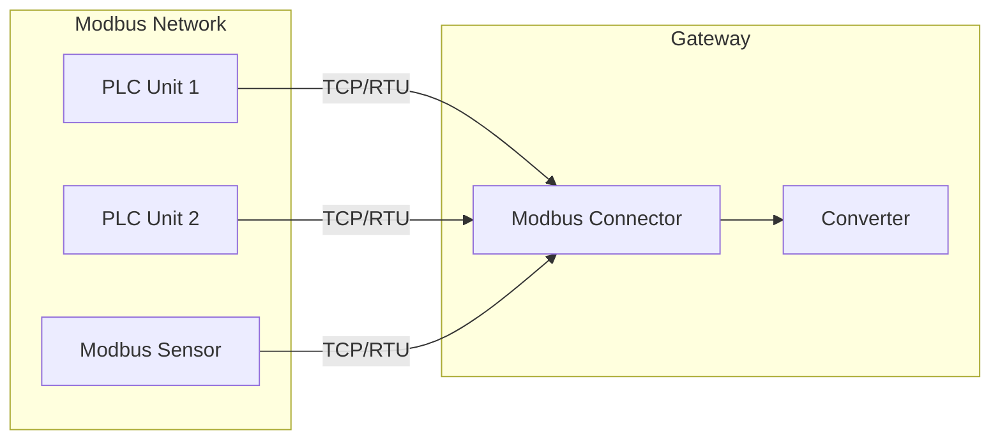
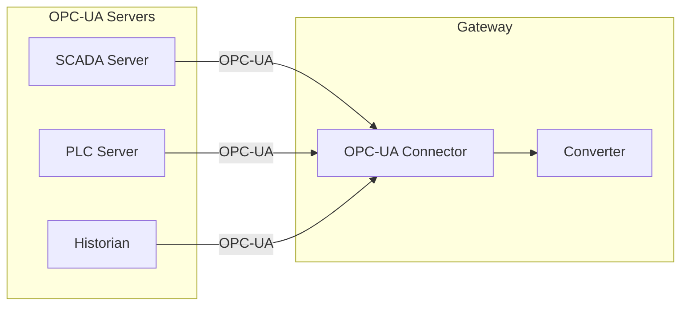
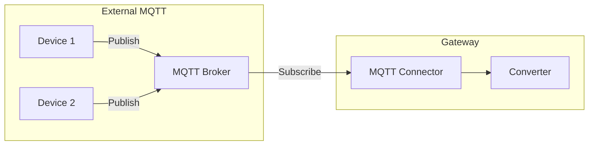
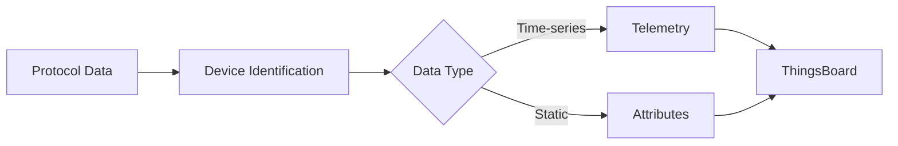
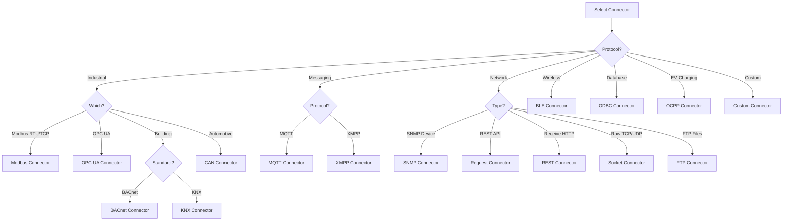

# Connectors Overview

## Overview

Connectors are protocol-specific modules within the ThingsBoard IoT Gateway that interface with external devices and systems. Each connector handles connection management, data collection, and bidirectional communication for its supported protocol. The gateway supports 15+ built-in connectors covering industrial, wireless, network, and custom protocols.

## Connector Categories



## Connector Comparison

| Connector | Protocol | Mode | RPC Support | Use Case |
|-----------|----------|------|-------------|----------|
| Modbus | Modbus TCP/RTU | Poll | Yes | Industrial sensors, PLCs |
| OPC-UA | OPC UA | Subscribe/Poll | Yes | Industrial automation |
| MQTT | MQTT 3.1.1/5.0 | Subscribe | Yes | External MQTT brokers |
| BLE | Bluetooth LE | Scan | No | Wireless sensors |
| BACnet | BACnet/IP | Poll | Yes | Building automation |
| CAN | CAN bus | Listen | Yes | Automotive, industrial |
| Request | HTTP client | Poll | No | REST API polling |
| REST | HTTP server | Listen | No | Incoming webhooks |
| SNMP | SNMP v1/v2c/v3 | Poll | Yes | Network equipment |
| Socket | TCP/UDP | Listen/Connect | Yes | Raw protocols |
| ODBC | SQL databases | Poll | No | Database integration |
| FTP | FTP/SFTP | Poll | No | File-based data |
| XMPP | XMPP | Subscribe | Yes | Messaging systems |
| OCPP | OCPP 1.6/2.0 | Listen | Yes | EV charging |
| KNX | KNX | Subscribe | Yes | Building automation |

## Industrial Connectors

### Modbus Connector

Connects to Modbus TCP servers or RTU serial devices. Supports both master (client) and slave (server) modes.

**Supported Features:**
- Modbus TCP and RTU
- Function codes: Read Coils (1), Read Discrete Inputs (2), Read Holding Registers (3), Read Input Registers (4), Write Single Coil (5), Write Single Register (6), Write Multiple Coils (15), Write Multiple Registers (16)
- Data types: bits, 16-bit integers, 32-bit integers/floats, strings
- Byte order configuration (big/little endian)

**Architecture:**



**Key Configuration:**

| Parameter | Description |
|-----------|-------------|
| type | tcp or serial |
| host/port | Server address (TCP) |
| port/baudrate | Serial port settings (RTU) |
| unitId | Modbus unit/slave ID |
| pollPeriod | Polling interval (ms) |

---

### OPC-UA Connector

Connects to OPC-UA servers for industrial data acquisition. Supports both subscription and polling modes.

**Supported Features:**
- OPC-UA subscriptions (data change notifications)
- Polling mode for servers without subscription support
- Security modes: None, Sign, SignAndEncrypt
- Authentication: Anonymous, Username/Password, Certificate
- Browse server namespace
- Read/write node values
- Method calls

**Architecture:**



**Key Configuration:**

| Parameter | Description |
|-----------|-------------|
| url | OPC-UA server endpoint |
| security | Security mode and policy |
| identity | Authentication credentials |
| scanPeriod | Node scan interval |
| subCheckPeriod | Subscription check interval |

---

### BACnet Connector

Connects to BACnet/IP devices for building automation integration.

**Supported Features:**
- BACnet/IP protocol
- Read properties (Present Value, Status Flags, etc.)
- Write properties
- COV (Change of Value) subscriptions
- Device discovery

**Use Cases:**
- HVAC systems
- Lighting control
- Access control
- Fire/safety systems

---

### CAN Connector

Interfaces with CAN bus networks common in automotive and industrial applications.

**Supported Features:**
- SocketCAN interface
- Standard and extended frame IDs
- DBC file parsing
- Signal decoding
- Message transmission

---

### KNX Connector

Connects to KNX building automation networks.

**Supported Features:**
- KNX/IP tunneling
- Group address communication
- Data point types (DPT)
- Read/write operations

## Messaging Connectors

### MQTT Connector

Connects to external MQTT brokers to collect data from MQTT-based IoT devices.

**Supported Features:**
- MQTT 3.1.1 and 5.0
- TLS/SSL encryption
- Username/password and certificate authentication
- Topic subscriptions with wildcards
- QoS levels 0, 1, 2
- Retained messages
- Last Will and Testament

**Architecture:**



**Key Configuration:**

| Parameter | Description |
|-----------|-------------|
| broker.host | MQTT broker address |
| broker.port | Broker port (1883/8883) |
| broker.security | TLS and auth settings |
| mapping | Topic-to-device mapping |

---

### XMPP Connector

Integrates with XMPP messaging servers.

**Supported Features:**
- XMPP protocol
- Message reception
- Presence handling

## Network Connectors

### SNMP Connector

Polls SNMP-enabled network devices for monitoring data.

**Supported Features:**
- SNMP v1, v2c, v3
- GET, GETNEXT, GETBULK operations
- SET operations for RPC
- Trap handling (planned)
- MIB parsing

**Use Cases:**
- Network switches/routers
- UPS systems
- Environmental monitors
- Printers

---

### Request Connector (HTTP Client)

Polls HTTP/HTTPS endpoints to collect data from REST APIs.

**Supported Features:**
- HTTP/HTTPS requests
- GET, POST, PUT methods
- Custom headers
- Authentication (Basic, Bearer, API Key)
- JSON/XML response parsing
- Configurable polling interval

---

### REST Connector (HTTP Server)

Creates HTTP endpoints to receive incoming data from external systems.

**Supported Features:**
- HTTP server endpoints
- Custom URL paths
- Request validation
- Response configuration

---

### Socket Connector

Handles raw TCP/UDP socket communication.

**Supported Features:**
- TCP client/server
- UDP client/server
- Custom message framing
- Binary and text protocols

---

### FTP Connector

Polls FTP/SFTP servers for file-based data collection.

**Supported Features:**
- FTP and SFTP
- File pattern matching
- CSV/JSON file parsing
- File archiving after processing

## Wireless Connectors

### BLE Connector

Scans and collects data from Bluetooth Low Energy devices.

**Supported Features:**
- BLE scanning
- GATT service/characteristic reading
- iBeacon/Eddystone parsing
- Connection and notification handling

**Use Cases:**
- Temperature/humidity sensors
- Asset tracking beacons
- Wearable devices

## Specialized Connectors

### ODBC Connector

Polls SQL databases for data collection.

**Supported Features:**
- ODBC database connection
- SQL query execution
- Configurable polling
- Multiple database support

---

### OCPP Connector

Implements the Open Charge Point Protocol for EV charging station integration.

**Supported Features:**
- OCPP 1.6 and 2.0
- Central System mode
- Charge point communication
- Transaction handling

## Data Mapping

All connectors use a mapping configuration to transform protocol data to ThingsBoard format.

**Mapping Flow:**



**Example Mapping (Modbus):**

```json
{
  "deviceName": "PLC-001",
  "deviceType": "plc",
  "attributes": [
    {
      "tag": "model",
      "type": "string",
      "address": 100,
      "registerCount": 8
    }
  ],
  "telemetry": [
    {
      "tag": "temperature",
      "type": "16int",
      "address": 0,
      "multiplier": 0.1
    },
    {
      "tag": "pressure",
      "type": "32float",
      "address": 2
    }
  ]
}
```

## Connector Selection Guide



## See Also

- [Gateway Architecture](./gateway-architecture.md) - Component details
- [Transport Layer](../05-transport-layer/README.md) - Platform protocols
- [Device Entity](../02-core-concepts/entities/device.md) - Device model
