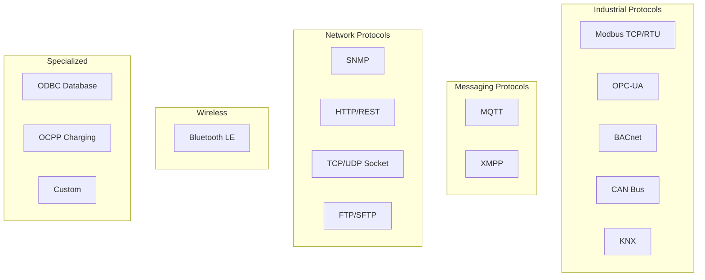
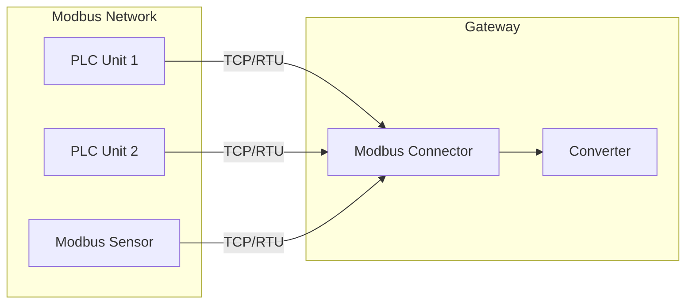
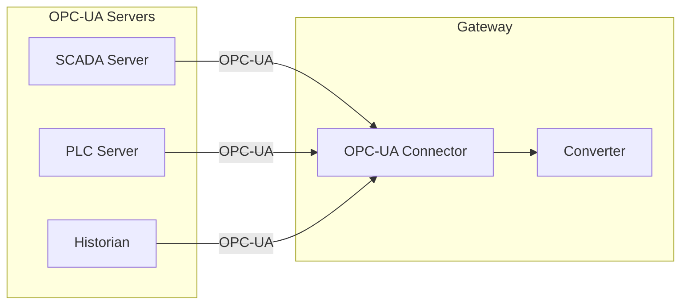
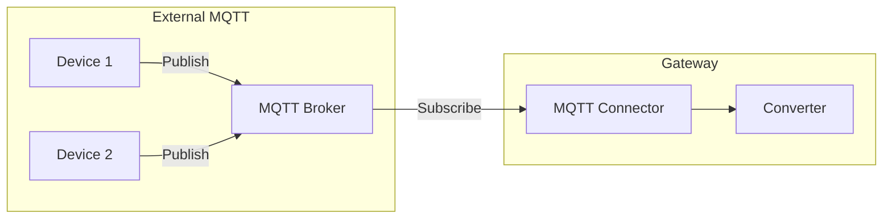
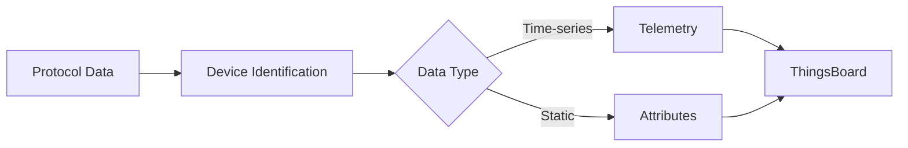
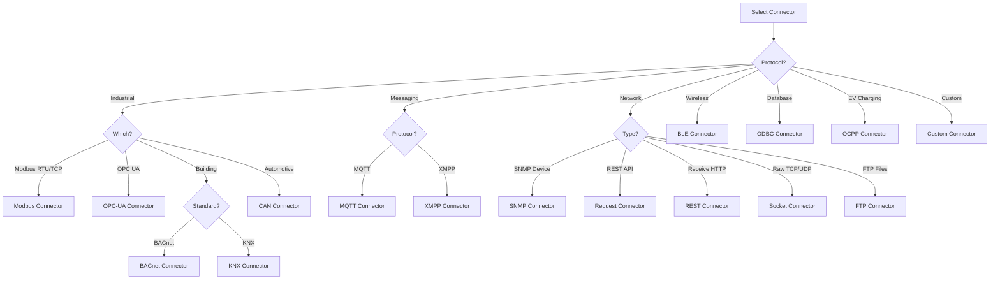

# Connectors Overview

## Overview

Connectors are protocol-specific modules within the ThingsBoard IoT Gateway that interface with external devices and systems. Each connector handles connection management, data collection, and bidirectional communication for its supported protocol. The gateway supports 15+ built-in connectors covering industrial, wireless, network, and custom protocols.

## Connector Categories



## Connector Comparison

| Connector | Protocol | Mode | RPC Support | Use Case |
|-----------|----------|------|-------------|----------|
| Modbus | Modbus TCP/RTU | Poll | Yes | Industrial sensors, PLCs |
| OPC-UA | OPC UA | Subscribe/Poll | Yes | Industrial automation |
| MQTT | MQTT 3.1.1/5.0 | Subscribe | Yes | External MQTT brokers |
| BLE | Bluetooth LE | Scan | No | Wireless sensors |
| BACnet | BACnet/IP | Poll | Yes | Building automation |
| CAN | CAN bus | Listen | Yes | Automotive, industrial |
| Request | HTTP client | Poll | No | REST API polling |
| REST | HTTP server | Listen | No | Incoming webhooks |
| SNMP | SNMP v1/v2c/v3 | Poll | Yes | Network equipment |
| Socket | TCP/UDP | Listen/Connect | Yes | Raw protocols |
| ODBC | SQL databases | Poll | No | Database integration |
| FTP | FTP/SFTP | Poll | No | File-based data |
| XMPP | XMPP | Subscribe | Yes | Messaging systems |
| OCPP | OCPP 1.6/2.0 | Listen | Yes | EV charging |
| KNX | KNX | Subscribe | Yes | Building automation |

## Industrial Connectors

### Modbus Connector

Connects to Modbus TCP servers or RTU serial devices. Supports both master (client) and slave (server) modes.

**Supported Features:**
- Modbus TCP and RTU
- Function codes: Read Coils (1), Read Discrete Inputs (2), Read Holding Registers (3), Read Input Registers (4), Write Single Coil (5), Write Single Register (6), Write Multiple Coils (15), Write Multiple Registers (16)
- Data types: bits, 16-bit integers, 32-bit integers/floats, strings
- Byte order configuration (big/little endian)

**Architecture:**



**Key Configuration:**

| Parameter | Description |
|-----------|-------------|
| type | tcp or serial |
| host/port | Server address (TCP) |
| port/baudrate | Serial port settings (RTU) |
| unitId | Modbus unit/slave ID |
| pollPeriod | Polling interval (ms) |

---

### OPC-UA Connector

Connects to OPC-UA servers for industrial data acquisition. Supports both subscription and polling modes.

**Supported Features:**
- OPC-UA subscriptions (data change notifications)
- Polling mode for servers without subscription support
- Security modes: None, Sign, SignAndEncrypt
- Authentication: Anonymous, Username/Password, Certificate
- Browse server namespace
- Read/write node values
- Method calls

**Architecture:**



**Key Configuration:**

| Parameter | Description |
|-----------|-------------|
| url | OPC-UA server endpoint |
| security | Security mode and policy |
| identity | Authentication credentials |
| scanPeriod | Node scan interval |
| subCheckPeriod | Subscription check interval |

---

### BACnet Connector

Connects to BACnet/IP devices for building automation integration.

**Supported Features:**
- BACnet/IP protocol
- Read properties (Present Value, Status Flags, etc.)
- Write properties
- COV (Change of Value) subscriptions
- Device discovery

**Use Cases:**
- HVAC systems
- Lighting control
- Access control
- Fire/safety systems

---

### CAN Connector

Interfaces with CAN bus networks common in automotive and industrial applications.

**Supported Features:**
- SocketCAN interface
- Standard and extended frame IDs
- DBC file parsing
- Signal decoding
- Message transmission

---

### KNX Connector

Connects to KNX building automation networks.

**Supported Features:**
- KNX/IP tunneling
- Group address communication
- Data point types (DPT)
- Read/write operations

## Messaging Connectors

### MQTT Connector

Connects to external MQTT brokers to collect data from MQTT-based IoT devices.

**Supported Features:**
- MQTT 3.1.1 and 5.0
- TLS/SSL encryption
- Username/password and certificate authentication
- Topic subscriptions with wildcards
- QoS levels 0, 1, 2
- Retained messages
- Last Will and Testament

**Architecture:**



**Key Configuration:**

| Parameter | Description |
|-----------|-------------|
| broker.host | MQTT broker address |
| broker.port | Broker port (1883/8883) |
| broker.security | TLS and auth settings |
| mapping | Topic-to-device mapping |

---

### XMPP Connector

Integrates with XMPP messaging servers.

**Supported Features:**
- XMPP protocol
- Message reception
- Presence handling

## Network Connectors

### SNMP Connector

Polls SNMP-enabled network devices for monitoring data.

**Supported Features:**
- SNMP v1, v2c, v3
- GET, GETNEXT, GETBULK operations
- SET operations for RPC
- Trap handling (planned)
- MIB parsing

**Use Cases:**
- Network switches/routers
- UPS systems
- Environmental monitors
- Printers

---

### Request Connector (HTTP Client)

Polls HTTP/HTTPS endpoints to collect data from REST APIs.

**Supported Features:**
- HTTP/HTTPS requests
- GET, POST, PUT methods
- Custom headers
- Authentication (Basic, Bearer, API Key)
- JSON/XML response parsing
- Configurable polling interval

---

### REST Connector (HTTP Server)

Creates HTTP endpoints to receive incoming data from external systems.

**Supported Features:**
- HTTP server endpoints
- Custom URL paths
- Request validation
- Response configuration

---

### Socket Connector

Handles raw TCP/UDP socket communication.

**Supported Features:**
- TCP client/server
- UDP client/server
- Custom message framing
- Binary and text protocols

---

### FTP Connector

Polls FTP/SFTP servers for file-based data collection.

**Supported Features:**
- FTP and SFTP
- File pattern matching
- CSV/JSON file parsing
- File archiving after processing

## Wireless Connectors

### BLE Connector

Scans and collects data from Bluetooth Low Energy devices.

**Supported Features:**
- BLE scanning
- GATT service/characteristic reading
- iBeacon/Eddystone parsing
- Connection and notification handling

**Use Cases:**
- Temperature/humidity sensors
- Asset tracking beacons
- Wearable devices

## Specialized Connectors

### ODBC Connector

Polls SQL databases for data collection.

**Supported Features:**
- ODBC database connection
- SQL query execution
- Configurable polling
- Multiple database support

---

### OCPP Connector

Implements the Open Charge Point Protocol for EV charging station integration.

**Supported Features:**
- OCPP 1.6 and 2.0
- Central System mode
- Charge point communication
- Transaction handling

## Data Mapping

All connectors use a mapping configuration to transform protocol data to ThingsBoard format.

**Mapping Flow:**



**Example Mapping (Modbus):**

```json
{
  "deviceName": "PLC-001",
  "deviceType": "plc",
  "attributes": [
    {
      "tag": "model",
      "type": "string",
      "address": 100,
      "registerCount": 8
    }
  ],
  "telemetry": [
    {
      "tag": "temperature",
      "type": "16int",
      "address": 0,
      "multiplier": 0.1
    },
    {
      "tag": "pressure",
      "type": "32float",
      "address": 2
    }
  ]
}
```

## Connector Selection Guide



## Common Pitfalls

Integrating ThingsBoard IoT Gateway with diverse devices and protocols requires careful attention to protocol-specific configuration, data mapping, and operational monitoring. Teams commonly encounter issues across nine areas: Modbus addressing and data types, OPC-UA certificates and node structures, BLE connection management, MQTT topic patterns, converter data transformation, data flow integrity, platform communication patterns, monitoring visibility, and security hardening. These pitfalls represent real-world integration challenges that span device commissioning, production operation, and troubleshooting.

### Modbus Connector

| Pitfall | Impact | Detection | Solution |
|---------|--------|-----------|----------|
| Register address confusion (0-based vs 1-based) | Reading wrong registers, incorrect or garbage data | Data values don't match device display, telemetry shows unexpected numbers | Device manuals show register 40001+ (1-based), config needs address 0+ (0-based). Subtract function code base (e.g., 40001 → address 0) |
| Data type and byte order mismatch | Corrupted values, temperature reads as 67000°C instead of 25.5°C | Telemetry values orders of magnitude wrong, negative when positive expected | Match data type to device: "16int", "32float", etc. Set byte order: "BIG" for most PLCs, "LITTLE" for some controllers. Test with known values |
| Polling rate too aggressive | Device crashes, timeouts, or refuses connections | "Timeout reading register" errors, device unresponsive, slave stops responding | Increase poll period from 100ms to 1000ms+ for industrial devices. Use 5000ms+ for slow devices like meters. Monitor device CPU load |
| RTU serial configuration mismatch | No communication, timeout errors immediately | All read attempts timeout, "No response from slave" errors | Match device settings exactly: baud rate (9600/19200), parity (N/E/O), stop bits (1/2). Common: 9600-8-N-1 for meters, 19200-8-E-1 for PLCs |
| Function code errors | Device returns exception code 0x01 (illegal function) | "Modbus exception 01" in logs, no data retrieved | Use FC03 for holding registers, FC04 for input registers, FC01/02 for coils. Check device manual for supported functions per register range |
| Timeout configuration too short | False timeouts on slow or distant devices | Frequent "Request timeout" despite device working | Increase timeout from default 5s to 10-30s for slow devices or serial connections. Use 1-3s for TCP, 5-10s for RTU |

### OPC-UA Connector

| Pitfall | Impact | Detection | Solution |
|---------|--------|-----------|----------|
| Certificate trust issues | Connection refused, cannot establish secure channel | "BadSecurityChecksFailed" or "Certificate not trusted" errors | Add server certificate to gateway trust store. For self-signed certs, copy to `/var/lib/tb-gateway/certificates/` and configure trust. Use proper PKI for production |
| Node ID format errors (namespace index wrong) | "Node not found" errors, cannot read any data | "BadNodeIdUnknown" errors, all subscriptions fail | Verify namespace index matches server. Use `ns=2;s=DeviceName.Temperature` format. Browse server with UA Expert to find correct Node IDs |
| Using polling when subscriptions available | High server CPU load, delayed data updates, performance issues | Server CPU > 80%, data updates 5-10s behind, slow dashboard refresh | Switch from polling to subscriptions in connector config. Subscriptions push data on change, far more efficient than 1-second polling |
| Array node handling errors | Only first element retrieved, rest of array missing | Telemetry shows single value when device has array of 10 measurements | Configure array reading in mapping. Use array index notation: `ArrayNode[0]`, `ArrayNode[1]` or read entire array and process in converter |
| Encryption mode mismatch | Connection fails with security policy errors | "Requested security mode not supported" errors | Match client security mode to server config. Try None → Basic256Sha256 → Aes128Sha256RsaOaep. Check server capabilities with UA client tool |
| Browse operation performance | Gateway startup takes 10+ minutes, timeouts during initialization | Very slow connector startup, browse timeouts, high CPU during init | Avoid browsing 10,000+ nodes. Pre-define Node IDs in config from commissioning. Use targeted subscriptions instead of full server browse |

### BLE Connector

| Pitfall | Impact | Detection | Solution |
|---------|--------|-----------|----------|
| Bluetooth adapter not available or permissions | Connector fails to start, no BLE devices detected | "hci0 not found" or "Permission denied: /dev/bluetooth" errors | Verify Bluetooth hardware: `hciconfig`. Add gateway user to `bluetooth` group. Grant BLE capabilities: `setcap cap_net_raw,cap_net_admin+eip $(which python3)` |
| Connection range issues | Intermittent disconnects, data gaps, devices show offline | Devices connect/disconnect frequently, "Connection timeout" errors | Keep devices within 10m line-of-sight. Remove obstacles (metal, concrete). Use external BLE adapter with antenna for better range |
| Characteristic UUID errors | Cannot read data, "Attribute not found" errors | "Characteristic UUID not found" in logs, no telemetry from device | Use correct 128-bit UUID format: "0000180f-0000-1000-8000-00805f9b34fb". Browse device with nRF Connect app to find correct UUIDs |
| Polling rate causing battery drain | Sensor batteries die in days instead of months | Device battery level drops rapidly, device reports low battery early | Reduce poll period from 1s to 30-60s minimum. Use notifications instead of polling where supported. Match manufacturer's recommended intervals |
| Concurrent connection limits exceeded | Some devices never connect, connection failures | Can only connect to 7 devices when 10 configured, consistent failures | Bluetooth adapters typically support 7 concurrent connections. Use multiple adapters or reduce device count per gateway. Consider BLE mesh |
| Scan window configuration too short | Missing beacon advertisements, devices not discovered | Devices don't appear in scan results, intermittent detection | Increase scan window from 1s to 5-10s. Use passive scanning. Reduce scan interval for critical beacons. Balance power consumption vs detection latency |

### MQTT Connector

| Pitfall | Impact | Detection | Solution |
|---------|--------|-----------|----------|
| Topic wildcard confusion in converter config | Converter fails to process messages, data loss | "Topic pattern not matched" errors, messages received but not converted | Don't use MQTT wildcards (+/#) in converter topicFilter. Use exact topic or simple prefix match. Configure wildcards only in subscription, not converter matching |
| QoS level mismatch with external broker | Message loss or performance issues | Messages missing randomly (QoS 0), extreme latency (QoS 2) | Match external broker QoS capabilities. Use QoS 1 for balance of reliability and performance. Avoid QoS 2 unless broker requires it |
| Missing authentication credentials | Cannot connect to broker requiring auth | "Not authorized" or "Authentication failed" errors | Configure username/password in connector config. Use clientId if broker requires specific identity. Test credentials with MQTT client tool first |
| Duplicate device names from multiple publishers | Data mixed between devices, telemetry attributed to wrong device | Dashboard shows combined data from multiple sources, inconsistent values | Ensure unique device names across all publishers. Use publisher ID prefix: "Publisher1-Device001". Configure topic structure to include unique identifiers |
| Non-JSON payload with JSON converter | Parsing failures, connector stops processing | "JSON decode error" in logs, connector disabled after exception | Match converter type to payload format. Use "bytes" or "custom" converter for non-JSON. Validate payload format with MQTT client before deployment |
| Retained messages processed on restart | Old/stale data republished every gateway restart | Duplicate historical data, dashboard shows same values repeatedly | Clear retained messages on broker or configure connector to ignore retained flag. Use "clean_session=true" to avoid reprocessing old messages |

### Converter Pitfalls

| Pitfall | Impact | Detection | Solution |
|---------|--------|-----------|----------|
| JSONPath syntax errors in expressions | Extraction fails silently, telemetry missing | Converter logs "Expression evaluation failed", partial telemetry published | Validate JSONPath against sample data: `$.data.temp` vs `$.temp`. Use online JSONPath testers. Add defensive null checks |
| Missing null checks for optional fields | Converter crashes when device omits field | "NoneType has no attribute" exceptions, connector disabled | Check field existence before access: `data.get("optional_field", default_value)`. Use try/except for conversion. Provide sensible defaults |
| Type conversion failures | String "23.5" to int fails, telemetry lost | "ValueError: invalid literal for int()" in logs | Match conversion to data type: `float("23.5")` succeeds, `int("23.5")` fails. Use `int(float("23.5"))` or validate format first |
| Timestamp format handling | Wrong timestamps, data rejected by platform, or timezone issues | Telemetry appears with wrong time, data rejected as "too old" | Use millisecond epoch timestamps. Convert ISO 8601: `int(datetime.fromisoformat(ts).timestamp() * 1000)`. Handle timezone consistently (UTC) |
| Device name collision | Multiple physical devices mapped to same name, data mixed | Single device dashboard shows combined data from multiple sources | Ensure unique device naming. Include device ID/serial in name: `deviceName = f"Sensor-{device_id}"`. Validate uniqueness during commissioning |
| Attribute vs telemetry confusion | Data sent as wrong type, not persisted or not time-series | Configuration changes not saved (sent as telemetry) or firmware version changing over time (sent as telemetry) | Use attributes for static/configuration data (firmware, model). Use telemetry for time-series measurements (temp, pressure) |

### Data Flow Pitfalls

| Pitfall | Impact | Detection | Solution |
|---------|--------|-----------|----------|
| Event ordering loss in file storage | Out-of-order data delivery, causality violations | Dashboard shows temperature decreased before heater turned off | Use timestamp-based ordering. Configure file storage with sequential processing. Avoid parallel event processing for time-sensitive data |
| Duplicate data after gateway restart | Same telemetry sent multiple times | Dashboard shows duplicate values at exact same timestamp | Implement event deduplication with message IDs. Configure storage to mark events as sent before delivery. Use platform deduplication if available |
| Backpressure from fast connectors | Queue grows unbounded, eventual OOM crash | Event storage queue depth increasing: 1000 → 10000 → 100000 | Implement connector rate limiting. Add backpressure signaling: slow polling when queue > threshold. Use file storage with limits, not unbounded memory queue |
| Batch size too large | MQTT message exceeds 256KB limit, rejected by platform | "Payload too large" errors, batch delivery fails, events remain queued | Reduce batch size from 1000 to 50-100 events. Configure maximum message size. Balance throughput vs individual message size |
| Memory leaks in custom converters | Gateway memory usage grows over time, eventual crash | RSS memory grows from 50MB to 500MB+ over days, slow degradation | Release object references after processing. Avoid global state accumulation. Profile with memory profiler. Restart gateway periodically as mitigation |
| Thread safety in shared converter state | Race conditions, corrupted data, intermittent failures | Random data corruption under load, inconsistent behavior, hard to reproduce bugs | Use thread-local storage or locks for shared state. Avoid mutable class variables. Make converters stateless when possible |

### Platform Communication

| Pitfall | Impact | Detection | Solution |
|---------|--------|-----------|----------|
| Exceeding platform rate limits | Gateway throttled or banned, queue grows, data delayed | Platform returns 429 errors, connection refused, growing event backlog | Respect rate limits: typically 100-1000 msg/sec per gateway. Implement client-side rate limiting. Use batch publishing. Request limit increase if needed |
| Single message exceeding size limit | Messages rejected, data loss for that batch | "Message too large" errors, specific batches never delivered | Platform limit typically 64KB-256KB per message. Reduce batch size. Split large device telemetry into multiple messages. Compress payload if supported |
| Telemetry before device provisioning | Data lost, device doesn't exist error | "Device not found" errors, telemetry disappears without trace | Publish `v1/gateway/connect` before first telemetry. Ensure provisioning completes. Add retry logic for provisioning failures. Use gateway claims provisioning |
| Shared attribute updates not received | RPC attributes don't update local cache | Attributes show stale values, RPC requests use old parameters | Subscribe to `v1/gateway/attributes/response` topic. Request shared attributes on device connect. Handle attribute update messages in downlink flow |
| All devices using single MQTT connection | Single point of failure, no isolation | All device data stops if connection fails, cannot isolate problematic devices | This is correct Gateway design - single connection multiplexes all devices. Add monitoring and rapid reconnection. Consider multiple gateway instances for isolation |
| Keepalive interval too long | Dead connections not detected, messages queued indefinitely | Connection appears established but messages not delivered, queue grows | Reduce keepalive from 300s to 60s. Platform detects dead connections faster. Balance with network overhead |

### Monitoring & Operations

| Pitfall | Impact | Detection | Solution |
|---------|--------|-----------|----------|
| No log aggregation | Cannot troubleshoot gateway in field, blind operation | Troubleshooting requires site visits, slow incident response | Forward logs to central system (rsyslog, filebeat to ELK/Loki). Include gateway ID in log context. Retain logs 30+ days |
| Missing health checks | Gateway process running but all connectors failed, no alerts | Users report missing data, operations unaware of failures | Implement gateway health endpoint. Monitor: connector states, event queue depth, platform connection status. Alert on failures |
| Metric export not configured | No visibility into throughput, queue sizes, connector performance | Cannot answer "why is data delayed?" questions, reactive troubleshooting | Export metrics to monitoring system (Prometheus, InfluxDB). Track: messages/sec per connector, queue depth, conversion errors, platform delivery latency |
| Alert configuration missing | Disk full, OOM, connector failures go unnoticed until users complain | Late detection of issues, extended outages, degraded user experience | Configure alerts: disk > 85%, memory > 90%, queue depth > 5000, any connector failed, platform disconnected > 5min |
| Gateway upgraded without config compatibility check | New version rejects old config, gateway fails to start | Gateway down after upgrade, "Invalid configuration" errors | Test upgrades in staging. Review changelog for breaking changes. Backup config before upgrade. Implement config validation step |
| No configuration backup | Config lost after hardware failure, manual recreation required | Hours/days to restore gateway after failure, lost institutional knowledge | Backup config to version control or central store. Document device mappings. Use configuration management tools (Ansible, Salt) |

### Security Hardening

| Pitfall | Impact | Detection | Solution |
|---------|--------|-----------|----------|
| Access tokens in plaintext config files | Credentials exposed, unauthorized access risk | Config files world-readable, tokens visible in process listings | Use environment variables or secrets management (Vault, k8s secrets). Set file permissions 600 on config. Encrypt sensitive fields |
| TLS not enabled for platform connection | MQTT traffic unencrypted over WAN, credentials interceptable | Network analysis shows plaintext MQTT, tokens visible on wire | Enable MQTTS (port 8883). Configure TLS certificates. Use platform-provided certificates. Verify certificate chain validity |
| Certificate validation disabled | Man-in-the-middle attack possible, rogue server can intercept data | Gateway accepts any server certificate, no warning in logs | Enable certificate validation. Use proper CA certificates. Never disable validation for production. Use self-signed only in isolated networks |
| Config directory world-readable | Any user on system can read access tokens | `ls -la /etc/tb-gateway/` shows 755/644 permissions | Set directory 700, files 600. Run gateway as dedicated user. Use OS access controls (SELinux, AppArmor) |
| No credential rotation policy | Compromised tokens remain valid indefinitely | Tokens unchanged for months/years, no audit trail | Rotate access tokens quarterly. Implement automated rotation. Monitor token usage for anomalies. Revoke old tokens after rotation |
| Gateway running as root for serial access | Unnecessary elevated privileges, security risk if compromised | Gateway process user is root: `ps aux | grep tb-gateway` | Use udev rules to grant specific user access to /dev/ttyUSB*. Add user to `dialout` group. Run gateway as dedicated service account, not root |

**Detailed Example 1: Modbus Register Addressing Confusion**

**Problem**: Modbus connector configured to read register "40001" (as shown in device manual) retrieves garbage data or wrong values. Temperature shows as 16705 when device display shows 25.5°C. This addressing confusion is the #1 cause of Modbus integration failures.

**Why This Happens**: Modbus register addressing has two conventions that cause endless confusion:
- **Device manuals** use 1-based addressing with function code prefix: 40001-49999 for holding registers (FC03), 30001-39999 for input registers (FC04)
- **Gateway configuration** uses 0-based addressing without prefix: address 0-65535 with separate function code specification

When device manual shows "Temperature at register 40001", the actual register address is 0 (40001 - 40001 = 0). Reading address 40001 in gateway config attempts to read register 40001 relative to the function code base, which doesn't exist or contains unrelated data.

**Detection**:
- Telemetry values completely wrong: 16705 instead of 25.5
- Gateway successfully reads registers (no timeout) but data is garbage
- Values don't correlate with device display or expected range
- Enabling Modbus protocol logging shows correct frames but wrong addresses requested
- Reading address N returns data that matches device manual address (N + 40001)

**Solution**:
1. **Immediate**: Translate device manual addresses to 0-based gateway config:
   - Manual shows 40001 → Config uses address 0
   - Manual shows 40108 → Config uses address 107
   - Manual shows 30005 → Config uses address 4 with FC04 (input registers)
2. **Configuration**:
   ```json
   {
     "deviceName": "PLC-001",
     "deviceType": "plc",
     "telemetry": [
       {
         "tag": "temperature",
         "type": "16int",
         "address": 0,          // Manual shows 40001
         "functionCode": 3,     // Holding registers
         "multiplier": 0.1      // Convert to engineering units
       }
     ]
   }
   ```
3. **Validation**: Read known test register during commissioning. Compare gateway-retrieved value with device display. Adjust address until they match
4. **Documentation**: Create address mapping spreadsheet: Manual Address | Config Address | Description | Data Type

**Modbus Address Reference**:
| Manual Range | Function Code | Config Address Calculation | Register Type |
|--------------|---------------|---------------------------|---------------|
| 00001-09999 | FC01 | address = (manual - 1) | Coils (read-write) |
| 10001-19999 | FC02 | address = (manual - 10001) | Discrete Inputs (read-only) |
| 30001-39999 | FC04 | address = (manual - 30001) | Input Registers (read-only) |
| 40001-49999 | FC03 | address = (manual - 40001) | Holding Registers (read-write) |

**Detailed Example 2: OPC-UA Certificate Trust Chain**

**Problem**: OPC-UA connector cannot connect to industrial server that uses self-signed certificate. Connection fails immediately with "BadSecurityChecksFailed" error. This blocks integration of 70% of industrial OPC-UA servers that don't use proper PKI certificates.

**Why This Happens**: OPC-UA uses X.509 certificates for authentication and encryption. Industrial servers often generate self-signed certificates during installation for simplicity. ThingsBoard Gateway's OPC-UA client validates server certificates against its trust store by default (correct security practice). Self-signed certificates aren't in the trust store and aren't signed by a trusted CA, so validation fails immediately. The server may also reject the gateway's client certificate if mutual authentication is configured.

**Detection**:
- Connector fails during initialization with security errors
- Logs show "Certificate not trusted" or "BadSecurityChecksFailed"
- Connection never reaches "CONNECTED" state
- Testing with UA Expert or similar tool with certificate trust disabled works fine
- Server allows anonymous connections but not secured ones

**Solution**:
1. **Immediate trust** (for testing/commissioning):
   - Export server certificate using UA Expert: Security → Trusted Server Certificates → Export
   - Copy `.der` file to gateway trust store: `/var/lib/tb-gateway/certificates/`
   - Configure connector to trust this certificate explicitly
2. **Production trust chain**:
   ```json
   {
     "server": {
       "url": "opc.tcp://192.168.1.100:4840",
       "security": {
         "mode": "SignAndEncrypt",
         "policy": "Basic256Sha256",
         "certificate": "/var/lib/tb-gateway/certificates/client-cert.pem",
         "privateKey": "/var/lib/tb-gateway/certificates/client-key.pem",
         "serverCertificate": "/var/lib/tb-gateway/certificates/server-cert.der"
       }
     }
   }
   ```
3. **Mutual authentication** (if server requires client certificate):
   - Generate client certificate for gateway
   - Export and import to server's trusted clients
   - Configure both client and server certificates in gateway config
4. **Verification**: Connect with security enabled. Check logs for "SecureChannel established"

**Security Modes** (in order of increasing security):
| Mode | Encryption | Signing | Use Case |
|------|-----------|---------|----------|
| None | No | No | Development only, never production |
| Sign | No | Yes | Internal networks, legacy compatibility |
| SignAndEncrypt | Yes | Yes | Production standard, use this |

**Detailed Example 3: BLE Connection Limit Exceeded**

**Problem**: BLE connector configured with 10 BLE temperature sensors successfully connects to 7 devices but 3 devices never connect. These 3 devices show "Connection timeout" errors repeatedly while the first 7 work perfectly. Restarting gateway doesn't help - always the same 7 devices connect.

**Why This Happens**: Bluetooth adapters have hardware and driver limitations on concurrent active connections. Most Bluetooth 4.0/5.0 adapters support maximum 7 concurrent connections due to:
- Hardware limitations in the Bluetooth controller chip
- Driver implementation in Linux bluez stack
- Link layer PDU scheduling constraints
- Memory allocation for connection contexts

When gateway attempts 8th connection, the Bluetooth stack rejects it before any BLE communication occurs. This is a hard limit - you cannot "increase" it with configuration.

**Detection**:
- Exactly 7 (or fixed number) devices connect successfully, rest fail
- Failed devices show "Connection timeout" or "Failed to connect"
- Same devices fail consistently - not random failures
- `hciconfig hci0` shows 7 active connections
- Disconnecting one device allows a previously failed device to connect
- Adding one more device causes existing device to disconnect (if gateway retries connections)

**Solution**:
1. **Immediate**: Reduce configured device count to adapter limit:
   - Remove 3 devices from configuration, deploy to different gateway
   - Prioritize critical devices in single gateway config
2. **Scale out**: Use multiple Bluetooth adapters:
   - Add USB Bluetooth adapter: provides independent set of 7 connections
   - Configure connector to use specific adapter: `hci0` for devices 1-7, `hci1` for devices 8-14
   - Use separate gateway instances per adapter for isolation
3. **Architecture change**: Deploy multiple gateways:
   - Gateway 1: 7 devices on hci0
   - Gateway 2: 7 devices on hci0 (separate Raspberry Pi)
   - Easier management, better isolation, supports 14+ devices total
4. **Alternative**: Use BLE mesh network (if devices support):
   - Mesh-capable devices relay data through network
   - Gateway connects to 1-2 mesh nodes, accesses all devices
   - Requires mesh-enabled sensors (not common in industrial settings)

**Configuration Example** (multi-adapter):
```json
{
  "name": "BLE Connector - hci0",
  "type": "ble",
  "configuration": "ble_hci0.json",
  "adapter": "hci0",
  "devices": [
    {"name": "Sensor-001", "mac": "AA:BB:CC:DD:EE:01"},
    {"name": "Sensor-002", "mac": "AA:BB:CC:DD:EE:02"}
    // ... up to Sensor-007
  ]
}
```

**Adapter Limits by Bluetooth Version**:
| Bluetooth Version | Typical Concurrent Connections | Common Hardware |
|-------------------|-------------------------------|-----------------|
| 4.0 | 7 | Most USB adapters, RPi 3 built-in |
| 4.2 | 7-10 | Some USB adapters |
| 5.0 | 7-20 | Varies by adapter, driver support limited |

## See Also

- [Gateway Architecture](./gateway-architecture.md) - Component details
- [Transport Layer](../05-transport-layer/README.md) - Platform protocols
- [Device Entity](../02-core-concepts/entities/device.md) - Device model
