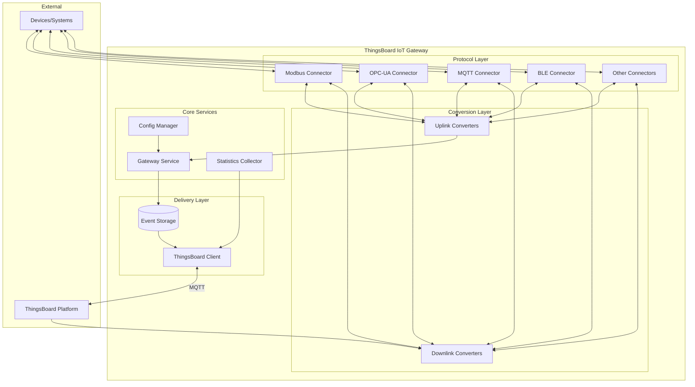
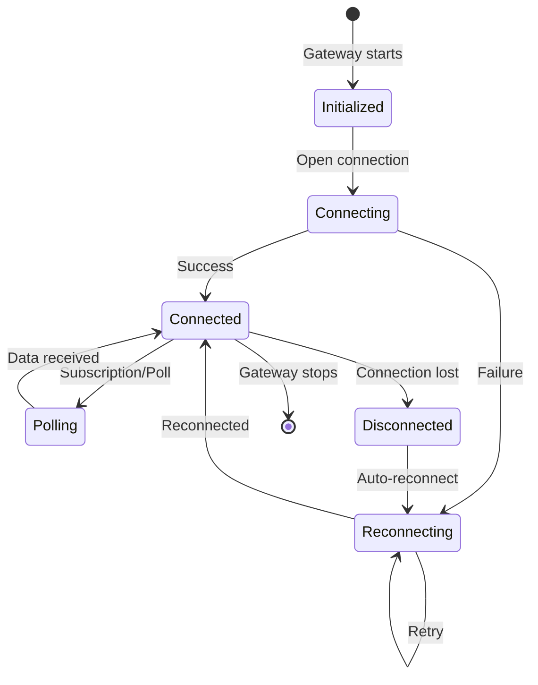
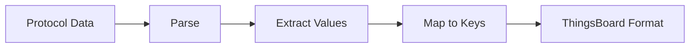
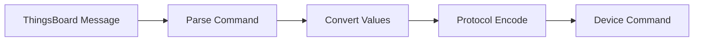
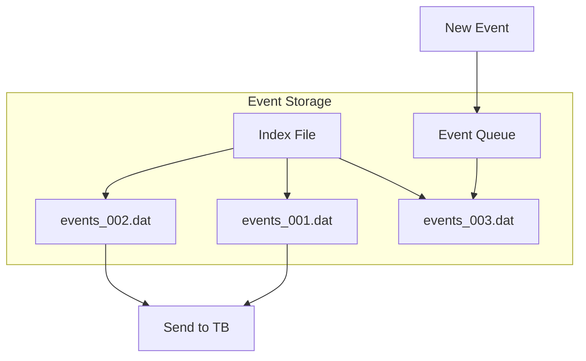
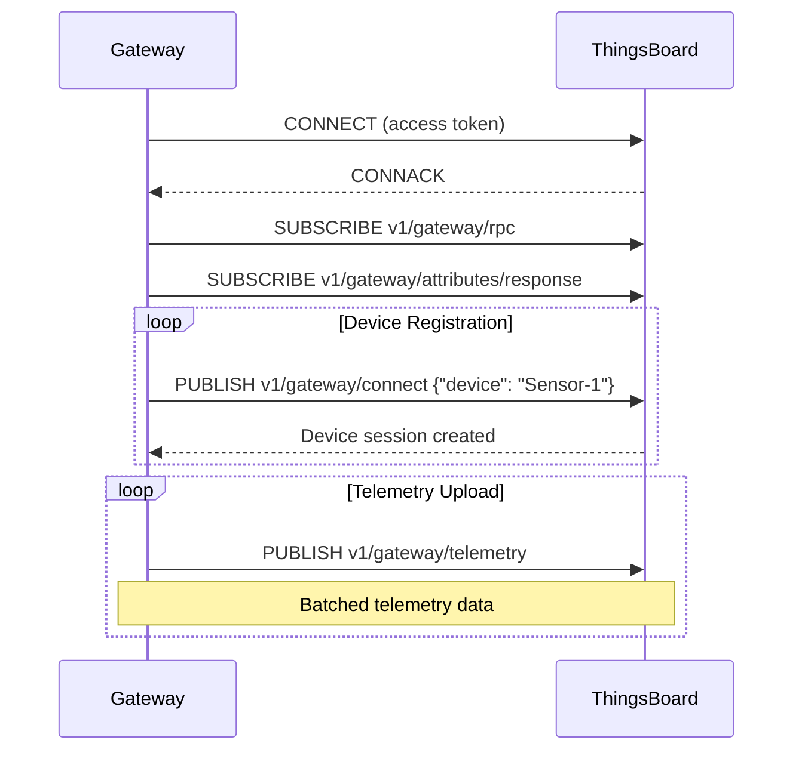
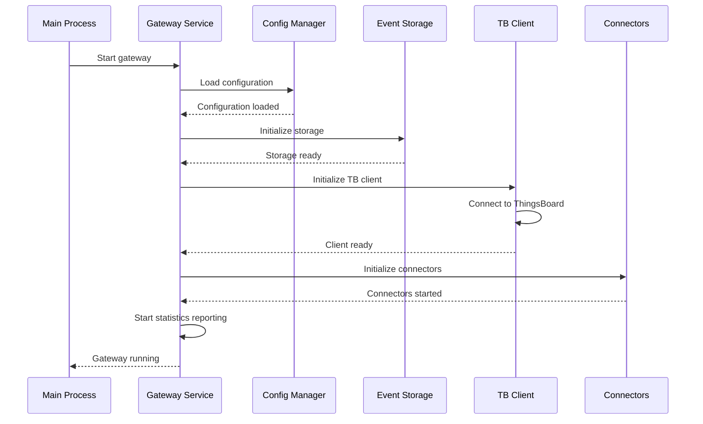
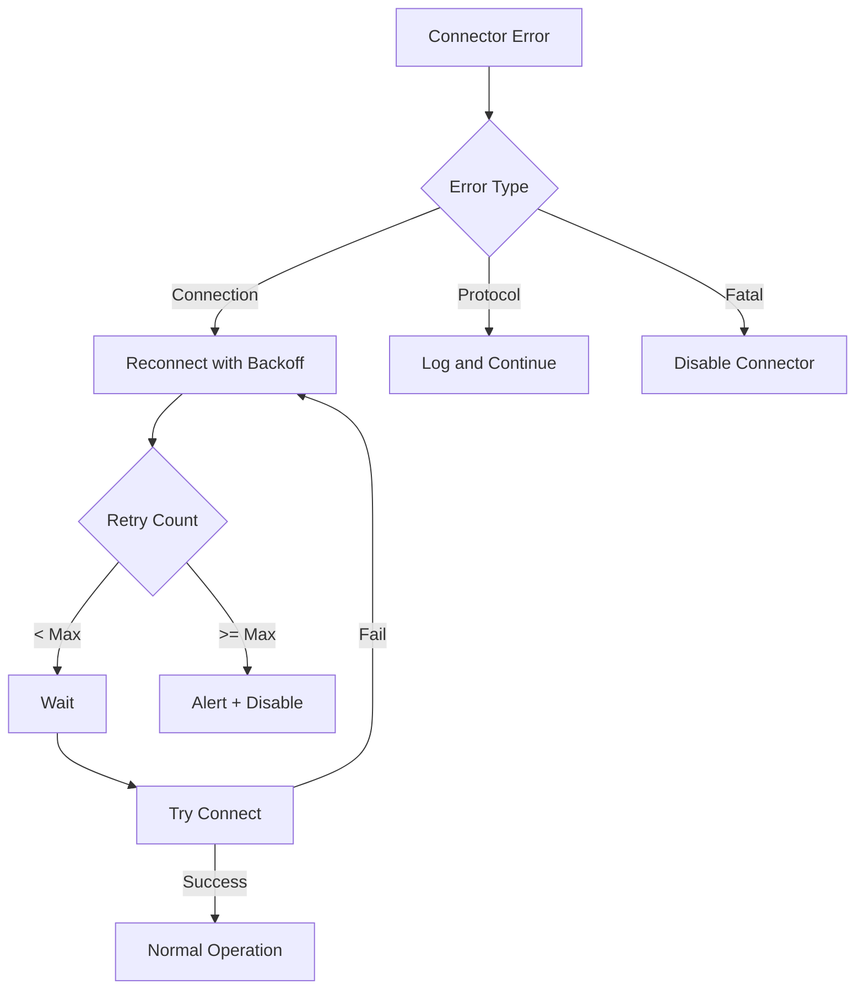
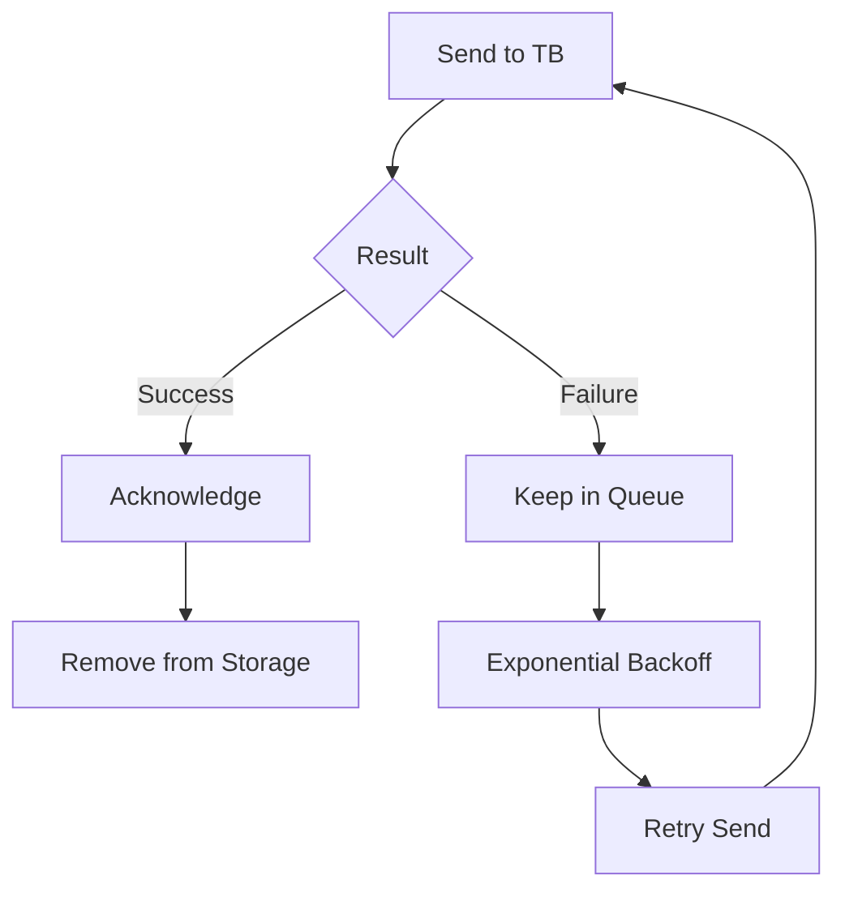

# Gateway Architecture

## Overview

The ThingsBoard IoT Gateway is a Python application designed to run on Linux-based systems, including resource-constrained devices like Raspberry Pi. The architecture consists of five main components: Connectors, Converters, Event Storage, ThingsBoard Client, and Gateway Service. This modular design enables support for diverse protocols while ensuring reliable data delivery to the ThingsBoard platform.

## Key Behaviors

1. **Protocol Abstraction**: Connectors handle protocol-specific communication, isolating complexity from the core system.

2. **Data Normalization**: Converters transform diverse data formats into ThingsBoard's unified telemetry/attribute model.

3. **Guaranteed Delivery**: Event Storage persists data locally until successfully delivered to ThingsBoard.

4. **Automatic Recovery**: The gateway reconnects automatically after network failures or service restarts.

5. **Extensibility**: Custom connectors and converters can be added without modifying core gateway code.

## Component Architecture



## Component Details

### Connectors

Connectors are responsible for interfacing with external systems and devices. Each connector type handles a specific protocol.

**Responsibilities:**
- Establish connections to external systems
- Poll data or subscribe to updates (protocol-dependent)
- Push updates to devices (bidirectional protocols)
- Handle reconnection and error recovery

**Connector Lifecycle:**



**Connector Types:**

| Type | Mode | Description |
|------|------|-------------|
| Polling | Pull | Periodically requests data (Modbus, SNMP) |
| Subscription | Push | Receives updates on change (MQTT, OPC-UA subscriptions) |
| Server | Listen | Accepts incoming connections (REST, Socket server) |

### Converters

Converters transform data between protocol-specific formats and ThingsBoard's data model.

**Uplink Converter** (Device → ThingsBoard):


**Downlink Converter** (ThingsBoard → Device):


**ThingsBoard Data Format:**

```json
{
  "deviceName": "Sensor-001",
  "deviceType": "temperature-sensor",
  "telemetry": [
    {
      "ts": 1609459200000,
      "values": {
        "temperature": 25.5,
        "humidity": 60
      }
    }
  ],
  "attributes": {
    "firmware": "1.2.0",
    "model": "TH-100"
  }
}
```

### Event Storage

Event Storage provides persistence for telemetry and events before delivery to ThingsBoard.

**Storage Types:**

| Type | Persistence | Performance | Use Case |
|------|-------------|-------------|----------|
| Memory | No | Fast | Development, stable networks |
| File | Yes | Moderate | Production, unreliable networks |

**File Storage Structure:**



**Configuration:**

| Parameter | Description | Default |
|-----------|-------------|---------|
| type | "memory" or "file" | memory |
| max_records | Maximum queue size | 100000 |
| data_folder_path | File storage location | ./data/ |
| max_file_size | Max file size (bytes) | 100MB |

### ThingsBoard Client

The ThingsBoard Client handles communication with the platform using the Gateway MQTT API.

**Features:**
- MQTT connection management
- Automatic reconnection with backoff
- Batch message delivery
- Device session tracking
- RPC command handling

**MQTT Topics Used:**

| Topic | Direction | Purpose |
|-------|-----------|---------|
| `v1/gateway/telemetry` | Uplink | Send telemetry data |
| `v1/gateway/attributes` | Uplink | Send attributes |
| `v1/gateway/connect` | Uplink | Register device |
| `v1/gateway/disconnect` | Uplink | Unregister device |
| `v1/gateway/rpc` | Downlink | Receive RPC commands |
| `v1/gateway/attributes/response` | Downlink | Receive attribute values |

**Connection Flow:**



### Gateway Service

The Gateway Service is the central orchestrator that bootstraps and manages all components.

**Responsibilities:**
- Load and validate configuration
- Initialize connectors and storage
- Manage connector lifecycle
- Collect and report statistics
- Handle graceful shutdown

**Startup Sequence:**



**Statistics Reported:**

| Metric | Description |
|--------|-------------|
| devices_connected | Number of connected devices |
| messages_received | Total messages from connectors |
| messages_sent | Total messages to ThingsBoard |
| events_queued | Current queue depth |

## Configuration

### Main Configuration (tb_gateway.json)

```json
{
  "thingsboard": {
    "host": "thingsboard.example.com",
    "port": 1883,
    "security": {
      "type": "accessToken",
      "accessToken": "GATEWAY_ACCESS_TOKEN"
    }
  },
  "storage": {
    "type": "file",
    "data_folder_path": "./data/",
    "max_file_count": 10,
    "max_records_per_file": 10000
  },
  "connectors": [
    {
      "name": "Modbus Connector",
      "type": "modbus",
      "configuration": "modbus.json"
    },
    {
      "name": "OPC-UA Connector",
      "type": "opcua",
      "configuration": "opcua.json"
    }
  ]
}
```

### Environment Variables

| Variable | Description | Default |
|----------|-------------|---------|
| TB_GW_HOST | ThingsBoard hostname | localhost |
| TB_GW_PORT | MQTT port | 1883 |
| TB_GW_ACCESS_TOKEN | Gateway access token | - |
| TB_GW_RATE_LIMITS | Message rate limits | 15:1,300:60 |

## Error Handling

### Connector Failures



### Data Delivery Failures



## Custom Extensions

### Custom Connector

Location: `/var/lib/thingsboard_gateway/extensions/<type>/`

```python
from thingsboard_gateway.connectors.connector import Connector

class CustomConnector(Connector):
    def __init__(self, gateway, config, connector_type):
        super().__init__()
        self.gateway = gateway
        self.config = config

    def open(self):
        # Initialize connection
        pass

    def close(self):
        # Cleanup
        pass

    def get_name(self):
        return self.config.get("name", "Custom Connector")
```

### Custom Converter

```python
from thingsboard_gateway.connectors.converter import Converter

class CustomConverter(Converter):
    def convert(self, config, data):
        return {
            "deviceName": data.get("id"),
            "telemetry": {
                "value": data.get("measurement")
            }
        }
```

## See Also

- [Connectors Overview](./connectors-overview.md) - Connector types and configuration
- [Transport Layer](../05-transport-layer/README.md) - Platform protocols
- [Device Entity](../02-core-concepts/entities/device.md) - Device model
- [Edge Architecture](../12-edge/edge-architecture.md) - Edge deployment
