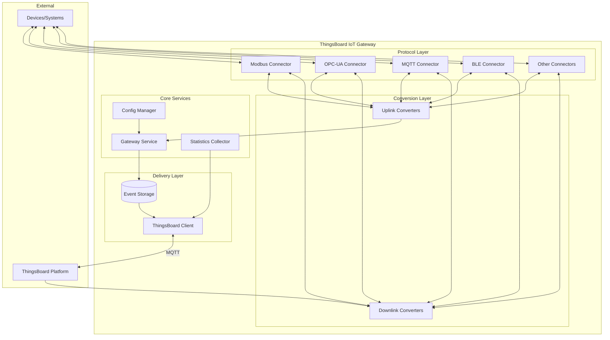
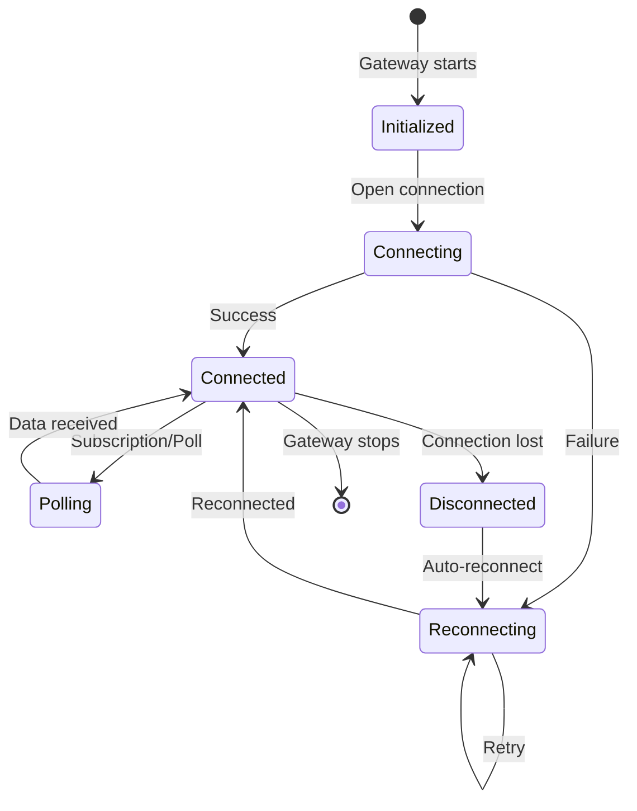
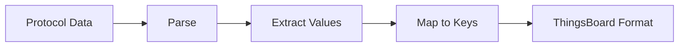
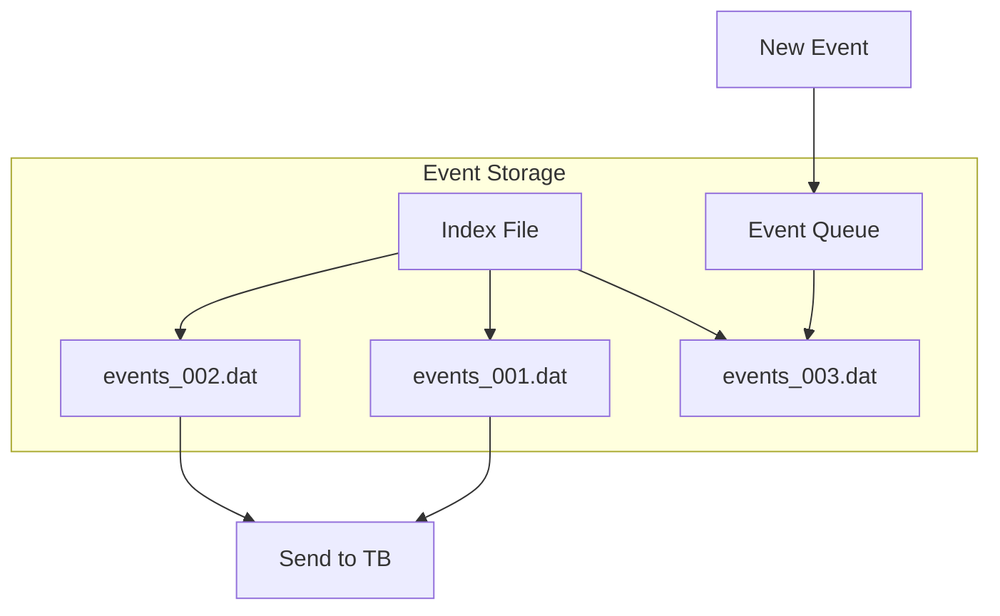
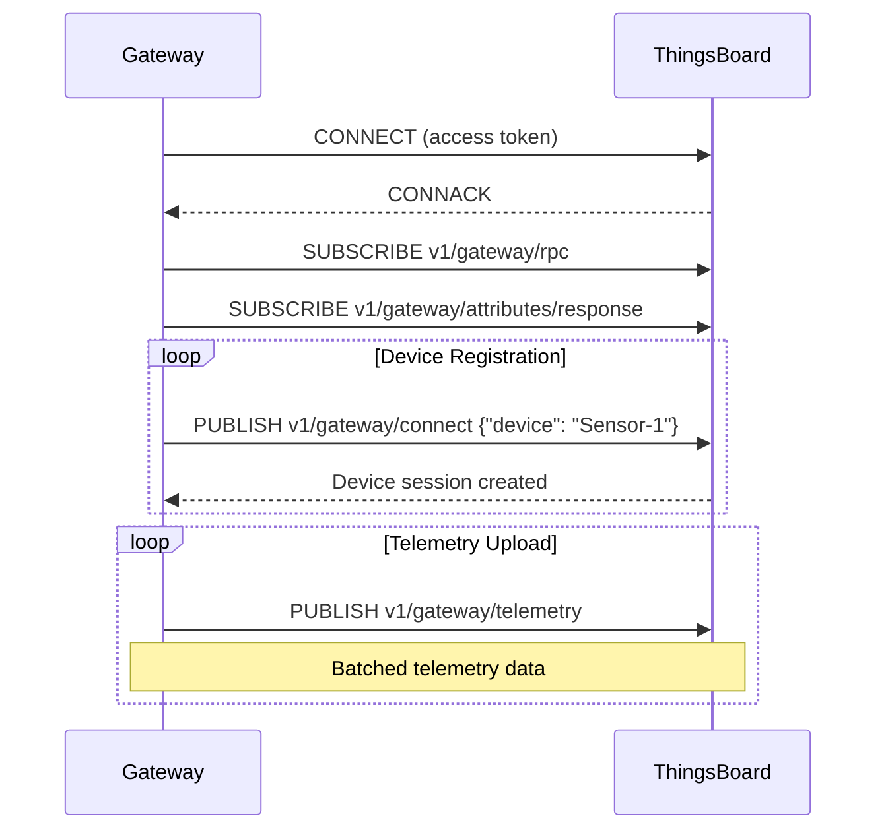
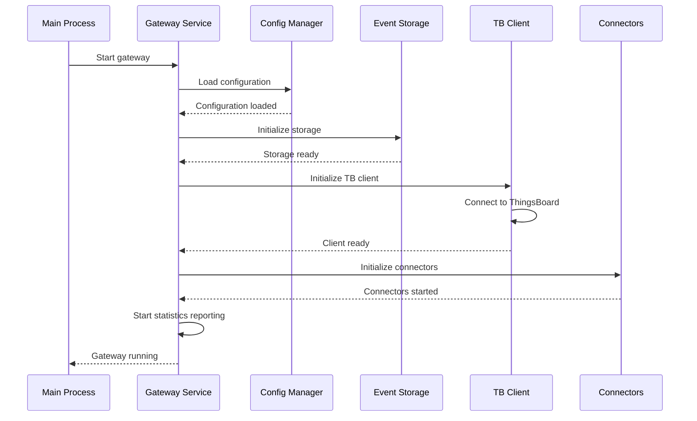
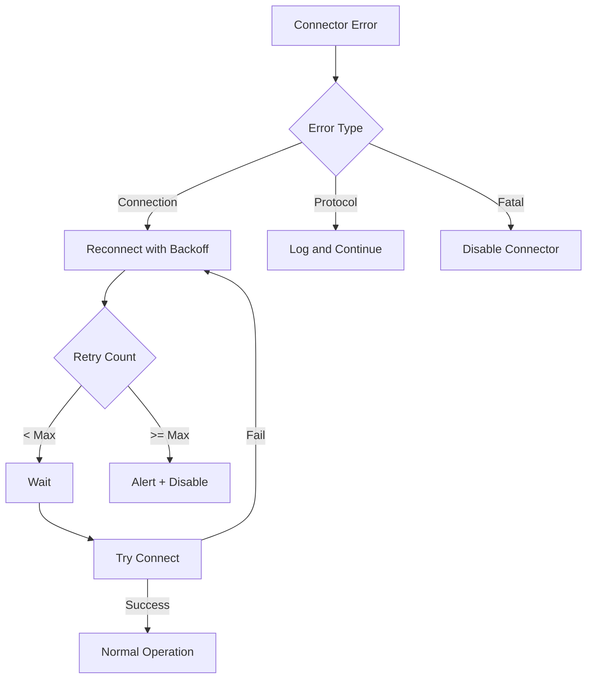
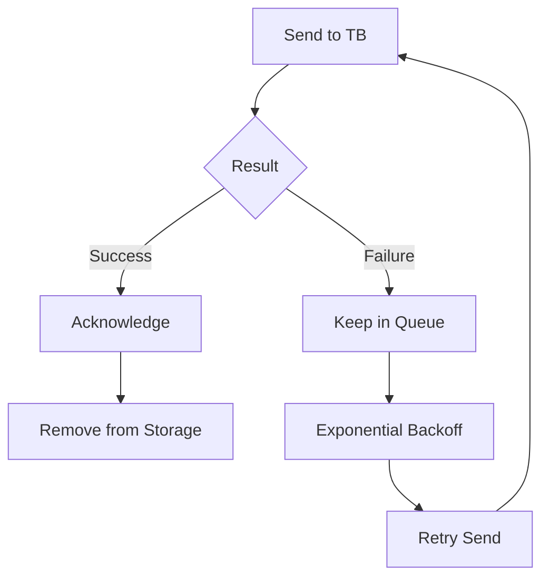

# Gateway Architecture

## Overview

The ThingsBoard IoT Gateway is a Python application designed to run on Linux-based systems, including resource-constrained devices like Raspberry Pi. The architecture consists of five main components: Connectors, Converters, Event Storage, ThingsBoard Client, and Gateway Service. This modular design enables support for diverse protocols while ensuring reliable data delivery to the ThingsBoard platform.

## Key Behaviors

1. **Protocol Abstraction**: Connectors handle protocol-specific communication, isolating complexity from the core system.

2. **Data Normalization**: Converters transform diverse data formats into ThingsBoard's unified telemetry/attribute model.

3. **Guaranteed Delivery**: Event Storage persists data locally until successfully delivered to ThingsBoard.

4. **Automatic Recovery**: The gateway reconnects automatically after network failures or service restarts.

5. **Extensibility**: Custom connectors and converters can be added without modifying core gateway code.

## Component Architecture



## Component Details

### Connectors

Connectors are responsible for interfacing with external systems and devices. Each connector type handles a specific protocol.

**Responsibilities:**
- Establish connections to external systems
- Poll data or subscribe to updates (protocol-dependent)
- Push updates to devices (bidirectional protocols)
- Handle reconnection and error recovery

**Connector Lifecycle:**



**Connector Types:**

| Type | Mode | Description |
|------|------|-------------|
| Polling | Pull | Periodically requests data (Modbus, SNMP) |
| Subscription | Push | Receives updates on change (MQTT, OPC-UA subscriptions) |
| Server | Listen | Accepts incoming connections (REST, Socket server) |

### Converters

Converters transform data between protocol-specific formats and ThingsBoard's data model.

**Uplink Converter** (Device → ThingsBoard):


**Downlink Converter** (ThingsBoard → Device):


**ThingsBoard Data Format:**

```json
{
  "deviceName": "Sensor-001",
  "deviceType": "temperature-sensor",
  "telemetry": [
    {
      "ts": 1609459200000,
      "values": {
        "temperature": 25.5,
        "humidity": 60
      }
    }
  ],
  "attributes": {
    "firmware": "1.2.0",
    "model": "TH-100"
  }
}
```

### Event Storage

Event Storage provides persistence for telemetry and events before delivery to ThingsBoard.

**Storage Types:**

| Type | Persistence | Performance | Use Case |
|------|-------------|-------------|----------|
| Memory | No | Fast | Development, stable networks |
| File | Yes | Moderate | Production, unreliable networks |

**File Storage Structure:**



**Configuration:**

| Parameter | Description | Default |
|-----------|-------------|---------|
| type | "memory" or "file" | memory |
| max_records | Maximum queue size | 100000 |
| data_folder_path | File storage location | ./data/ |
| max_file_size | Max file size (bytes) | 100MB |

### ThingsBoard Client

The ThingsBoard Client handles communication with the platform using the Gateway MQTT API.

**Features:**
- MQTT connection management
- Automatic reconnection with backoff
- Batch message delivery
- Device session tracking
- RPC command handling

**MQTT Topics Used:**

| Topic | Direction | Purpose |
|-------|-----------|---------|
| `v1/gateway/telemetry` | Uplink | Send telemetry data |
| `v1/gateway/attributes` | Uplink | Send attributes |
| `v1/gateway/connect` | Uplink | Register device |
| `v1/gateway/disconnect` | Uplink | Unregister device |
| `v1/gateway/rpc` | Downlink | Receive RPC commands |
| `v1/gateway/attributes/response` | Downlink | Receive attribute values |

**Connection Flow:**



### Gateway Service

The Gateway Service is the central orchestrator that bootstraps and manages all components.

**Responsibilities:**
- Load and validate configuration
- Initialize connectors and storage
- Manage connector lifecycle
- Collect and report statistics
- Handle graceful shutdown

**Startup Sequence:**



**Statistics Reported:**

| Metric | Description |
|--------|-------------|
| devices_connected | Number of connected devices |
| messages_received | Total messages from connectors |
| messages_sent | Total messages to ThingsBoard |
| events_queued | Current queue depth |

## Configuration

### Main Configuration (tb_gateway.json)

```json
{
  "thingsboard": {
    "host": "thingsboard.example.com",
    "port": 1883,
    "security": {
      "type": "accessToken",
      "accessToken": "GATEWAY_ACCESS_TOKEN"
    }
  },
  "storage": {
    "type": "file",
    "data_folder_path": "./data/",
    "max_file_count": 10,
    "max_records_per_file": 10000
  },
  "connectors": [
    {
      "name": "Modbus Connector",
      "type": "modbus",
      "configuration": "modbus.json"
    },
    {
      "name": "OPC-UA Connector",
      "type": "opcua",
      "configuration": "opcua.json"
    }
  ]
}
```

### Environment Variables

| Variable | Description | Default |
|----------|-------------|---------|
| TB_GW_HOST | ThingsBoard hostname | localhost |
| TB_GW_PORT | MQTT port | 1883 |
| TB_GW_ACCESS_TOKEN | Gateway access token | - |
| TB_GW_RATE_LIMITS | Message rate limits | 15:1,300:60 |

## Error Handling

### Connector Failures



### Data Delivery Failures



## Custom Extensions

### Custom Connector

Location: `/var/lib/thingsboard_gateway/extensions/<type>/`

```python
from thingsboard_gateway.connectors.connector import Connector

class CustomConnector(Connector):
    def __init__(self, gateway, config, connector_type):
        super().__init__()
        self.gateway = gateway
        self.config = config

    def open(self):
        # Initialize connection
        pass

    def close(self):
        # Cleanup
        pass

    def get_name(self):
        return self.config.get("name", "Custom Connector")
```

### Custom Converter

```python
from thingsboard_gateway.connectors.converter import Converter

class CustomConverter(Converter):
    def convert(self, config, data):
        return {
            "deviceName": data.get("id"),
            "telemetry": {
                "value": data.get("measurement")
            }
        }
```

## Common Pitfalls

Operating ThingsBoard IoT Gateway requires understanding component interactions, lifecycle management, and failure modes. Teams commonly encounter issues in four areas: connector lifecycle (restart failures, resource leaks), converter configuration (data transformation errors, missing converters), event storage (corruption, capacity management), and platform client (connection management, retry behavior). The pitfalls below represent architectural challenges that can impact reliability, data integrity, and operational continuity.

### Connector Lifecycle Issues

| Pitfall | Impact | Detection | Solution |
|---------|--------|-----------|----------|
| Connector restart failures after exception | Connector remains disabled, specific devices not connected | Connector status shows "STOPPED" or "ERROR", device data stops flowing | Implement exception handling in connector initialization. Add health checks to detect failed connectors. Configure auto-restart with exponential backoff |
| Resource leaks in connector shutdown | Open file handles, socket connections persist after stop | Growing file descriptor count, eventual "too many open files" error | Ensure graceful shutdown closes all resources. Use context managers for connections. Implement timeout-based cleanup for stuck connectors |
| Hot reload limitations | Config changes not applied without gateway restart | Modified configuration values not reflected in connector behavior | Document hot-reload scope clearly. Use gateway restart for structural changes (new connectors, storage type). Support runtime tuning for polling intervals only |

### Converter Configuration

| Pitfall | Impact | Detection | Solution |
|---------|--------|-----------|----------|
| Uplink converter JSON path expression errors | Telemetry extraction fails, data loss | Converter exception logs: "JSONPath not found", no telemetry for devices | Validate JSON path expressions against sample device data. Use defensive expressions with fallbacks: `$.temp or $.temperature`. Test converters with representative data |
| Missing downlink converter for RPC | Platform RPC commands never reach devices | RPC timeout errors in platform, no command execution on devices | Configure both uplink and downlink converters for bidirectional protocols. Test RPC flow during integration. Document which RPCs are supported per device type |
| Custom converter module loading failures | Connector startup fails, gateway unable to process data | "ModuleNotFoundError" or "ImportError" in logs, connector disabled | Verify custom converter in correct extensions directory path. Check module naming conventions. Ensure all dependencies installed in gateway environment |

### Event Storage Problems

| Pitfall | Impact | Detection | Solution |
|---------|--------|-----------|----------|
| File storage corruption after power loss | Gateway fails to start, event queue unreadable | "Cannot read storage file" errors on startup, gateway exits | Implement atomic writes with temp file + rename. Add storage validation on startup. Provide recovery tool to rebuild index from data files |
| Memory storage overflow with persistent queue | Out-of-memory crash when queue grows unbounded | Increasing memory usage, eventual OOM kill by system | Use file-based storage for production. Configure maximum queue size limits. Implement backpressure to slow connector polling when queue is full |
| Storage path misconfiguration | Cannot persist events, offline resilience disabled | "Permission denied" or "Directory not found" errors | Validate storage path exists with write permissions during startup. Create directory if missing. Use dedicated partition for storage to prevent system impact |

### ThingsBoard Client Issues

| Pitfall | Impact | Detection | Solution |
|---------|--------|-----------|----------|
| MQTT QoS misconfiguration causing data loss | Messages dropped during network issues when using QoS 0 | Gaps in telemetry timeline, data loss during brief disconnects | Use QoS 1 for telemetry delivery guarantee. Accept slight performance cost for reliability. Reserve QoS 0 for non-critical statistics |
| Topic structure format errors | Messages published but platform doesn't process them | Messages published successfully but no data appears in platform | Validate topic format matches Gateway MQTT API specification. Test with MQTT client before integration. Enable client-side logging to verify topic strings |
| Missing exponential backoff in reconnection | Connection retry storm overwhelms platform, may trigger rate limiting | Very frequent reconnect attempts (every 100ms), connection failures | Implement exponential backoff: start at 1s, double on each failure, cap at 60s. Add jitter to prevent thundering herd. Respect platform rate limits |

**Detailed Example 1: Converter JSON Path Expression Errors**

**Problem**: Uplink converter configured with JSON path expression `$.temperature` fails to extract telemetry when device sends data with different field name (`temp` or `t`), resulting in complete data loss for that telemetry key. No error is surfaced to operators until users notice missing data in dashboards.

**Why This Happens**: Device firmware or protocol implementation uses different field naming than expected by converter configuration. JSON path expressions are exact match - `$.temperature` will not match `$.temp`. Connector successfully receives device data and forwards to converter, but converter extraction fails silently. ThingsBoard Gateway may not emit clear errors for missing JSON paths, instead publishing empty telemetry or omitting the field entirely.

**Detection**:
- Platform dashboards show missing telemetry for specific devices or keys
- Converter debug logs show "JSONPath expression '$.temperature' returned no results"
- Gateway publishes device connection events but no telemetry data appears
- Enabling converter debug mode shows raw device data with different field names than configured paths
- MQTT client subscribed to `v1/gateway/telemetry` shows partial or empty telemetry payloads

**Solution**:
1. **Immediate**: Update JSON path expression to match actual device field names. Test with sample device data:
   ```json
   {
     "deviceName": "Sensor-001",
     "telemetry": [
       {
         "ts": 1609459200000,
         "values": {
           "temp": 25.5  // Note: "temp" not "temperature"
         }
       }
     ]
   }
   ```
2. **Defensive**: Use fallback expressions in converter logic: `$.temperature or $.temp or $.t`
3. **Validation**: Capture sample device data during commissioning. Validate converter extracts all expected fields. Enable converter logging during initial deployment
4. **Monitoring**: Alert on missing telemetry keys for provisioned devices. Track converter extraction success rate metrics

**Configuration Example**:
```json
{
  "converter": {
    "type": "json",
    "deviceNameJsonExpression": "${$.deviceId}",
    "deviceTypeJsonExpression": "sensor",
    "telemetry": [
      {
        "key": "temperature",
        "type": "double",
        "value": "${$.temp}"  // Match actual device field name
      }
    ]
  }
}
```

**Detailed Example 2: File Storage Corruption After Power Loss**

**Problem**: Gateway deployed on device experiencing power loss (unstable power grid, edge deployment) encounters file storage corruption when power fails during event write operation. Gateway fails to start on next boot because storage index file is incomplete, causing loss of all queued events from the outage period.

**Why This Happens**: File-based event storage writes events to data files and maintains an index file tracking write positions. If power is lost mid-write, the data file may contain partial event data and the index file may be inconsistent with actual file contents. On startup, the gateway attempts to read from index-specified positions that don't contain valid data, causing parse errors. Without atomic writes (write to temp file, then rename), corruption is inevitable during crashes.

**Detection**:
- Gateway fails to start after power restoration
- Logs show "Cannot parse storage file at offset X" or "Corrupted event data" errors
- Storage directory contains `.dat` files but gateway won't initialize
- Manual inspection of data files shows incomplete JSON objects or binary corruption
- Gateway process exits during initialization phase before establishing platform connection

**Solution**:
1. **Immediate recovery**: Identify corrupted files and remove or rebuild:
   ```bash
   # Backup current storage
   cp -r /var/lib/tb-gateway/data /var/lib/tb-gateway/data.backup

   # Remove corrupted files (data loss occurs)
   rm /var/lib/tb-gateway/data/*.dat
   rm /var/lib/tb-gateway/data/*.idx

   # Restart gateway
   systemctl restart tb-gateway
   ```
2. **Prevention**:
   - Use power supply with battery backup (UPS) for critical deployments
   - Implement storage write strategy with atomic operations (temp file + rename)
   - Add storage validation on startup with automatic recovery from corruption
3. **Configuration**: Enable storage checksum validation if available. Configure maximum file size to limit corruption scope
4. **Monitoring**: Alert on repeated gateway restart failures. Track storage write errors before they cause corruption

**Storage Configuration**:
```json
{
  "storage": {
    "type": "file",
    "data_folder_path": "/var/lib/tb-gateway/data",
    "max_file_count": 100,
    "max_records_per_file": 5000,  // Smaller files limit corruption scope
    "max_file_size": 10485760       // 10MB file size limit
  }
}
```

**Detailed Example 3: MQTT Connection Retry Storm**

**Problem**: Gateway deployed in environment with intermittent network connectivity enters connection retry storm after disconnect, attempting reconnection every 100-200ms without exponential backoff. This overwhelms the platform's connection rate limits, resulting in the gateway being temporarily banned by rate limiting policies, extending the outage duration significantly.

**Why This Happens**: Default MQTT client configurations often use fixed retry intervals without exponential backoff or jitter. When gateway loses connection (network glitch, platform maintenance), it immediately attempts reconnection. Without backoff, failed attempts happen in rapid succession. ThingsBoard platform implements rate limiting (e.g., 10 connections/minute per IP) to protect against connection storms. Rapid retry attempts trigger rate limiting, causing connection refusals even after network recovers. Multiple gateways behind same NAT IP compound the problem (thundering herd).

**Detection**:
- Gateway logs show connection attempts every 100-200ms: "Connecting to ThingsBoard..." repeated rapidly
- Platform logs show rate limit violations: "Connection rate limit exceeded for IP x.x.x.x"
- Connection state oscillates: CONNECTING → DISCONNECTED → CONNECTING without CONNECTED state
- Gateway connectivity outage extends 5-10x longer than actual network issue duration
- Platform monitoring shows spike in connection attempts from gateway IP

**Solution**:
1. **Immediate**: Manually restart gateway with rate limiting in mind (wait 60s between attempts):
   ```bash
   systemctl stop tb-gateway
   sleep 60  # Wait for rate limit window to reset
   systemctl start tb-gateway
   ```
2. **Configuration**: Implement exponential backoff with jitter:
   - Initial retry: 1 second
   - Subsequent retries: double previous delay (2s, 4s, 8s, 16s, 32s, 60s max)
   - Add random jitter (±20%) to prevent synchronized retries from multiple gateways
   - Reset backoff after successful connection lasting >5 minutes
3. **Prevention**: Configure MQTT client with connection limits. Test reconnection behavior during gateway commissioning
4. **Monitoring**: Alert on excessive connection attempts (>5 per minute). Track time in CONNECTING state

**Client Configuration**:
```json
{
  "thingsboard": {
    "host": "thingsboard.example.com",
    "port": 1883,
    "security": {
      "type": "accessToken",
      "accessToken": "YOUR_TOKEN"
    },
    "reconnect": {
      "enabled": true,
      "minDelay": 1000,       // 1 second initial
      "maxDelay": 60000,      // 60 second maximum
      "backoffMultiplier": 2, // Double on each failure
      "jitter": 0.2           // 20% random jitter
    }
  }
}
```

## See Also

- [Connectors Overview](./connectors-overview.md) - Connector types and configuration
- [Transport Layer](../05-transport-layer/README.md) - Platform protocols
- [Device Entity](../02-core-concepts/entities/device.md) - Device model
- [Edge Architecture](../12-edge/edge-architecture.md) - Edge deployment
