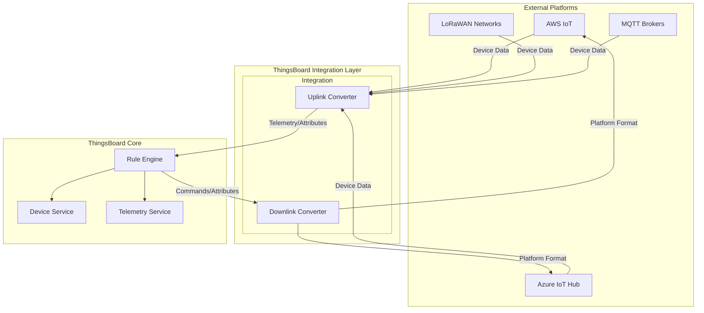
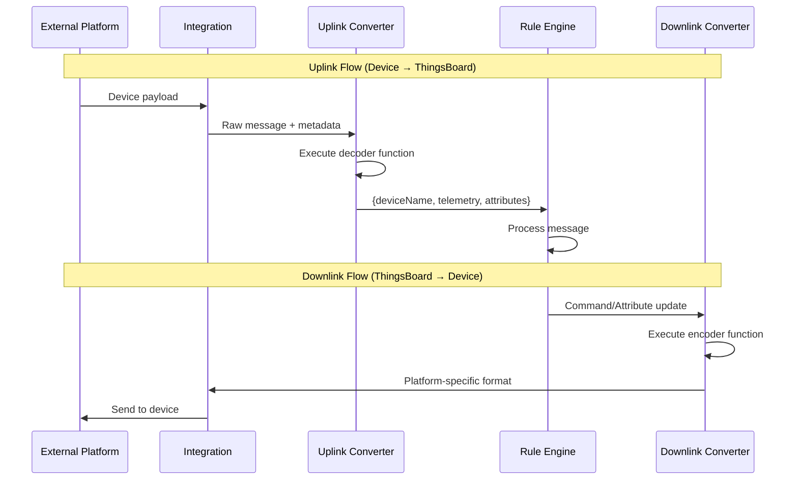
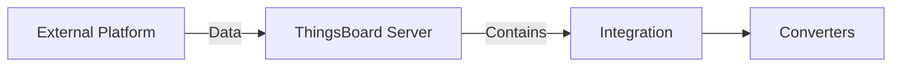
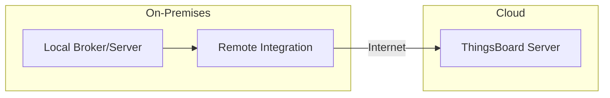

# Platform Integrations

## Overview

ThingsBoard Platform Integrations enable bidirectional data exchange between ThingsBoard and external systems, IoT platforms, and network servers. Integrations handle protocol translation, payload conversion, and secure data routing, allowing devices connected to third-party platforms (AWS IoT, Azure IoT Hub, LoRaWAN networks, etc.) to stream data to ThingsBoard without modification. This feature is available in ThingsBoard Professional Edition.

## Contents

| Document | Description |
|----------|-------------|
| [Cloud Integrations](./cloud-integrations.md) | AWS IoT, Azure IoT Hub, Google Cloud Pub/Sub |
| [LoRaWAN Integrations](./lorawan-integrations.md) | ChirpStack, TTN, Loriot, ThingPark |
| [Messaging Integrations](./messaging-integrations.md) | Kafka, RabbitMQ, MQTT brokers |

## Key Concepts

- **Uplink Converter**: Transforms incoming device data to ThingsBoard format (telemetry/attributes)
- **Downlink Converter**: Transforms outgoing commands/attributes to external platform format
- **Data Converters**: JavaScript/TBEL functions that handle payload transformation
- **Remote Integration**: Runs on-premises to connect local systems to cloud ThingsBoard
- **Embedded Integration**: Runs within ThingsBoard server process

## Integration Architecture



## Available Integrations

### Cloud IoT Platforms

| Integration | Protocol | Direction | Use Case |
|-------------|----------|-----------|----------|
| AWS IoT | MQTT | Bidirectional | Devices on AWS IoT Core |
| AWS Kinesis | HTTP | Uplink | Stream processing |
| AWS SQS | HTTP | Uplink | Queue-based ingestion |
| Azure IoT Hub | AMQP/MQTT | Bidirectional | Devices on Azure IoT |
| Azure Event Hub | AMQP | Uplink | Event streaming |
| Azure Service Bus | AMQP | Uplink | Message queuing |
| Google Pub/Sub | HTTP | Bidirectional | GCP-connected devices |
| IBM Watson IoT | MQTT | Bidirectional | Watson IoT Platform |

### LoRaWAN Network Servers

| Integration | Protocol | Features |
|-------------|----------|----------|
| ChirpStack | HTTP/MQTT | Open-source, self-hosted |
| The Things Stack (TTN) | HTTP | Community network |
| The Things Industries | HTTP | Enterprise network |
| Loriot | HTTP | Enterprise LoRaWAN |
| ThingPark | HTTP | Actility network |
| KPN Things | HTTP | Netherlands IoT network |

### Messaging Systems

| Integration | Protocol | Use Case |
|-------------|----------|----------|
| MQTT | MQTT | External MQTT brokers |
| Kafka | Kafka | Stream processing |
| RabbitMQ | AMQP | Message queuing |
| Apache Pulsar | Pulsar | Distributed messaging |

### Network Protocols

| Integration | Protocol | Use Case |
|-------------|----------|----------|
| HTTP | HTTP/HTTPS | Webhook-based devices |
| CoAP | CoAP | Constrained devices |
| TCP | Raw TCP | Custom TCP protocols |
| UDP | Raw UDP | Custom UDP protocols |
| OPC-UA | OPC-UA | Industrial systems |

### Cellular IoT

| Integration | Protocol | Network |
|-------------|----------|---------|
| SigFox | HTTP | SigFox backend |
| OceanConnect | HTTP | Huawei IoT |
| T-Mobile IoT CDP | HTTP | T-Mobile network |

## Data Converter Flow



## Uplink Converter

Transforms incoming device data to ThingsBoard format.

**Input:**
- `payload` - Raw message content (JSON, TEXT, or Base64)
- `metadata` - Integration-specific fields (topic, headers, etc.)

**Output:**
```json
{
  "deviceName": "sensor-001",
  "deviceType": "temperature-sensor",
  "telemetry": {
    "temperature": 25.5,
    "humidity": 60
  },
  "attributes": {
    "firmware": "1.2.0"
  }
}
```

**Example Converter (TBEL):**
```javascript
var data = decodeToJson(payload);
var deviceName = metadata['deviceName'];

var result = {
    deviceName: deviceName,
    deviceType: 'sensor',
    telemetry: {
        temperature: data.temp,
        humidity: data.hum
    }
};

return result;
```

## Downlink Converter

Transforms ThingsBoard messages to external platform format.

**Input:**
- `msg` - Rule engine message
- `metadata` - Message metadata
- `msgType` - Message type (POST_ATTRIBUTES_REQUEST, RPC_CALL, etc.)

**Output:**
```json
{
  "contentType": "JSON",
  "data": "{\"command\":\"setTemp\",\"value\":22}",
  "metadata": {
    "topic": "devices/sensor-001/commands"
  }
}
```

## Deployment Options

### Embedded Integration

Runs within ThingsBoard server process.



**Pros:**
- Simple deployment (UI configuration only)
- Low latency
- No additional infrastructure

**Cons:**
- Shares server resources
- Cannot reach local networks from cloud deployment

### Remote Integration

Runs as separate process, can be deployed on-premises.



**Pros:**
- Access local systems from cloud ThingsBoard
- Process isolation
- Data buffering during outages

**Cons:**
- Requires separate installation
- Additional infrastructure to manage

## Integration vs IoT Gateway

| Aspect | Platform Integration | IoT Gateway |
|--------|---------------------|-------------|
| Deployment | Server-side | Edge/Local |
| Scale | High throughput, clustered | < 1000 devices |
| Converter updates | Real-time (JavaScript) | Requires restart |
| Use case | Server-to-server | Local device protocols |
| Network | Cloud accessible | Local network |

## Converters Library

ThingsBoard provides a built-in library of uplink converters for 100+ device types across popular LoRaWAN networks. The library is open-source and maintained at [github.com/thingsboard/data-converters](https://github.com/thingsboard/data-converters).

**Supported Networks:**
- ChirpStack
- Loriot
- The Things Stack (Community/Industries)
- ThingPark

## See Also

- [Rule Engine](../04-rule-engine/README.md) - Message processing
- [IoT Gateway](../13-iot-gateway/README.md) - Local device integration
- [Transport Layer](../05-transport-layer/README.md) - Direct device protocols
- [Edge Computing](../12-edge/README.md) - Edge deployment
