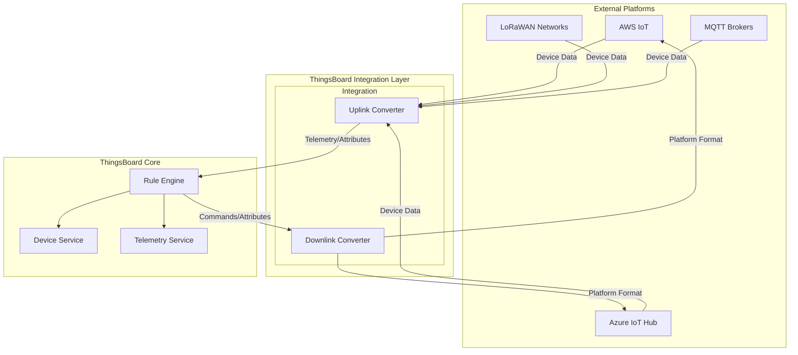
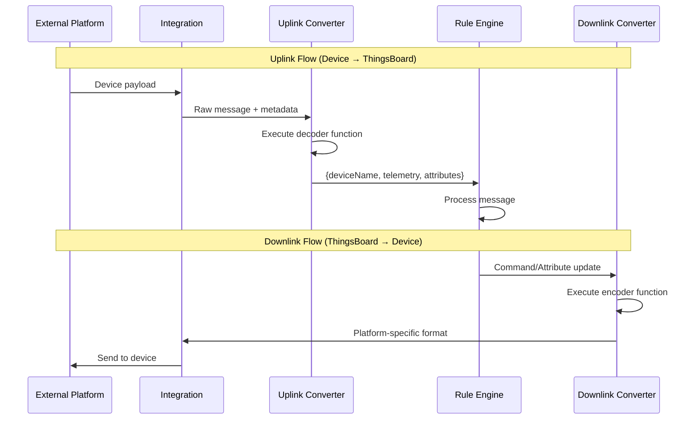
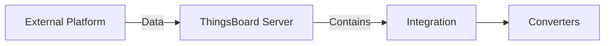
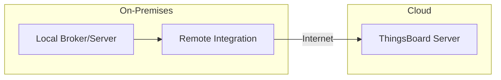

# Platform Integrations

## Overview

ThingsBoard Platform Integrations enable bidirectional data exchange between ThingsBoard and external systems, IoT platforms, and network servers. Integrations handle protocol translation, payload conversion, and secure data routing, allowing devices connected to third-party platforms (AWS IoT, Azure IoT Hub, LoRaWAN networks, etc.) to stream data to ThingsBoard without modification. This feature is available in ThingsBoard Professional Edition.

**Primary Use Cases:**
- Connect NB-IoT, LoRaWAN, Sigfox, and other LPWAN devices with vendor-specific payload formats
- Stream data from devices already connected to cloud IoT platforms (AWS, Azure, GCP)
- Receive webhook callbacks from external systems and services

## Contents

| Document | Description |
|----------|-------------|
| [Cloud Integrations](./cloud-integrations.md) | AWS IoT, Azure IoT Hub, Google Cloud Pub/Sub |
| [LoRaWAN Integrations](./lorawan-integrations.md) | ChirpStack, TTN, Loriot, ThingPark, Sigfox |
| [Messaging Integrations](./messaging-integrations.md) | Kafka, RabbitMQ, MQTT brokers, HTTP webhooks |

## Key Concepts

- **Uplink Converter**: Transforms incoming device data to ThingsBoard format (telemetry/attributes)
- **Downlink Converter**: Transforms outgoing commands/attributes to external platform format
- **Data Converters**: JavaScript/TBEL functions that handle payload transformation
- **Remote Integration**: Runs on-premises to connect local systems to cloud ThingsBoard
- **Embedded Integration**: Runs within ThingsBoard server process
- **Typed Converter**: Simplified converter configuration for supported integration types (LoRaWAN networks)
- **Converters Library**: Built-in decoders for 100+ device types from popular vendors

## Integration Architecture



## Available Integrations

### Cloud IoT Platforms

| Integration | Protocol | Direction | Use Case |
|-------------|----------|-----------|----------|
| AWS IoT | MQTT | Bidirectional | Devices on AWS IoT Core |
| AWS Kinesis | HTTP | Uplink | Stream processing |
| AWS SQS | HTTP | Uplink | Queue-based ingestion |
| Azure IoT Hub | AMQP/MQTT | Bidirectional | Devices on Azure IoT |
| Azure Event Hub | AMQP | Uplink | Event streaming |
| Azure Service Bus | AMQP | Uplink | Message queuing |
| Google Pub/Sub | HTTP | Bidirectional | GCP-connected devices |
| IBM Watson IoT | MQTT | Bidirectional | Watson IoT Platform |

### LoRaWAN Network Servers

| Integration | Protocol | Features |
|-------------|----------|----------|
| ChirpStack | HTTP/MQTT | Open-source, self-hosted |
| The Things Stack (TTN) | HTTP | Community network |
| The Things Industries | HTTP | Enterprise network |
| Loriot | HTTP | Enterprise LoRaWAN |
| ThingPark | HTTP | Actility network |
| KPN Things | HTTP | Netherlands IoT network |

### Messaging Systems

| Integration | Protocol | Use Case |
|-------------|----------|----------|
| MQTT | MQTT | External MQTT brokers |
| Kafka | Kafka | Stream processing |
| RabbitMQ | AMQP | Message queuing |
| Apache Pulsar | Pulsar | Distributed messaging |

### Network Protocols

| Integration | Protocol | Use Case |
|-------------|----------|----------|
| HTTP | HTTP/HTTPS | Webhook-based devices |
| CoAP | CoAP | Constrained devices |
| TCP | Raw TCP | Custom TCP protocols |
| UDP | Raw UDP | Custom UDP protocols |
| OPC-UA | OPC-UA | Industrial systems |

### Cellular IoT

| Integration | Protocol | Network |
|-------------|----------|---------|
| SigFox | HTTP | SigFox backend |
| OceanConnect | HTTP | Huawei IoT |
| T-Mobile IoT CDP | HTTP | T-Mobile network |

## Data Converter Flow



## Uplink Converter

Transforms incoming device data to ThingsBoard format. The converter receives raw payload data and metadata, then returns a structured object that ThingsBoard uses to create or update devices.

### Converter Types

| Type | Use Case | Configuration |
|------|----------|---------------|
| **Generic** | Any integration, full control | Write decoder script manually |
| **Typed** | Supported LoRaWAN integrations | Select fields for attributes/telemetry via UI |

**Typed converters** are available for ChirpStack, Loriot, TTN, TTI, ThingPark, and ThingPark Enterprise. They simplify configuration by letting you select which message fields become attributes or telemetry without writing code.

### Input Parameters

| Parameter | Description | Example |
|-----------|-------------|---------|
| `payload` | Raw message content | JSON, TEXT, or Base64-encoded binary |
| `metadata` | Integration-specific context | Topic name, HTTP headers, device identifiers |

### Output Structure

```json
{
  "deviceName": "sensor-001",
  "deviceType": "temperature-sensor",
  "telemetry": {
    "temperature": 25.5,
    "humidity": 60
  },
  "attributes": {
    "firmware": "1.2.0"
  }
}
```

**Required fields:** `deviceName` and `deviceType`
**Optional fields:** `telemetry`, `attributes`, `customerName`, `groupName`

### Example Converter (TBEL)

```javascript
var data = decodeToJson(payload);
var deviceName = metadata['deviceName'];

var result = {
    deviceName: deviceName,
    deviceType: 'sensor',
    telemetry: {
        temperature: data.temp,
        humidity: data.hum
    }
};

return result;
```

### Testing Converters

Before deploying a converter, test it with sample payloads:

1. Open the converter editor
2. Click **Test payload decoder**
3. Enter sample payload matching your integration format
4. Verify the output structure is correct
5. Check that device name extraction works as expected

**Payload Content Types:**
- **JSON**: Parsed automatically, access via `decodeToJson(payload)`
- **TEXT**: Access via `decodeToString(payload)`
- **Binary (Base64)**: Automatically decoded to byte array

## Downlink Converter

Transforms ThingsBoard messages to external platform format. Downlink converters are optional and only required when the integration needs to send data back to devices (commands, configuration updates).

**Input:**

| Parameter | Description |
|-----------|-------------|
| `msg` | Rule engine message content |
| `metadata` | Message metadata (device name, type, etc.) |
| `msgType` | Message type triggering the downlink |
| `integrationMetadata` | Integration-specific configuration |

**Common Message Types:**
- `POST_ATTRIBUTES_REQUEST` - Shared attribute update
- `RPC_CALL_FROM_SERVER_TO_DEVICE` - RPC command
- Custom rule engine messages

**Output:**
```json
{
  "contentType": "JSON",
  "data": "{\"command\":\"setTemp\",\"value\":22}",
  "metadata": {
    "topic": "devices/sensor-001/commands"
  }
}
```

### Synchronous vs Asynchronous Downlinks

| Type | Integrations | Behavior |
|------|--------------|----------|
| **Asynchronous** | MQTT, Kafka, AWS IoT | Message sent immediately |
| **Synchronous** | HTTP, Sigfox | Message queued until next uplink request |

For synchronous integrations (HTTP, Sigfox), the downlink response is sent as a reply to the next uplink message from the device.

### Triggering Downlinks

To send downlinks through an integration:

1. Create an **Integration Downlink** node in your rule chain
2. Connect it to the **Message Type Switch** node
3. Link **Attributes Updated** and/or **RPC Request** outputs to the downlink node
4. The integration will invoke the downlink converter and send the result

## Deployment Options

### Embedded Integration

Runs within ThingsBoard server process.



**Pros:**
- Simple deployment (UI configuration only)
- Low latency
- No additional infrastructure

**Cons:**
- Shares server resources
- Cannot reach local networks from cloud deployment

### Remote Integration

Runs as separate process, can be deployed on-premises.



**Pros:**
- Access local systems from cloud ThingsBoard
- Process isolation
- Data buffering during outages

**Cons:**
- Requires separate installation
- Additional infrastructure to manage

## Integration vs IoT Gateway

| Aspect | Platform Integration | IoT Gateway |
|--------|---------------------|-------------|
| Deployment | Server-side | Edge/Local |
| Scale | High throughput, clustered | < 1000 devices |
| Converter updates | Real-time (JavaScript) | Requires restart |
| Use case | Server-to-server | Local device protocols |
| Network | Cloud accessible | Local network |

## Converters Library

ThingsBoard provides a built-in library of uplink converters for 100+ device types across popular LoRaWAN networks. The library is open-source and maintained at [github.com/thingsboard/data-converters](https://github.com/thingsboard/data-converters).

**Supported Networks:**
- ChirpStack
- Loriot
- The Things Stack (Community/Industries)
- ThingPark

**Using the Library:**
1. Create a new integration for a supported network
2. In the uplink converter step, select **Library** instead of **Custom**
3. Choose the device vendor and model
4. The decoder function loads automatically

## Debug Mode

Debug mode captures incoming and outgoing messages for troubleshooting. When enabled:

- All message data is stored in the database
- View **In** and **Out** blocks in the converter Events tab
- See raw payload, metadata, and converter output

**Important:** Debug mode increases disk usage significantly. ThingsBoard automatically limits debug storage:
- First 15 minutes: All events stored
- After 15 minutes: Only failure events retained

Disable debug mode in production once integration is verified.

## Common Pitfalls

### Integration Configuration

| Pitfall | Impact | Solution |
|---------|--------|----------|
| Integration vs gateway confusion | Wrong tool selected | Use integrations for server-to-server; gateways for local device protocols |
| Leaving debug mode enabled | Database grows rapidly | Disable after initial testing |
| Wrong payload content type | Converter fails to parse | Match content type to actual data format |

### Converter Development

| Pitfall | Impact | Solution |
|---------|--------|----------|
| Missing null checks | Runtime exceptions | Always check `if (data.field != null)` |
| Incorrect device name extraction | Duplicate or missing devices | Test converter with real payloads |
| Hardcoded device names | All data goes to one device | Extract device identifier from payload/metadata |
| Nested objects in telemetry | Data not stored | Flatten nested objects before returning |

### Downlink Issues

| Pitfall | Impact | Solution |
|---------|--------|----------|
| No downlink converter configured | Commands not sent | Create and assign downlink converter |
| Rule chain not connected | Downlinks never triggered | Connect Integration Downlink node properly |
| Synchronous downlink timing | Message never delivered | Understand that HTTP/Sigfox require uplink first |

### Credential Management

| Pitfall | Impact | Solution |
|---------|--------|----------|
| Shared credentials across integrations | Security risk | Use unique credentials per integration |
| Expired certificates | Connection failures | Monitor certificate expiration dates |
| Wrong API key scope | Authentication errors | Verify key has required permissions |

### Remote Integration

| Pitfall | Impact | Solution |
|---------|--------|----------|
| Integration key/secret mismatch | Connection refused | Copy values exactly from ThingsBoard UI |
| Firewall blocking outbound | No data reaches cloud | Allow outbound connections to ThingsBoard |
| Local broker unreachable | Integration can't connect | Verify network path to local server |

## See Also

- [Rule Engine](../04-rule-engine/README.md) - Message processing
- [IoT Gateway](../13-iot-gateway/README.md) - Local device integration
- [Transport Layer](../05-transport-layer/README.md) - Direct device protocols
- [Edge Computing](../12-edge/README.md) - Edge deployment
