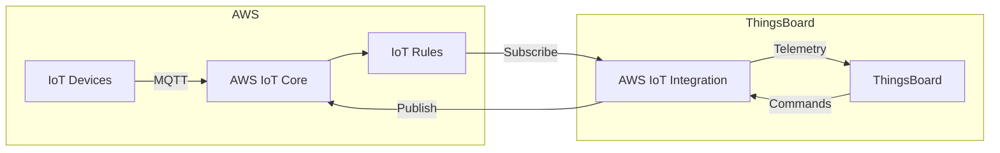
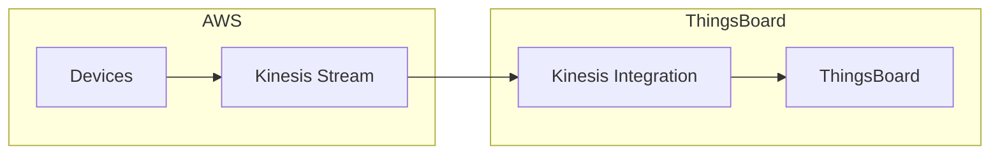
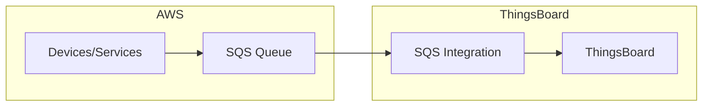
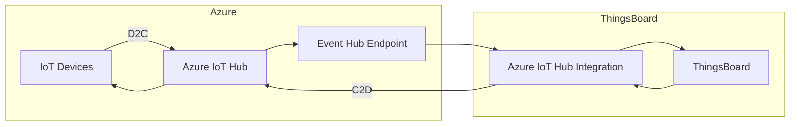
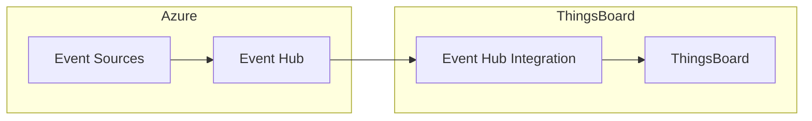
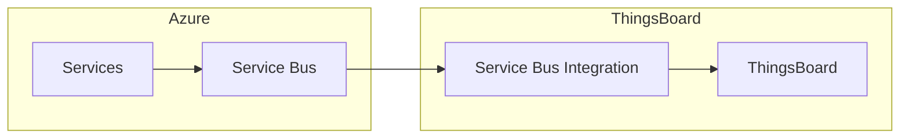
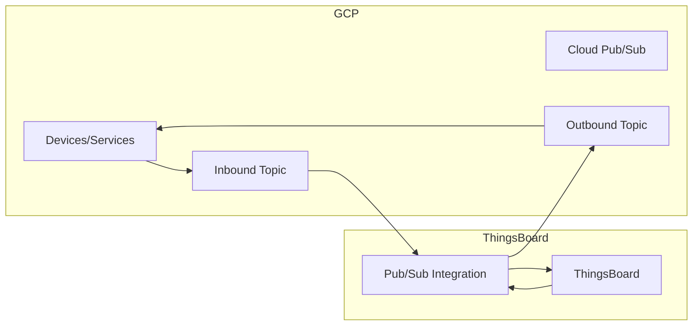
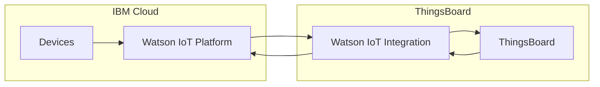
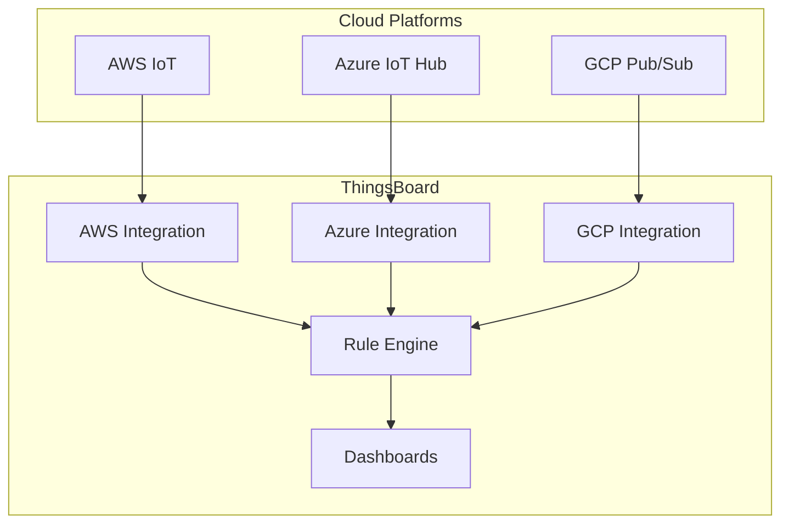
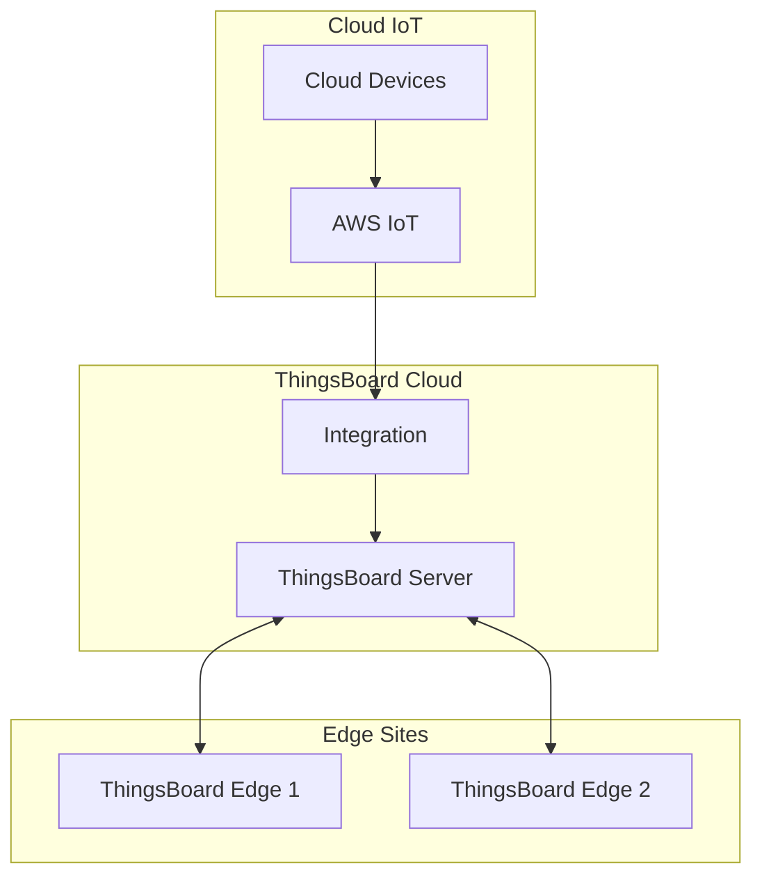

# Cloud IoT Integrations

## Overview

Cloud IoT integrations connect ThingsBoard to major cloud platforms (AWS, Azure, GCP), enabling data ingestion from devices already connected to these platforms. Each integration subscribes to device data streams and transforms payloads using converters. Bidirectional integrations also support sending commands and attribute updates back to devices.

## AWS Integrations

### AWS IoT Core

Integrates with AWS IoT Core MQTT broker to receive device telemetry and send commands.

**Connection Method**: MQTT with X.509 certificates

**Required AWS Resources:**
- IoT Thing (device)
- IoT Policy (permissions)
- Certificate (authentication)

**Key Configuration:**

| Parameter | Description |
|-----------|-------------|
| Endpoint | AWS IoT endpoint (xxx.iot.region.amazonaws.com) |
| Client ID | MQTT client identifier |
| Topic filters | MQTT topics to subscribe |
| Certificate | X.509 certificate for authentication |
| Private key | Certificate private key |

**Features:**
- Bidirectional communication
- X.509 certificate authentication
- Topic-based device routing
- Downlink support via MQTT publish

---

### AWS Kinesis

Consumes data from AWS Kinesis Data Streams for high-throughput ingestion.

**Connection Method**: Kinesis Consumer (HTTP-based)

**Key Configuration:**

| Parameter | Description |
|-----------|-------------|
| Stream name | Kinesis stream name |
| Region | AWS region |
| Access key | IAM access key |
| Secret key | IAM secret key |

**Use Cases:**
- High-volume telemetry streams
- Real-time analytics pipelines
- Multi-source data aggregation

---

### AWS SQS

Polls messages from Amazon Simple Queue Service.

**Connection Method**: SQS Long Polling

**Key Configuration:**

| Parameter | Description |
|-----------|-------------|
| Queue URL | SQS queue URL |
| Region | AWS region |
| Access key | IAM access key |
| Secret key | IAM secret key |
| Polling interval | Message poll frequency |

**Use Cases:**
- Decoupled message processing
- Serverless device data ingestion
- Lambda function outputs

---

## Azure Integrations

### Azure IoT Hub

Integrates with Azure IoT Hub to receive device-to-cloud messages and send cloud-to-device commands.

**Connection Method**: AMQP (Event Hub compatible endpoint)

**Key Configuration:**

| Parameter | Description |
|-----------|-------------|
| Connection string | IoT Hub connection string |
| Consumer group | Event Hub consumer group |
| Event Hub name | Built-in endpoint name |

**Features:**
- Device-to-cloud messages
- Cloud-to-device commands
- Device twin integration (planned)
- Per-device routing

---

### Azure Event Hub

Consumes events from Azure Event Hubs for streaming data ingestion.

**Connection Method**: AMQP

**Key Configuration:**

| Parameter | Description |
|-----------|-------------|
| Connection string | Event Hub connection string |
| Event Hub name | Event Hub name |
| Consumer group | Consumer group name |

**Use Cases:**
- Stream processing pipelines
- Multi-tenant data ingestion
- Event-driven architectures

---

### Azure Service Bus

Integrates with Azure Service Bus queues and topics.

**Connection Method**: AMQP

**Key Configuration:**

| Parameter | Description |
|-----------|-------------|
| Connection string | Service Bus connection string |
| Queue/Topic name | Queue or topic name |
| Subscription | Topic subscription (if using topics) |

---

## Google Cloud Integrations

### Google Cloud Pub/Sub

Integrates with Google Cloud Pub/Sub for bidirectional messaging.

**Connection Method**: gRPC/HTTP

**Key Configuration:**

| Parameter | Description |
|-----------|-------------|
| Project ID | GCP project ID |
| Service account | JSON key file |
| Subscription | Pub/Sub subscription name |
| Topic (downlink) | Outbound topic for commands |

**Features:**
- Bidirectional messaging
- Service account authentication
- Automatic message acknowledgment
- Downlink via separate topic

---

## IBM Watson IoT

Integrates with IBM Watson IoT Platform.

**Connection Method**: MQTT

**Key Configuration:**

| Parameter | Description |
|-----------|-------------|
| Organization ID | Watson IoT org ID |
| API key | API key for authentication |
| Auth token | API authentication token |
| Device type filter | Filter by device type |

---

## Common Patterns

### Multi-Cloud Data Aggregation

Collect data from multiple cloud platforms:

### Cloud-to-Edge Synchronization

Use cloud integrations with Edge deployment:

## Security Best Practices

| Practice | Description |
|----------|-------------|
| Dedicated credentials | Create integration-specific IAM users/service accounts |
| Least privilege | Grant only required permissions |
| Certificate rotation | Rotate X.509 certificates periodically |
| Network isolation | Use VPC endpoints where available |
| Audit logging | Enable cloud provider audit logs |

## Common Pitfalls

### AWS IoT Integration

| Pitfall | Impact | Solution |
|---------|--------|----------|
| IAM policy too restrictive | Connection or publish fails | Grant `iot:Connect`, `iot:Subscribe`, `iot:Receive`, `iot:Publish` permissions |
| Certificate not activated | Authentication rejected | Activate certificate in AWS IoT console |
| Wrong endpoint region | Connection timeout | Use region-specific endpoint (e.g., `xxx.iot.us-east-1.amazonaws.com`) |
| Thing registry mismatch | Device shadow conflicts | Ensure consistent device naming between platforms |
| Topic filter too broad | Receiving irrelevant messages | Use specific topic patterns like `devices/+/telemetry` |

### Azure IoT Hub Integration

| Pitfall | Impact | Solution |
|---------|--------|----------|
| Connection string format | Parse error on startup | Use IoT Hub connection string, not device connection string |
| Consumer group conflicts | Messages not received | Create dedicated consumer group for ThingsBoard |
| IoT Hub vs IoT Central confusion | Wrong API/protocol | Use IoT Hub for direct integration; IoT Central requires different approach |
| Shared access policy scope | Permission denied | Use `iothubowner` or policy with ServiceConnect permission |
| D2C vs C2D message routing | Commands not delivered | Configure message routing for cloud-to-device messages |

### Google Cloud Pub/Sub Integration

| Pitfall | Impact | Solution |
|---------|--------|----------|
| Service account key expired | Authentication fails | Rotate keys regularly, update in integration config |
| Subscription not pulling | Messages accumulate | Verify subscription exists and is attached to correct topic |
| IAM roles insufficient | Permission denied | Grant `pubsub.subscriber` and `pubsub.publisher` roles |
| Acknowledgment timeout | Duplicate messages | Process messages faster or increase ack deadline |
| Cross-project access | Subscription not found | Ensure service account has access to the project |

### General Cloud Integration

| Pitfall | Impact | Solution |
|---------|--------|----------|
| Rate limiting from cloud provider | Messages dropped | Implement backoff, monitor API quotas |
| Network latency between regions | High message delay | Deploy ThingsBoard closer to cloud region |
| Credential expiration | Silent failures | Set up monitoring for credential expiration |
| Message ordering assumptions | Out-of-order processing | Use timestamps from payload, not arrival time |

## Troubleshooting

| Issue | Possible Cause | Solution |
|-------|---------------|----------|
| No data received | Wrong topic/subscription | Verify topic filters match device publishing pattern |
| Authentication failed | Invalid credentials | Regenerate and update certificates/keys |
| Converter errors | Payload format mismatch | Enable debug mode, check payload structure |
| High latency | Network/region distance | Deploy integration closer to cloud region |
| Intermittent disconnects | Network instability | Enable reconnection, check keep-alive settings |
| Duplicate messages | At-least-once delivery | Implement deduplication in converter or rule chain |

## See Also

- [LoRaWAN Integrations](./lorawan-integrations.md) - LPWAN networks
- [Messaging Integrations](./messaging-integrations.md) - Kafka, RabbitMQ
- [Rule Engine](../04-rule-engine/README.md) - Processing received data
