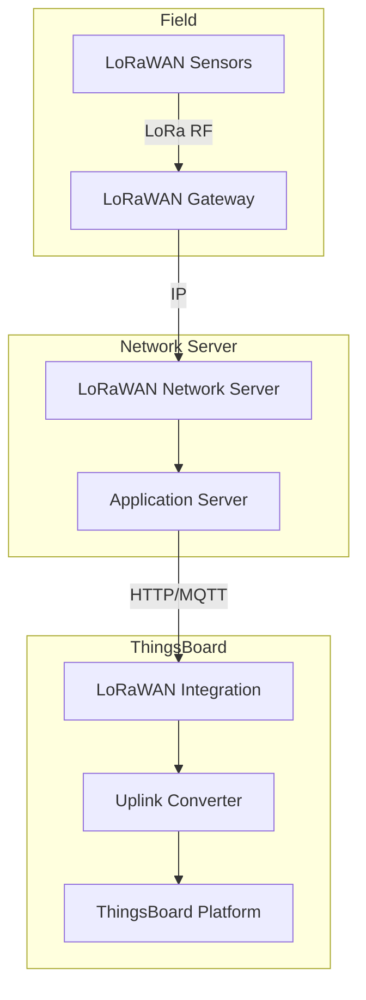
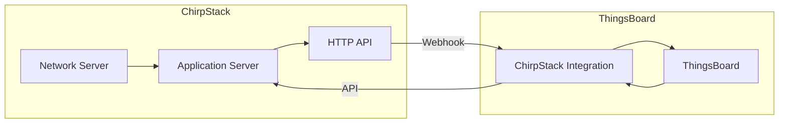
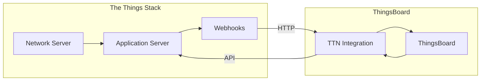
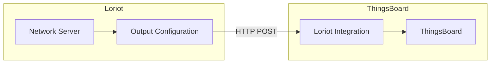
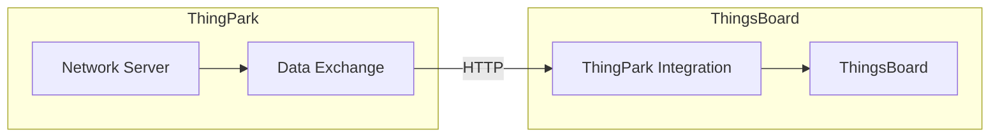
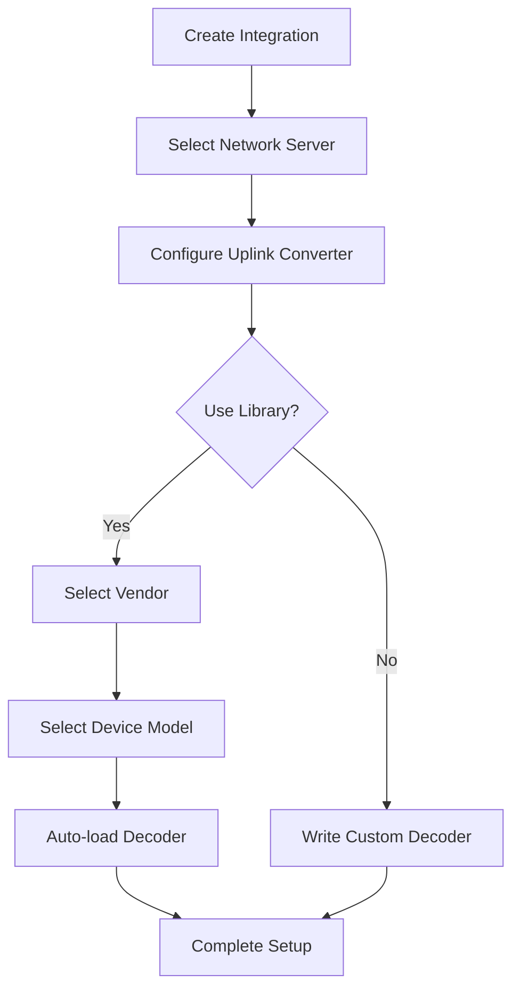
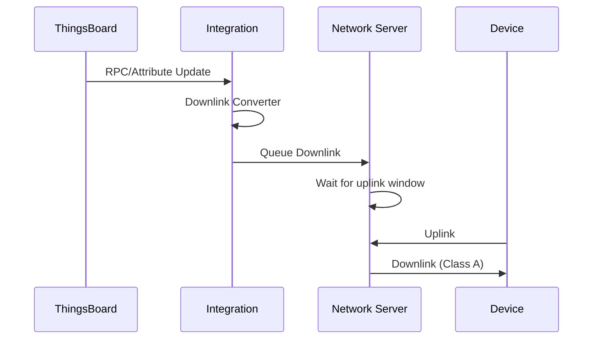
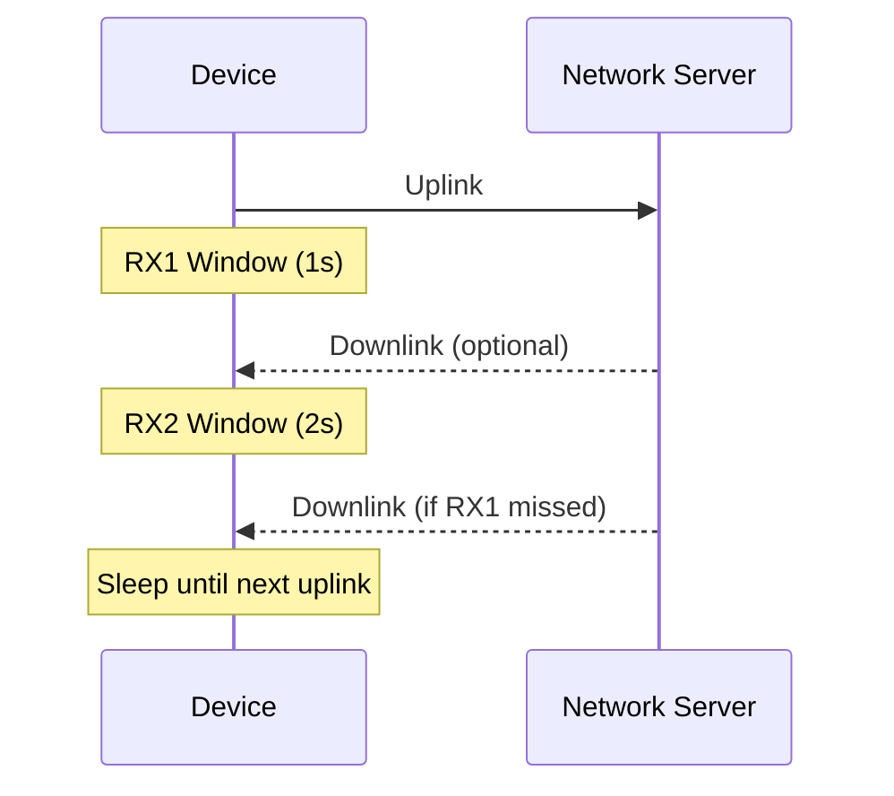

# LoRaWAN Integrations

## Overview

LoRaWAN integrations connect ThingsBoard to Low-Power Wide-Area Network (LPWAN) servers, enabling data collection from LoRaWAN devices without direct connectivity. These integrations receive uplink data via HTTP webhooks or MQTT subscriptions, decode device payloads, and support downlink messaging for device configuration. ThingsBoard provides a converters library with 100+ pre-built decoders for popular LoRaWAN sensors.

## LoRaWAN Architecture



## Supported Network Servers

| Network Server | Protocol | Direction | Converters Library |
|----------------|----------|-----------|-------------------|
| ChirpStack | HTTP/MQTT | Bidirectional | Yes |
| The Things Stack (TTN) | HTTP | Bidirectional | Yes |
| The Things Industries | HTTP | Bidirectional | Yes |
| Loriot | HTTP | Bidirectional | Yes |
| ThingPark (Actility) | HTTP | Bidirectional | Yes |
| ThingPark Enterprise | HTTP | Bidirectional | Yes |
| KPN Things | HTTP | Uplink | No |

---

## ChirpStack Integration

Open-source LoRaWAN network server integration.



**Connection Method**: HTTP Webhooks

**Key Configuration:**

| Parameter | Description |
|-----------|-------------|
| Base URL | ThingsBoard integration endpoint |
| Application server URL | ChirpStack API endpoint (for downlinks) |
| API token | ChirpStack API authentication token |

**Payload Format:**
```json
{
  "deviceInfo": {
    "devEui": "0102030405060708",
    "deviceName": "temperature-sensor",
    "applicationName": "smart-building"
  },
  "data": "AQIDBAUGBwg=",
  "fPort": 1,
  "rxInfo": [...],
  "txInfo": {...}
}
```

**Features:**
- Automatic device provisioning
- Downlink queue management
- Multi-application support
- Pre-built converters for 100+ devices

---

## The Things Stack (TTN) Integration

Integration with The Things Network community and enterprise deployments.



**Connection Method**: HTTP Webhooks

**Key Configuration:**

| Parameter | Description |
|-----------|-------------|
| Webhook URL | ThingsBoard endpoint for uplinks |
| API key | TTN application API key |
| Application ID | TTN application identifier |

**Payload Format:**
```json
{
  "end_device_ids": {
    "device_id": "eui-0102030405060708",
    "dev_eui": "0102030405060708"
  },
  "uplink_message": {
    "f_port": 1,
    "frm_payload": "AQIDBAUGBwg=",
    "decoded_payload": {
      "temperature": 25.5
    },
    "rx_metadata": [...]
  }
}
```

**Features:**
- Community and enterprise network support
- Decoded payload passthrough
- Downlink scheduling
- Converters library support

---

## The Things Industries Integration

Enterprise deployment of The Things Stack.

**Connection Method**: HTTP Webhooks

**Key Configuration:**

| Parameter | Description |
|-----------|-------------|
| Cluster address | TTI cluster (e.g., eu1.cloud.thethings.industries) |
| Application ID | Application identifier |
| API key | Application API key |

**Differences from TTN:**
- Enterprise SLA and support
- Private network deployment option
- Advanced security features

---

## Loriot Integration

Enterprise LoRaWAN network server integration.



**Connection Method**: HTTP Webhooks

**Key Configuration:**

| Parameter | Description |
|-----------|-------------|
| Webhook URL | ThingsBoard endpoint |
| Application ID | Loriot application ID |
| Access token | Loriot API token |

**Payload Format:**
```json
{
  "cmd": "rx",
  "EUI": "0102030405060708",
  "ts": 1609459200000,
  "fcnt": 123,
  "port": 1,
  "data": "AQIDBAUGBwg=",
  "freq": 868100000,
  "rssi": -100,
  "snr": 5.5
}
```

---

## ThingPark Integration

Actility ThingPark network server integration.



**Connection Method**: HTTP Webhooks

**Key Configuration:**

| Parameter | Description |
|-----------|-------------|
| Webhook URL | ThingsBoard endpoint |
| AS ID | Application server ID |
| AS key | Application server key |

**Features:**
- Enterprise-grade network server
- Global roaming support
- ThingPark Enterprise support

---

## Converters Library

ThingsBoard provides pre-built uplink converters for popular LoRaWAN devices.

**Supported Vendors (100+ devices):**
- Dragino (temperature, humidity, door sensors)
- Elsys (environmental sensors)
- Milesight (industrial sensors)
- Browan (smart building sensors)
- Netvox (various sensors)
- RAK Wireless (gateways, sensors)
- Seeed Studio (sensors)

**Using the Library:**



---

## Common Uplink Converter Pattern

**TBEL Decoder:**
```javascript
var data = decodeToJson(payload);
var deviceName = data.deviceInfo ? data.deviceInfo.devEui : data.EUI;

// Decode binary payload
var bytes = atob(data.data || data.frm_payload);
var temperature = (bytes.charCodeAt(0) << 8 | bytes.charCodeAt(1)) / 100;
var humidity = bytes.charCodeAt(2);

var result = {
    deviceName: 'lora-' + deviceName,
    deviceType: 'lorawan-sensor',
    telemetry: {
        temperature: temperature,
        humidity: humidity,
        rssi: data.rssi || data.rxInfo?.[0]?.rssi,
        snr: data.snr || data.rxInfo?.[0]?.snr
    },
    attributes: {
        devEui: deviceName,
        fPort: data.fPort || data.port
    }
};

return result;
```

---

## Downlink Configuration

Send commands and configuration to LoRaWAN devices.



**Downlink Converter Example:**
```javascript
var result = {
    contentType: "JSON",
    data: JSON.stringify({
        devEui: metadata.deviceName.replace('lora-', ''),
        fPort: 2,
        data: btoa(String.fromCharCode(msg.interval || 60)),
        confirmed: false
    }),
    metadata: {}
};

return result;
```

---

## Device Classes

| Class | Latency | Power | Use Case |
|-------|---------|-------|----------|
| Class A | High | Lowest | Battery sensors |
| Class B | Medium | Medium | Scheduled beacons |
| Class C | Low | Highest | Powered actuators |

**Class A Downlink Timing:**


---

## Best Practices

### Device Naming
```
Pattern: lora-{devEui}
Example: lora-0102030405060708
```

### Payload Decoding
- Use converters library when available
- Handle missing fields gracefully
- Extract RF metadata (RSSI, SNR) for monitoring

### Downlink Optimization
- Minimize downlink frequency (battery impact)
- Use confirmed downlinks sparingly
- Queue commands, don't expect immediate delivery

---

## Troubleshooting

| Issue | Possible Cause | Solution |
|-------|---------------|----------|
| No uplinks received | Webhook not configured | Verify network server webhook URL |
| Decoder errors | Payload format changed | Update converter for new format |
| Downlinks not delivered | Class A timing | Wait for device uplink window |
| Duplicate devices | DevEUI format mismatch | Normalize DevEUI in converter |

## See Also

- [Cloud Integrations](./cloud-integrations.md) - AWS, Azure, GCP
- [Messaging Integrations](./messaging-integrations.md) - Kafka, MQTT
- [Transport Layer](../05-transport-layer/README.md) - Direct protocols
