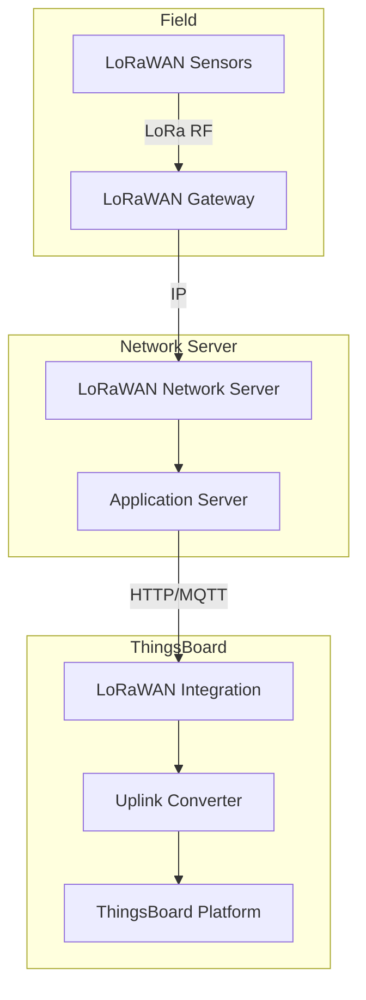
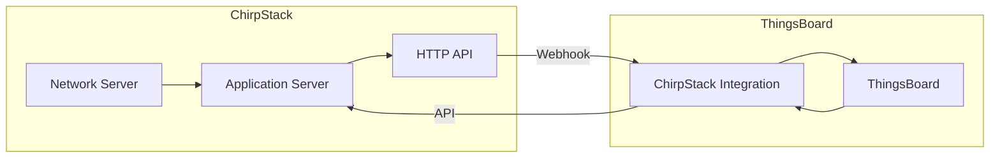
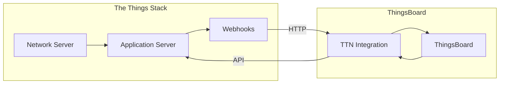
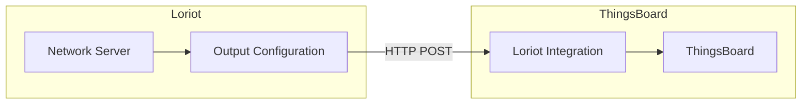
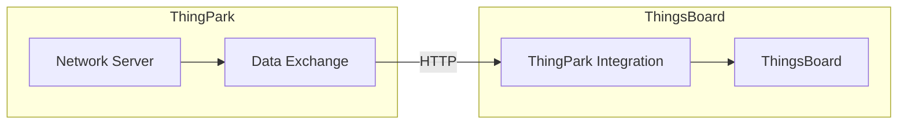
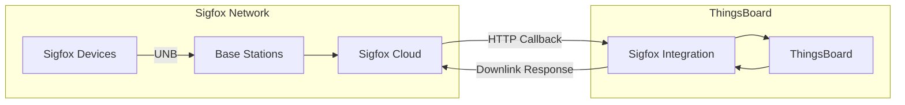
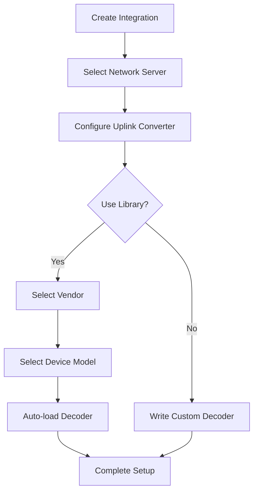
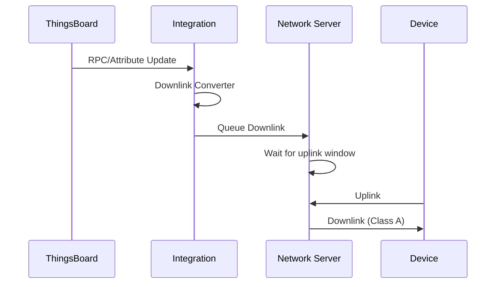
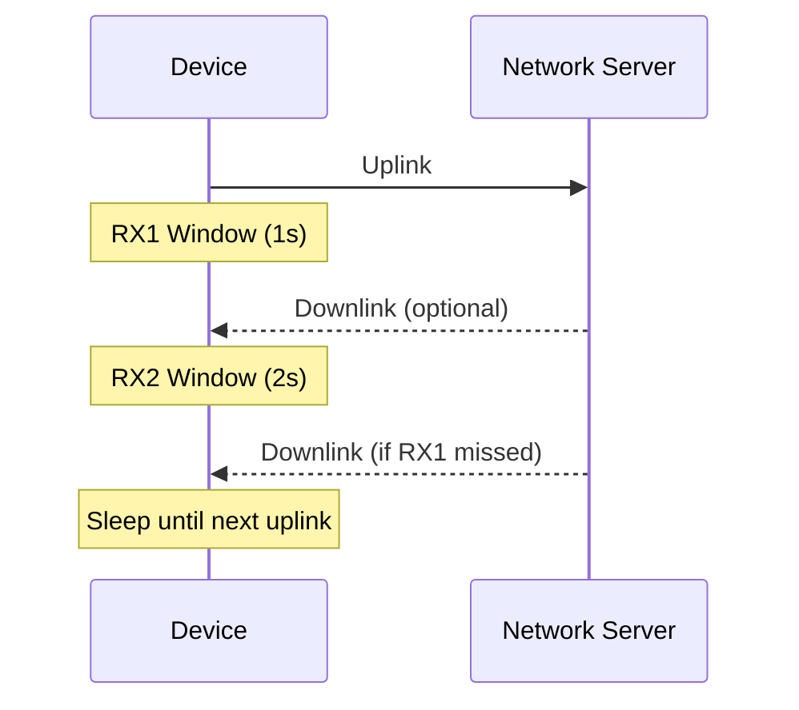

# LoRaWAN Integrations

## Overview

LoRaWAN integrations connect ThingsBoard to Low-Power Wide-Area Network (LPWAN) servers, enabling data collection from LoRaWAN devices without direct connectivity. These integrations receive uplink data via HTTP webhooks or MQTT subscriptions, decode device payloads, and support downlink messaging for device configuration. ThingsBoard provides a converters library with 100+ pre-built decoders for popular LoRaWAN sensors.

## LoRaWAN Architecture



## Supported Network Servers

| Network Server | Protocol | Direction | Converters Library |
|----------------|----------|-----------|-------------------|
| ChirpStack | HTTP/MQTT | Bidirectional | Yes |
| The Things Stack (TTN) | HTTP | Bidirectional | Yes |
| The Things Industries | HTTP | Bidirectional | Yes |
| Loriot | HTTP | Bidirectional | Yes |
| ThingPark (Actility) | HTTP | Bidirectional | Yes |
| ThingPark Enterprise | HTTP | Bidirectional | Yes |
| KPN Things | HTTP | Uplink | No |

---

## ChirpStack Integration

Open-source LoRaWAN network server integration.



**Connection Method**: HTTP Webhooks

**Key Configuration:**

| Parameter | Description |
|-----------|-------------|
| Base URL | ThingsBoard integration endpoint |
| Application server URL | ChirpStack API endpoint (for downlinks) |
| API token | ChirpStack API authentication token |

**Payload Format:**
```json
{
  "deviceInfo": {
    "devEui": "0102030405060708",
    "deviceName": "temperature-sensor",
    "applicationName": "smart-building"
  },
  "data": "AQIDBAUGBwg=",
  "fPort": 1,
  "rxInfo": [...],
  "txInfo": {...}
}
```

**Features:**
- Automatic device provisioning
- Downlink queue management
- Multi-application support
- Pre-built converters for 100+ devices

---

## The Things Stack (TTN) Integration

Integration with The Things Network community and enterprise deployments.



**Connection Method**: HTTP Webhooks

**Key Configuration:**

| Parameter | Description |
|-----------|-------------|
| Webhook URL | ThingsBoard endpoint for uplinks |
| API key | TTN application API key |
| Application ID | TTN application identifier |

**Payload Format:**
```json
{
  "end_device_ids": {
    "device_id": "eui-0102030405060708",
    "dev_eui": "0102030405060708"
  },
  "uplink_message": {
    "f_port": 1,
    "frm_payload": "AQIDBAUGBwg=",
    "decoded_payload": {
      "temperature": 25.5
    },
    "rx_metadata": [...]
  }
}
```

**Features:**
- Community and enterprise network support
- Decoded payload passthrough
- Downlink scheduling
- Converters library support

---

## The Things Industries Integration

Enterprise deployment of The Things Stack.

**Connection Method**: HTTP Webhooks

**Key Configuration:**

| Parameter | Description |
|-----------|-------------|
| Cluster address | TTI cluster (e.g., eu1.cloud.thethings.industries) |
| Application ID | Application identifier |
| API key | Application API key |

**Differences from TTN:**
- Enterprise SLA and support
- Private network deployment option
- Advanced security features

---

## Loriot Integration

Enterprise LoRaWAN network server integration.



**Connection Method**: HTTP Webhooks

**Key Configuration:**

| Parameter | Description |
|-----------|-------------|
| Webhook URL | ThingsBoard endpoint |
| Application ID | Loriot application ID |
| Access token | Loriot API token |

**Payload Format:**
```json
{
  "cmd": "rx",
  "EUI": "0102030405060708",
  "ts": 1609459200000,
  "fcnt": 123,
  "port": 1,
  "data": "AQIDBAUGBwg=",
  "freq": 868100000,
  "rssi": -100,
  "snr": 5.5
}
```

---

## ThingPark Integration

Actility ThingPark network server integration.



**Connection Method**: HTTP Webhooks

**Key Configuration:**

| Parameter | Description |
|-----------|-------------|
| Webhook URL | ThingsBoard endpoint |
| AS ID | Application server ID |
| AS key | Application server key |

**Features:**
- Enterprise-grade network server
- Global roaming support
- ThingPark Enterprise support

---

## Sigfox Integration

Sigfox integration receives device data via HTTP callbacks from the Sigfox backend.



**Connection Method**: HTTP Webhooks (callback)

**Key Configuration:**

| Parameter | Description |
|-----------|-------------|
| Webhook URL | ThingsBoard endpoint for callbacks |
| API credentials | Sigfox backend credentials (optional) |
| Custom payload config | Fields to include in callback |

**Sigfox Callback Setup:**

1. In Sigfox backend, navigate to **Device Type** → **Callbacks**
2. Create a **Custom callback** with:
   - Type: **DATA** / **UPLINK**
   - Channel: **URL**
   - URL pattern: ThingsBoard integration endpoint
   - HTTP Method: **POST**
   - Content Type: **application/json**

**Payload Format:**
```json
{
  "device": "BF1327",
  "time": "1661868952",
  "data": "2502af2102462a",
  "seqNumber": "3737"
}
```

**Features:**
- Ultra-narrow band (UNB) protocol support
- Low power, long range connectivity
- Downlink via callback response (synchronous)
- Limited payload size (12 bytes uplink, 8 bytes downlink)

**Downlink Behavior:**
Sigfox uses synchronous downlinks. The response to an uplink callback is queued and sent to the device during the next downlink window. This differs from MQTT-based integrations where downlinks are sent immediately.

---

## Converters Library

ThingsBoard provides pre-built uplink converters for popular LoRaWAN devices.

**Supported Vendors (100+ devices):**
- Dragino (temperature, humidity, door sensors)
- Elsys (environmental sensors)
- Milesight (industrial sensors)
- Browan (smart building sensors)
- Netvox (various sensors)
- RAK Wireless (gateways, sensors)
- Seeed Studio (sensors)

**Using the Library:**



---

## Common Uplink Converter Pattern

**TBEL Decoder:**
```javascript
var data = decodeToJson(payload);
var deviceName = data.deviceInfo ? data.deviceInfo.devEui : data.EUI;

// Decode binary payload
var bytes = atob(data.data || data.frm_payload);
var temperature = (bytes.charCodeAt(0) << 8 | bytes.charCodeAt(1)) / 100;
var humidity = bytes.charCodeAt(2);

var result = {
    deviceName: 'lora-' + deviceName,
    deviceType: 'lorawan-sensor',
    telemetry: {
        temperature: temperature,
        humidity: humidity,
        rssi: data.rssi || data.rxInfo?.[0]?.rssi,
        snr: data.snr || data.rxInfo?.[0]?.snr
    },
    attributes: {
        devEui: deviceName,
        fPort: data.fPort || data.port
    }
};

return result;
```

---

## Downlink Configuration

Send commands and configuration to LoRaWAN devices.



**Downlink Converter Example:**
```javascript
var result = {
    contentType: "JSON",
    data: JSON.stringify({
        devEui: metadata.deviceName.replace('lora-', ''),
        fPort: 2,
        data: btoa(String.fromCharCode(msg.interval || 60)),
        confirmed: false
    }),
    metadata: {}
};

return result;
```

---

## Device Classes

| Class | Latency | Power | Use Case |
|-------|---------|-------|----------|
| Class A | High | Lowest | Battery sensors |
| Class B | Medium | Medium | Scheduled beacons |
| Class C | Low | Highest | Powered actuators |

**Class A Downlink Timing:**


---

## Best Practices

### Device Naming
```
Pattern: lora-{devEui}
Example: lora-0102030405060708
```

### Payload Decoding
- Use converters library when available
- Handle missing fields gracefully
- Extract RF metadata (RSSI, SNR) for monitoring

### Downlink Optimization
- Minimize downlink frequency (battery impact)
- Use confirmed downlinks sparingly
- Queue commands, don't expect immediate delivery

---

## Common Pitfalls

### LoRaWAN General

| Pitfall | Impact | Solution |
|---------|--------|----------|
| Device EUI format mismatch | Duplicate devices created | Normalize format (hex uppercase, no separators) |
| ABP vs OTAA confusion | Device won't join | Match activation mode between network server and device |
| Downlink queue overflow | Commands dropped | Limit queued downlinks, prioritize critical commands |
| Port number routing | Wrong decoder applied | Use fPort to determine payload format |
| Payload codec mismatch | Garbled data | Verify decoder matches device firmware version |

### The Things Network (TTN)

| Pitfall | Impact | Solution |
|---------|--------|----------|
| API key scope too narrow | Authentication fails | Include required permissions (read devices, write downlinks) |
| V2 vs V3 API differences | Integration breaks | Use V3 endpoints and payload format |
| Webhook vs MQTT choice | Different setup required | Webhooks simpler; MQTT for real-time requirements |
| Application ID mismatch | Messages not received | Verify application ID matches exactly |
| Fair use policy exceeded | Messages dropped | Monitor airtime usage, reduce transmission frequency |
| Region-specific endpoints | Connection fails | Use correct cluster (eu1, nam1, au1) |

### ChirpStack

| Pitfall | Impact | Solution |
|---------|--------|----------|
| API token format | Authentication rejected | Include "Bearer " prefix or use correct header |
| gRPC vs REST selection | Wrong protocol configured | Use HTTP integration for simplicity |
| Application server URL | Downlinks fail | Configure correct AS URL for bidirectional flow |
| Device profile mismatch | Join fails | Ensure device profile matches device configuration |
| Gateway bridge misconfiguration | No uplinks | Verify gateway bridge points to ChirpStack |

### Sigfox

| Pitfall | Impact | Solution |
|---------|--------|----------|
| Callback URL unreachable | No data received | Ensure ThingsBoard endpoint is publicly accessible |
| Downlink synchronous timing | Commands delayed | Downlinks only sent after device uplink |
| Payload size limits | Data truncated | Keep uplink ≤12 bytes, downlink ≤8 bytes |
| Device type callback scope | Some devices missing | Configure callbacks at correct device type level |
| Sequence number gaps | Missed messages suspected | Normal behavior; Sigfox doesn't guarantee delivery |

### Device Classes

| Pitfall | Impact | Solution |
|---------|--------|----------|
| Class A downlink timing | Commands never arrive | Queue commands, wait for device uplink window |
| Class C power consumption | Battery drain | Only use Class C with powered devices |
| Class B beacon sync | Missed receive windows | Ensure gateway broadcasts beacons |

### Converter Issues

| Pitfall | Impact | Solution |
|---------|--------|----------|
| Base64 vs hex payload | Decode fails | Check network server encoding format |
| Missing rssi/snr extraction | No RF metadata | Extract from rxInfo array in payload |
| Timestamp format mismatch | Wrong time displayed | Convert epoch seconds to milliseconds if needed |
| Null fPort handling | Exceptions thrown | Check for null before accessing fPort |

## Troubleshooting

| Issue | Possible Cause | Solution |
|-------|---------------|----------|
| No uplinks received | Webhook not configured | Verify network server webhook URL |
| Decoder errors | Payload format changed | Update converter for new format |
| Downlinks not delivered | Class A timing | Wait for device uplink window |
| Duplicate devices | DevEUI format mismatch | Normalize DevEUI in converter |
| Authentication failed | Invalid API token | Regenerate token, verify format |
| Partial data received | Converter exception | Enable debug mode, check for null values |

## See Also

- [Cloud Integrations](./cloud-integrations.md) - AWS, Azure, GCP
- [Messaging Integrations](./messaging-integrations.md) - Kafka, MQTT
- [Transport Layer](../05-transport-layer/README.md) - Direct protocols
