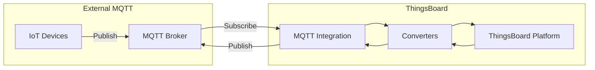
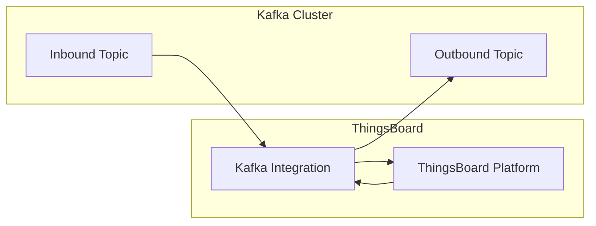
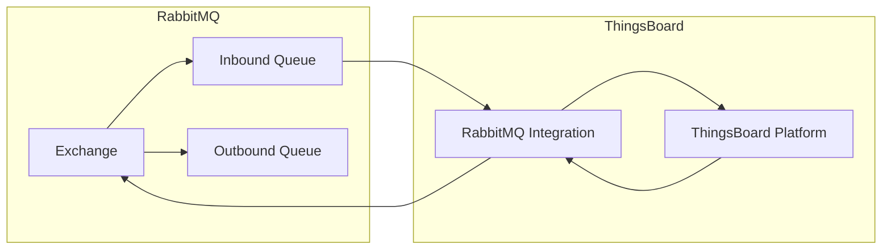
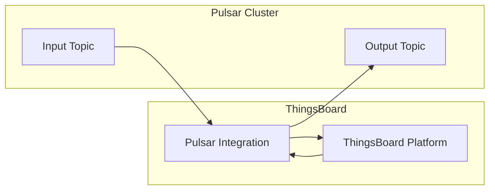
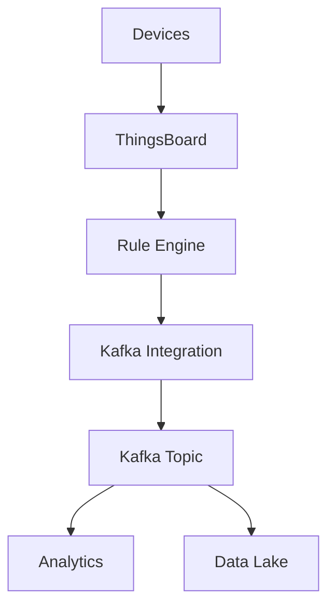
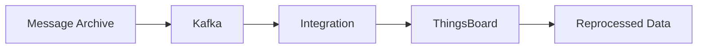
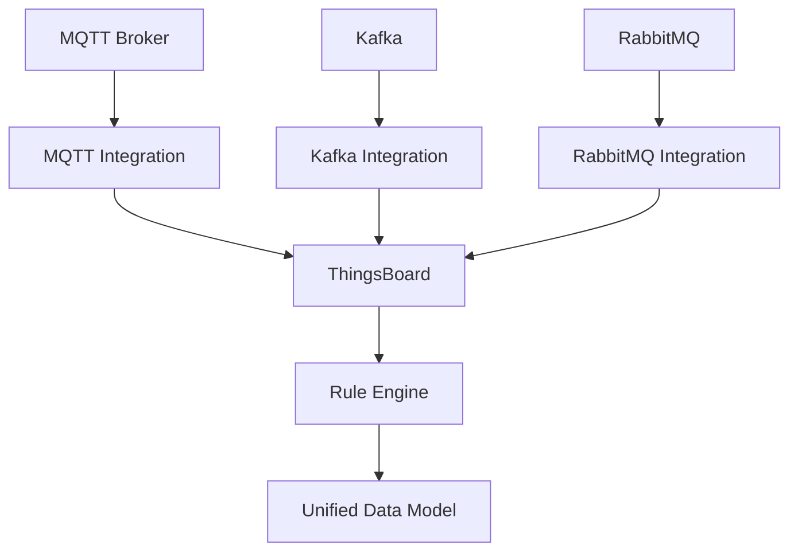

# Messaging Integrations

## Overview

Messaging integrations connect ThingsBoard to external message brokers and streaming platforms, enabling data ingestion from MQTT brokers, Apache Kafka, RabbitMQ, and Apache Pulsar. These integrations support both consuming messages from external systems and publishing data back, making them ideal for enterprise integration scenarios and stream processing pipelines.

## Supported Platforms

| Platform | Protocol | Direction | Use Case |
|----------|----------|-----------|----------|
| MQTT | MQTT 3.1.1/5.0 | Bidirectional | External MQTT brokers |
| Apache Kafka | Kafka | Bidirectional | Stream processing |
| RabbitMQ | AMQP | Bidirectional | Message queuing |
| Apache Pulsar | Pulsar | Bidirectional | Distributed messaging |

---

## MQTT Integration

Connects to external MQTT brokers to consume device data and publish commands.



### Key Configuration

| Parameter | Description |
|-----------|-------------|
| Host | MQTT broker hostname |
| Port | Broker port (1883/8883) |
| Client ID | MQTT client identifier |
| Username/Password | Broker authentication |
| SSL/TLS | Enable secure connection |
| Topic filters | Topics to subscribe |
| QoS | Quality of service level |

### Topic Mapping

Map MQTT topics to device names and data types:

```json
{
  "topicFilter": "sensors/+/telemetry",
  "converter": {
    "type": "custom",
    "deviceNamePattern": "${topic[1]}",
    "deviceTypePattern": "mqtt-sensor"
  }
}
```

**Topic Pattern Examples:**

| Pattern | Matches | Device Name |
|---------|---------|-------------|
| `sensors/+/telemetry` | sensors/device1/telemetry | device1 |
| `building/#` | building/floor1/room2/temp | floor1-room2 |
| `+/+/data` | site/dev123/data | dev123 |

### Uplink Converter Example

```javascript
var data = decodeToJson(payload);
var topicParts = metadata.topic.split('/');

var result = {
    deviceName: topicParts[1],
    deviceType: 'mqtt-sensor',
    telemetry: {
        temperature: data.temp,
        humidity: data.hum
    }
};

return result;
```

### Downlink Configuration

Publish to external broker when rule engine triggers:

```javascript
var result = {
    contentType: "JSON",
    data: JSON.stringify({
        command: msg.method,
        params: msg.params
    }),
    metadata: {
        topic: "devices/" + metadata.deviceName + "/commands"
    }
};

return result;
```

---

## Apache Kafka Integration

Consumes and produces messages to Apache Kafka topics.



### Key Configuration

| Parameter | Description |
|-----------|-------------|
| Bootstrap servers | Kafka broker addresses |
| Topic | Topic to consume from |
| Group ID | Consumer group identifier |
| Auto offset reset | earliest/latest |
| Key deserializer | Key format |
| Value deserializer | Value format |

### SASL/SSL Configuration

| Parameter | Description |
|-----------|-------------|
| Security protocol | PLAINTEXT, SSL, SASL_PLAINTEXT, SASL_SSL |
| SASL mechanism | PLAIN, SCRAM-SHA-256, SCRAM-SHA-512 |
| SASL username | Authentication username |
| SASL password | Authentication password |
| SSL truststore | Truststore for TLS |

### Consumer Configuration

```json
{
  "bootstrapServers": "kafka1:9092,kafka2:9092",
  "topic": "iot-telemetry",
  "groupId": "thingsboard-integration",
  "autoOffsetReset": "latest",
  "pollInterval": 1000,
  "consumerProperties": {
    "max.poll.records": 500
  }
}
```

### Uplink Converter Example

```javascript
var data = decodeToJson(payload);

var result = {
    deviceName: data.deviceId,
    deviceType: 'kafka-device',
    telemetry: {
        ts: data.timestamp,
        values: data.measurements
    }
};

return result;
```

### Producer (Downlink) Configuration

Send rule engine messages to Kafka:

```javascript
var result = {
    contentType: "JSON",
    data: JSON.stringify({
        deviceId: metadata.deviceName,
        command: msg.method,
        params: msg.params,
        timestamp: Date.now()
    }),
    metadata: {
        key: metadata.deviceName  // Kafka message key
    }
};

return result;
```

---

## RabbitMQ Integration

Integrates with RabbitMQ message broker using AMQP protocol.



### Key Configuration

| Parameter | Description |
|-----------|-------------|
| Host | RabbitMQ server hostname |
| Port | AMQP port (5672/5671) |
| Virtual host | RabbitMQ virtual host |
| Username | Authentication username |
| Password | Authentication password |
| Queue name | Queue to consume from |
| Exchange name | Exchange for publishing |
| Routing key | Message routing key |

### Queue Binding

```json
{
  "host": "rabbitmq.example.com",
  "port": 5672,
  "virtualHost": "/",
  "username": "thingsboard",
  "password": "secret",
  "queueName": "iot-data",
  "exchangeName": "iot-exchange",
  "routingKey": "telemetry.#"
}
```

### Message Patterns

| Pattern | Use Case |
|---------|----------|
| Direct | Point-to-point messaging |
| Topic | Wildcard routing |
| Fanout | Broadcast to all queues |
| Headers | Attribute-based routing |

---

## Apache Pulsar Integration

Integrates with Apache Pulsar distributed messaging platform.



### Key Configuration

| Parameter | Description |
|-----------|-------------|
| Service URL | Pulsar broker URL |
| Topic | Topic to consume |
| Subscription | Subscription name |
| Subscription type | Exclusive/Shared/Failover |

### Connection Settings

```json
{
  "serviceUrl": "pulsar://pulsar.example.com:6650",
  "topic": "persistent://public/iot/telemetry",
  "subscriptionName": "thingsboard-sub",
  "subscriptionType": "Shared"
}
```

---

## Common Integration Patterns

### Event Sourcing

Capture all device events in a message stream:



### Message Replay

Re-process historical data:



### Multi-System Integration

Bridge multiple messaging systems:



---

## Performance Tuning

### MQTT Integration

| Parameter | Recommendation |
|-----------|----------------|
| QoS | Use QoS 1 for balance |
| Keep Alive | 30-60 seconds |
| Max Inflight | Adjust based on throughput |
| Clean Session | false for persistence |

### Kafka Integration

| Parameter | Recommendation |
|-----------|----------------|
| Batch size | 16384-65536 bytes |
| Linger ms | 5-10 ms |
| Buffer memory | 32-64 MB |
| Compression | lz4 or snappy |
| Partitions | Scale with consumers |

### RabbitMQ Integration

| Parameter | Recommendation |
|-----------|----------------|
| Prefetch count | 10-50 messages |
| Acknowledgment | Manual with batching |
| Heartbeat | 60 seconds |
| Connection recovery | Enable automatic |

---

## Security Configuration

### TLS/SSL

All messaging integrations support encrypted connections:

```json
{
  "ssl": {
    "enabled": true,
    "trustStore": "/path/to/truststore.jks",
    "trustStorePassword": "secret",
    "keyStore": "/path/to/keystore.jks",
    "keyStorePassword": "secret"
  }
}
```

### Authentication Methods

| Platform | Methods |
|----------|---------|
| MQTT | Username/Password, Certificates |
| Kafka | SASL (PLAIN, SCRAM), SSL |
| RabbitMQ | Username/Password, Certificates |
| Pulsar | Token, TLS, OAuth2 |

---

## Troubleshooting

| Issue | Possible Cause | Solution |
|-------|---------------|----------|
| Connection refused | Wrong host/port | Verify broker address |
| Authentication failed | Invalid credentials | Check username/password |
| No messages received | Wrong topic/queue | Verify subscription |
| High latency | Network/batch settings | Tune buffer and batch sizes |
| Consumer lag | Slow processing | Increase consumers or partitions |

## See Also

- [Cloud Integrations](./cloud-integrations.md) - AWS, Azure, GCP
- [LoRaWAN Integrations](./lorawan-integrations.md) - LPWAN networks
- [Message Queue](../08-message-queue/README.md) - Internal queue architecture
- [Rule Engine](../04-rule-engine/README.md) - Processing messages
