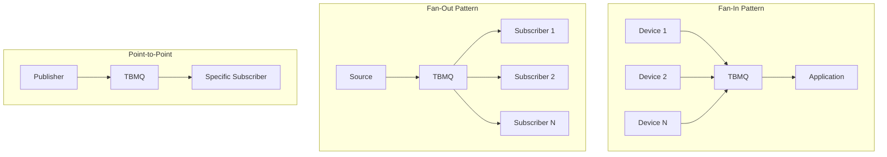
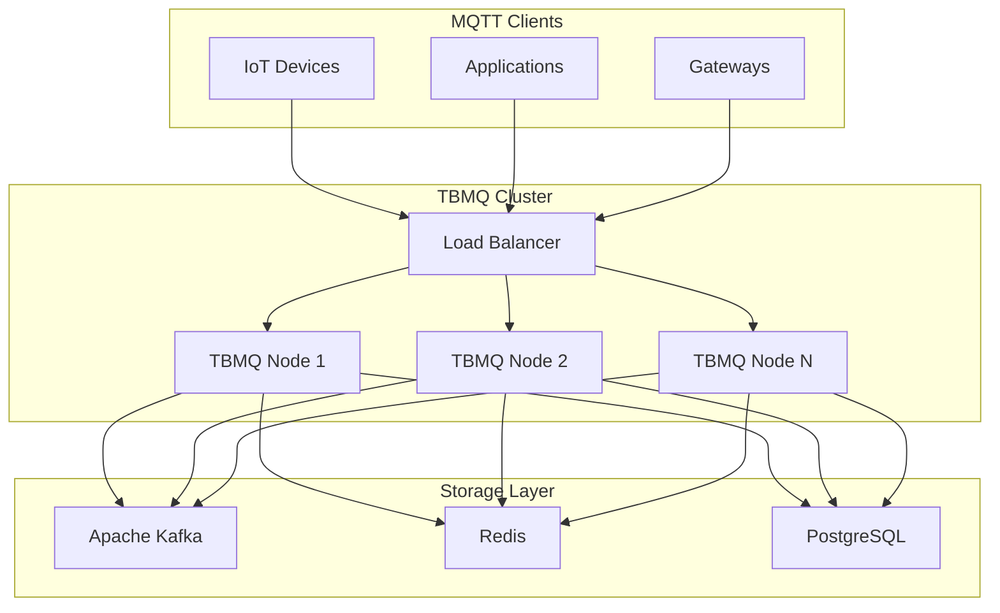
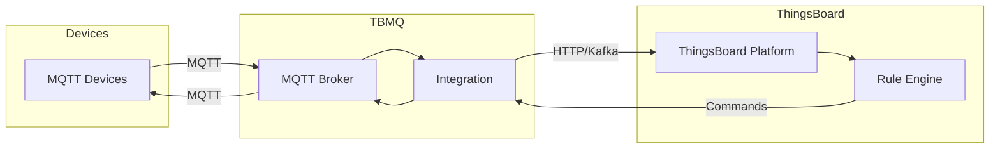

# TBMQ - MQTT Broker

## Overview

TBMQ is ThingsBoard's open-source MQTT message broker designed for high-performance IoT messaging. It can handle 4M+ concurrent client connections, supporting 3M+ messages per second throughput on a single node with low latency delivery. In cluster mode, TBMQ scales to support 100M+ concurrently connected clients.

## Contents

| Document | Description |
|----------|-------------|
| [TBMQ Architecture](./tbmq-architecture.md) | Broker architecture, scalability, clustering |
| [MQTT Features](./mqtt-features.md) | Protocol support, QoS, sessions, shared subscriptions |

## Key Features

- **Full MQTT Compliance** - MQTT 3.1, 3.1.1, and 5.0 support
- **Massive Scale** - 4M+ connections, 3M+ msg/sec per node
- **Horizontal Scaling** - Cluster mode for 100M+ connections
- **Multiple Auth Methods** - X.509, JWT, SCRAM, Basic
- **Access Control** - Client ID, username, or certificate-based ACL
- **Integrations** - HTTP, MQTT, and Kafka integrations
- **Monitoring** - Cluster and client metrics, Kafka topic monitoring

## MQTT Messaging Patterns

TBMQ is designed to handle three core IoT messaging patterns:



| Pattern | Description | Use Case |
|---------|-------------|----------|
| Fan-In | Many devices → Few applications | Telemetry collection |
| Fan-Out | Few sources → Many subscribers | Broadcast notifications |
| Point-to-Point | One-to-one messaging | Device commands, private messaging |

## Architecture Overview



## Client Types

TBMQ distinguishes between two client types with different persistence behaviors:

| Client Type | Session Handling | Message Storage | Use Case |
|-------------|------------------|-----------------|----------|
| DEVICE | Individual sessions | Redis (when offline) | IoT sensors, constrained devices |
| APPLICATION | Consumer groups | Kafka topics | Backend services, data processors |

### Device Clients

- Optimized for many-to-one communication
- Persistent sessions store messages in Redis when offline
- Automatic message redelivery on reconnection

### Application Clients

- Optimized for shared subscriptions and load balancing
- Messages stored in Kafka topics for durability
- Consumer group-based message distribution

## Protocol Support

| Version | Features | Standard |
|---------|----------|----------|
| MQTT 3.1 | Basic pub/sub, QoS 0-2 | IBM specification |
| MQTT 3.1.1 | Improved 3.1, cleaner protocol | OASIS standard |
| MQTT 5.0 | Enhanced features, properties | OASIS standard |

## Authentication Methods

| Method | Description | Configuration |
|--------|-------------|---------------|
| Basic | Username/password | Client credentials |
| X.509 | Certificate chain | TLS mutual auth |
| JWT | JSON Web Tokens | Token validation |
| SCRAM | Salted Challenge Response | MQTT 5.0 enhanced auth |

## Integration with ThingsBoard

TBMQ can be used standalone or integrated with ThingsBoard IoT Platform:



## Performance Benchmarks

### Single Node Performance

| Metric | Value |
|--------|-------|
| Max concurrent connections | 4M+ |
| Message throughput | 3M+ msg/sec |
| Latency | Sub-millisecond |

### Cluster Performance

| Metric | Value |
|--------|-------|
| Max concurrent connections | 100M+ |
| Horizontal scaling | Linear |
| Node count | Unlimited |

## Deployment Options

| Option | Description | Best For |
|--------|-------------|----------|
| Docker | Single container | Development, testing |
| Docker Compose | Multi-container with dependencies | Small deployments |
| Kubernetes/Helm | Orchestrated cluster | Production at scale |
| Bare Metal | Direct installation | Maximum performance |

## Use Cases

- **Smart Home** - Connected appliances, sensors, controls
- **Industrial IoT** - Factory automation, predictive maintenance
- **Fleet Management** - Vehicle telemetry, location tracking
- **Smart Cities** - Environmental monitoring, traffic systems
- **Healthcare** - Medical devices, patient monitoring
- **Agriculture** - Crop monitoring, irrigation systems

## Common Pitfalls

Deploying and operating TBMQ in production requires careful attention to client type selection, infrastructure sizing, and operational monitoring. Teams commonly encounter issues in three areas: client configuration (choosing appropriate client type and session settings), deployment planning (resource allocation for expected scale), and operations (monitoring, alerting, backup strategies). The pitfalls below represent real-world MQTT broker operational challenges that can impact reliability, message delivery, and troubleshooting efficiency.

### Client Type Selection

| Pitfall | Impact | Detection | Solution |
|---------|--------|-----------|----------|
| Using DEVICE client for backend services | Messages stored in Redis instead of Kafka, limited durability and throughput | Backend service messages flood Redis memory, slow performance | Use APPLICATION client type for backend services, data processors, and integration services. Reserve DEVICE type for constrained IoT devices |
| Clean session for persistent subscriptions | Messages lost during disconnect, subscription state not preserved | Clients miss messages published while disconnected, no queue buildup | Use persistent sessions (cleanSession=false for MQTT 3.x, cleanStart=false + session expiry for MQTT 5.0) for devices requiring message delivery guarantees |
| QoS 0 for critical command-and-control | Fire-and-forget delivery loses messages during network issues or client offline | Critical device commands not executed, no acknowledgment of delivery | Use QoS 1 (at least once) for important messages. Reserve QoS 0 for high-frequency telemetry where individual message loss is acceptable |

### Deployment & Scaling

| Pitfall | Impact | Detection | Solution |
|---------|--------|-----------|----------|
| Kafka partition count underprovisioned | Single hot partition becomes bottleneck, message lag increases | Kafka consumer lag growing (10s+), uneven partition distribution visible in metrics | Calculate partitions: devices ÷ 10K as baseline. 100K devices → 10+ partitions minimum. Monitor partition distribution and rebalance if needed |
| Redis memory exhaustion | Persistent session storage exceeds available memory, OOM kills broker | Redis memory usage >90%, eviction warnings, broker crashes during peak | Size Redis for peak persistent sessions: session count × 10KB per session baseline. 50K sessions → 500MB minimum. Enable monitoring and alerts at 80% |
| PostgreSQL connection pool saturation | Slow queries accumulate, authentication delays, connection timeouts | Connection pool exhaustion warnings, client connection failures, auth timeouts > 5s | Increase connection pool size proportional to expected connection rate. Default 50 → 200+ for high-connection-rate deployments. Monitor pool utilization |

### Monitoring & Operations

| Pitfall | Impact | Detection | Solution |
|---------|--------|-----------|----------|
| No observability into broker health | Issues discovered only when users report failures, reactive troubleshooting | Users complain about message loss or delays before operations team aware | Export broker metrics to monitoring system (Prometheus, Grafana). Track: client connections, message throughput, latency, storage utilization. Alert on thresholds |
| Missing critical alerts | Resource exhaustion (disk full, OOM, connection limits) goes unnoticed until catastrophic failure | Broker crashes without warning, extended downtime for recovery | Configure alerts: Kafka disk >85%, Redis memory >80%, connection count >80% limit, message lag >10K, node unavailable >1min |
| No session data backup strategy | Redis failure or cluster loss results in all persistent session state lost | After Redis failure, all devices must reconnect and resubscribe, message queues lost | Configure Redis persistence (AOF or RDB snapshots). For critical deployments, use Redis Cluster with replication. Document recovery procedures |

**Detailed Example 1: CLIENT_TYPE Mismatch Causing Message Loss**

**Problem**: Backend integration service connects to TBMQ with CLIENT_TYPE set to DEVICE and requests persistent session (cleanSession=false). During service maintenance window, service disconnects for 5 minutes. Upon reconnection, messages published during the outage are not delivered, causing data gaps in downstream processing.

**Why This Happens**: TBMQ distinguishes between two fundamentally different client types with different storage backends and delivery semantics:
- **DEVICE clients**: Store messages in Redis with session-based queuing. Optimized for many (100K+) devices with sporadic connectivity and small message queues per device.
- **APPLICATION clients**: Store messages in Kafka topics with consumer group semantics. Optimized for few (10-100) backend services processing high message volumes with durable storage.

When a backend service incorrectly uses DEVICE type, its message queue competes with thousands of actual devices for Redis memory. Redis has limited memory compared to Kafka's disk-based storage. During the maintenance window, if Redis memory is constrained, the LRU eviction policy may discard the service's queued messages to make room for device queues. Upon reconnection, the service receives partial or no messages from the outage period.

**Detection**:
- Backend service reports gaps in processed message timeline
- Redis memory utilization spikes during service disconnection
- Redis eviction count increases in metrics during service offline period
- Application logs show fewer messages received than expected based on publish rate
- Message sequence numbers have gaps indicating missing deliveries

**Solution**:
1. **Immediate**: Reconfigure backend service to use APPLICATION client type:
   ```yaml
   mqtt:
     clientType: APPLICATION  # Not DEVICE
     cleanSession: false
     subscriptions:
       - topic: "sensors/+/telemetry"
         qos: 1
   ```
2. **Consumer Group Configuration**: APPLICATION clients automatically form consumer groups, enabling horizontal scaling:
   ```yaml
   consumerGroup: "telemetry-processor"  # Multiple instances share load
   ```
3. **Validation**: After reconfiguration, verify messages are stored in Kafka topics (not Redis). Monitor Kafka consumer lag instead of Redis queue depth
4. **Sizing**: APPLICATION client message storage is limited only by Kafka disk space (TB scale) rather than Redis memory (GB scale)

**Configuration Comparison**:
```yaml
# WRONG - Backend service as DEVICE
client:
  id: "backend-service-001"
  type: DEVICE              # Stores in Redis
  cleanSession: false       # Creates persistent Redis queue
  # Problem: Competes with 100K devices for Redis memory

# CORRECT - Backend service as APPLICATION
client:
  id: "backend-service-001"
  type: APPLICATION         # Stores in Kafka
  cleanSession: false       # Creates Kafka consumer group
  consumerGroup: "processors"  # Load balances across instances
  # Benefit: Durable Kafka storage, horizontal scaling
```

**Detailed Example 2: Kafka Partition Underprovisioning**

**Problem**: TBMQ deployment configured with 3 Kafka partitions handles 100,000 device connections. During operational monitoring, message delivery latency increases from <10ms to 5-10 seconds. Kafka consumer lag metrics show one partition with 50K messages lag while other partitions have <1K lag.

**Why This Happens**: TBMQ distributes client connections and their messages across Kafka partitions using client ID hashing. With default hashing, distribution should be even, but real-world client ID patterns can create hot spots:
- Sequential client IDs (`device-00001` to `device-10000`) may hash to similar partition values
- Client IDs with common prefixes concentrate on same partition
- Geographic or deployment-based naming (all devices in region use `us-east-*` prefix)

With only 3 partitions serving 100K devices, each partition handles ~33K devices on average. If client ID hashing is skewed, one partition may handle 50K+ devices (50% of load). Kafka partition throughput is limited by single-threaded consumer processing. When 50K devices publish simultaneously during peak hours, the hot partition's consumer cannot keep pace, causing lag accumulation. Messages queue in Kafka until the consumer catches up hours later.

**Detection**:
- Kafka consumer lag for APPLICATION client topics grows continuously: `lag > 10000` sustained
- Partition distribution heavily skewed: partition 0 has 50K active clients, partition 1 has 30K, partition 2 has 20K
- Message delivery latency monitoring shows increasing delays: P99 latency increases from 10ms to 5000ms
- TBMQ metrics show high message publish rate (100K/sec) but low delivery rate (20K/sec) indicating backlog
- Kafka metrics show CPU saturation on consumer threads for specific partitions

**Solution**:
1. **Immediate**: Add Kafka partitions to distribute load:
   ```bash
   # Increase partition count from 3 to 12
   kafka-topics.sh --alter --topic tbmq.msg.all --partitions 12
   ```
2. **Partition Sizing Guidelines**:
   - Rule of thumb: 1 partition per 10K active devices for telemetry workloads
   - 100K devices → 10 partitions minimum, 15-20 recommended for headroom
   - High-frequency telemetry (>1 msg/sec per device) → 1 partition per 5K devices
3. **Monitor Partition Distribution**:
   - After adding partitions, rebalancing occurs gradually as clients reconnect
   - Monitor partition message count distribution: should be within 20% of average
   - If still skewed, investigate client ID patterns and consider custom partitioning strategy
4. **Preventative Sizing**: Size partitions before deployment based on expected scale:
   ```yaml
   kafka:
     topics:
       applicationMessages:
         partitions: 15  # For 100K devices
         replicationFactor: 3
   ```

**Partition Sizing Table**:
| Device Count | Telemetry Rate | Recommended Partitions | Throughput per Partition |
|--------------|----------------|----------------------|--------------------------|
| 10,000 | 0.1 msg/sec | 1-2 | 1K msg/sec |
| 50,000 | 0.2 msg/sec | 5-7 | 1.5K msg/sec |
| 100,000 | 0.5 msg/sec | 10-15 | 3-5K msg/sec |
| 500,000 | 1 msg/sec | 50-75 | 7-10K msg/sec |

**Detailed Example 3: Connection Storm After Network Outage**

**Problem**: After a 10-minute network outage affecting 10,000 IoT devices, all devices attempt to reconnect simultaneously when network recovers. TBMQ broker implements rate limiting (1000 connections/sec) to prevent overload. Due to rate limiting, only 10% of devices successfully reconnect in the first minute. The remaining 9,000 devices retry immediately, triggering rate limiting again. This reconnection storm extends for 30+ minutes instead of the expected 10 seconds.

**Why This Happens**: Well-designed MQTT brokers implement connection rate limiting to prevent resource exhaustion during connection storms. TBMQ's connection rate limiter allows a maximum number of new connections per second (default 1000). When a large population of devices loses connectivity simultaneously (network outage, broker restart, load balancer failover), they all attempt reconnection at the same moment when connectivity restores.

Without exponential backoff and jitter in client reconnection logic, rejected connection attempts retry immediately. This creates a "thundering herd" problem:
- Minute 0: 10,000 devices attempt connection, 1,000 accepted, 9,000 rejected by rate limiter
- Minute 0:01: 9,000 rejected devices retry immediately, 1,000 accepted, 8,000 rejected
- This pattern continues for 10 minutes (10,000 devices ÷ 1,000 per sec)

Additionally, each failed connection attempt consumes broker resources (TLS handshake, authentication check, rate limit check) before rejection, increasing broker load and further limiting actual throughput.

**Detection**:
- Broker connection rate metrics show sustained maximum rate (1000/sec) for extended period
- Broker logs show "Connection rate limit exceeded" warnings repeatedly
- Client-side logs show "Connection refused" or "CONNACK with return code 3" errors
- Monitoring shows connection recovery taking 30+ minutes when expected <1 minute based on rate limit
- Device online count increases linearly (1000/sec) instead of exponentially

**Solution**:
1. **Immediate** (broker-side): Temporarily increase connection rate limit during recovery:
   ```yaml
   # Emergency increase (requires broker restart or config hot-reload)
   mqtt:
     rateLimits:
       clientConnect: 5000  # Temporarily increase from 1000
   ```
2. **Client-side** (long-term fix): Implement exponential backoff with jitter in device firmware:
   ```python
   # Exponential backoff with jitter
   retry_delay = min(2 ** retry_count, 60) + random.uniform(0, 5)
   # Retry 0: 1s + [0-5s]
   # Retry 1: 2s + [0-5s]
   # Retry 2: 4s + [0-5s]
   # Retry 3: 8s + [0-5s]
   # Retry 4+: 60s + [0-5s] (capped)
   ```
3. **Connection Rate Limit Tuning**: Size rate limit based on expected simultaneous reconnection scenarios:
   - Normal operation: 100 new connections/sec (gradual deployment, device churn)
   - Recovery scenario: 10K devices need to reconnect in 2 minutes → 5000 connections/sec required
   - Set rate limit to 2-3x normal with burst capacity: 3000 sustained, 5000 burst
4. **Monitoring & Alerting**: Alert on connection rate approaching limit:
   - Warning: connection rate >80% of limit for >1 minute
   - Critical: connection rate at 100% limit for >5 minutes, indicates storm in progress

**Rate Limit Configuration**:
```yaml
mqtt:
  rateLimits:
    # Connection establishment
    clientConnect: 3000              # Sustained rate
    clientConnectBurstCapacity: 5000 # Short-term burst allowance

    # Per-client limits (prevent single misbehaving client)
    clientConnectPerIp: 100          # Max 100 connections/sec from single IP

    # Recovery recommendations
    # Normal: 1000-3000 connections/sec
    # High availability: 5000-10000 connections/sec
    # Monitor: Alert when sustained >80% for >60s
```

## See Also

- [Transport Layer](../05-transport-layer/README.md) - ThingsBoard device protocols
- [Message Queue](../08-message-queue/README.md) - Internal queue architecture
- [Integrations](../14-integrations/README.md) - Platform integrations
