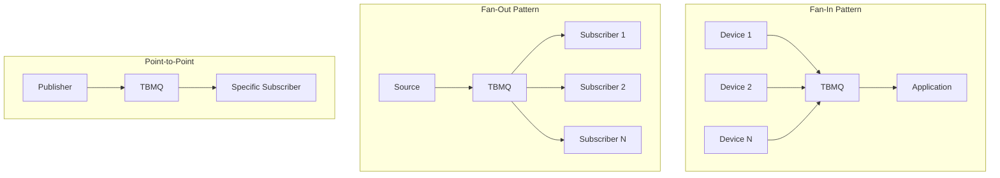
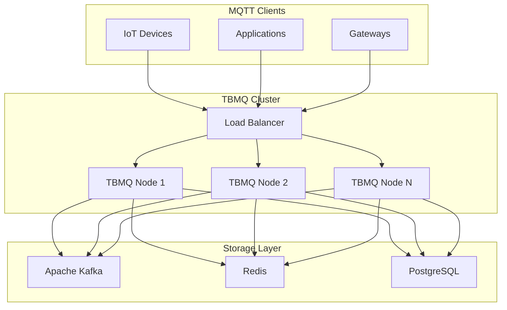
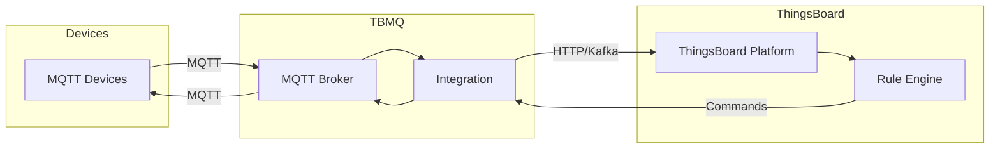

# TBMQ - MQTT Broker

## Overview

TBMQ is ThingsBoard's open-source MQTT message broker designed for high-performance IoT messaging. It can handle 4M+ concurrent client connections, supporting 3M+ messages per second throughput on a single node with low latency delivery. In cluster mode, TBMQ scales to support 100M+ concurrently connected clients.

## Contents

| Document | Description |
|----------|-------------|
| [TBMQ Architecture](./tbmq-architecture.md) | Broker architecture, scalability, clustering |
| [MQTT Features](./mqtt-features.md) | Protocol support, QoS, sessions, shared subscriptions |

## Key Features

- **Full MQTT Compliance** - MQTT 3.1, 3.1.1, and 5.0 support
- **Massive Scale** - 4M+ connections, 3M+ msg/sec per node
- **Horizontal Scaling** - Cluster mode for 100M+ connections
- **Multiple Auth Methods** - X.509, JWT, SCRAM, Basic
- **Access Control** - Client ID, username, or certificate-based ACL
- **Integrations** - HTTP, MQTT, and Kafka integrations
- **Monitoring** - Cluster and client metrics, Kafka topic monitoring

## MQTT Messaging Patterns

TBMQ is designed to handle three core IoT messaging patterns:

| Pattern | Description | Use Case |
|---------|-------------|----------|
| Fan-In | Many devices → Few applications | Telemetry collection |
| Fan-Out | Few sources → Many subscribers | Broadcast notifications |
| Point-to-Point | One-to-one messaging | Device commands, private messaging |

## Architecture Overview

## Client Types

TBMQ distinguishes between two client types with different persistence behaviors:

| Client Type | Session Handling | Message Storage | Use Case |
|-------------|------------------|-----------------|----------|
| DEVICE | Individual sessions | Redis (when offline) | IoT sensors, constrained devices |
| APPLICATION | Consumer groups | Kafka topics | Backend services, data processors |

### Device Clients

- Optimized for many-to-one communication
- Persistent sessions store messages in Redis when offline
- Automatic message redelivery on reconnection

### Application Clients

- Optimized for shared subscriptions and load balancing
- Messages stored in Kafka topics for durability
- Consumer group-based message distribution

## Protocol Support

| Version | Features | Standard |
|---------|----------|----------|
| MQTT 3.1 | Basic pub/sub, QoS 0-2 | IBM specification |
| MQTT 3.1.1 | Improved 3.1, cleaner protocol | OASIS standard |
| MQTT 5.0 | Enhanced features, properties | OASIS standard |

## Authentication Methods

| Method | Description | Configuration |
|--------|-------------|---------------|
| Basic | Username/password | Client credentials |
| X.509 | Certificate chain | TLS mutual auth |
| JWT | JSON Web Tokens | Token validation |
| SCRAM | Salted Challenge Response | MQTT 5.0 enhanced auth |

## Integration with ThingsBoard

TBMQ can be used standalone or integrated with ThingsBoard IoT Platform:

## Performance Benchmarks

### Single Node Performance

| Metric | Value |
|--------|-------|
| Max concurrent connections | 4M+ |
| Message throughput | 3M+ msg/sec |
| Latency | Sub-millisecond |

### Cluster Performance

| Metric | Value |
|--------|-------|
| Max concurrent connections | 100M+ |
| Horizontal scaling | Linear |
| Node count | Unlimited |

## Deployment Options

| Option | Description | Best For |
|--------|-------------|----------|
| Docker | Single container | Development, testing |
| Docker Compose | Multi-container with dependencies | Small deployments |
| Kubernetes/Helm | Orchestrated cluster | Production at scale |
| Bare Metal | Direct installation | Maximum performance |

## Use Cases

- **Smart Home** - Connected appliances, sensors, controls
- **Industrial IoT** - Factory automation, predictive maintenance
- **Fleet Management** - Vehicle telemetry, location tracking
- **Smart Cities** - Environmental monitoring, traffic systems
- **Healthcare** - Medical devices, patient monitoring
- **Agriculture** - Crop monitoring, irrigation systems

## See Also

- [Transport Layer](../05-transport-layer/README.md) - ThingsBoard device protocols
- [Message Queue](../08-message-queue/README.md) - Internal queue architecture
- [Integrations](../14-integrations/README.md) - Platform integrations
