# MQTT Protocol Features

## Overview

TBMQ provides full compliance with MQTT 3.1, 3.1.1, and 5.0 specifications. This document covers the MQTT protocol features supported by TBMQ, including Quality of Service levels, session management, retained messages, Last Will and Testament, shared subscriptions, and MQTT 5.0 specific features.

## Quality of Service (QoS)

MQTT defines three QoS levels that control message delivery guarantees:

### QoS Levels

| Level | Name | Guarantee | Use Case |
|-------|------|-----------|----------|
| 0 | At most once | Fire and forget | Non-critical telemetry |
| 1 | At least once | Delivery guaranteed (may duplicate) | Important messages |
| 2 | Exactly once | Single delivery guaranteed | Critical transactions |

### QoS 0 Flow

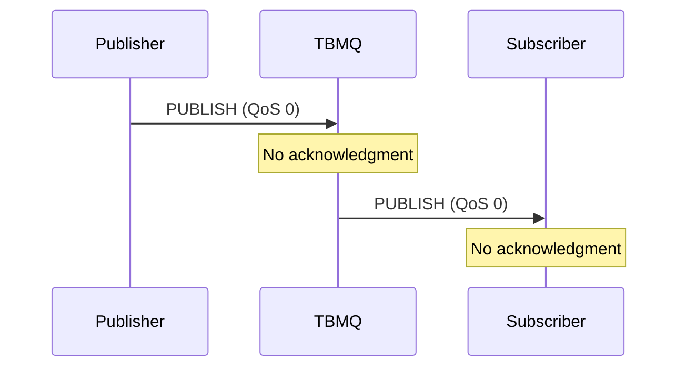

### QoS 1 Flow

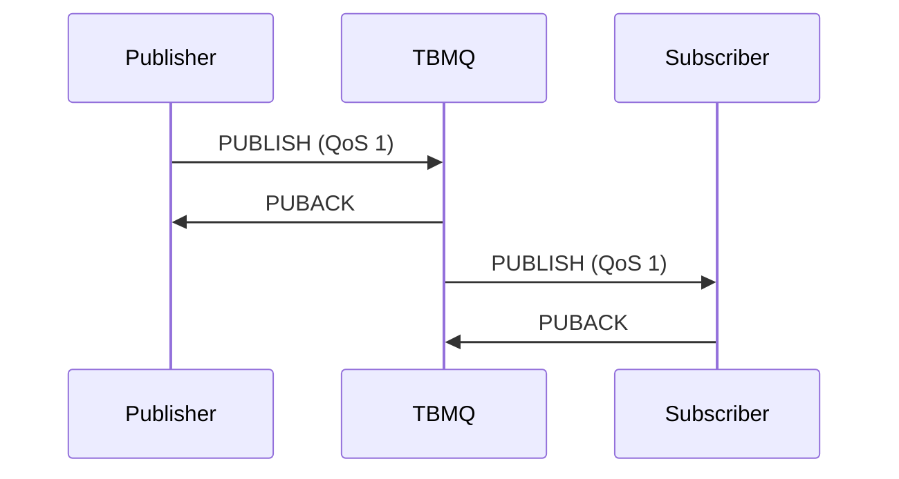

### QoS 2 Flow

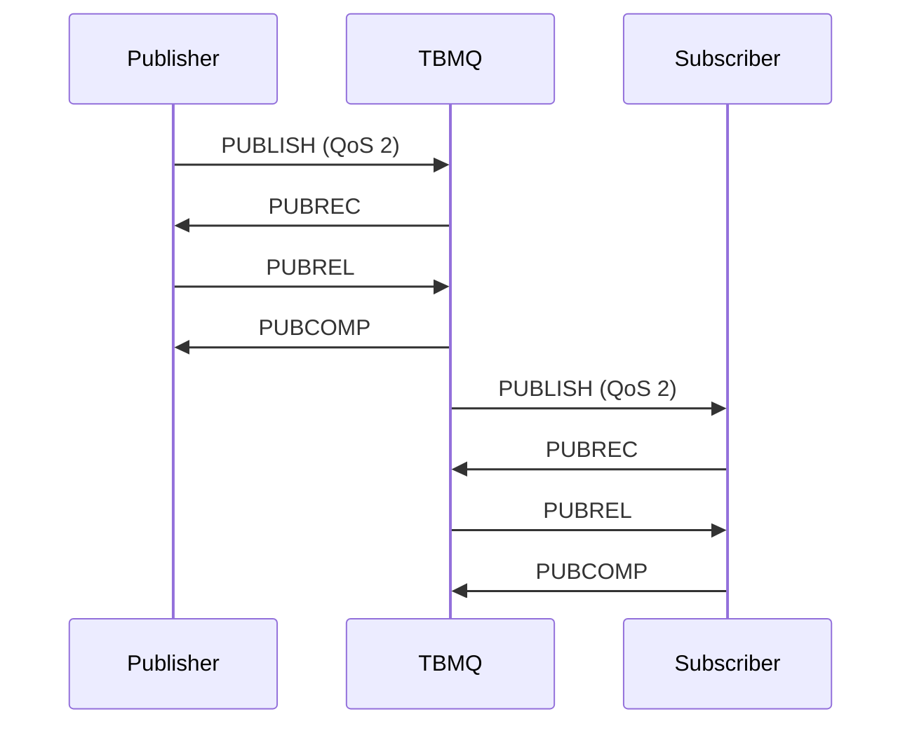

### QoS Downgrade

The effective QoS is the minimum of publisher and subscriber QoS:

| Publisher QoS | Subscriber QoS | Effective QoS |
|---------------|----------------|---------------|
| 2 | 2 | 2 |
| 2 | 1 | 1 |
| 2 | 0 | 0 |
| 1 | 0 | 0 |

## Session Management

### Session Types

| Type | Clean Session Flag | Behavior |
|------|-------------------|----------|
| Clean | true (3.x) / Clean Start (5.0) | Session cleared on disconnect |
| Persistent | false | Session retained across disconnects |

### Persistent Session Storage

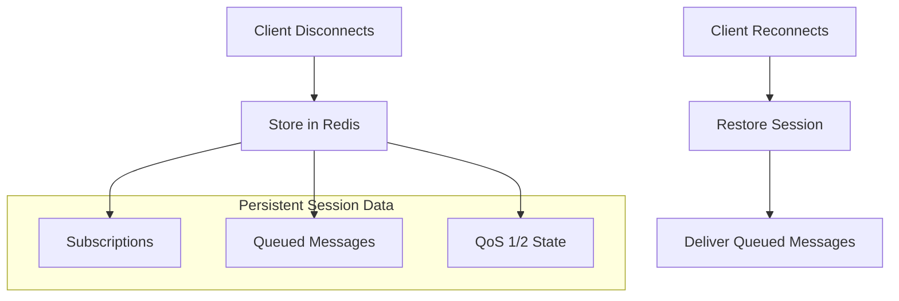

### Session Expiry (MQTT 5.0)

MQTT 5.0 introduces session expiry interval:

| Value | Behavior |
|-------|----------|
| 0 | Session expires immediately on disconnect |
| N seconds | Session expires N seconds after disconnect |
| 0xFFFFFFFF | Session never expires |

## Topics and Wildcards

### Topic Structure

Topics are hierarchical strings separated by `/`:

```
sensors/building1/floor2/temperature
devices/thermostat/commands
home/+/temperature
factory/#
```

### Wildcard Characters

| Wildcard | Description | Example | Matches |
|----------|-------------|---------|---------|
| `+` | Single level | `sensors/+/temp` | sensors/room1/temp, sensors/room2/temp |
| `#` | Multi level | `sensors/#` | sensors/a, sensors/a/b/c |

### Topic Matching Examples

| Subscription | Published Topic | Match? |
|--------------|-----------------|--------|
| `home/+/temperature` | `home/living/temperature` | Yes |
| `home/+/temperature` | `home/living/room1/temperature` | No |
| `home/#` | `home/living/temperature` | Yes |
| `home/#` | `home/living/room1/temperature` | Yes |
| `+/+/temperature` | `home/living/temperature` | Yes |

## Retained Messages

Retained messages are stored by the broker and delivered to new subscribers:

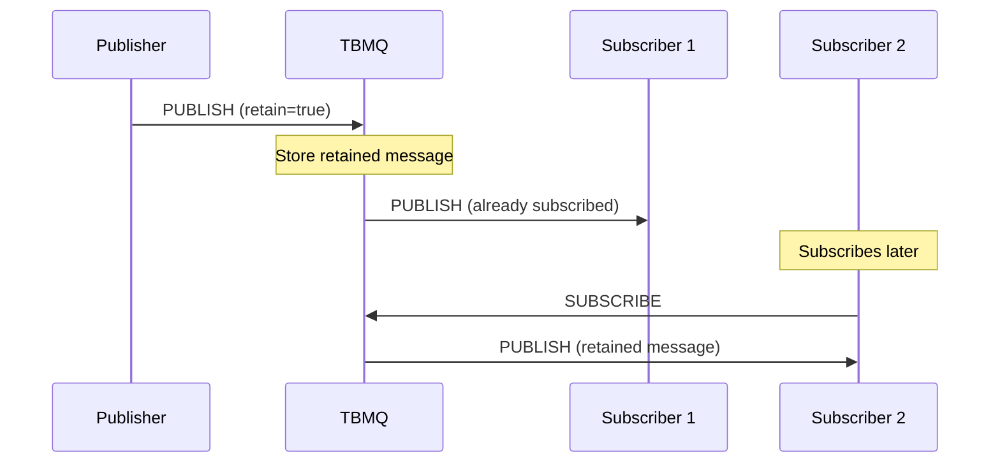

### Retained Message Behavior

| Action | Behavior |
|--------|----------|
| Publish with retain=true | Store/update retained message |
| Publish empty payload with retain=true | Delete retained message |
| Subscribe to topic with retained | Receive retained message immediately |

## Last Will and Testament (LWT)

LWT messages are published when a client disconnects unexpectedly:

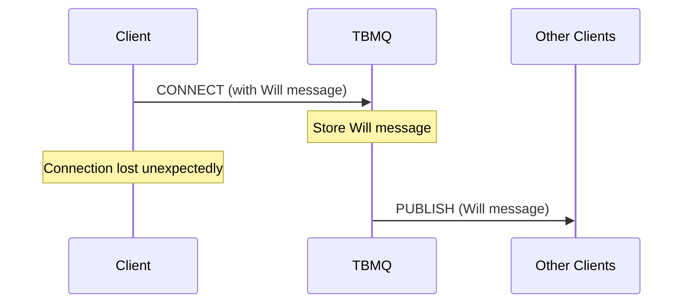

### LWT Configuration

| Field | Description |
|-------|-------------|
| Will Topic | Topic for Will message |
| Will Message | Payload to publish |
| Will QoS | QoS level for Will |
| Will Retain | Retain flag for Will |
| Will Delay (5.0) | Delay before publishing |

## Shared Subscriptions

Shared subscriptions distribute messages among multiple subscribers:

### Topic Format

```
$share/{ShareName}/{TopicFilter}
```

Example: `$share/group1/sensors/+/temperature`

### Load Balancing

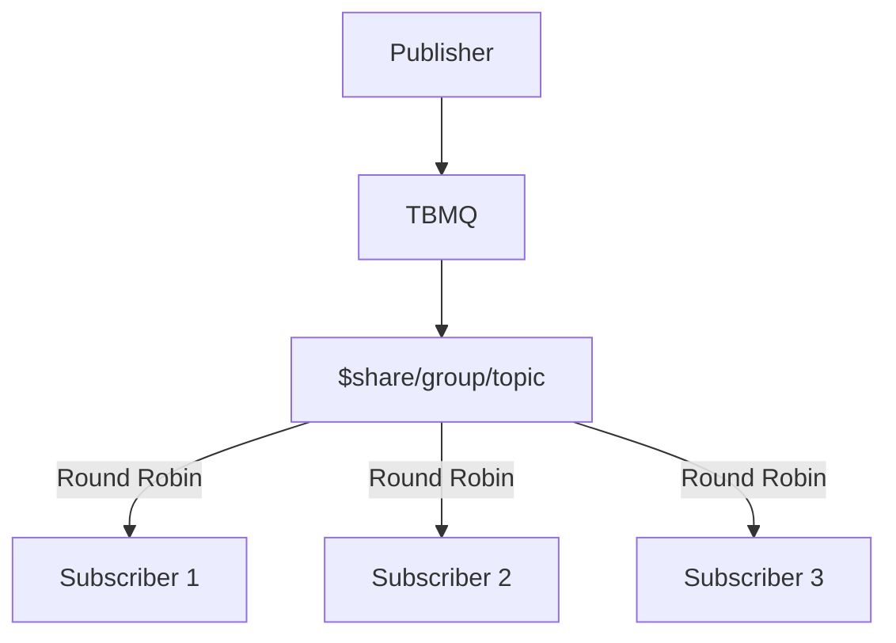

### Shared Subscription Behavior

| Scenario | Behavior |
|----------|----------|
| Normal operation | Messages distributed round-robin |
| Subscriber disconnects | Remaining subscribers share load |
| All subscribers disconnect | Messages queued (APPLICATION clients) |

### Device vs Application Clients

| Client Type | Storage | Shared Sub Behavior |
|-------------|---------|---------------------|
| DEVICE | Redis | Per-client queuing when offline |
| APPLICATION | Kafka | Consumer group distribution |

## MQTT 5.0 Features

### Reason Codes

MQTT 5.0 provides detailed reason codes for all acknowledgments:

| Code | Name | Description |
|------|------|-------------|
| 0x00 | Success | Operation successful |
| 0x80 | Unspecified error | Generic error |
| 0x81 | Malformed packet | Protocol error |
| 0x82 | Protocol error | Violation of protocol |
| 0x83 | Implementation specific | Broker-specific error |
| 0x87 | Not authorized | Permission denied |

### User Properties

Key-value metadata attached to packets:

```
PUBLISH (topic=sensors/temp)
  User Properties:
    - deviceId: sensor-001
    - location: building-a
    - priority: high
```

### Message Expiry

Messages can have an expiration time:

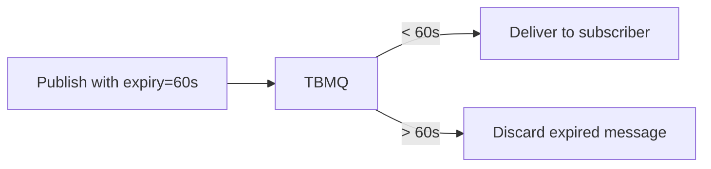

### Topic Alias

Reduces bandwidth by replacing topic names with numeric aliases:

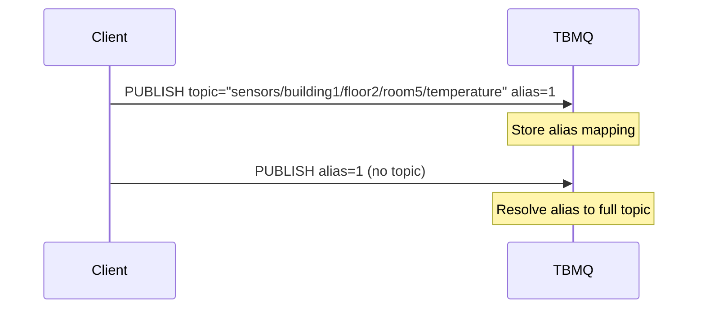

### Flow Control

MQTT 5.0 allows clients to limit in-flight messages:

| Property | Purpose |
|----------|---------|
| Receive Maximum | Max concurrent QoS 1/2 messages |
| Maximum Packet Size | Limit packet size |
| Topic Alias Maximum | Max topic aliases |

### Request-Response Pattern

MQTT 5.0 supports request-response via response topics:

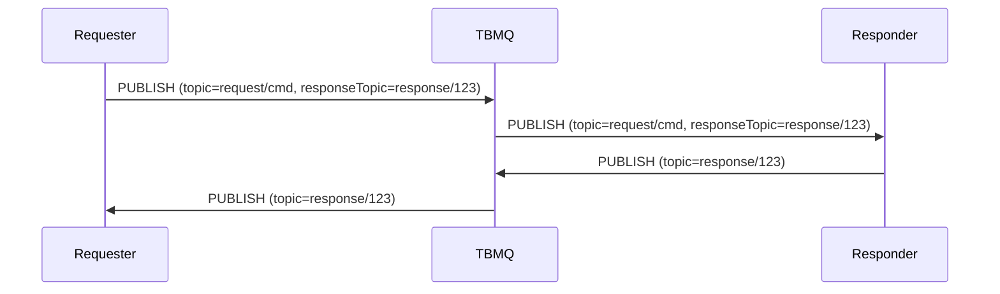

### Subscription Options (MQTT 5.0)

| Option | Description |
|--------|-------------|
| No Local | Don't receive own publications |
| Retain As Published | Preserve retain flag |
| Retain Handling | Control retained message delivery |
| Maximum QoS | Limit subscription QoS |

## Keep Alive

Keep alive ensures connection health:

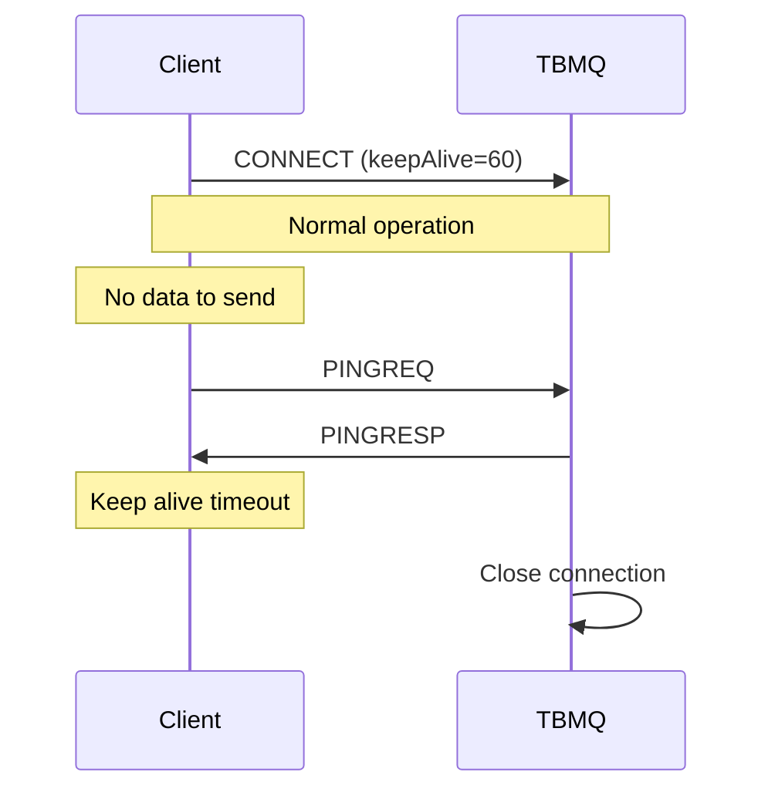

### Keep Alive Behavior

| Condition | Action |
|-----------|--------|
| Client sends PINGREQ | Broker responds PINGRESP |
| No activity for 1.5 × keepAlive | Broker closes connection |
| keepAlive = 0 | Keep alive disabled |

## MQTT over WebSocket

TBMQ supports MQTT over WebSocket for browser-based clients:

| Endpoint | Protocol | Port |
|----------|----------|------|
| ws://host:8084/mqtt | WebSocket | 8084 |
| wss://host:8085/mqtt | WebSocket Secure | 8085 |

## Best Practices

### QoS Selection

| Use Case | Recommended QoS |
|----------|-----------------|
| Telemetry (high frequency) | QoS 0 |
| Important sensor data | QoS 1 |
| Commands and confirmations | QoS 1 or 2 |
| Financial transactions | QoS 2 |

### Topic Design

| Practice | Example |
|----------|---------|
| Use hierarchy | `company/building/floor/room/sensor` |
| Be specific | `sensors/temperature` not `data` |
| Avoid deep nesting | Max 5-7 levels |
| Use consistent naming | camelCase or snake_case |

### Session Management

| Scenario | Recommendation |
|----------|----------------|
| Mobile apps | Persistent session with expiry |
| Backend services | Clean session |
| IoT devices | Persistent session |
| Dashboard | Clean session |

## See Also

- [TBMQ Architecture](./tbmq-architecture.md) - Broker internals
- [Transport Layer](../05-transport-layer/mqtt-transport.md) - ThingsBoard MQTT
- [Integrations](../14-integrations/messaging-integrations.md) - MQTT integration
