# MQTT Protocol Features

## Overview

TBMQ provides full compliance with MQTT 3.1, 3.1.1, and 5.0 specifications. This document covers the MQTT protocol features supported by TBMQ, including Quality of Service levels, session management, retained messages, Last Will and Testament, shared subscriptions, and MQTT 5.0 specific features.

## Quality of Service (QoS)

MQTT defines three QoS levels that control message delivery guarantees:

### QoS Levels

| Level | Name | Guarantee | Use Case |
|-------|------|-----------|----------|
| 0 | At most once | Fire and forget | Non-critical telemetry |
| 1 | At least once | Delivery guaranteed (may duplicate) | Important messages |
| 2 | Exactly once | Single delivery guaranteed | Critical transactions |

### QoS 0 Flow

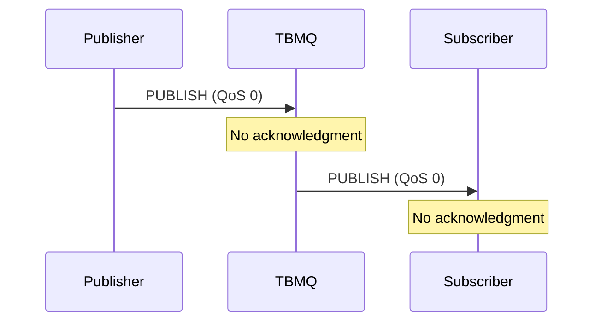

### QoS 1 Flow

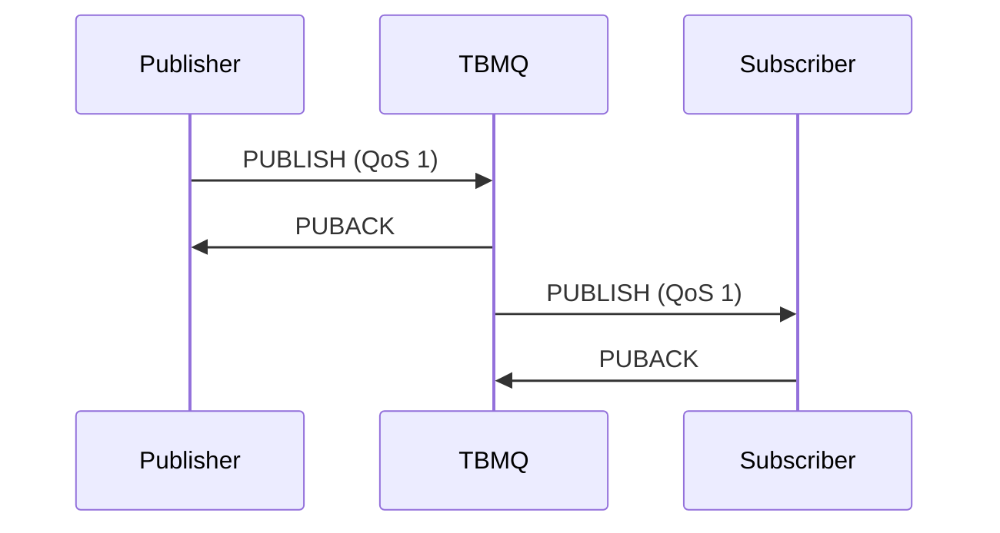

### QoS 2 Flow

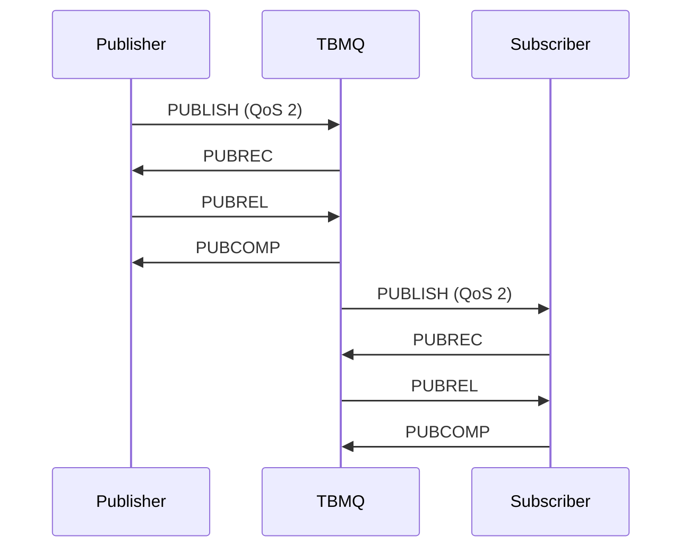

### QoS Downgrade

The effective QoS is the minimum of publisher and subscriber QoS:

| Publisher QoS | Subscriber QoS | Effective QoS |
|---------------|----------------|---------------|
| 2 | 2 | 2 |
| 2 | 1 | 1 |
| 2 | 0 | 0 |
| 1 | 0 | 0 |

## Session Management

### Session Types

| Type | Clean Session Flag | Behavior |
|------|-------------------|----------|
| Clean | true (3.x) / Clean Start (5.0) | Session cleared on disconnect |
| Persistent | false | Session retained across disconnects |

### Persistent Session Storage

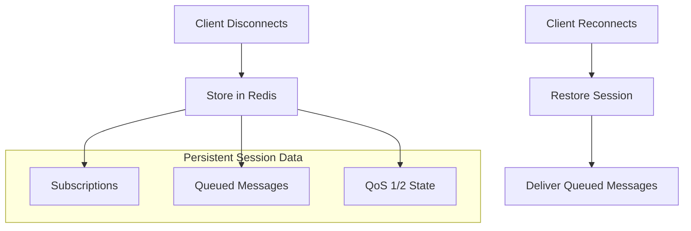

### Session Expiry (MQTT 5.0)

MQTT 5.0 introduces session expiry interval:

| Value | Behavior |
|-------|----------|
| 0 | Session expires immediately on disconnect |
| N seconds | Session expires N seconds after disconnect |
| 0xFFFFFFFF | Session never expires |

## Topics and Wildcards

### Topic Structure

Topics are hierarchical strings separated by `/`:

```
sensors/building1/floor2/temperature
devices/thermostat/commands
home/+/temperature
factory/#
```

### Wildcard Characters

| Wildcard | Description | Example | Matches |
|----------|-------------|---------|---------|
| `+` | Single level | `sensors/+/temp` | sensors/room1/temp, sensors/room2/temp |
| `#` | Multi level | `sensors/#` | sensors/a, sensors/a/b/c |

### Topic Matching Examples

| Subscription | Published Topic | Match? |
|--------------|-----------------|--------|
| `home/+/temperature` | `home/living/temperature` | Yes |
| `home/+/temperature` | `home/living/room1/temperature` | No |
| `home/#` | `home/living/temperature` | Yes |
| `home/#` | `home/living/room1/temperature` | Yes |
| `+/+/temperature` | `home/living/temperature` | Yes |

## Retained Messages

Retained messages are stored by the broker and delivered to new subscribers:

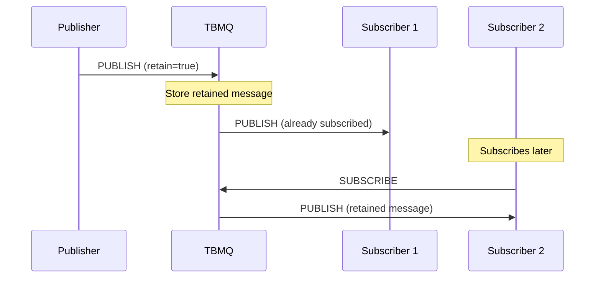

### Retained Message Behavior

| Action | Behavior |
|--------|----------|
| Publish with retain=true | Store/update retained message |
| Publish empty payload with retain=true | Delete retained message |
| Subscribe to topic with retained | Receive retained message immediately |

## Last Will and Testament (LWT)

LWT messages are published when a client disconnects unexpectedly:

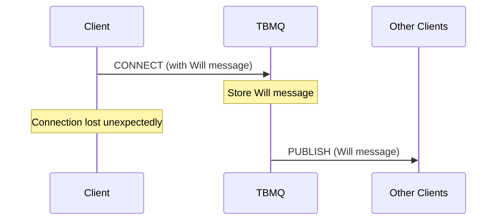

### LWT Configuration

| Field | Description |
|-------|-------------|
| Will Topic | Topic for Will message |
| Will Message | Payload to publish |
| Will QoS | QoS level for Will |
| Will Retain | Retain flag for Will |
| Will Delay (5.0) | Delay before publishing |

## Shared Subscriptions

Shared subscriptions distribute messages among multiple subscribers:

### Topic Format

```
$share/{ShareName}/{TopicFilter}
```

Example: `$share/group1/sensors/+/temperature`

### Load Balancing

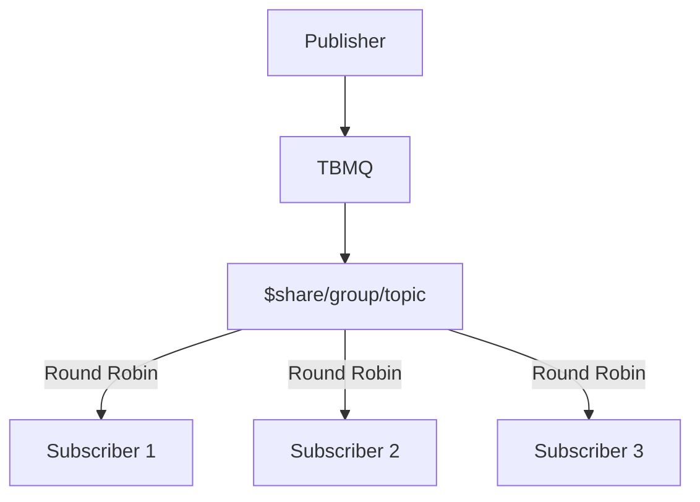

### Shared Subscription Behavior

| Scenario | Behavior |
|----------|----------|
| Normal operation | Messages distributed round-robin |
| Subscriber disconnects | Remaining subscribers share load |
| All subscribers disconnect | Messages queued (APPLICATION clients) |

### Device vs Application Clients

| Client Type | Storage | Shared Sub Behavior |
|-------------|---------|---------------------|
| DEVICE | Redis | Per-client queuing when offline |
| APPLICATION | Kafka | Consumer group distribution |

## MQTT 5.0 Features

### Reason Codes

MQTT 5.0 provides detailed reason codes for all acknowledgments:

| Code | Name | Description |
|------|------|-------------|
| 0x00 | Success | Operation successful |
| 0x80 | Unspecified error | Generic error |
| 0x81 | Malformed packet | Protocol error |
| 0x82 | Protocol error | Violation of protocol |
| 0x83 | Implementation specific | Broker-specific error |
| 0x87 | Not authorized | Permission denied |

### User Properties

Key-value metadata attached to packets:

```
PUBLISH (topic=sensors/temp)
  User Properties:
    - deviceId: sensor-001
    - location: building-a
    - priority: high
```

### Message Expiry

Messages can have an expiration time:

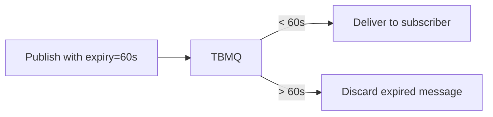

### Topic Alias

Reduces bandwidth by replacing topic names with numeric aliases:

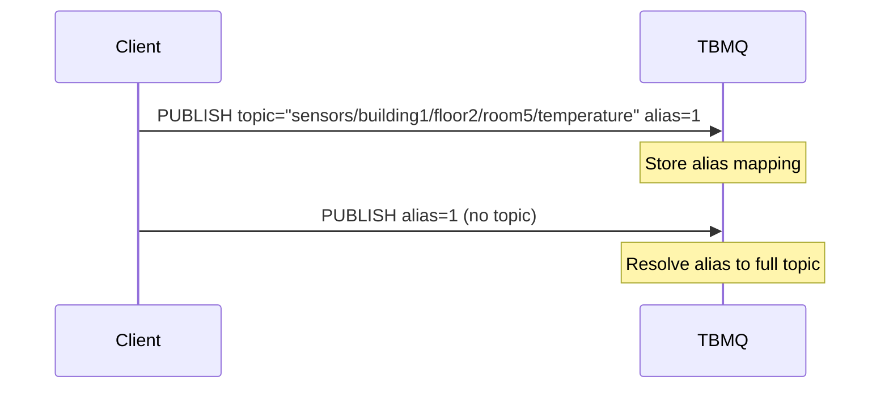

### Flow Control

MQTT 5.0 allows clients to limit in-flight messages:

| Property | Purpose |
|----------|---------|
| Receive Maximum | Max concurrent QoS 1/2 messages |
| Maximum Packet Size | Limit packet size |
| Topic Alias Maximum | Max topic aliases |

### Request-Response Pattern

MQTT 5.0 supports request-response via response topics:

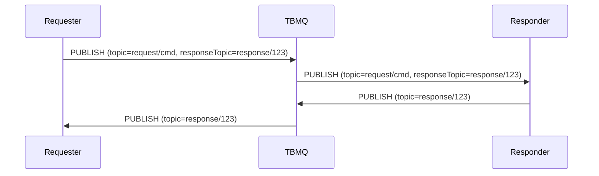

### Subscription Options (MQTT 5.0)

| Option | Description |
|--------|-------------|
| No Local | Don't receive own publications |
| Retain As Published | Preserve retain flag |
| Retain Handling | Control retained message delivery |
| Maximum QoS | Limit subscription QoS |

## Keep Alive

Keep alive ensures connection health:

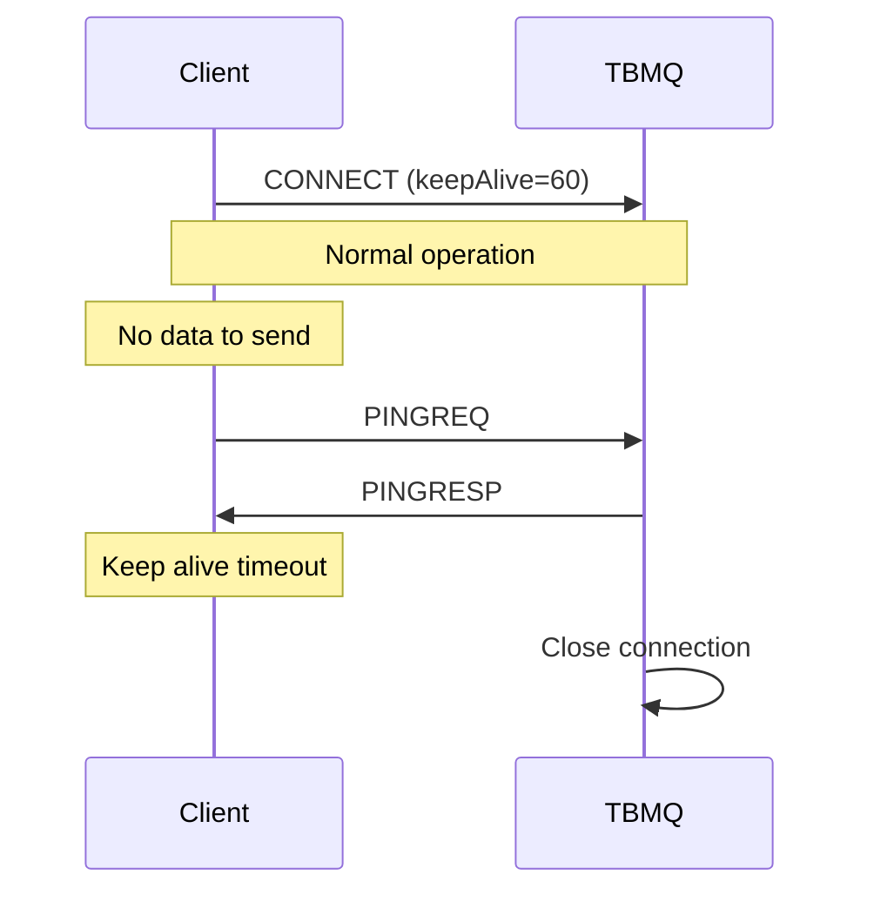

### Keep Alive Behavior

| Condition | Action |
|-----------|--------|
| Client sends PINGREQ | Broker responds PINGRESP |
| No activity for 1.5 × keepAlive | Broker closes connection |
| keepAlive = 0 | Keep alive disabled |

## MQTT over WebSocket

TBMQ supports MQTT over WebSocket for browser-based clients:

| Endpoint | Protocol | Port |
|----------|----------|------|
| ws://host:8084/mqtt | WebSocket | 8084 |
| wss://host:8085/mqtt | WebSocket Secure | 8085 |

## Best Practices

### QoS Selection

| Use Case | Recommended QoS |
|----------|-----------------|
| Telemetry (high frequency) | QoS 0 |
| Important sensor data | QoS 1 |
| Commands and confirmations | QoS 1 or 2 |
| Financial transactions | QoS 2 |

### Topic Design

| Practice | Example |
|----------|---------|
| Use hierarchy | `company/building/floor/room/sensor` |
| Be specific | `sensors/temperature` not `data` |
| Avoid deep nesting | Max 5-7 levels |
| Use consistent naming | camelCase or snake_case |

### Session Management

| Scenario | Recommendation |
|----------|----------------|
| Mobile apps | Persistent session with expiry |
| Backend services | Clean session |
| IoT devices | Persistent session |
| Dashboard | Clean session |

## Common Pitfalls

Effective MQTT protocol usage requires understanding subtle semantic differences between QoS levels, session types, subscription patterns, and MQTT version features. Teams commonly encounter issues in eight critical areas: QoS level selection (performance vs reliability trade-offs), session management (memory growth, expiry configuration), subscription patterns (wildcard performance, shared subscription syntax), retained messages (storage limits, cleanup), Last Will and Testament (timing expectations), MQTT 5.0 features (property size limits, feature support), connection management (keep-alive tuning, client ID collisions), and topic design (hierarchy depth, cardinality). These pitfalls represent protocol misunderstandings that can impact message delivery, broker performance, and application reliability.

### QoS Level Pitfalls

| Pitfall | Impact | Detection | Solution |
|---------|--------|-----------|----------|
| QoS 0 for critical control commands | Fire-and-forget loses messages during network issues, commands not executed, safety risk | Devices don't respond to commands, telemetry shows command not received, audit logs show command sent but no execution | Use QoS 1 for critical commands requiring delivery confirmation. Reserve QoS 0 for high-frequency telemetry where individual message loss is acceptable (e.g., temperature readings every 5 seconds) |
| QoS 2 overuse for non-critical data | 4-way handshake reduces throughput by 60-75%, increased latency, memory pressure from inflight tracking | Message delivery latency >100ms for simple telemetry, throughput plateaus at 25% of QoS 0 baseline, inflight message queue growing | Use QoS 2 only for exactly-once requirements (financial transactions, critical state changes). Prefer QoS 1 for most reliable delivery needs (3-5x better throughput) |
| QoS downgrade misunderstanding across broker bridges | Messages cross broker boundaries at lower QoS than expected, effective QoS is minimum of publisher and subscriber | Bridge deployment shows message loss despite QoS 2 publisher, subscriber receives QoS 0 when expecting QoS 2 | Document effective QoS policy: `min(publisher_qos, subscriber_qos, bridge_qos)`. Configure bridge QoS to match requirements. Test end-to-end delivery across broker topology |
| Inflight window exhaustion blocking new publishes | QoS 1/2 messages fill window (default 65,535 packet IDs), new publishes blocked until PUBACK/PUBCOMP received | Publisher logs show "No available packet ID" or timeouts, publish operations hang, throughput drops to zero despite network available | Configure receive maximum (MQTT 5.0) to limit inflight messages: `receiveMaximum=1000`. Implement application-level flow control. Monitor inflight queue depth and throttle publishers when approaching limit |

### Session Management Pitfalls

| Pitfall | Impact | Detection | Solution |
|---------|--------|-----------|----------|
| Persistent session accumulation without cleanup | Orphaned sessions grow unbounded, Redis/disk exhaustion, broker OOM, new connections fail | Session count growing linearly without corresponding active connections, memory usage climbing, session storage shows 10K+ sessions for 1K active clients | Implement session expiry policy: MQTT 5.0 session expiry interval (e.g., 1 hour) or periodic cleanup of sessions inactive >24 hours. Monitor session count vs active connections ratio |
| Session expiry interval too short (MQTT 5.0) | Devices lose session state during temporary network outage, queued messages discarded, subscriptions lost | Devices reconnect with `CONNACK session_present=0` after brief outage, subscription re-establishment storm, telemetry shows gaps in message delivery | Size session expiry to cover maximum expected offline duration plus safety margin. For mobile devices: 1-4 hours. For fixed IoT: 24 hours. Monitor disconnect duration distribution to inform policy |
| Session takeover behavior causing message loss | New connection with same clientId disconnects old session, queued messages for old session discarded (clean session scenarios) | Duplicate clientIds cause connection flip-flopping every few seconds, message delivery gaps, audit logs show rapid CONNECT/DISCONNECT for same clientId | Enforce unique clientIds per physical device (device serial number + deployment ID). Implement clientId registry to prevent duplicates. Use `CONNACK session_present` flag to detect unexpected session replacement |
| Clean session misunderstanding for persistent devices | `cleanSession=true` discards all queued messages and subscriptions on disconnect, state lost | Devices don't receive messages published while offline, subscriptions lost on reconnect, devices must re-subscribe on every connection | Use `cleanSession=false` (MQTT 3.x) or `cleanStart=false` with session expiry (MQTT 5.0) for devices requiring message persistence. Document session requirements per device type in architecture |

### Subscription Pitfalls

| Pitfall | Impact | Detection | Solution |
|---------|--------|-----------|----------|
| Multi-level wildcard (#) on high-volume topics | Single subscriber receives massive message volume, CPU saturation processing unwanted messages, memory pressure | Subscriber CPU at 100%, message processing rate <<< arrival rate, subscriber continuously falling behind, memory growing with message backlog | Use specific subscriptions or single-level wildcards (+). Example: Replace `sensors/#` (matches 50K topics) with `sensors/building1/+` (matches 500 topics). Implement topic filtering at publisher side where possible |
| Shared subscription syntax errors | Missing `$share/` prefix or wrong group name causes non-shared subscription, single subscriber receives all messages instead of load-balanced distribution | Single shared subscription consumer saturated while others idle, message distribution heavily skewed (one consumer 100%, others 0%), audit shows subscription not using $share syntax | Use correct syntax: `$share/{GroupName}/{TopicFilter}`. Example: `$share/workers/jobs/#`. Validate shared subscription creation with monitoring to confirm load balancing active |
| Mixed shared and regular subscriptions on same topic | Client receives messages through both paths, duplicate message delivery, complex debugging | Application receives duplicate messages for same topic, de-duplication logic triggers frequently, confusion about message origin | Choose one subscription type per topic per application. Use shared subscriptions for load balancing (backend workers) or regular subscriptions for broadcast (monitoring dashboards). Document subscription types per use case |
| Subscription identifier collision (MQTT 5.0) | Reused subscription IDs cause message misrouting, messages delivered to wrong handler in application | Messages trigger wrong business logic, application logs show unexpected message types in handlers, correlation issues between request/response | Use unique subscription identifiers per subscription. Implement ID allocation strategy (counter, UUID). Track subscription ID to handler mapping. Test multi-subscription scenarios thoroughly |

### Retained Message Issues

| Pitfall | Impact | Detection | Solution |
|---------|--------|-----------|----------|
| High-cardinality topics exhausting retained message storage | Millions of unique topics with retained messages (e.g., `sensors/sensor-{UUID}/status`) fill Kafka, disk exhaustion, cleanup complexity | Retained message storage size growing linearly with device count, Kafka disk at capacity, query for retained message count shows millions of entries | Limit retained message usage to low-cardinality topics (device types, not individual devices). Example: Use `sensors/temperature/latest` (1 retained) instead of `sensors/{deviceId}/temperature` (10K retained). Document retention policy |
| Clearing retained messages incorrectly | Publishing empty payload with `retain=true` not understood, developers publish empty string thinking it preserves topic, retained messages not deleted | Retained messages persist after intended deletion, subscribers continue receiving old data on SUBSCRIBE, confusion about retained message lifecycle | To clear retained message: publish zero-length payload with `retain=true`. Example (Mosquitto): `mosquitto_pub -t topic -n -r` (note: `-n` sends zero-length payload). Test cleanup procedures in development |
| Retained message flood on reconnect | Subscriber with wildcard subscription receives thousands of retained messages immediately on CONNECT, connection saturated, application overwhelmed | Subscriber connection shows burst of messages immediately after SUBSCRIBE, application message queue overflows, slow processing of initial retained messages | Use specific subscriptions to limit retained message delivery. Implement application-level throttling for retained message processing. Consider MQTT 5.0 "Retain Handling" subscription option to control delivery |

### Last Will and Testament Pitfalls

| Pitfall | Impact | Detection | Solution |
|---------|--------|-----------|----------|
| Will message not sent on clean disconnect | Normal DISCONNECT packet suppresses LWT, monitoring systems don't detect graceful shutdown | LWT messages only appear for unexpected disconnections (network failure, crash), clean shutdowns invisible to monitoring, confusion about device state | LWT indicates abnormal disconnection only. For status updates on graceful shutdown, publish explicit status message before DISCONNECT. Use combination: LWT for failures + explicit status for normal operations |
| Will delay interval misunderstood (MQTT 5.0) | Expecting will delay guarantees delivery despite immediate reconnection, will not published if client reconnects within delay period | Will messages not published when expected, monitoring delays don't align with will delay setting, confusion about will delivery guarantees | Will delay defers publication to allow reconnection. If client reconnects before delay expires, will is canceled. Set delay based on maximum acceptable detection time (e.g., 30 seconds for health monitoring) |
| Will topic not in client ACL permissions | Will message rejected by ACL rules during publication, silent failure (no delivery to subscribers) | Will messages never appear despite client disconnections, ACL logs show "Permission denied" for will topic, monitoring gaps for unexpected disconnects | Grant PUBLISH permission on will topic in client ACL rules. Test will message delivery during client setup. Monitor ACL denials for will topics. Document will topic patterns in ACL configuration |

### MQTT 5.0 Specific Pitfalls

| Pitfall | Impact | Detection | Solution |
|---------|--------|-----------|----------|
| Topic alias maximum limit exceeded | Client sends more aliases than broker supports, PUBLISH fails with reason code 0x94 (Topic Alias Invalid) | Connection drops with protocol error, client logs show topic alias rejection, CONNACK properties show lower `TopicAliasMaximum` than client expects | Respect broker's `TopicAliasMaximum` from CONNACK. Implement alias reuse strategy (LRU eviction when limit reached). Verify broker and client alias limits match deployment requirements (typical: 10-100) |
| Message expiry vs session expiry confusion | Message expiry (per-message TTL) confused with session expiry (session state lifetime), unexpected message loss or retention | Messages discarded after expiry interval despite session active, confusion about which expiry applies to what, message delivery gaps not aligned with session timeouts | Message expiry: per-message, time until message deleted if undelivered. Session expiry: session state lifetime after disconnect. Configure independently based on requirements. Document both in architecture |
| User properties size exceeding maximum packet size | Large user property payloads (e.g., 1MB metadata) exceed broker maximum packet size, PUBLISH rejected | Connection dropped with "Packet too large" error, DISCONNECT with reason code 0x95 (Packet too large), message delivery failures for specific high-metadata messages | Limit user properties to essential metadata (<10KB total). Use separate mechanism for large data (publish payload, external storage reference). Check broker `MaximumPacketSize` from CONNACK and validate before publishing |
| Request-response pattern with ACL misconfigurations | Response topic not in subscriber ACL permissions, responder cannot publish response, request-response pattern broken | Request-response operations timeout, no response received despite request delivered, ACL logs show permission denied on response topics | Grant wildcard PUBLISH permissions for response topic patterns. Example: Allow `response/*` for all clients using request-response. Use correlation data to match requests/responses. Test full request-response cycle with ACL enabled |

### Connection Management Pitfalls

| Pitfall | Impact | Detection | Solution |
|---------|--------|-----------|----------|
| Keep-alive timeout too short for network conditions | Network jitter or latency causes false disconnect detection, client disconnected despite network available, reconnection storms | Clients disconnect every 30-60 seconds during normal operation, DISCONNECT reason code 0x8D (Keep Alive timeout), connection duration histogram shows premature disconnections | Size keep-alive for network conditions: `keep-alive = (max_expected_latency × 3) + safety_margin`. Example: 5s latency → 20s keep-alive. For cellular/satellite: 120-300s. Test under real network conditions |
| Keep-alive timeout too long for failure detection | Dead connections not detected for minutes, resource leaks (memory, file descriptors), phantom clients in session state | Connection count growing over time despite stable client population, file descriptor exhaustion, half-open TCP connections accumulating | Balance detection speed vs false positives. Typical range: 30-60s for WiFi, 120-300s for cellular. Enable TCP keep-alive as backup (`SO_KEEPALIVE`). Monitor connection state staleness |
| Client ID collision between device deployments | Two physical devices use same clientId (e.g., default configuration), continuous disconnect storm as devices fight for connection | Connection state flip-flopping every 1-10 seconds for same clientId, audit logs show rapid CONNECT/DISCONNECT, device telemetry shows intermittent connectivity | Enforce globally unique clientIds: `{deviceType}-{serialNumber}-{deploymentId}` or UUID. Implement clientId uniqueness validation at provisioning. Monitor for duplicate clientId connection patterns |
| Connection rate limiting causing extended outages | Reconnection storms after broker restart trigger rate limits, devices blocked from connecting, cascading failure as devices retry exponentially | Mass reconnection events show only partial reconnection success, connection rate plateaus at limit, CONNACK with reason code 0x97 (Quota exceeded), extended recovery time | Implement jittered exponential backoff: `retry_delay = min(2^retry × random(0.5-1.5), 60s)`. Pre-calculate connection capacity: `max_rate = connections / reconnect_window`. Configure rate limits above expected storm rates |

### Topic Design Pitfalls

| Pitfall | Impact | Detection | Solution |
|---------|--------|-----------|----------|
| Deep topic hierarchies (10+ levels) | Slow wildcard matching, subscription manager CPU saturation, publish latency increases with depth, memory overhead for topic trie | Publish latency >100ms for deep topics, CPU spikes during subscription matching, slow SUBSCRIBE operations (>1s), broker profiling shows topic matching as hot path | Limit topic depth to 5-7 levels. Example: `company/site/building/floor/room/sensor` (6 levels). Flatten hierarchy with prefixes: `sensors-b1-f2-temp` instead of `sensors/building1/floor2/temperature`. Benchmark topic matching performance |
| High-cardinality topics (millions of unique topics) | Memory exhaustion from topic storage, slow lookups, subscription matching degradation, broker instability | Memory usage growing unbounded with topic count, subscription operations slowing (SUBSCRIBE >1s), out of memory errors, topic count metrics showing millions | Limit unique topics through design. Use topic templates with low cardinality: `sensors/{type}/{location}` (100 types × 50 locations = 5K topics) instead of `sensors/{uuid}` (millions). Consider topic consolidation or multiplexing |
| Publishing with wildcard characters in topic name | MQTT spec prohibits wildcards in PUBLISH topic (only in subscriptions), broker rejects PUBLISH, silent failure or protocol error | PUBLISH operations fail with protocol error, messages not delivered despite successful CONNECT, client logs show PUBLISH rejection, broker logs show malformed topic | Validate topic names before PUBLISH: no `+` or `#` characters allowed. Wildcards only valid in SUBSCRIBE. Example: PUBLISH to `sensors/temp` (valid), SUBSCRIBE to `sensors/+` (valid), PUBLISH to `sensors/+` (INVALID) |

**Detailed Example 1: QoS 2 Overuse Reducing Throughput by 75%**

**Problem**: IoT platform with 10,000 devices publishes all telemetry (temperature, pressure, vibration readings every 5 seconds) using QoS 2 for "guaranteed reliability." Load testing reveals maximum throughput of 12,000 messages/second, far below the expected 50,000 msg/sec based on QoS 0 benchmarks. CPU utilization is only 40%, and network bandwidth is under 30% capacity, yet throughput plateaus at 12K msg/sec. Investigation shows the QoS 2 four-way handshake (PUBLISH → PUBREC → PUBREL → PUBCOMP) creates significant overhead compared to QoS 1 two-way handshake (PUBLISH → PUBACK), reducing effective throughput by 75%.

**Why This Happens**: QoS 2 guarantees exactly-once delivery through a two-phase commit protocol requiring four messages per publish operation. Each QoS 2 message requires: (1) PUBLISH to broker, (2) broker sends PUBREC acknowledging receipt, (3) client sends PUBREL confirming acknowledgment, (4) broker sends PUBCOMP confirming completion. The broker must track inflight QoS 2 messages in both directions (publisher → broker and broker → subscriber), consuming memory and CPU for state management. In contrast, QoS 1 requires only two messages (PUBLISH → PUBACK) and simpler state tracking. For high-frequency telemetry where occasional duplicate delivery is acceptable (de-duplicated by timestamp at application layer), QoS 2 overhead provides no business value but consumes 4x message bandwidth and 3x state management resources.

**Detection**:
- Message delivery rate plateaus at 25-30% of QoS 0 baseline despite available CPU/network capacity
- Broker metrics show high QoS 2 inflight message counts (thousands of messages in PUBREC/PUBREL state)
- Latency increases from 20ms (QoS 0) to 80-120ms (QoS 2) for same message size
- Profiling shows QoS 2 state machine processing as CPU hotspot (30-40% of CPU time in QoS 2 handlers)
- Memory usage higher than expected due to inflight message tracking (QoS 2 requires 2x memory vs QoS 1)
- Benchmark comparison:
  ```bash
  # QoS 0 baseline (publisher only, no ACK)
  mosquitto_pub -t test/qos0 -q 0 -m "test" --repeat 10000 --repeat-delay 0
  # Throughput: 50K msg/sec

  # QoS 1 comparison (publisher + 1 ACK)
  mosquitto_pub -t test/qos1 -q 1 -m "test" --repeat 10000 --repeat-delay 0
  # Throughput: 30K msg/sec (60% of QoS 0)

  # QoS 2 actual (publisher + 3 ACKs)
  mosquitto_pub -t test/qos2 -q 2 -m "test" --repeat 10000 --repeat-delay 0
  # Throughput: 12K msg/sec (24% of QoS 0)
  ```

**Solution**:
1. **Immediate**: Downgrade telemetry to QoS 1 (at-least-once delivery):
   - Implement application-level de-duplication using message timestamps or sequence numbers
   - 90% of use cases don't require exactly-once semantics
   - Achieves 3-5x throughput improvement over QoS 2

2. **Short-term**: Implement QoS selection policy by message type:
   ```yaml
   # Message type QoS policy
   telemetry:
     temperature: 0        # High frequency, loss acceptable (next reading in 5s)
     pressure: 0           # High frequency, loss acceptable
     vibration: 1          # Important for maintenance, delivery required

   commands:
     set_parameter: 1      # Important, delivery required, duplicates safe (idempotent)
     trigger_action: 2     # Critical, must execute exactly once

   events:
     alarm_triggered: 1    # Important notification, duplicate acceptable
     firmware_update: 2    # Critical, exactly-once required
   ```

3. **Long-term**: Design for idempotency and de-duplication:
   - Make all operations idempotent where possible (allows QoS 1)
   - Include message IDs or timestamps for de-duplication at application layer
   - Reserve QoS 2 for financial transactions, critical state changes, non-idempotent operations
   - Monitor QoS distribution metrics and alert on unexpected QoS 2 usage

**Configuration Example**:
```python
# MQTT client configuration with QoS policy

class MessageType(Enum):
    TELEMETRY = 0      # QoS 0 - fire and forget
    EVENT = 1          # QoS 1 - at least once
    COMMAND = 1        # QoS 1 - at least once (idempotent)
    TRANSACTION = 2    # QoS 2 - exactly once

def publish_message(client, topic, payload, msg_type):
    qos = msg_type.value

    # Add message ID for de-duplication (QoS 1/2)
    if qos > 0:
        payload['msg_id'] = str(uuid.uuid4())
        payload['timestamp'] = int(time.time() * 1000)

    client.publish(topic, json.dumps(payload), qos=qos)

# Usage examples
publish_message(client, "sensors/temp", {"value": 22.5}, MessageType.TELEMETRY)     # QoS 0
publish_message(client, "devices/alarm", {"level": "critical"}, MessageType.EVENT)   # QoS 1
publish_message(client, "payment/process", {"amount": 100}, MessageType.TRANSACTION) # QoS 2
```

**Performance Comparison Table**:
```markdown
| QoS Level | Messages | Latency | Memory | CPU | Throughput | Use Case |
|-----------|----------|---------|--------|-----|------------|----------|
| 0 | 1 (PUBLISH) | 5ms | 1x | 1x | 100% | High-frequency telemetry |
| 1 | 2 (PUBLISH + PUBACK) | 15ms | 1.5x | 1.8x | 60% | Important events |
| 2 | 4 (PUBLISH + PUBREC + PUBREL + PUBCOMP) | 45ms | 3x | 4x | 24% | Critical transactions |
```

**Detailed Example 2: Persistent Session Accumulation Causing Redis OOM**

**Problem**: TBMQ deployment experiences Redis out-of-memory crashes every 2-3 weeks. Session count grows from 10,000 active devices to 95,000 stored sessions over time. Investigation reveals persistent sessions accumulating for devices that were retired, replaced, or permanently disconnected but never explicitly deleted. Each persistent session consumes 5KB metadata + queued messages, growing Redis memory from 500MB (10K active) to 6.2GB (95K stored) until OOM crash occurs. The broker is configured with `cleanSession=false` for all device clients to ensure message delivery during temporary network outages, but lacks any session cleanup policy for permanently offline devices.

**Why This Happens**: MQTT persistent sessions are designed to survive client disconnections and retain subscriptions + queued messages indefinitely by default (MQTT 3.x) or until session expiry interval expires (MQTT 5.0). Without explicit cleanup, sessions accumulate for: devices decommissioned without clean disconnect, prototype devices from testing, devices with typos in clientId (creating orphan sessions), devices replaced with new clientIds, and transient connections with persistent session flags. Default MQTT 3.x behavior never expires sessions, and many deployments don't configure MQTT 5.0 session expiry interval or implement cleanup procedures. Each session consumes memory for: session metadata (clientId, subscriptions, QoS levels, authentication state), connection state (will message, keep-alive settings), and queued messages awaiting delivery (potentially hundreds of messages for long-offline devices).

**Detection**:
- Redis memory usage growing linearly over weeks/months despite stable active device count
- Session count metrics show 10x discrepancy with active connection count (95K sessions vs 10K connections)
- Redis `INFO` command shows memory fragmentation and high keyspace size
- Query session age distribution reveals thousands of sessions offline for weeks:
  ```bash
  # List sessions by last activity time
  redis-cli KEYS 'session:*' | while read key; do
    last_activity=$(redis-cli HGET "$key" last_activity_time)
    age_hours=$(( ($(date +%s) - last_activity) / 3600 ))
    echo "$key: ${age_hours}h offline"
  done | sort -t: -k2 -n

  # Output shows many sessions offline for 500+ hours (20+ days)
  ```
- Broker metrics show session creation rate > session deletion rate over time (net accumulation)
- Post-OOM crash: All session data lost, 10K devices reconnect simultaneously creating connection storm

**Solution**:
1. **Immediate**: Implement emergency session cleanup for sessions offline >7 days:
   ```bash
   # Identify and delete abandoned sessions
   redis-cli --scan --pattern 'session:*' | while read session_key; do
     last_seen=$(redis-cli HGET "$session_key" last_seen_timestamp)
     age_seconds=$(( $(date +%s) - last_seen ))
     age_days=$(( age_seconds / 86400 ))

     if [ $age_days -gt 7 ]; then
       echo "Deleting session $session_key (offline ${age_days} days)"
       redis-cli DEL "$session_key"
     fi
   done

   # Result: Reduced sessions from 95K to 12K, memory from 6.2GB to 850MB
   ```

2. **Short-term**: Configure MQTT 5.0 session expiry for all devices:
   ```yaml
   # TBMQ configuration (application.yml)
   mqtt:
     sessions:
       device-sessions:
         # Session expiry interval (seconds)
         session-expiry-interval: 86400    # 24 hours default

         # Per-device-type overrides
         expiry-by-device-type:
           mobile-app: 14400               # 4 hours (frequent reconnects)
           fixed-iot: 86400                # 24 hours (daily telemetry)
           critical-asset: 259200          # 3 days (infrequent updates)

         # Cleanup job configuration
         cleanup-job:
           enabled: true
           cron: "0 0 2 * * ?"             # 2 AM daily
           batch-size: 1000                # Delete 1000 sessions per batch

       # Session cleanup policy
       cleanup-policy:
         delete-if-offline: 604800         # Delete if offline >7 days (seconds)
         max-queued-messages: 1000         # Limit per-session queue depth
   ```

3. **Long-term**: Implement session lifecycle management:
   - **Provisioning**: Create sessions only for active devices (not pre-provisioned)
   - **Monitoring**: Track session age distribution, alert on accumulation trends
   - **Cleanup**: Scheduled job deletes sessions offline >7 days (configurable per device type)
   - **Limits**: Enforce maximum queued messages per session (1,000 messages = ~500KB at 500 bytes/msg)
   - **Metrics**: Session creation/deletion rate, session age histogram, memory usage by session type
   - **Audit**: Log session deletions with reason (expired, offline too long, manual cleanup)

**Configuration Example**:
```python
# Client-side MQTT 5.0 session expiry configuration

from paho.mqtt.client import Client, MQTTv5
from paho.mqtt.properties import Properties

def connect_with_session_expiry(device_type):
    client = Client(client_id=f"{device_type}-{device_id}", protocol=MQTTv5)

    # Configure session expiry based on device type
    expiry_intervals = {
        "mobile-app": 4 * 3600,        # 4 hours (frequent reconnects expected)
        "fixed-iot": 24 * 3600,         # 24 hours (daily telemetry cycle)
        "critical-asset": 72 * 3600,    # 72 hours (infrequent updates, high reliability)
        "prototype": 1 * 3600,          # 1 hour (testing devices, aggressive cleanup)
    }

    properties = Properties(PacketTypes.CONNECT)
    properties.SessionExpiryInterval = expiry_intervals.get(device_type, 24 * 3600)

    # Clean start = false (use existing session if present)
    # Session expires after SessionExpiryInterval seconds of disconnect
    client.connect("broker.example.com", 1883, clean_start=False, properties=properties)
```

**Session Memory Sizing Formula**:
```
Total Memory = (Active Sessions × Session Overhead) + (Orphaned Sessions × Session Overhead)

Session Overhead = Session Metadata + Queued Messages
                 = 5KB + (queue_depth × avg_message_size)

Example (Current State - Bad):
- Active: 10K devices × (5KB + 50 msgs × 500 bytes) = 10K × 30KB = 300MB
- Orphaned: 85K abandoned × (5KB + 0 msgs) = 85K × 5KB = 425MB
- Total: 725MB (+ 30% Redis overhead) = 943MB

Example (With Cleanup - Good):
- Active: 10K devices × (5KB + 50 msgs × 500 bytes) = 300MB
- Orphaned: 2K recent disconnects × 5KB = 10MB
- Total: 310MB (+ 30% Redis overhead) = 403MB

Memory savings: 943MB → 403MB (57% reduction)
```

**Session Cleanup Monitoring**:
```sql
-- Session age distribution query (for monitoring dashboard)
SELECT
  CASE
    WHEN age_hours < 1 THEN '<1h'
    WHEN age_hours < 24 THEN '<24h'
    WHEN age_hours < 168 THEN '<7d'
    WHEN age_hours < 720 THEN '<30d'
    ELSE '>30d'
  END AS age_bucket,
  COUNT(*) AS session_count
FROM (
  SELECT
    client_id,
    (EXTRACT(EPOCH FROM NOW()) - last_seen_timestamp) / 3600 AS age_hours
  FROM mqtt_sessions
) age_data
GROUP BY age_bucket
ORDER BY
  CASE age_bucket
    WHEN '<1h' THEN 1
    WHEN '<24h' THEN 2
    WHEN '<7d' THEN 3
    WHEN '<30d' THEN 4
    ELSE 5
  END;

-- Expected healthy distribution:
-- <1h:     8,000 sessions (80% active recently)
-- <24h:    1,500 sessions (15% daily cycle)
-- <7d:       400 sessions (4% weekly cycle)
-- <30d:       80 sessions (0.8% infrequent)
-- >30d:       20 sessions (0.2% cleanup candidates)
```

**Detailed Example 3: Wildcard Subscription Performance Degradation**

**Problem**: Monitoring dashboard subscribes to `sensors/#` wildcard to display all sensor data across industrial facility. Facility grows from 5,000 sensors (500 msg/sec) to 50,000 sensors (5,000 msg/sec) over 12 months. Dashboard becomes unusable: UI freezes for 10+ seconds when switching tabs, CPU at 100% processing incoming messages, message processing rate (200 msg/sec) far below arrival rate (5,000 msg/sec), causing growing backlog and memory pressure. Broker subscription manager CPU also increases from 10% to 85% during peak hours. Investigation reveals single dashboard client processing all 5,000 msg/sec through one WebSocket connection, overwhelming both client and broker.

**Why This Happens**: Multi-level wildcard `#` matches all topics at that level and below, creating fan-out where one subscription receives messages from all matching topics. As sensor count grows 10x (5,000 → 50,000), message volume grows 10x (500 → 5,000 msg/sec), but the subscription remains singular. The broker's subscription manager must evaluate every published message against all wildcard subscriptions, and deep wildcards (`#`) require checking entire topic namespace. Client-side processing becomes bottleneck: deserializing 5,000 messages/sec, updating UI state, and rendering updates exceeds JavaScript event loop capacity, causing UI freezes. Network bandwidth saturates WebSocket connection (5,000 msg/sec × 500 bytes = 2.5 MB/sec = 20 Mbps), and TCP congestion control causes message queuing and delays.

**Detection**:
- Client CPU at 100% in message processing handlers (JavaScript event loop blocked)
- Message processing latency increasing: median 50ms → 5 seconds (100x degradation)
- Client-side message queue depth growing unbounded (thousands of messages buffered)
- Network bandwidth saturation: WebSocket connection at 20 Mbps (link capacity)
- Broker subscription manager CPU >80% during peak message publishing
- Profiling shows topic matching as hotspot:
  ```bash
  # Broker profiling output
  Top CPU consumers:
  1. subscriptionMatcher.matchTopic() - 68% (wildcard matching)
  2. messageDispatcher.fanout() - 15% (message distribution)
  3. tcpHandler.write() - 8% (network I/O)
  ```
- Query subscription statistics:
  ```bash
  # Subscription fanout analysis
  mosquitto_sub -h localhost -t '$SYS/broker/subscriptions/#' -v | grep 'sensors/#'
  # Output: sensors/# → 50,000 matching topics → 5,000 msg/sec fanout
  ```

**Solution**:
1. **Immediate**: Replace broad wildcard with specific subscriptions for current dashboard view:
   ```javascript
   // Before: Single wildcard receiving ALL sensor data
   client.subscribe('sensors/#');  // Receives 5,000 msg/sec

   // After: Specific subscriptions for active dashboard tab only
   function subscribeForView(building, floor) {
     // Unsubscribe previous view
     client.unsubscribe(currentSubscription);

     // Subscribe to specific scope (reduces from 50K to 500 topics)
     const topic = `sensors/${building}/${floor}/+`;
     client.subscribe(topic);  // Receives 50 msg/sec (100x reduction)

     currentSubscription = topic;
   }

   // Result: Message rate drops from 5,000 to 50 msg/sec, UI responsive again
   ```

2. **Short-term**: Implement topic sharding and aggregation:
   ```yaml
   # Publisher-side aggregation: Reduce message rate via summarization
   original:
     topics: sensors/building1/floor2/room5/temp
     rate: 50,000 sensors × 0.1 msg/sec = 5,000 msg/sec

   aggregated:
     topics: sensors/building1/floor2/summary
     payload: { "room5": {"temp": 22.5}, "room6": {"temp": 23.1}, ... }
     rate: 100 floors × 0.2 msg/sec = 20 msg/sec (250x reduction)

   # Subscriber uses aggregated topics
   client.subscribe('sensors/+/+/summary');  # 20 msg/sec vs 5,000 msg/sec
   ```

3. **Long-term**: Implement hierarchical subscription strategy:
   - **Limit wildcard scope**: Use `sensors/building1/+` (500 topics) instead of `sensors/#` (50K topics)
   - **Topic sharding**: Split into regions `sensors/region-us-east/#`, `sensors/region-eu-west/#`
   - **Server-side filtering**: Implement broker plugin for complex filtering (e.g., "only temperature >30°C")
   - **Shared subscriptions for dashboards**: Load-balance dashboard instances across shared subscription group
   - **Data summarization**: Publish aggregated metrics (building-level summaries) in addition to raw sensor data
   - **Subscription management**: Monitor fanout per subscription, alert when single subscription exceeds 1,000 matched topics

**Configuration Example**:
```javascript
// Client-side subscription management with scope limiting

class DashboardSubscriptionManager {
  constructor(mqttClient) {
    this.client = mqttClient;
    this.activeSubscriptions = new Set();
    this.maxTopicsPerSubscription = 1000;  // Limit wildcard fanout
  }

  // Subscribe to specific dashboard scope
  subscribeToScope(scope) {
    const { building, floor, room } = scope;

    // Build specific topic pattern based on scope
    let topic;
    if (room) {
      topic = `sensors/${building}/${floor}/${room}/+`;  // ~10 topics
    } else if (floor) {
      topic = `sensors/${building}/${floor}/+/+`;        // ~500 topics
    } else if (building) {
      topic = `sensors/${building}/+/+/+`;                // ~5,000 topics
    } else {
      // Fallback: Use aggregated summary topics instead of full wildcard
      topic = `sensors/+/summary`;                         // ~100 topics
    }

    // Unsubscribe from previous scope
    this.unsubscribeAll();

    // Subscribe to new scope
    this.client.subscribe(topic, { qos: 0 });
    this.activeSubscriptions.add(topic);

    console.log(`Subscribed to ${topic} (estimated fanout: ${this.estimateFanout(topic)})`);
  }

  estimateFanout(topic) {
    // Estimate number of matching topics based on wildcard levels
    const wildcards = (topic.match(/[+#]/g) || []).length;
    return Math.pow(10, wildcards);  // Rough estimate: 10^wildcards topics
  }

  unsubscribeAll() {
    this.activeSubscriptions.forEach(topic => {
      this.client.unsubscribe(topic);
    });
    this.activeSubscriptions.clear();
  }
}

// Usage
const subManager = new DashboardSubscriptionManager(mqttClient);

// User views Building 1, Floor 2
subManager.subscribeToScope({ building: 'building1', floor: 'floor2' });
// Subscribes to: sensors/building1/floor2/+/+ (500 topics, 50 msg/sec)

// User zooms out to Building 1 overview
subManager.subscribeToScope({ building: 'building1' });
// Subscribes to: sensors/building1/+/summary (10 aggregated topics, 1 msg/sec)
```

**Subscription Fanout Comparison**:
```markdown
| Subscription Pattern | Matched Topics | Message Rate | Client CPU | Broker CPU | UI Latency |
|----------------------|----------------|--------------|------------|------------|------------|
| `sensors/#` | 50,000 | 5,000 msg/sec | 100% | 85% | 5+ seconds |
| `sensors/+/+/#` | 10,000 | 1,000 msg/sec | 80% | 50% | 1 second |
| `sensors/{building}/+/+` | 5,000 | 500 msg/sec | 40% | 25% | 200ms |
| `sensors/{building}/{floor}/+` | 500 | 50 msg/sec | 10% | 5% | 20ms |
| `sensors/{building}/{floor}/{room}/+` | 10 | 1 msg/sec | 2% | 1% | 5ms |

**Recommendation**: Limit subscriptions to 500-1,000 matched topics for real-time dashboards
```

**Broker-Side Subscription Limiting**:
```yaml
# TBMQ configuration (application.yml)
mqtt:
  subscriptions:
    # Warn when subscription matches too many topics
    fanout-warning-threshold: 1000

    # Reject subscriptions exceeding maximum fanout
    max-fanout-per-subscription: 5000

    # Rate limit high-fanout subscriptions
    rate-limit-high-fanout:
      enabled: true
      threshold: 1000              # Topics matched
      max-rate: 100                # Messages per second

  # Monitoring alerts
  alerts:
    - name: high_fanout_subscription
      condition: subscription_fanout > 1000
      action: log_warning
      message: "Subscription ${subscription} matches ${fanout} topics (>1K threshold)"
```

## See Also

- [TBMQ Architecture](./tbmq-architecture.md) - Broker internals
- [Transport Layer](../05-transport-layer/mqtt.md) - ThingsBoard MQTT
- [Integrations](../14-integrations/messaging-integrations.md) - MQTT integration
