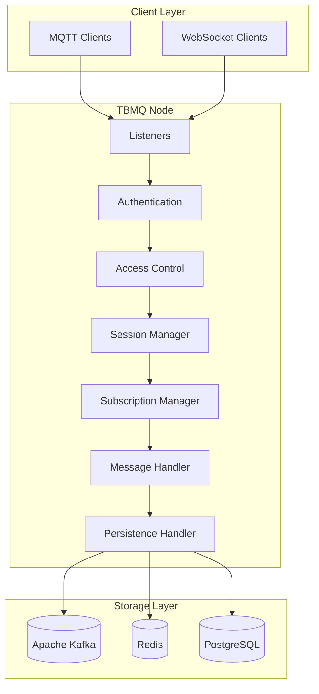
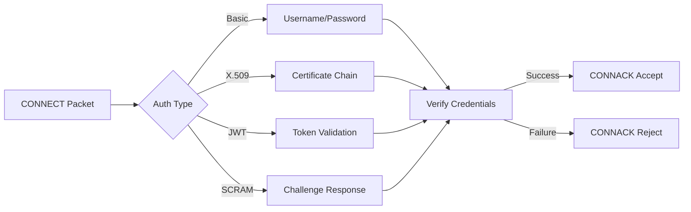
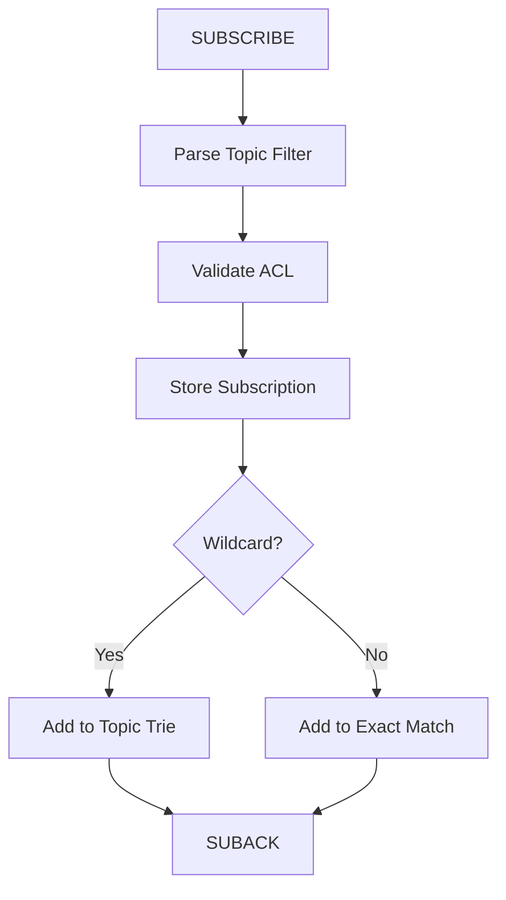
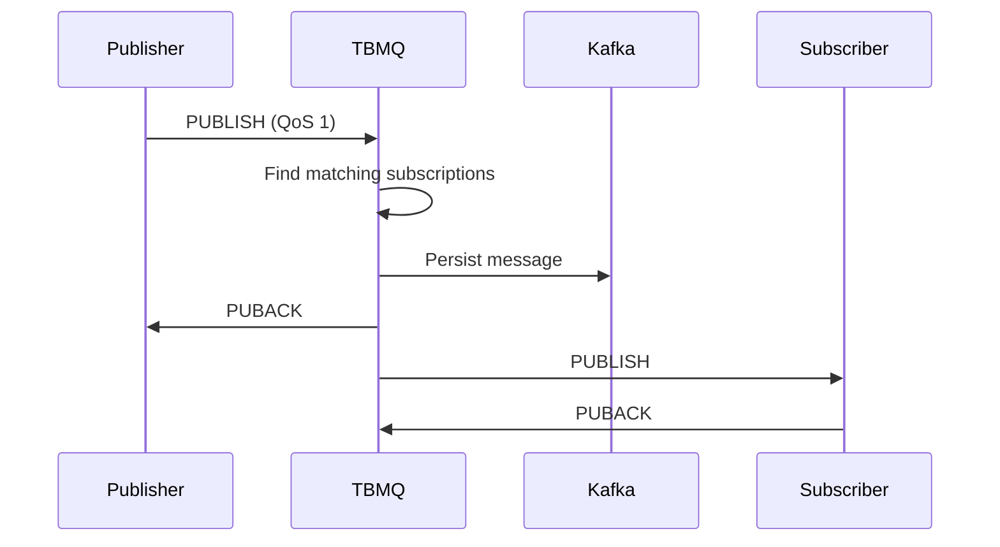
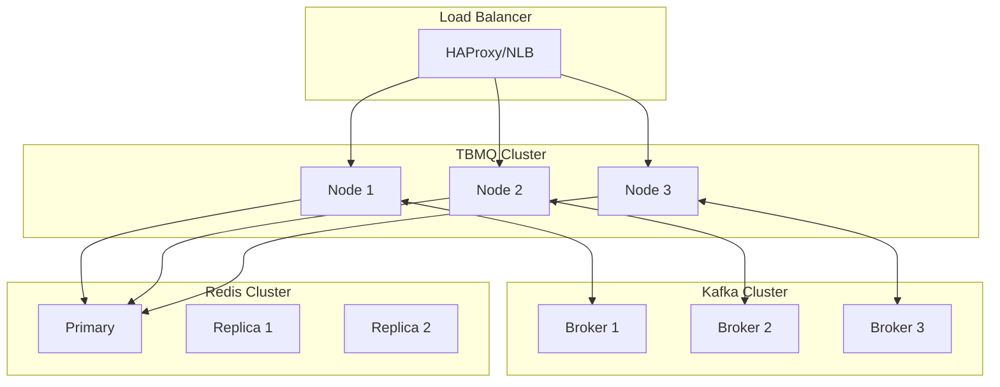
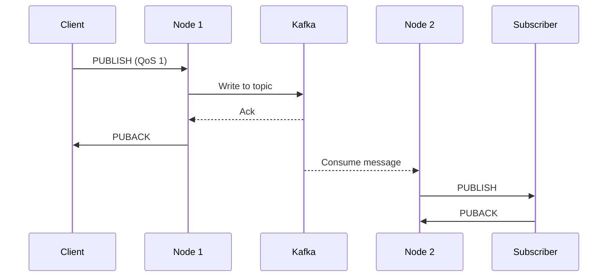
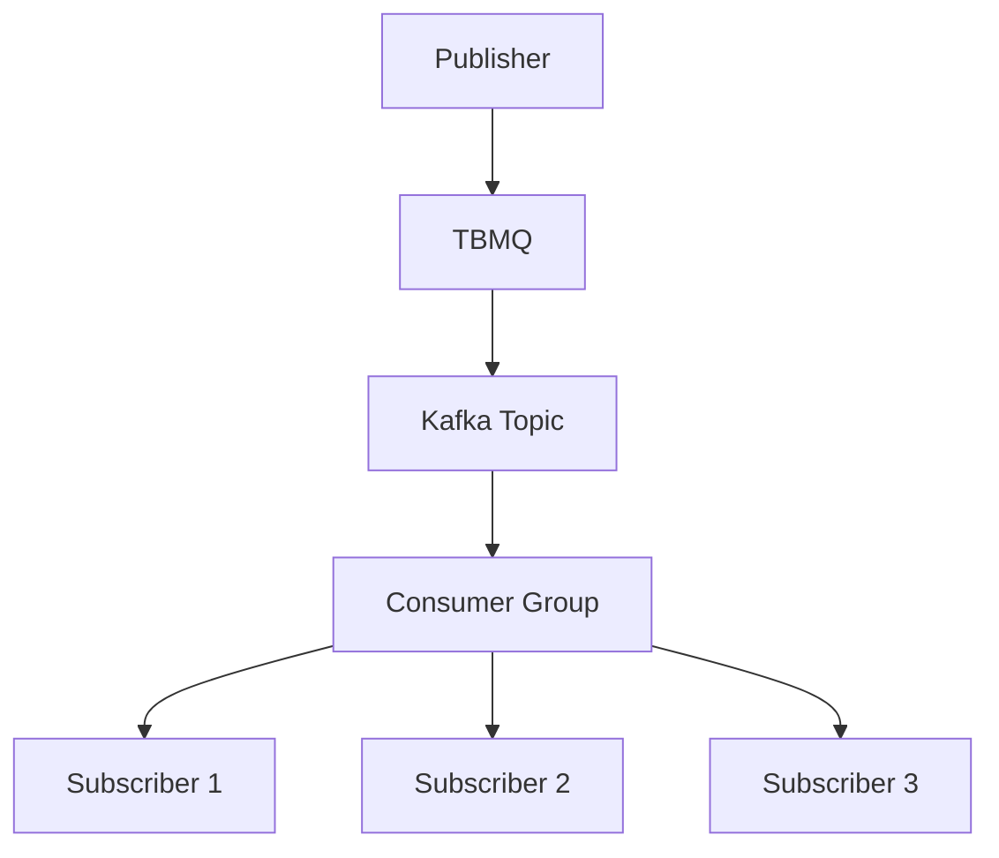
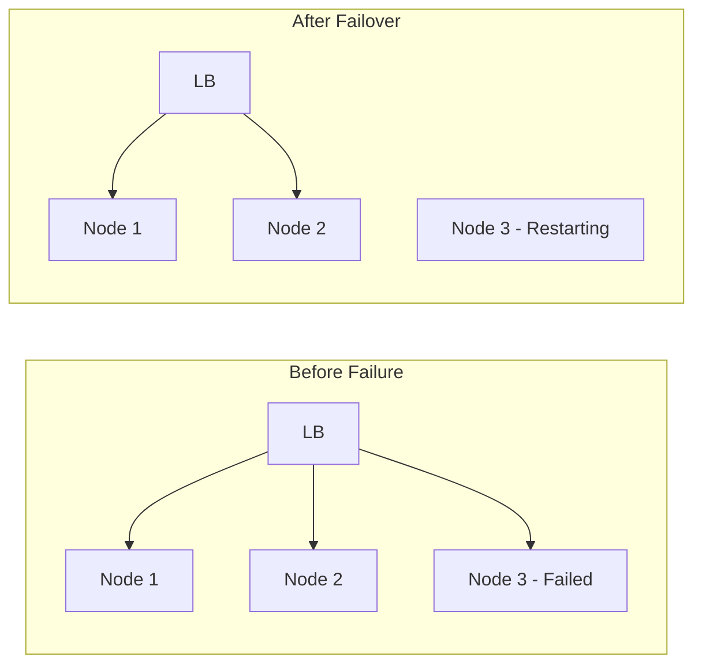
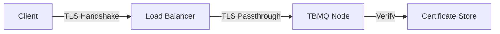
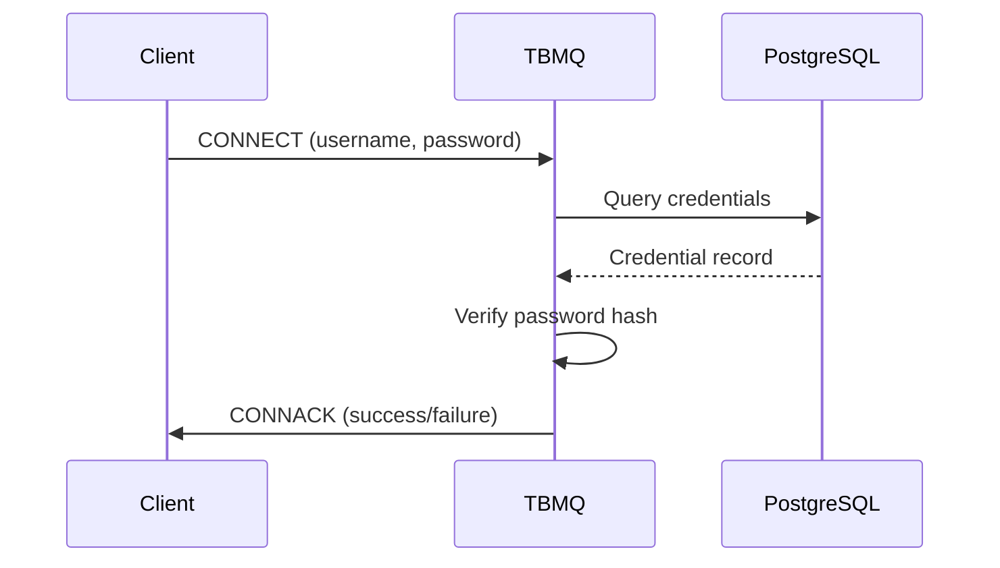

# TBMQ Architecture

## Overview

TBMQ is built on a horizontally scalable architecture using Java and proven open-source technologies. The broker is designed to be fault-tolerant with no single point of failure, where every node in a cluster is identical. This architecture enables millions of concurrent connections and millions of messages per second throughput.

## Core Architecture

## Component Details

### Listeners

Listeners accept incoming MQTT connections over various transports:

| Listener | Port | Protocol | Security |
|----------|------|----------|----------|
| TCP | 1883 | MQTT | Plain |
| TLS | 8883 | MQTT | SSL/TLS |
| WebSocket | 8084 | MQTT over WS | Plain |
| WebSocket Secure | 8085 | MQTT over WSS | SSL/TLS |

### Authentication

Authentication verifies client identity before allowing connection:

### Access Control (ACL)

ACL rules determine what topics clients can publish to or subscribe from:

| Rule Type | Scope | Example |
|-----------|-------|---------|
| Client ID | Per client | Allow clientA on topic/data |
| Username | Per user | Allow user1 on sensors/# |
| Certificate CN | Per certificate | Allow CN=device1 on devices/+ |

### Session Manager

Manages client sessions including persistence:

| Session Type | Behavior | Storage |
|--------------|----------|---------|
| Clean Session | Cleared on disconnect | Memory only |
| Persistent Session | Retained across disconnects | Redis |

### Subscription Manager

Handles topic subscriptions and message routing:

### Message Handler

Processes incoming PUBLISH messages and routes to subscribers:

## Storage Architecture

### Apache Kafka

Kafka provides durable message storage and cluster coordination:

| Topic | Purpose | Retention |
|-------|---------|-----------|
| tbmq.msg.all | All published messages | Configurable |
| tbmq.msg.app.* | Application client messages | Configurable |
| tbmq.msg.retained | Retained messages | Infinite |
| tbmq.client.session | Session state | Compacted |
| tbmq.client.subscriptions | Subscription state | Compacted |

### Redis

Redis stores session data for device clients:

| Data Type | Key Pattern | Purpose |
|-----------|-------------|---------|
| Hash | session:{clientId} | Session metadata |
| List | msgs:{clientId} | Queued messages |
| Set | subs:{clientId} | Subscriptions |

### PostgreSQL

PostgreSQL stores broker configuration and client credentials:

| Table | Purpose |
|-------|---------|
| mqtt_client_credentials | Authentication credentials |
| application_shared_subscription | Shared subscription config |
| broker_settings | Broker configuration |

## Cluster Architecture

### Cluster Communication

Nodes communicate through Kafka for:
- Session state synchronization
- Subscription propagation
- Message routing between nodes

### Client Distribution

Clients are distributed across nodes via load balancer:

| Strategy | Description | Use Case |
|----------|-------------|----------|
| Round Robin | Equal distribution | General purpose |
| Least Connections | Route to least loaded | Variable load |
| IP Hash | Same client same node | Session affinity |

## Message Flow

### Publish Flow (QoS 1)

### Shared Subscription Flow

## Scalability Design

### Horizontal Scaling

| Component | Scaling Method | Limit |
|-----------|----------------|-------|
| TBMQ Nodes | Add nodes behind LB | Unlimited |
| Kafka | Add brokers, partitions | Kafka limits |
| Redis | Cluster mode | Redis limits |
| PostgreSQL | Read replicas | Connection limits |

### Performance Tuning

| Parameter | Impact | Tuning |
|-----------|--------|--------|
| Kafka partitions | Parallelism | Match node count |
| Redis connections | Session throughput | Pool size |
| JVM heap | Memory for sessions | Based on connections |
| Netty threads | Connection handling | CPU cores * 2 |

## Fault Tolerance

### Node Failure

- Load balancer detects failed node via health checks
- Clients reconnect to healthy nodes
- Session state restored from Redis/Kafka
- Queued messages redelivered

### Data Durability

| Data | Durability | Recovery |
|------|------------|----------|
| Messages | Kafka replication | Automatic |
| Sessions | Redis persistence | On reconnect |
| Subscriptions | Kafka compacted topic | Automatic |
| Credentials | PostgreSQL replication | Automatic |

## Security Architecture

### TLS Configuration

### Authentication Flow

## Monitoring

### Metrics

| Category | Metrics |
|----------|---------|
| Connections | Active, total, rejected |
| Messages | Published, delivered, dropped |
| Subscriptions | Total, shared, by QoS |
| Kafka | Lag, throughput, errors |
| System | CPU, memory, network |

### Health Checks

| Endpoint | Purpose |
|----------|---------|
| /health | Overall broker health |
| /ready | Ready to accept connections |
| /metrics | Prometheus metrics |

## See Also

- [MQTT Features](./mqtt-features.md) - Protocol feature details
- [Message Queue](../08-message-queue/README.md) - Kafka architecture
- [Security](../09-security/README.md) - Security concepts
