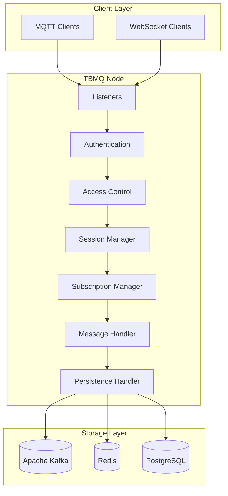
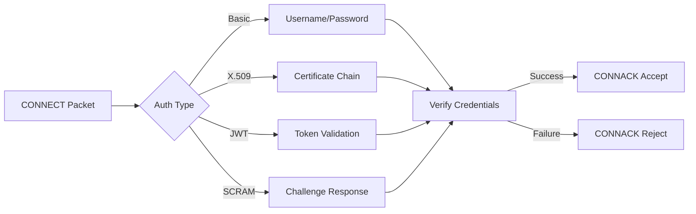
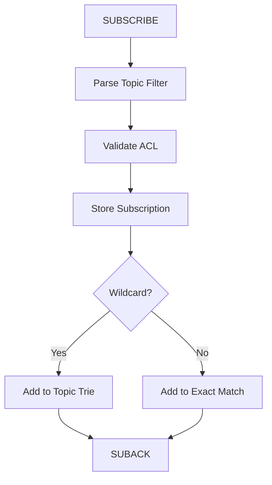
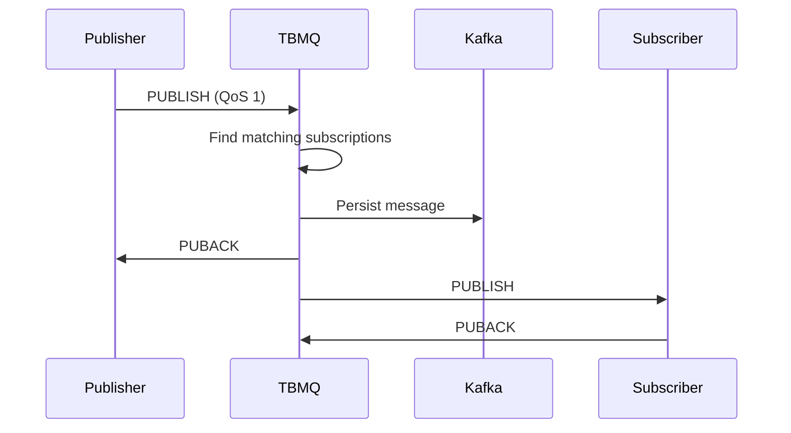
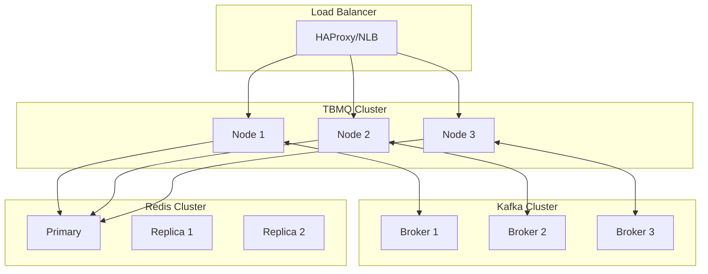
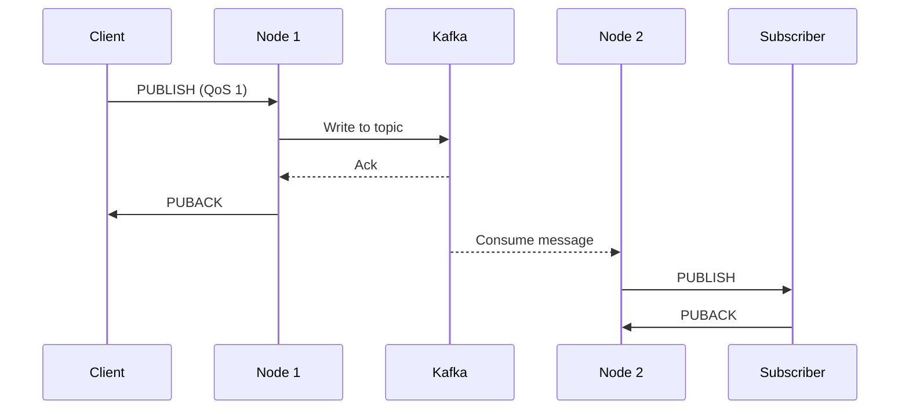
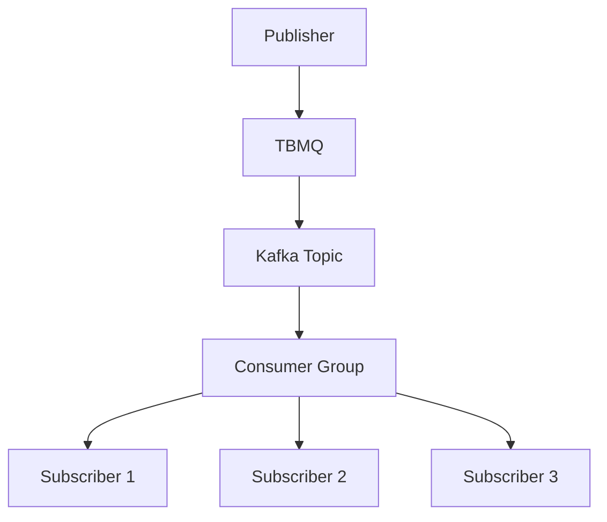
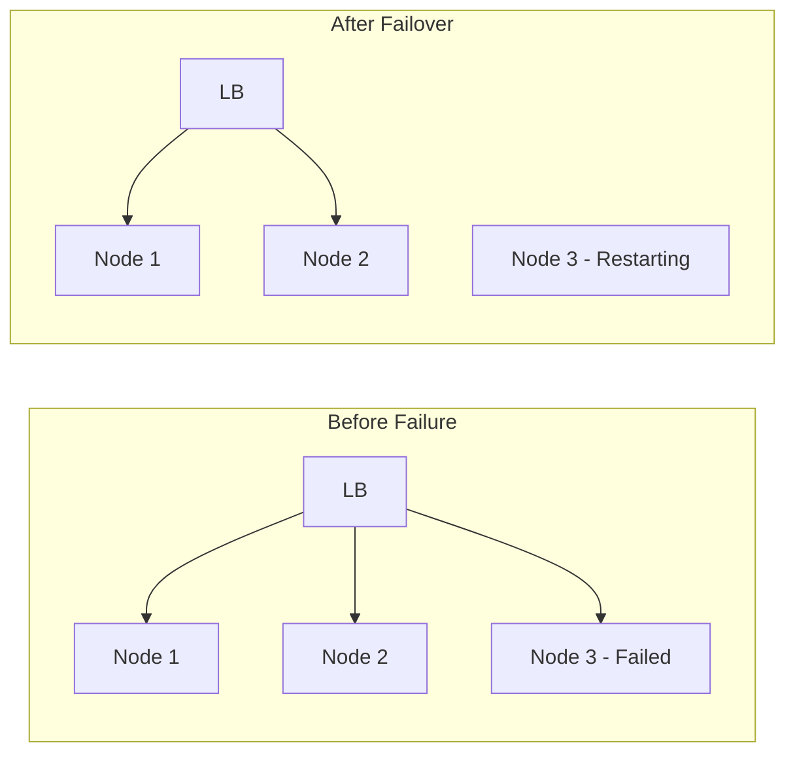
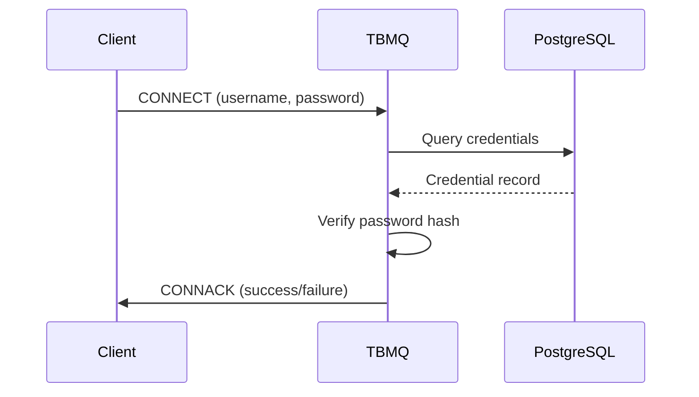

# TBMQ Architecture

## Overview

TBMQ is built on a horizontally scalable architecture using Java and proven open-source technologies. The broker is designed to be fault-tolerant with no single point of failure, where every node in a cluster is identical. This architecture enables millions of concurrent connections and millions of messages per second throughput.

## Core Architecture



## Component Details

### Listeners

Listeners accept incoming MQTT connections over various transports:

| Listener | Port | Protocol | Security |
|----------|------|----------|----------|
| TCP | 1883 | MQTT | Plain |
| TLS | 8883 | MQTT | SSL/TLS |
| WebSocket | 8084 | MQTT over WS | Plain |
| WebSocket Secure | 8085 | MQTT over WSS | SSL/TLS |

### Authentication

Authentication verifies client identity before allowing connection:



### Access Control (ACL)

ACL rules determine what topics clients can publish to or subscribe from:

| Rule Type | Scope | Example |
|-----------|-------|---------|
| Client ID | Per client | Allow clientA on topic/data |
| Username | Per user | Allow user1 on sensors/# |
| Certificate CN | Per certificate | Allow CN=device1 on devices/+ |

### Session Manager

Manages client sessions including persistence:

| Session Type | Behavior | Storage |
|--------------|----------|---------|
| Clean Session | Cleared on disconnect | Memory only |
| Persistent Session | Retained across disconnects | Redis |

### Subscription Manager

Handles topic subscriptions and message routing:



### Message Handler

Processes incoming PUBLISH messages and routes to subscribers:



## Storage Architecture

### Apache Kafka

Kafka provides durable message storage and cluster coordination:

| Topic | Purpose | Retention |
|-------|---------|-----------|
| tbmq.msg.all | All published messages | Configurable |
| tbmq.msg.app.* | Application client messages | Configurable |
| tbmq.msg.retained | Retained messages | Infinite |
| tbmq.client.session | Session state | Compacted |
| tbmq.client.subscriptions | Subscription state | Compacted |

### Redis

Redis stores session data for device clients:

| Data Type | Key Pattern | Purpose |
|-----------|-------------|---------|
| Hash | session:{clientId} | Session metadata |
| List | msgs:{clientId} | Queued messages |
| Set | subs:{clientId} | Subscriptions |

### PostgreSQL

PostgreSQL stores broker configuration and client credentials:

| Table | Purpose |
|-------|---------|
| mqtt_client_credentials | Authentication credentials |
| application_shared_subscription | Shared subscription config |
| broker_settings | Broker configuration |

## Cluster Architecture



### Cluster Communication

Nodes communicate through Kafka for:
- Session state synchronization
- Subscription propagation
- Message routing between nodes

### Client Distribution

Clients are distributed across nodes via load balancer:

| Strategy | Description | Use Case |
|----------|-------------|----------|
| Round Robin | Equal distribution | General purpose |
| Least Connections | Route to least loaded | Variable load |
| IP Hash | Same client same node | Session affinity |

## Message Flow

### Publish Flow (QoS 1)



### Shared Subscription Flow



## Scalability Design

### Horizontal Scaling

| Component | Scaling Method | Limit |
|-----------|----------------|-------|
| TBMQ Nodes | Add nodes behind LB | Unlimited |
| Kafka | Add brokers, partitions | Kafka limits |
| Redis | Cluster mode | Redis limits |
| PostgreSQL | Read replicas | Connection limits |

### Performance Tuning

| Parameter | Impact | Tuning |
|-----------|--------|--------|
| Kafka partitions | Parallelism | Match node count |
| Redis connections | Session throughput | Pool size |
| JVM heap | Memory for sessions | Based on connections |
| Netty threads | Connection handling | CPU cores * 2 |

## Fault Tolerance

### Node Failure



- Load balancer detects failed node via health checks
- Clients reconnect to healthy nodes
- Session state restored from Redis/Kafka
- Queued messages redelivered

### Data Durability

| Data | Durability | Recovery |
|------|------------|----------|
| Messages | Kafka replication | Automatic |
| Sessions | Redis persistence | On reconnect |
| Subscriptions | Kafka compacted topic | Automatic |
| Credentials | PostgreSQL replication | Automatic |

## Security Architecture

### TLS Configuration


### Authentication Flow



## Monitoring

### Metrics

| Category | Metrics |
|----------|---------|
| Connections | Active, total, rejected |
| Messages | Published, delivered, dropped |
| Subscriptions | Total, shared, by QoS |
| Kafka | Lag, throughput, errors |
| System | CPU, memory, network |

### Health Checks

| Endpoint | Purpose |
|----------|---------|
| /health | Overall broker health |
| /ready | Ready to accept connections |
| /metrics | Prometheus metrics |

## Common Pitfalls

Operating a production TBMQ deployment requires careful attention to storage layer configuration, cluster coordination, and resource allocation. Teams commonly encounter issues in four critical areas: storage backends (Kafka partition design, Redis memory limits, PostgreSQL connection pools), cluster behavior (node discovery, session migration, split-brain scenarios), security configuration (ACL rule precedence, certificate validation), and performance bottlenecks (listener thread pools, subscription fanout, message handler backpressure). The pitfalls below represent architectural challenges that can impact broker reliability, message delivery, and operational efficiency.

### Storage Layer Issues

| Pitfall | Impact | Detection | Solution |
|---------|--------|-----------|----------|
| Kafka partition hot spots due to poor clientId distribution | Single partition handles majority of traffic, causing lag and message delays | Kafka consumer lag metrics show one partition with 10x higher lag. Throughput drops during peak load | Increase partition count and ensure clientId diversity. Use consistent hashing for better distribution. Monitor per-partition lag and rebalance if needed |
| Redis memory exhaustion during session peaks | OOM errors crash broker, all persistent sessions lost, devices must reconnect and re-establish state | Redis memory usage at 100%, broker logs show "Out of Memory" errors, sudden connection drops | Right-size Redis memory: `(sessions × 5KB) + (queued_msgs × avg_msg_size) × 1.5 safety margin`. Configure `maxmemory-policy allkeys-lru` for graceful eviction. Monitor with alerts at 80% memory |
| PostgreSQL connection pool exhaustion | Authentication queries fail, new clients cannot connect, existing clients unaffected | Connection refused errors in logs, PostgreSQL `pg_stat_activity` shows pool at max, authentication failures spike | Tune connection pool: `max_connections = (nodes × 50) + 20 buffer`. Use connection pooler (PgBouncer) for efficient sharing. Monitor active connections and queue depth |
| Kafka topic retention too short | Historical messages deleted before consumers read them, message loss for slow/offline subscribers | Consumer offset resets to earliest available, message gaps in delivery, "OffsetOutOfRangeException" errors | Configure retention based on maximum acceptable downtime: `retention.ms = max_outage_hours × 3600000 × 2 safety factor`. For critical data, use infinite retention with size limits |

### Cluster Configuration

| Pitfall | Impact | Detection | Solution |
|---------|--------|-----------|----------|
| Split-brain during network partition | Multiple nodes believe they're primary, duplicate message delivery, inconsistent session state | Kafka partition leadership conflicts, duplicate client sessions across nodes, message re-delivery | Implement quorum-based coordination. Configure Kafka `min.insync.replicas=2` to prevent split writes. Use network monitoring to detect partitions. Design clients with deduplication logic |
| Session migration delays during node failures | Clients reconnect but session state not available, queued messages delayed, temporary message loss | Session restoration takes >5 seconds, clients receive CONNACK with session_present=false when expecting true, message delivery gaps | Pre-warm session cache on healthy nodes. Reduce Redis replication lag with faster networks. Configure client reconnect delays (5-10s) to allow migration. Monitor session restoration latency |
| Node discovery failures in dynamic environments | New nodes don't join cluster, existing nodes don't detect failures, unbalanced load | New node metrics not appearing, load balancer doesn't route to new node, cluster size mismatch in monitoring | Use reliable service discovery (Consul, etcd, Kubernetes services). Configure health check intervals (5s) and failure thresholds (3 consecutive). Verify network connectivity between nodes on discovery ports |
| Uneven load distribution across cluster | Few nodes handle most traffic while others idle, resource waste, performance degradation on hot nodes | CPU/memory/connections highly variable across nodes (>30% difference), some nodes saturated while others <50% utilized | Configure load balancer with least-connections strategy. Ensure client reconnection uses fresh DNS resolution. Monitor per-node metrics and adjust load balancer weights. Investigate sticky sessions or client affinity issues |

### Authentication & Authorization

| Pitfall | Impact | Detection | Solution |
|---------|--------|-----------|----------|
| ACL rule precedence errors allowing unauthorized access | Clients publish to restricted topics, security breach, data leakage | Unauthorized messages appear in topics, audit logs show unexpected publishers, security scanning detects overly permissive rules | Design ACL rules deny-by-default. Specific denies should precede generic allows. Test ACL rules with security scanning tools. Use ACL rule ordering: specific deny → specific allow → generic deny |
| TLS certificate validation disabled in production | Man-in-the-middle attacks possible, credential theft, message interception | Security audits flag disabled validation, `ssl.verify=false` in configuration, warning messages in logs | Enable full certificate validation: verify hostname, check revocation (CRL/OCSP), trust only specific CAs. Configure `ssl.endpoint.identification.algorithm=HTTPS` for hostname verification. Use certificate pinning for critical clients |
| Missing credential rotation policy | Compromised credentials remain valid indefinitely, unauthorized access persists, compliance violations | Credential age monitoring shows 365+ day old passwords, no rotation audit trail, compliance reports flag static credentials | Implement 90-day credential rotation policy. Support credential overlap periods during rotation (old + new valid for 7 days). Use password policies (complexity, expiry). Monitor credential age and force rotation |

### Performance Bottlenecks

| Pitfall | Impact | Detection | Solution |
|---------|--------|-----------|----------|
| Listener thread pool undersized for connection rate | Connection accept delays, clients timeout during connect, backlog grows, new connections fail | Connection accept latency >500ms, thread pool queue depth growing, `TIME_WAIT` sockets accumulating, connection refused errors | Size thread pool based on connection rate: `threads = (connections_per_sec × 0.1) + 10 baseline`. Monitor thread pool metrics (active, queued, rejected). Tune TCP `accept_backlog` to match connection rate |
| Subscription manager overload on high-fanout topics | Single topic with 10K+ subscribers saturates node, publish latency increases to seconds, message delays | Publish latency >1s for specific topics, subscription manager CPU at 100%, thread dumps show subscription matching, fanout metrics high | Limit subscribers per topic (1K-5K recommended). Use shared subscriptions for high fanout. Distribute subscribers across topics using topic sharding (sensors/region1/# vs sensors/#). Consider message consolidation to reduce fanout |
| Message handler backlog from slow subscribers | Fast publishers blocked by slow consumers, memory pressure, eventual OOM, message loss | Growing message queue depth, memory usage climbing, slow consumer metrics show lag >10s, GC pressure increasing | Implement subscriber rate limiting. Use separate message queues for fast/slow consumers. Configure `max.poll.records` to prevent bulk blocking. Monitor consumer lag and throttle fast publishers when lag exceeds thresholds |

**Detailed Example 1: Kafka Partition Hot Spot Causing Message Lag**

**Problem**: TBMQ deployment with 100K devices experiences severe message lag (10+ seconds) during peak hours despite only 60% average CPU utilization across cluster. Investigation reveals a single Kafka partition handling 80% of all messages while other partitions remain mostly idle. The broker is configured with only 3 partitions for the `tbmq.msg.all` topic, and clientId distribution is highly skewed (many clients share similar ID prefixes like `device-0001`, `device-0002`, etc.), causing hash collisions that route most traffic to partition 0.

**Why This Happens**: Kafka partition assignment uses consistent hashing of clientId by default. When clientIds share common prefixes or patterns, the hash function may produce similar values that map to the same partition. With only 3 partitions, the probability of hash collisions increases dramatically. A single partition can only be consumed by one consumer thread, creating a throughput bottleneck regardless of available CPU or network capacity. The partition becomes a "hot spot" that limits overall broker throughput to the performance of a single consumer thread (typically 5-10K msg/sec).

**Detection**:
- Kafka consumer lag metrics show partition 0 with lag >50K messages while partitions 1-2 have <1K lag
- Per-partition throughput monitoring reveals imbalanced distribution (e.g., P0: 45K msg/sec, P1: 3K msg/sec, P2: 2K msg/sec)
- Message delivery latency increases from 50ms to 10+ seconds during peak hours
- Broker logs show consumer rebalancing attempts as system tries to redistribute load
- Query Kafka metrics:
  ```bash
  kafka-consumer-groups.sh --bootstrap-server localhost:9092 \
    --group tbmq-consumer --describe
  # Output shows LAG column heavily skewed to single partition
  ```

**Solution**:
1. **Immediate**: Increase partition count to distribute load (requires topic recreation or partition addition):
   ```bash
   # Increase partition count from 3 to 12
   kafka-topics.sh --alter --topic tbmq.msg.all --partitions 12 \
     --bootstrap-server localhost:9092
   ```

2. **Short-term**: Improve clientId distribution to avoid hash collisions:
   - Add random suffix to clientIds: `device-0001-a7f3` instead of `device-0001`
   - Use region/zone prefixes with diversity: `us-east-device-7a3f` vs `eu-west-device-2b9c`
   - Avoid sequential numbering that creates clustering

3. **Long-term**: Right-size partitions based on workload:
   - Calculate required partitions: `target_partitions = (peak_throughput / per_partition_throughput) × 1.5 safety factor`
   - Example: 50K msg/sec target ÷ 5K msg/sec per partition × 1.5 = 15 partitions
   - Monitor partition distribution continuously and rebalance proactively

**Configuration Example**:
```yaml
# TBMQ Kafka configuration (application.yml)
kafka:
  topics:
    - name: tbmq.msg.all
      partitions: 12              # Increased from 3
      replication-factor: 3       # For durability
      configs:
        retention.ms: 604800000   # 7 days
        segment.ms: 86400000      # 1 day segments

  # Consumer configuration
  consumer:
    max-poll-records: 500         # Batch size per poll
    fetch-min-bytes: 1048576      # Wait for 1MB before fetching

# Partition distribution sizing guide
# | Device Count | Msg Rate | Target Partitions | Notes |
# |--------------|----------|-------------------|-------|
# | 10K          | 0.1/sec  | 1-2              | Low throughput |
# | 50K          | 0.2/sec  | 5-7              | Moderate throughput |
# | 100K         | 0.5/sec  | 10-15            | High throughput |
# | 500K         | 1/sec    | 50-75            | Very high throughput |
```

**Detailed Example 2: Redis OOM During Session Peak**

**Problem**: TBMQ broker crashes with Out of Memory errors during peak usage hours when concurrent persistent sessions reach 50K. All device clients are configured with `cleanSession=false` for message reliability, and each session queues approximately 100 messages during the 30-minute peak period. Redis is provisioned with 4GB memory, but actual session data grows to 6.2GB (50K sessions × 5KB metadata + 50K sessions × 100 messages × 500 bytes avg), exceeding capacity and causing OOM crashes. When Redis crashes, all session state is lost, forcing 50K devices to reconnect simultaneously, creating a connection storm that prolongs the outage.

**Why This Happens**: Each persistent session in Redis stores: session metadata (clientId, subscriptions, QoS levels, authentication state), connection state (will message, keep-alive), and queued messages awaiting delivery. The memory footprint grows as: (active_sessions × session_metadata_size) + (queued_messages × message_size). During peak hours or network outages, message queues grow rapidly as devices disconnect or fall behind in consumption. Without proper memory limits or eviction policies, Redis exhausts available memory and crashes. Default Redis configuration doesn't enforce memory limits, allowing unbounded growth until system OOM killer terminates the process.

**Detection**:
- Redis `INFO memory` shows `used_memory` approaching `maxmemory` (or system limit if not set)
- Broker logs contain "OOM command not allowed when used memory > maxmemory" errors
- Sudden connection drops for all device clients simultaneously (50K DISCONNECT events)
- System logs show OOM killer terminating redis-server process: `Out of memory: Killed process 12345 (redis-server)`
- Post-crash: All session data lost, devices reconnect with `CONNACK session_present=0` instead of expected `1`
- Monitor Redis memory:
  ```bash
  redis-cli INFO memory | grep used_memory_human
  # Output: used_memory_human:6.2G (exceeded 4GB limit)

  redis-cli INFO stats | grep evicted_keys
  # Output: evicted_keys:0 (no eviction policy configured)
  ```

**Solution**:
1. **Immediate**: Restart Redis with emergency configuration and clear old sessions:
   ```bash
   # Emergency restart with memory limit
   redis-cli CONFIG SET maxmemory 4gb
   redis-cli CONFIG SET maxmemory-policy allkeys-lru

   # Optional: Clear old sessions if data loss acceptable
   redis-cli --scan --pattern 'session:*' | \
     xargs -L 100 redis-cli DEL
   ```

2. **Short-term**: Right-size Redis memory based on realistic session calculations:
   ```
   Required Memory Calculation:
   - Session metadata: 50K sessions × 5KB = 250MB
   - Queued messages: 50K sessions × 100 messages × 500 bytes = 2.5GB
   - Peak multiplier (2x for spikes): 2.5GB × 2 = 5GB
   - Redis overhead (30%): 5GB × 1.3 = 6.5GB
   - Recommended allocation: 8GB (with headroom)
   ```

3. **Long-term**: Implement session management policies:
   - Configure session expiry: MQTT 5.0 `Session Expiry Interval` property (e.g., 1 hour)
   - Limit queued messages per session: `max-queued-messages=1000` with oldest-message eviction
   - Use APPLICATION client type for high-throughput consumers (Kafka-backed instead of Redis)
   - Implement session cleanup for abandoned clients (no activity for 24+ hours)
   - Monitor memory usage with alerts at 80% threshold

**Configuration Example**:
```yaml
# Redis configuration (redis.conf)
maxmemory 8gb                          # Hard memory limit
maxmemory-policy allkeys-lru           # Evict least recently used keys
maxmemory-samples 5                    # LRU sample size (trade-off: accuracy vs speed)

# Redis persistence for session durability
save 900 1                             # Save after 15 min if ≥1 key changed
save 300 10                            # Save after 5 min if ≥10 keys changed
save 60 10000                          # Save after 1 min if ≥10K keys changed

# TBMQ session configuration (application.yml)
mqtt:
  sessions:
    device-sessions:
      max-queued-messages: 1000        # Limit per-session queue depth
      session-expiry-seconds: 3600     # 1 hour expiry for inactive sessions
      cleanup-period-seconds: 300      # Check for expired sessions every 5 min

  # Memory monitoring alerts
  redis:
    memory-alert-threshold: 0.8        # Alert at 80% memory usage
    max-session-metadata-size: 10240   # 10KB max per session metadata
```

**Session Memory Sizing Guide**:
```markdown
| Concurrent Sessions | Avg Queue Depth | Avg Message Size | Metadata | Required Memory |
|---------------------|-----------------|------------------|----------|-----------------|
| 10K                 | 50              | 500 bytes        | 5KB      | 350MB           |
| 50K                 | 100             | 500 bytes        | 5KB      | 2.8GB           |
| 100K                | 100             | 500 bytes        | 5KB      | 5.5GB           |
| 500K                | 50              | 500 bytes        | 5KB      | 15GB            |

**Formula**: `memory = (sessions × 5KB) + (sessions × queue_depth × msg_size) × 1.3 overhead`
```

**Detailed Example 3: ACL Rule Precedence Error Causing Unauthorized Access**

**Problem**: Security audit discovers that backend monitoring services can publish to device command topics (e.g., `devices/+/commands`) despite explicit deny rules intended to restrict these topics to authorized control systems only. The ACL configuration contains a specific deny rule for pattern `devices/+/commands` but also includes a generic allow rule `devices/#` earlier in the rule list. The allow rule matches first during ACL evaluation, granting access before the deny rule is evaluated. This precedence error allows monitoring services with valid credentials to inadvertently (or maliciously) publish commands to devices, creating a security vulnerability.

**Why This Happens**: ACL rule evaluation follows first-match-wins semantics in most MQTT brokers. When a client attempts to publish to `devices/device123/commands`, the broker evaluates ACL rules in order: (1) generic allow `devices/#` matches and grants access, (2) specific deny `devices/+/commands` is never evaluated because the first rule already made a decision. This is the opposite of firewall rule logic where explicit denies typically take precedence. The root cause is misunderstanding ACL evaluation order: administrators assume "most specific rule wins" when the actual behavior is "first matching rule wins." Without proper testing and rule ordering, security policies fail silently until discovered during audits or incidents.

**Detection**:
- Security audit logs show unexpected client publishing to restricted topics
- Message analysis reveals monitoring service clientIds in command topic messages
- ACL rule testing tools show allow decision when deny expected:
  ```bash
  # Test ACL evaluation for specific client and topic
  tbmq-cli acl-test --client monitoring-001 \
    --topic devices/device123/commands --action publish
  # Output: ALLOWED (expected: DENIED)
  ```
- Production incident: Device receives unexpected command from monitoring service
- Manual ACL rule review identifies ordering issue

**Solution**:
1. **Immediate**: Disable overly permissive generic allow rule and add explicit allows only for approved patterns:
   ```sql
   -- Emergency: Remove generic allow for devices/#
   DELETE FROM mqtt_acl_rule WHERE topic_pattern = 'devices/#' AND action = 'ALLOW';

   -- Add specific allow rules for approved patterns
   INSERT INTO mqtt_acl_rule (client_id, topic_pattern, action, priority)
   VALUES
     ('monitoring-*', 'devices/+/telemetry', 'ALLOW', 100),
     ('monitoring-*', 'devices/+/status', 'ALLOW', 100);
   ```

2. **Short-term**: Redesign ACL rules with correct precedence order:
   ```
   ACL Rule Ordering Principle:
   1. Specific DENY rules (highest priority, e.g., priority 1-10)
   2. Specific ALLOW rules (medium priority, e.g., priority 50-100)
   3. Generic DENY rules (lowest priority, e.g., priority 1000 - deny-by-default)

   NEVER use generic ALLOW rules unless absolutely necessary
   ```

3. **Long-term**: Implement ACL management best practices:
   - Use priority-based rule ordering (lower number = higher priority)
   - Apply deny-by-default policy (generic deny at lowest priority)
   - Document rule intent and business justification
   - Implement ACL rule testing in CI/CD pipeline
   - Conduct quarterly ACL audits with automated scanning
   - Use role-based ACL groups instead of individual client rules

**Configuration Example**:
```yaml
# TBMQ ACL Configuration (application.yml)
security:
  acl:
    # Global default: deny all unless explicitly allowed
    default-action: DENY

    # Rule evaluation: lowest priority number evaluated first
    rules:
      # DENY rules - highest priority (1-10)
      - priority: 1
        pattern: devices/+/commands
        clients: monitoring-*
        action: DENY
        description: "Monitoring services cannot publish device commands"

      - priority: 2
        pattern: admin/#
        clients: device-*
        action: DENY
        description: "Devices cannot access admin topics"

      # ALLOW rules - medium priority (50-100)
      - priority: 50
        pattern: devices/+/telemetry
        clients: device-*, gateway-*
        action: ALLOW
        description: "Devices and gateways can publish telemetry"

      - priority: 51
        pattern: devices/+/commands
        clients: control-system-*
        action: ALLOW
        description: "Only control systems can publish commands"

      - priority: 60
        pattern: devices/#
        clients: monitoring-*
        action: ALLOW
        description: "Monitoring can subscribe to all device topics"

      # DEFAULT DENY - lowest priority (implicit, no explicit rule needed)
```

**ACL Rule Testing Matrix**:
```markdown
| Client Pattern | Topic | Expected | Actual | Rule Applied |
|----------------|-------|----------|--------|--------------|
| monitoring-001 | devices/d1/commands | DENY | DENY | Priority 1 deny |
| monitoring-001 | devices/d1/telemetry | ALLOW | ALLOW | Priority 60 allow |
| device-001 | devices/d1/telemetry | ALLOW | ALLOW | Priority 50 allow |
| device-001 | admin/settings | DENY | DENY | Priority 2 deny |
| control-system-1 | devices/d1/commands | ALLOW | ALLOW | Priority 51 allow |
| unknown-client | devices/d1/telemetry | DENY | DENY | Default deny |
```

**ACL Rule Design Principles**:
1. **Deny-by-default**: No implicit allows; all access must be explicitly granted
2. **Principle of least privilege**: Grant minimum necessary permissions
3. **Specific before generic**: Specific rules (lower priority) before generic rules (higher priority)
4. **Deny before allow**: DENY rules should have lower priority numbers than ALLOW rules
5. **Document intent**: Every rule includes description explaining business justification
6. **Regular audits**: Quarterly review of all ACL rules with stakeholder approval
7. **Automated testing**: CI/CD pipeline validates ACL rules against security policy

## See Also

- [MQTT Features](./mqtt-features.md) - Protocol feature details
- [Message Queue](../08-message-queue/README.md) - Kafka architecture
- [Security](../09-security/README.md) - Security concepts
