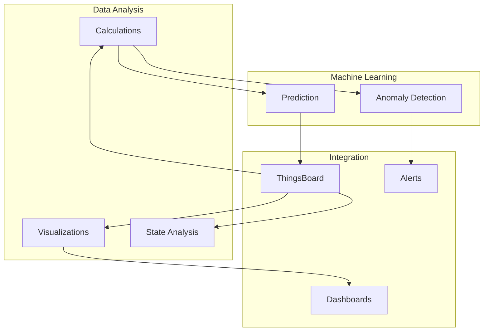
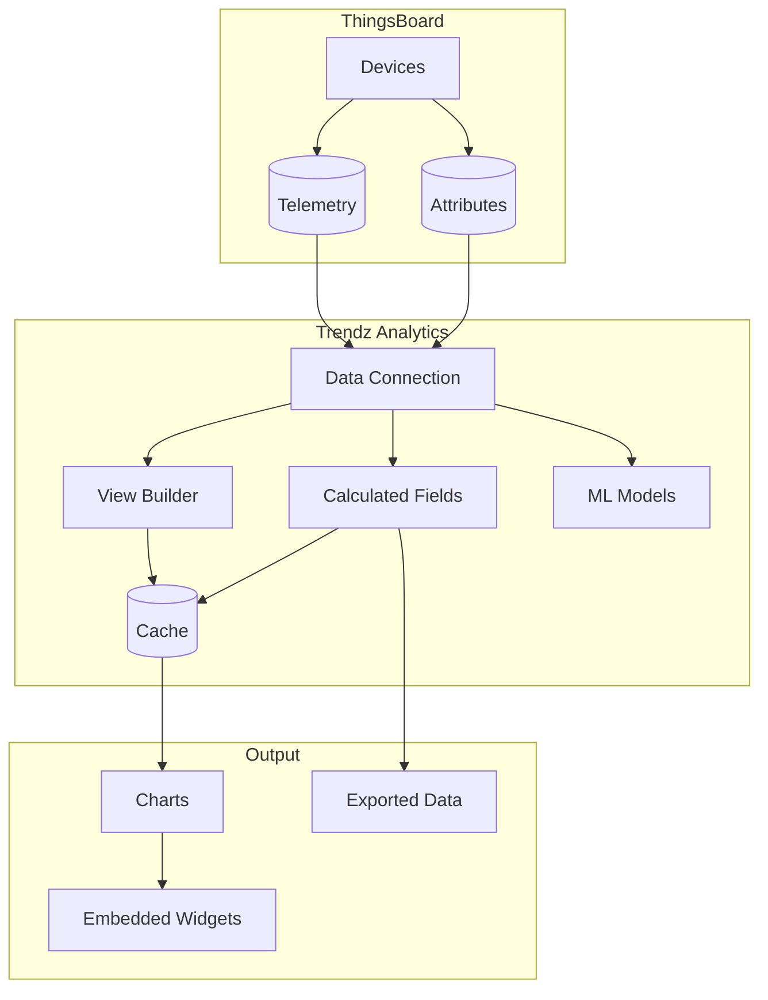
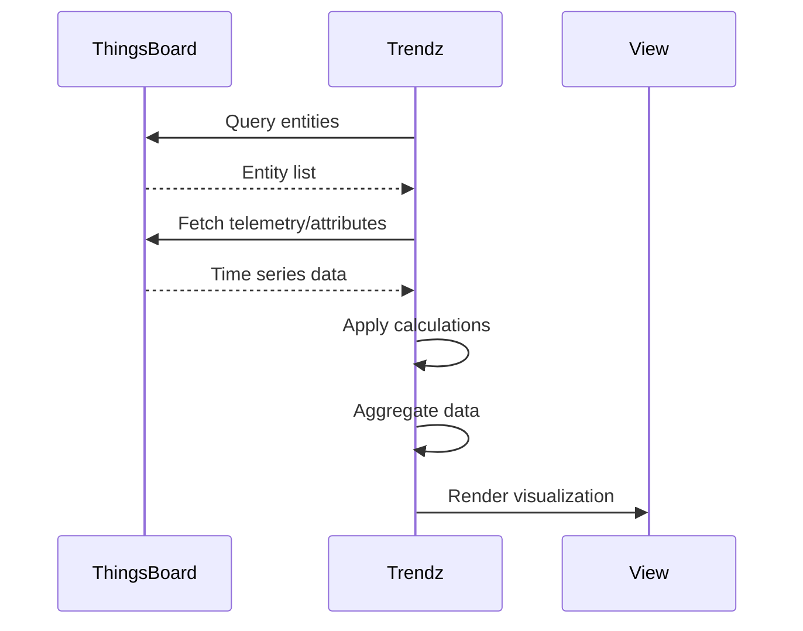
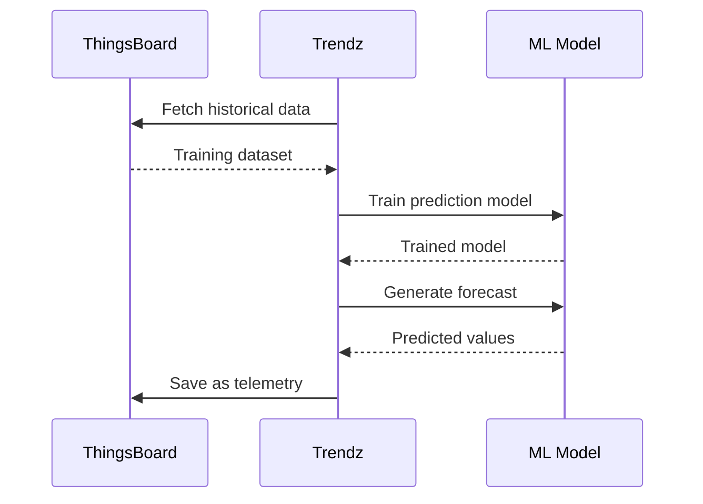
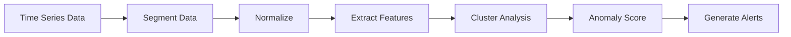

# Trendz Analytics

## Overview

Trendz Analytics is ThingsBoard's analytics platform that converts IoT datasets into actionable insights. It provides tools for data visualization, calculated fields, time-series prediction, anomaly detection, and state analysis without requiring data science expertise.

## Contents

| Document | Description |
|----------|-------------|
| [Visualizations](./trendz-visualizations.md) | Chart types, view builder, data grouping |
| [Calculations & Prediction](./trendz-calculations.md) | Calculated fields, prediction models, forecasting |
| [Anomaly Detection](./trendz-anomaly-detection.md) | Anomaly models, scoring, alerting |

## Key Capabilities



## Core Features

| Feature | Description | Use Case |
|---------|-------------|----------|
| Visualizations | 8+ chart types with interactive builder | Data exploration |
| Calculated Fields | JavaScript/Python transformations | KPI monitoring |
| Predictions | ML-based time series forecasting | Demand planning |
| Anomaly Detection | Unsupervised anomaly scoring | Fault detection |
| States | Duration tracking across conditions | Equipment monitoring |
| Dashboards | Embedded visualizations | Reporting |

## Architecture



## Data Flow

### From ThingsBoard to Visualization



### Prediction Pipeline



## Visualization Types

| Type | Description | Best For |
|------|-------------|----------|
| Line Chart | Time series trends | Continuous metrics |
| Bar Chart | Categorical comparisons | Discrete values |
| Pie Chart | Proportional breakdown | Distribution analysis |
| Heatmap | Density visualization | Pattern detection |
| Scatter Plot | Correlation analysis | Relationship discovery |
| Table | Raw/aggregated data | Detailed inspection |
| Calendar | Date-based patterns | Seasonal analysis |
| Card | Single KPI display | Executive dashboards |

## Calculated Fields

Trendz supports custom calculations using JavaScript or Python:

```javascript
// JavaScript example: Temperature conversion
var celsius = avg(Sensor.temperature);
var fahrenheit = celsius * 1.8 + 32;
return fahrenheit;
```

### Field Types

| Type | Description | Processing |
|------|-------------|------------|
| Simple | Single value transformation | Per data point |
| Batch | Array-based transformation | Entire dataset |

### Aggregation Functions

| Function | Description |
|----------|-------------|
| `avg()` | Average value |
| `sum()` | Total sum |
| `min()` | Minimum value |
| `max()` | Maximum value |
| `count()` | Count of values |
| `uniq()` | Unique value (for attributes) |
| `none()` | Raw value (for states) |

## Prediction Models

Trendz provides multiple ML algorithms for time series forecasting:

| Model | Description | Use Case |
|-------|-------------|----------|
| Fourier | Frequency component analysis | Cyclic patterns |
| Prophet | Facebook's forecasting | Seasonal with holidays |
| ARIMA | Autoregressive moving average | Trend/seasonal data |
| Linear Regression | Statistical linear model | Simple trends |
| Custom Python | User-defined models | Advanced use cases |

## Anomaly Detection

Trendz uses unsupervised machine learning to detect anomalies:



### Key Metrics

| Metric | Description | Use |
|--------|-------------|-----|
| Anomaly Score | Deviation intensity | Short-term spikes |
| Anomaly Score Index | Score × Duration | Long-term impact |

## State Analysis

Track time spent in different operational states:

```javascript
// Define machine states
var pressure = none(Machine.pressure);
var speed = none(Machine.rotationSpeed);
return pressure > 700 && speed < 35; // Critical state
```

### State Aggregations

| Function | Description |
|----------|-------------|
| Duration | Total time in state |
| Duration Percent | Percentage of time in state |

## ThingsBoard Integration

### Saving Calculations

Calculated fields can be saved back to ThingsBoard as telemetry:

| Option | Description |
|--------|-------------|
| Key Prefix | `_ECD_` for calculated fields |
| Refresh Schedule | Periodic recalculation |
| Real-time (RT) | On-demand calculation |
| ThingsBoard (TB) | Pre-calculated storage |

### Dashboard Embedding

Trendz visualizations can be embedded in ThingsBoard dashboards:

1. Create visualization in Trendz
2. Copy embed code
3. Add to ThingsBoard dashboard widget
4. Configure filters and aliases

## Configuration

### Caching

| Setting | Description |
|---------|-------------|
| Cache TTL | Duration to store results |
| Cache Strategy | Memory vs persistent |
| Invalidation | On data change or schedule |

### Background Jobs

| Job Type | Description |
|----------|-------------|
| Prediction Refresh | Update forecasts periodically |
| Anomaly Refresh | Check for new anomalies |
| Calculated Field Refresh | Recompute values |
| Reprocess | Recalculate historical data |

## Use Cases

| Industry | Application |
|----------|-------------|
| Energy | Consumption forecasting, demand planning |
| Manufacturing | OEE monitoring, predictive maintenance |
| Smart Buildings | Occupancy analysis, energy optimization |
| Fleet Management | Vehicle health, route optimization |
| Agriculture | Crop monitoring, irrigation scheduling |

## Performance Considerations

| Factor | Recommendation |
|--------|----------------|
| Large datasets | Use aggregation and caching |
| Complex calculations | Batch processing |
| Real-time views | Limit time range |
| Many entities | Filter before visualization |

## Deployment Options

| Option | Description |
|--------|-------------|
| Cloud | ThingsBoard Cloud with Trendz |
| Docker | Self-hosted container |
| Kubernetes | Clustered deployment |
| On-premise | Direct installation |

## See Also

- [Rule Engine](../04-rule-engine/README.md) - Data processing
- [Data Model](../03-data-model/README.md) - Entity structure
- [Security](../09-security/README.md) - Access control
