# Anomaly Detection

## Overview

Trendz provides unsupervised machine learning for detecting anomalies in time series data. The system automatically identifies abnormal patterns without requiring labeled training data, using clustering-based algorithms to distinguish normal behavior from deviations.

## Anomaly Detection Concepts

### Key Metrics

| Metric | Description | Use Case |
|--------|-------------|----------|
| Anomaly Score | Deviation intensity from normal | Short-term spikes |
| Anomaly Score Index | Score × Duration | Long-term impact assessment |

### Score vs Score Index

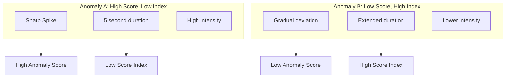

**Example: Pump Vibration**
- **Anomaly A**: Sharp spike lasting 5 seconds - high score, low index
- **Anomaly B**: Sustained deviation over minutes - lower score, higher index (more impactful)

## How Anomaly Detection Works

### Processing Pipeline

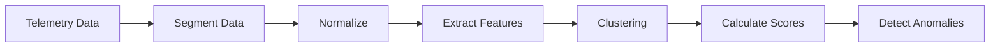

### Unsupervised Learning

Trendz uses unsupervised clustering algorithms:

| Algorithm | Description |
|-----------|-------------|
| K-Means | Partition-based clustering |
| DBSCAN | Density-based clustering |
| GMM | Gaussian Mixture Models |
| Hierarchical | Tree-based clustering |

### Clustering Process

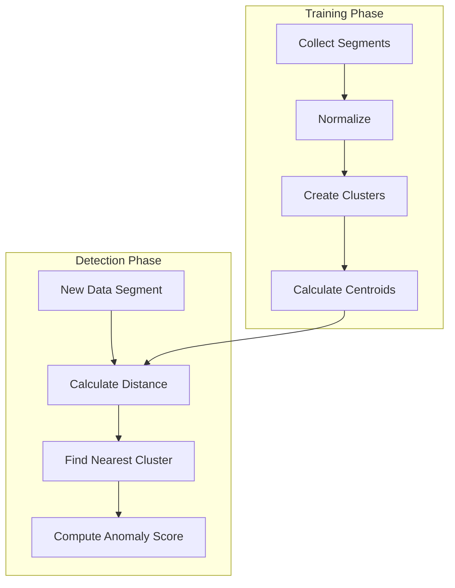

## Creating Anomaly Models

### Model Workflow

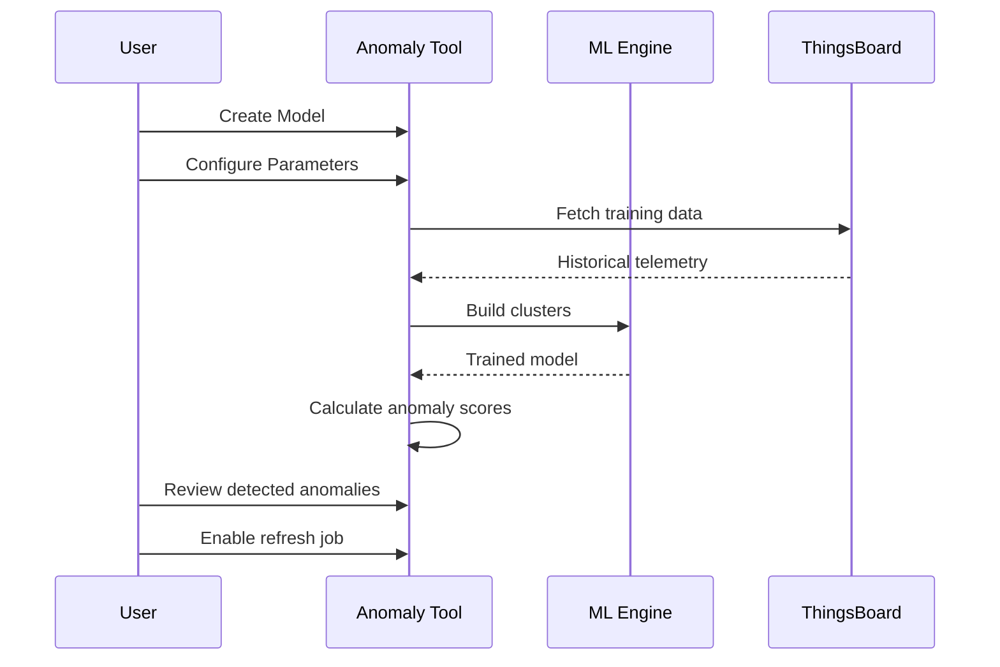

## Model Configuration

### Input Tab Settings

| Setting | Description |
|---------|-------------|
| Model Name | Identifier for the model |
| Entity | Target entity type |
| Telemetry Key | Field to analyze |
| Training Range | Historical data period |
| Segment Size | Data segment duration |

### Model Status

| Status | Description |
|--------|-------------|
| READY | Model is ready for detection |
| QUEUED | Waiting for training |
| IN PROGRESS | Currently training |
| CANCELLED | Training cancelled |
| FAILED | Training failed |

## Anomaly Model Tabs

### Input Tab

Configure core anomaly model parameters:

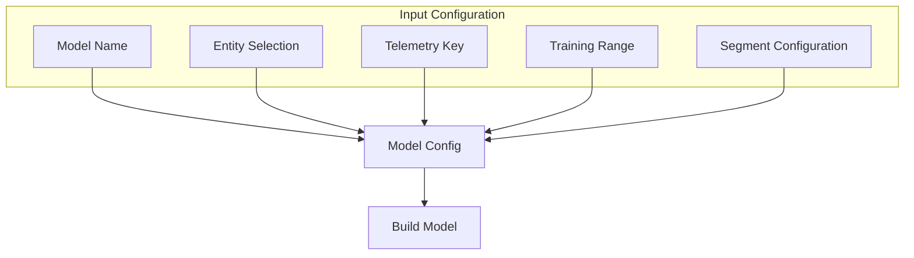

### Summary Tab

Overview of anomalies grouped by device:

| View Mode | Description |
|-----------|-------------|
| Calendar | Total anomaly index per day |
| Dynamic | Monthly distribution |
| Review | Latest detected anomaly |

### Review Tab

Inspect all detected anomalies:

| Sort Option | Description |
|-------------|-------------|
| Total Duration | Time spent in anomaly |
| Score | Anomaly intensity |
| Score Index | Impact metric |
| Item | Device/entity |
| End Timestamp | When anomaly ended |

### Cluster Info Tab

Validate clustering results:

| Column | Description |
|--------|-------------|
| Cluster ID | Unique identifier |
| Segments Count | Number of segments |
| Segments Percent | Distribution percentage |
| Total Duration | Combined segment duration |
| Min Score | Lowest anomaly score |
| Max Score | Highest anomaly score |

### Tasks Tab

Monitor model tasks:

| Task Type | Description |
|-----------|-------------|
| Build | Initial model training |
| Refresh | Check for new anomalies |
| Reprocess | Recalculate historical data |

## Saving Anomaly Data

### Save to ThingsBoard

Anomaly scores can be saved as telemetry:

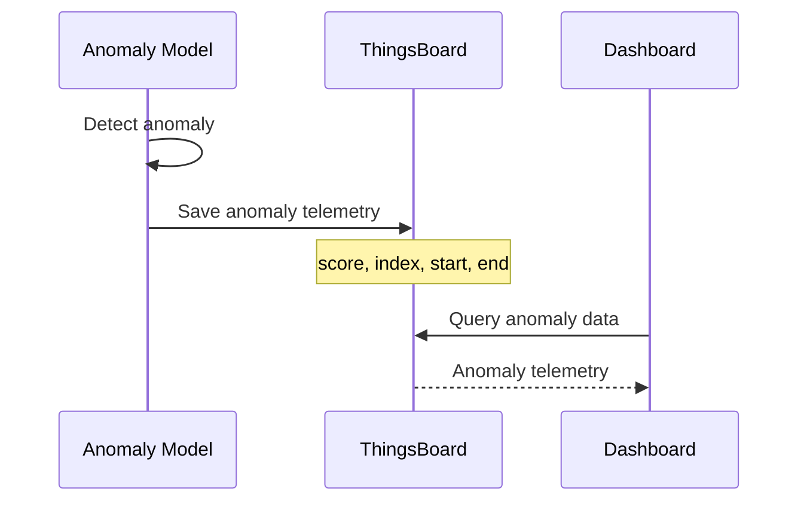

### Telemetry Fields

| Field | Description |
|-------|-------------|
| anomaly_score | Deviation intensity |
| anomaly_index | Score × Duration |
| anomaly_start | Start timestamp |
| anomaly_end | End timestamp |

## Anomaly Alerts

### Alarm Configuration

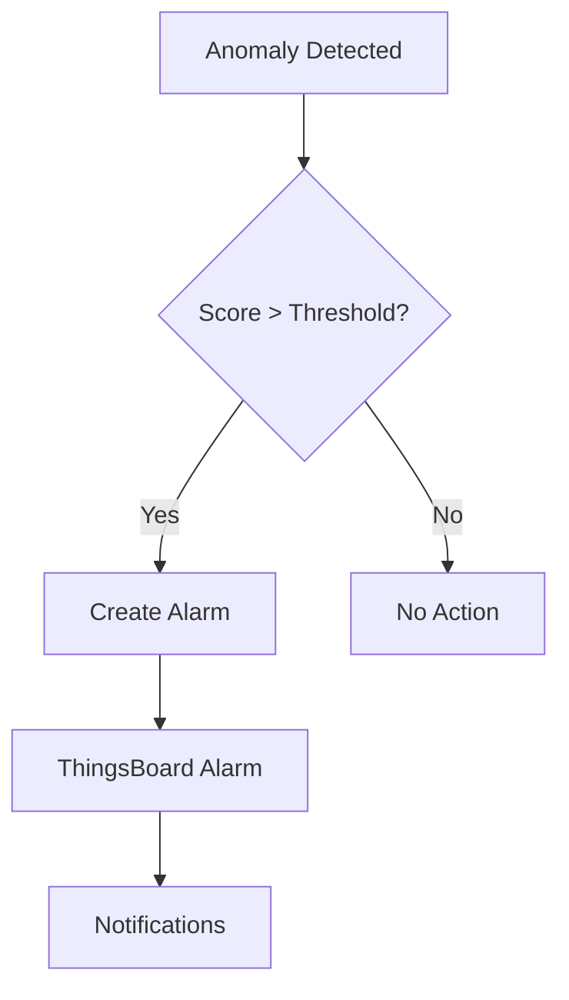

### Alarm Settings

| Setting | Description |
|---------|-------------|
| Enable Alarms | Auto-create alarms |
| Score Threshold | Minimum score for alarm |
| Index Threshold | Minimum index for alarm |
| Alarm Type | ThingsBoard alarm type |
| Severity | Alarm severity level |

## Refresh and Reprocess

### Anomaly Refresh

Periodic check for new anomalies:

| Setting | Description |
|---------|-------------|
| Enable Refresh | Turn on periodic refresh |
| Interval | How often to check |
| Items | Devices to monitor |

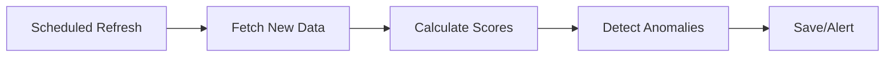

### Anomaly Reprocess

Recalculate historical anomalies:

| Use Case | Description |
|----------|-------------|
| Model update | Apply new model to history |
| Threshold change | Re-evaluate with new thresholds |
| Data correction | After fixing data issues |

## Anomaly Visualization

### Summary Views

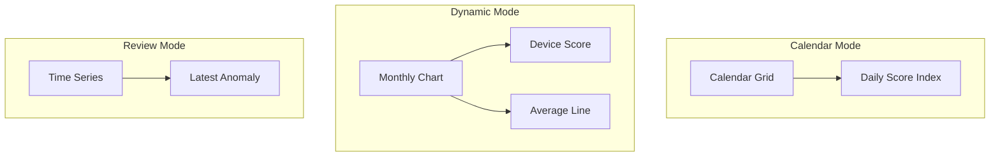

### Cluster Visualization

Centroids represent typical patterns:

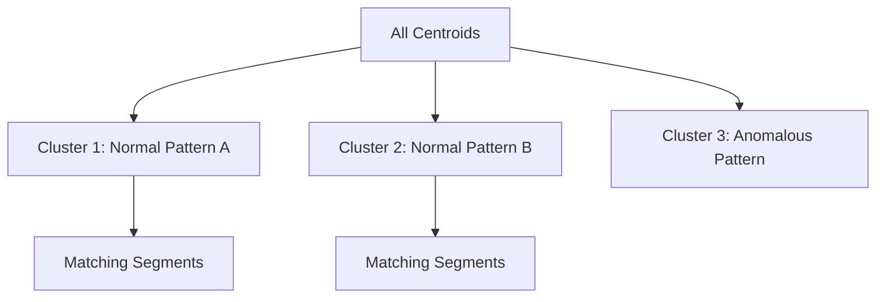

## Best Practices

### Data Preparation

| Practice | Benefit |
|----------|---------|
| Sufficient history | Better normal patterns |
| Clean data | Accurate clustering |
| Appropriate segment size | Match operational cycles |
| Remove known anomalies | Cleaner baseline |

### Model Configuration

| Practice | Benefit |
|----------|---------|
| Start with AUTO settings | Reasonable defaults |
| Validate clusters | Meaningful groupings |
| Review detected anomalies | Verify accuracy |
| Adjust thresholds | Reduce false positives |

### Monitoring

| Practice | Benefit |
|----------|---------|
| Enable refresh jobs | Continuous detection |
| Set appropriate thresholds | Actionable alerts |
| Regular model review | Adapt to changes |
| Track false positives | Improve accuracy |

## Use Cases

### Predictive Maintenance

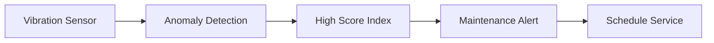

### Equipment Health

| Metric | Normal | Anomaly |
|--------|--------|---------|
| Vibration | Low, consistent | Spikes or sustained increase |
| Temperature | Within range | Unusual patterns |
| Power | Stable consumption | Erratic usage |

### Environmental Monitoring

| Application | Monitored Data |
|-------------|----------------|
| HVAC systems | Temperature, humidity patterns |
| Air quality | Pollutant levels |
| Water systems | Flow rates, pressure |

### Security Monitoring

| Pattern | Detection |
|---------|-----------|
| Access patterns | Unusual login times |
| Network traffic | Abnormal data flows |
| Resource usage | Unexpected spikes |

## Example: Heat Pump Anomaly Detection

### Configuration

1. **Create Model**
   - Entity: Heat Pump
   - Telemetry: compressorVibration
   - Training: Last 6 months

2. **Build Model**
   - Segment size: 1 hour
   - Let system cluster normal patterns

3. **Review Results**
   - Check cluster centroids
   - Validate detected anomalies

4. **Enable Monitoring**
   - Refresh: Every hour
   - Alarm threshold: Score Index > 50
   - Severity: Warning

### Expected Results

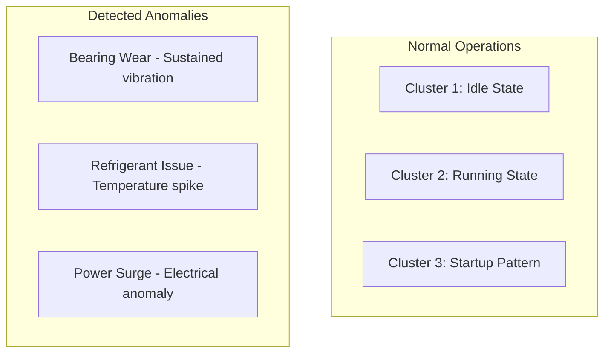

## Common Pitfalls

### Model Configuration

| Pitfall | Symptom | Solution |
|---------|---------|----------|
| **Training data includes known anomalies** | Model treats anomalies as normal, misses similar future anomalies | Review training period for incidents, exclude anomaly periods, or use clean baseline data |
| **Segment size too small** | Excessive segments, poor clustering, noise dominates | Match segment size to operational cycles (machine cycle time, HVAC cycles, batch processes) |
| **Insufficient training data** | Poor cluster formation, high false positive rate | Use minimum 100-200 segments for training, longer training period for better patterns |
| **Mixing multiple operational modes** | Model confuses different modes as anomalies | Train separate models for distinct modes (summer/winter, production/maintenance) |

### Training & Baseline

| Pitfall | Symptom | Solution |
|---------|---------|----------|
| **Baseline period too short** | Poor normal pattern recognition | Use minimum 2-4 weeks of stable operation for training, avoid startup/commissioning periods |
| **Model never retrained** | Accuracy degrades as equipment behavior changes | Enable periodic retraining (monthly/quarterly) to adapt to operational changes |
| **Training during abnormal conditions** | Baseline includes non-representative data | Select training period during normal, stable operations without known issues |
| **Wrong telemetry field selected** | Irrelevant anomalies detected | Choose fields with clear normal/abnormal patterns (vibration, temperature, not status codes) |

### Detection & Alerting

| Pitfall | Symptom | Solution |
|---------|---------|----------|
| **Threshold too sensitive** | Alarm flood, many low-score anomalies | Increase Score Index threshold, focus on sustained anomalies not brief spikes |
| **Alert fatigue from false positives** | Operators ignore anomaly alarms | Tune threshold based on review tab, validate detected anomalies manually before enabling alarms |
| **No cluster validation** | Poor quality anomalies, meaningless alerts | Review Cluster Info tab, ensure recognizable patterns in centroids before deployment |
| **Ignoring anomaly duration** | Focusing only on score, missing long-term issues | Use Score Index (score × duration) to catch sustained deviations with lower intensity |

## Troubleshooting

### Common Issues

| Issue | Cause | Solution |
|-------|-------|----------|
| Too many anomalies | Threshold too low | Increase threshold |
| Missed anomalies | Threshold too high | Decrease threshold |
| Poor clustering | Insufficient data | More training data |
| Model degradation | Operational changes | Retrain model |

### Model Validation

| Check | What to Look For |
|-------|------------------|
| Cluster distribution | Segments spread across clusters |
| Centroid shapes | Recognizable patterns |
| Score distribution | Most scores low, few high |
| False positive rate | Acceptable alarm frequency |

## See Also

- [Calculations](./trendz-calculations.md) - Calculated fields
- [Visualizations](./trendz-visualizations.md) - Display anomalies
- [Rule Engine](../04-rule-engine/README.md) - Alarm handling
- [Security](../09-security/README.md) - Alert notifications
