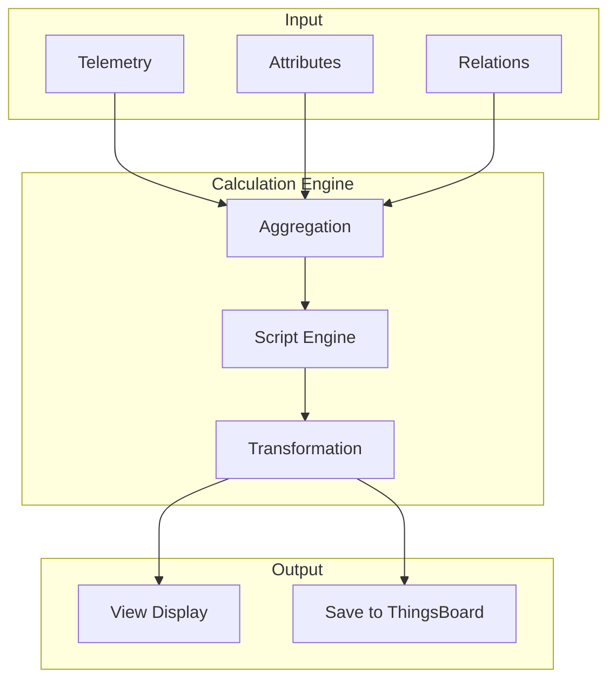
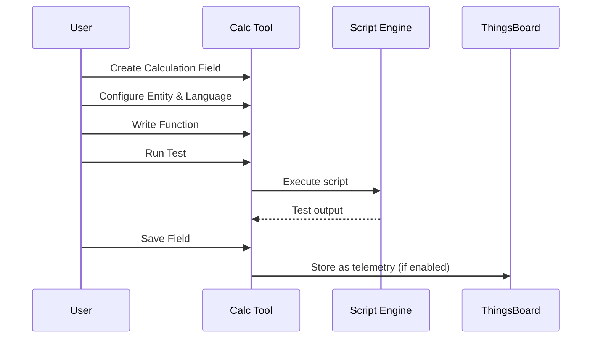
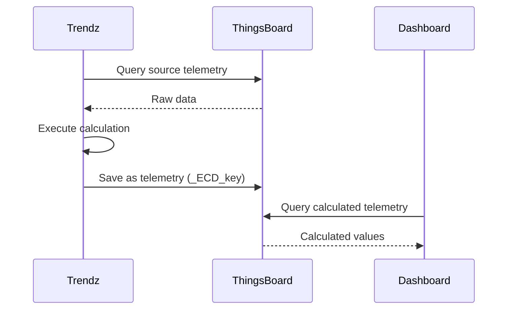
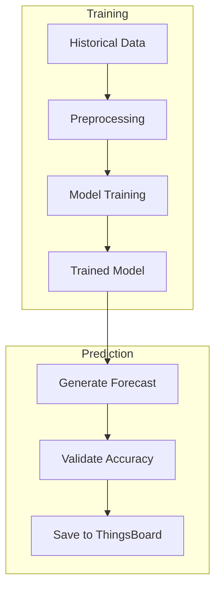
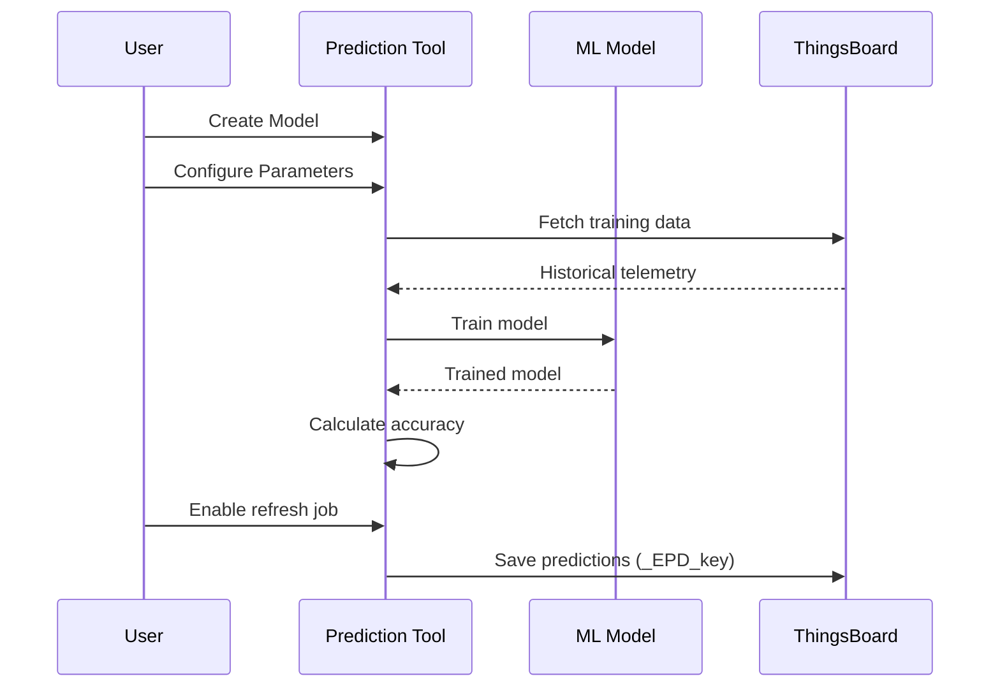
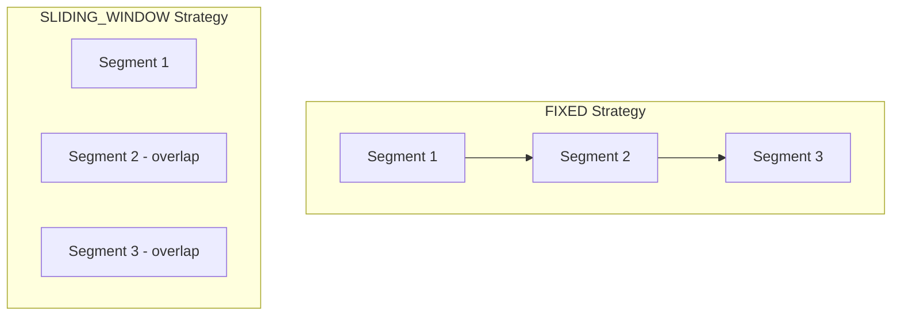
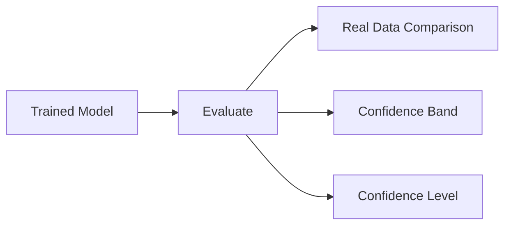
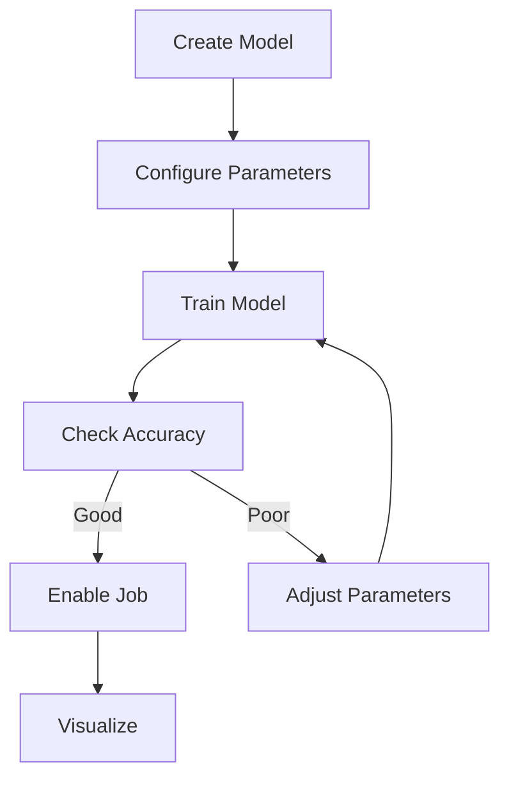

# Calculations and Predictions

## Overview

Trendz provides calculated fields for KPI monitoring and transformation, along with ML-based prediction models for time series forecasting. Calculations process data on-the-fly without modifying ThingsBoard data, and results can be saved back as telemetry.

## Calculated Fields

### Architecture



### Creating a Calculated Field



## Field Configuration

### Function Tab Settings

| Field | Type | Description |
|-------|------|-------------|
| KEY | string | Telemetry key (prefix: `_ECD_`) |
| ENTITY | select | Business entity to link |
| LANGUAGE | select | JavaScript or Python |
| GROUPING INTERVAL | select | Time aggregation unit |
| FIELD TYPE | select | Simple or Batch |
| AGGREGATION | select | Aggregation function |

### Field Types

| Type | Description | Use Case |
|------|-------------|----------|
| Simple | Process single values | Basic transformations |
| Batch | Process entire array | Complex calculations |

### Language Options

| Language | Version | Libraries |
|----------|---------|-----------|
| JavaScript | ECMAScript 5.1 | Built-in |
| Python | 3.8+ | NumPy, Pandas, Flask |

## Writing Calculation Functions

### Basic Syntax

```javascript
// Get aggregated field value
var value = aggregation(Entity.fieldName);

// Return calculated result
return transformedValue;
```

### Accessing Field Values

| Pattern | Description | Example |
|---------|-------------|---------|
| `avg(Entity.field)` | Average value | `avg(Sensor.temperature)` |
| `sum(Entity.field)` | Sum of values | `sum(Meter.consumption)` |
| `uniq(Entity.attr)` | Attribute value | `uniq(Device.location)` |
| `none(Entity.field)` | Raw value (states) | `none(Machine.status)` |

### Aggregation Functions

| Function | Description | Use With |
|----------|-------------|----------|
| `avg()` | Average | Telemetry |
| `sum()` | Total | Telemetry |
| `min()` | Minimum | Telemetry |
| `max()` | Maximum | Telemetry |
| `count()` | Count | Telemetry |
| `latest()` | Most recent | Telemetry |
| `first()` | Earliest | Telemetry |
| `uniq()` | Unique value | Attributes |
| `none()` | Raw (no aggregation) | States |

## Calculation Examples

### Temperature Conversion

```javascript
// Convert Celsius to Fahrenheit
var celsius = avg(Sensor.temperature);
var fahrenheit = celsius * 1.8 + 32;
return fahrenheit;
```

### Energy per Square Meter

```javascript
// Calculate energy consumption per square meter
var energy = sum(EnergyMeter.energyConsumption);
var heat = sum(HeatMeter.heatConsumption);
var area = uniq(Apartment.area);

return (energy + heat) / area;
```

### Running Total

```javascript
// Calculate daily consumption delta
var current = sum(Meter.reading);
var previous = sum(Meter.previousReading);
return current - previous;
```

### Conditional Logic

```javascript
// Categorize temperature
var temp = avg(Sensor.temperature);
if (temp < 18) {
    return "Cold";
} else if (temp < 25) {
    return "Normal";
} else {
    return "Hot";
}
```

## Batch Mode Calculations

Batch mode provides access to the entire raw telemetry array:

```javascript
// Access raw data array in batch mode
function calculate(data) {
    var values = data.Sensor.temperature;
    var sum = 0;
    for (var i = 0; i < values.length; i++) {
        sum += values[i].value;
    }
    return sum / values.length;
}
```

### Batch vs Simple Mode

| Aspect | Simple | Batch |
|--------|--------|-------|
| Data Access | Aggregated value | Full array |
| Processing | Per aggregation interval | Entire dataset |
| Performance | Faster | More flexible |
| Use Case | Basic KPIs | Complex analysis |

## Saving to ThingsBoard

### Enable Calculated Field

When enabled, calculations are saved as telemetry:

| Setting | Description |
|---------|-------------|
| Key | Telemetry key (`_ECD_` prefix) |
| Schedule | Refresh interval |
| Real-time | Calculate on demand |

### Data Flow



---

## Prediction Models

### Overview

Trendz provides ML-based time series prediction with multiple algorithms:



### Prediction Workflow



## Prediction Algorithms

### Available Models

| Model | Description | Best For |
|-------|-------------|----------|
| Fourier Transformation | Frequency analysis | Cyclic patterns |
| Prophet | Facebook's forecasting | Seasonal + holidays |
| Multivariable Prophet | Multi-series Prophet | Correlated variables |
| ARIMA | Autoregressive moving average | Trend/seasonal |
| Linear Regression | Linear relationship | Simple trends |
| Custom Python | User-defined | Advanced scenarios |

### Model Selection Guide

| Pattern | Recommended Model |
|---------|-------------------|
| Strong seasonality | Prophet, Fourier |
| Simple linear trend | Linear Regression |
| Complex patterns | ARIMA |
| Multiple correlated series | Multivariable Prophet |
| Domain-specific | Custom Python |

## Prediction Configuration

### Input Tab Settings

| Setting | Description |
|---------|-------------|
| Entity | Target entity type |
| Predicted Field | Telemetry to forecast |
| Item | Specific device/asset |
| Key | Output key (`_EPD_` prefix) |
| Training Range | Historical data period |
| Prediction Range | Forecast duration |
| Prediction Unit | Hours, Days, Weeks, Months |

### Segment Strategy

| Strategy | Description |
|----------|-------------|
| AUTO | Automatic segmentation |
| FIXED | Sequential, non-overlapping |
| SLIDING_WINDOW_UNIT | Overlapping by time unit |
| SLIDING_WINDOW_PERCENT | Overlapping by percentage |
| STICK_TO_END | Focus on recent segments |



### Aggregation Settings

| Setting | Options |
|---------|---------|
| Aggregation | AVG, SUM, MIN, MAX, LATEST |
| Grouping Interval | Hour, Day, Week, Month |

### Advanced Settings

| Setting | Description |
|---------|-------------|
| Set Limits | Enable min/max bounds |
| MIN | Minimum predicted value |
| MAX | Maximum predicted value |

## Accuracy Validation

### Accuracy Tab



### Accuracy Metrics

| Metric | Description |
|--------|-------------|
| Accuracy Summary | Overall percentage accuracy |
| Real Data | Side-by-side comparison |
| Confidence Band | Error percentage range |
| Confidence Level | Binary pass/fail by threshold |

### Configuration Parameters

| Parameter | Description |
|-----------|-------------|
| Device Selection | Devices to evaluate |
| Mode | AUTO or MANUAL |
| Acceptable Value Error | Tolerance for value difference |
| Acceptable Time Error | Tolerance for time offset |
| Percentile | Best values to consider |

## Prediction Jobs

### Job Configuration

| Setting | Description |
|---------|-------------|
| Enable Refresh | Periodic prediction update |
| Interval | Refresh frequency |
| Items | Devices to predict |
| Enable Retraining | Periodically retrain model |

### Job Types

| Job | Description |
|-----|-------------|
| Train | Initial model training |
| Refresh | Generate new predictions |
| Reprocess | Recalculate historical |

## State Analysis

### Defining States

States track time spent in different conditions:

```javascript
// Define production state
var okRate = none(Machine.okDetails);
return okRate < 75; // Low Production state
```

### State Aggregations

| Function | Description |
|----------|-------------|
| DURATION | Total time in state |
| DURATION_PERCENT | Percentage of time |

### Multi-Condition States

```javascript
// Critical state with multiple conditions
var pressure = none(Machine.pressure);
var speed = none(Machine.rotationSpeed);
return pressure > 700 && speed < 35;
```

### State Visualization

States work well with:
- Bar charts (stacked 100%)
- Heatmaps
- Tables

## Example: Energy Forecast

### Configuration

```
Entity: Energy Meter
Predicted Field: energyConsumption
Training Range: Last Year
Prediction Range: 3 Months
Method: FOURIER_TRANSFORMATION
Segment Strategy: AUTO
Aggregation: AVG
Grouping: DAY
```

### Workflow

1. Create prediction model
2. Configure input parameters
3. Train model
4. Review accuracy
5. Enable refresh job
6. Visualize in dashboard



## Best Practices

### Calculations

| Practice | Benefit |
|----------|---------|
| Test before saving | Validate logic |
| Use appropriate aggregation | Correct results |
| Enable caching | Performance |
| Document formulas | Maintainability |

### Predictions

| Practice | Benefit |
|----------|---------|
| Sufficient training data | Better accuracy |
| Appropriate model selection | Better fit |
| Regular retraining | Adapt to changes |
| Validate accuracy | Trust results |

### States

| Practice | Benefit |
|----------|---------|
| Clear state definitions | Consistent results |
| Non-overlapping conditions | Accurate duration |
| Use DURATION_PERCENT | Comparable across periods |

## See Also

- [Visualizations](./trendz-visualizations.md) - Display results
- [Anomaly Detection](./trendz-anomaly-detection.md) - Detect anomalies
- [Rule Engine](../04-rule-engine/README.md) - Event processing
