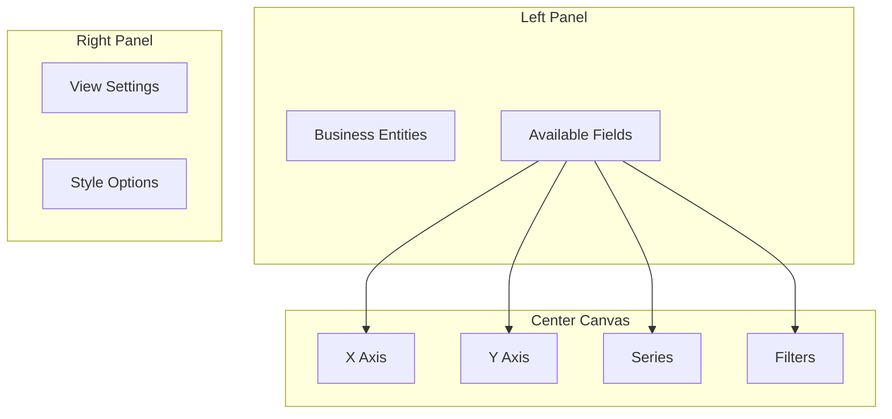
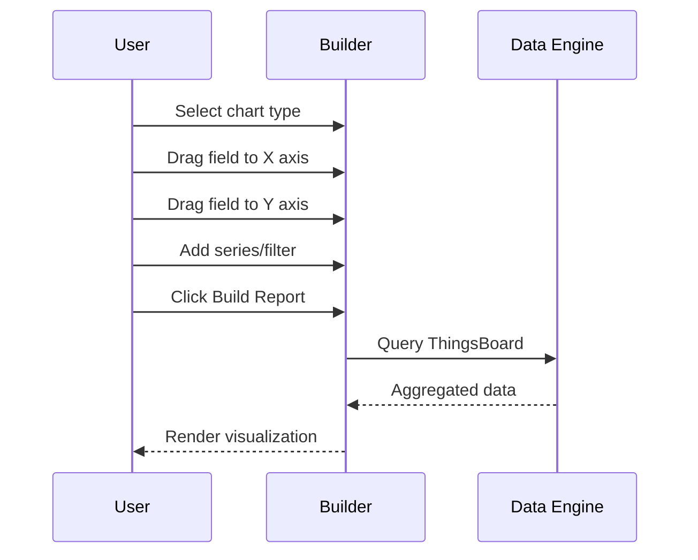
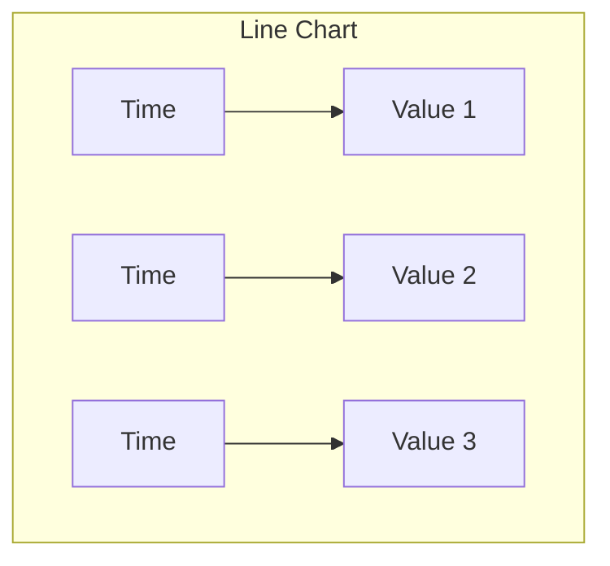
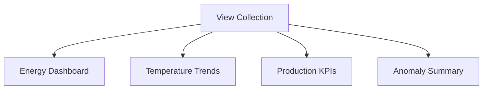
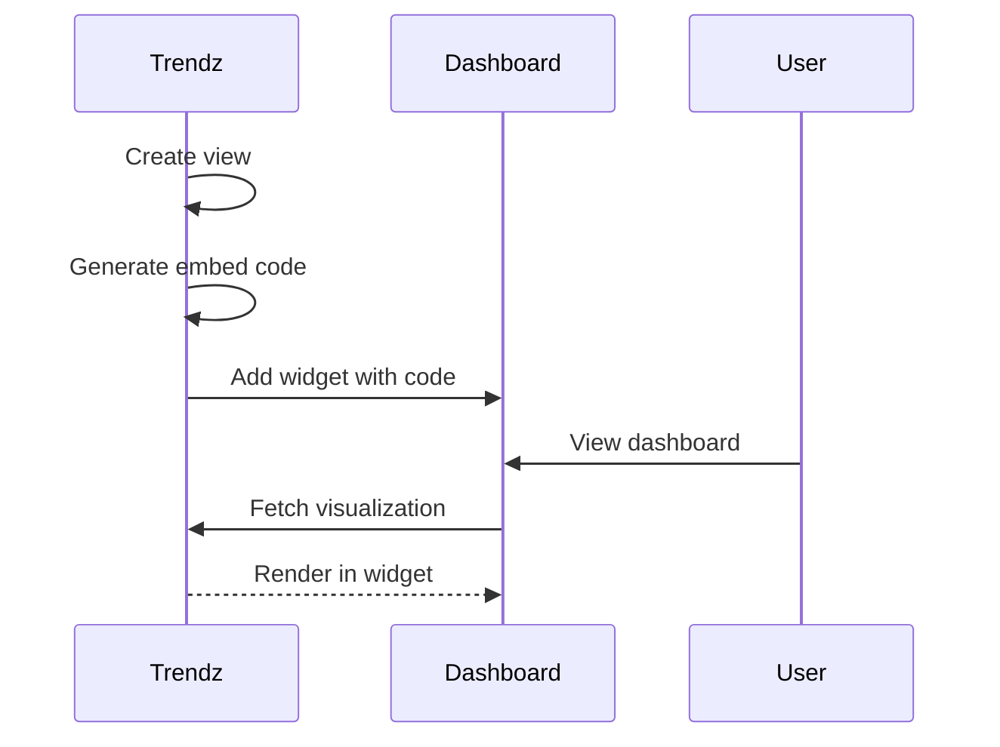

# Trendz Visualizations

## Overview

Trendz provides eight visualization types optimized for IoT data analysis. The view builder enables drag-and-drop creation of charts with support for filtering, grouping, and aggregation across ThingsBoard entities.

## Visualization Types

| Type | Description | Best For |
|------|-------------|----------|
| Line Chart | Time series with multiple series | Trend analysis |
| Bar Chart | Categorical/histogram | Comparisons |
| Pie Chart | Proportional segments | Distribution |
| Heatmap | Color-coded matrix | Patterns |
| Scatter Plot | X-Y correlation | Relationships |
| Table | Rows and columns | Details |
| Calendar | Day-based view | Seasonal |
| Card | Single value | KPIs |

## View Builder

### Builder Interface



### Building a View



## Line Chart

Line charts display time series data with support for multiple series.

### Configuration

| Field | Description |
|-------|-------------|
| X Axis | Date field (typically Date or Date RAW) |
| Y Axis | Telemetry/attribute fields |
| Series | Entity field for separate lines |

### Example: Temperature Over Time

```
X Axis: Date (RAW)
Y Axis: temperature (AVG)
Series: Device Name
```



### Line Chart Settings

| Setting | Options | Default |
|---------|---------|---------|
| Line Style | Solid, Dashed, Dotted | Solid |
| Point Display | Show/Hide | Show |
| Interpolation | Linear, Smooth | Linear |
| Stacked | Yes/No | No |

## Bar Chart

Bar charts compare values across categories or time periods.

### Configuration

| Field | Description |
|-------|-------------|
| X Axis | Category or date field |
| Y Axis | Numeric values |
| Series | Grouping field |

### Bar Types

| Type | Description | Use Case |
|------|-------------|----------|
| Vertical | Bars going up | Most comparisons |
| Horizontal | Bars going right | Long labels |
| Stacked | Cumulative bars | Part-to-whole |
| Grouped | Side-by-side bars | Direct comparison |

### Bar Chart Settings

| Setting | Options |
|---------|---------|
| Stack Mode | None, Stacked, 100% Stacked |
| Bar Width | Auto, Custom |
| Labels | Show/Hide values |
| Orientation | Vertical, Horizontal |

## Pie Chart

Pie charts show proportional breakdown of a whole.

### Configuration

| Field | Description |
|-------|-------------|
| Value | Numeric field (aggregated) |
| Label | Category field for segments |

### Pie Chart Settings

| Setting | Options |
|---------|---------|
| Display | Pie, Donut |
| Labels | Value, Percent, Both |
| Legend | Show/Hide |
| Start Angle | 0-360 degrees |

## Heatmap

Heatmaps visualize density using color intensity across two dimensions.

### Configuration

| Field | Description |
|-------|-------------|
| X Axis | First dimension |
| Y Axis | Second dimension |
| Value | Color intensity field |

### Time-Based Heatmaps

| Pattern | X Axis | Y Axis |
|---------|--------|--------|
| Hour vs Day of Week | Hour (0-23) | Weekday |
| Day vs Month | Day (1-31) | Month |
| Week vs Year | Week (1-52) | Year |

### Example: Activity by Hour/Day

```
X Axis: Hour of Day
Y Axis: Day of Week
Value: messageCount (SUM)
Color: Low (Blue) to High (Red)
```

## Scatter Plot

Scatter plots reveal correlations between two variables.

### Configuration

| Field | Description |
|-------|-------------|
| X Axis | First numeric field |
| Y Axis | Second numeric field |
| Series | Optional grouping |
| Size | Optional third dimension |

### Scatter Plot Settings

| Setting | Description |
|---------|-------------|
| Point Size | Fixed or data-driven |
| Trend Line | None, Linear, Polynomial |
| Opacity | Point transparency |

## Table

Tables display raw or aggregated data in rows and columns.

### Configuration

| Field | Description |
|-------|-------------|
| Columns | Fields to display |
| Rows | Data grouping |

### Table Features

| Feature | Description |
|---------|-------------|
| Sorting | Click column headers |
| Filtering | Per-column filters |
| Pagination | Page through large datasets |
| Export | CSV/Excel download |

### Table Settings

| Setting | Options |
|---------|---------|
| Rows per Page | 10, 25, 50, 100 |
| Column Width | Auto, Fixed |
| Row Striping | Alternating colors |
| Totals Row | Sum/Average footer |

## Calendar

Calendar views display data by date in a calendar format.

### Configuration

| Field | Description |
|-------|-------------|
| Date | Date field for positioning |
| Value | Numeric field for intensity |

### Calendar Views

| View | Description |
|------|-------------|
| Month | Traditional calendar grid |
| Year | 12-month overview |
| Heatmap | Color intensity by day |

## Card

Cards display single KPI values with optional comparison.

### Configuration

| Field | Description |
|-------|-------------|
| Value | Primary metric |
| Label | Display title |
| Comparison | Optional trend indicator |

### Card Variants

| Variant | Description |
|---------|-------------|
| Simple | Value only |
| With Trend | Value + change indicator |
| With Sparkline | Value + mini chart |

## Data Grouping

### Grouping by Time

| Interval | Description |
|----------|-------------|
| Minute | Per-minute aggregation |
| Hour | Hourly aggregation |
| Day | Daily aggregation |
| Week | Weekly aggregation |
| Month | Monthly aggregation |
| Year | Yearly aggregation |

### Grouping by Category

| Field Type | Description |
|------------|-------------|
| Entity Name | Group by device/asset name |
| Entity Type | Group by device type |
| Attribute | Group by attribute value |
| Customer | Group by customer |

## Aggregation Functions

### Numeric Aggregations

| Function | Description | SQL Equivalent |
|----------|-------------|----------------|
| AVG | Average value | AVG() |
| SUM | Total sum | SUM() |
| MIN | Minimum value | MIN() |
| MAX | Maximum value | MAX() |
| COUNT | Count of values | COUNT() |
| LATEST | Most recent value | - |
| FIRST | Earliest value | - |

### Special Aggregations

| Function | Description |
|----------|-------------|
| UNIQ | Unique value (attributes) |
| DELTA | Change between periods |
| DURATION | Time spent (states) |
| DURATION_PERCENT | Percentage time (states) |

## Filtering

### Filter Types

| Type | Description |
|------|-------------|
| Entity Filter | Select specific entities |
| Time Range | Date/time boundaries |
| Value Filter | Numeric conditions |
| Attribute Filter | By attribute value |

### Filter Operations

| Operation | Description |
|-----------|-------------|
| Equals | Exact match |
| Contains | Partial match |
| Greater Than | Numeric comparison |
| Less Than | Numeric comparison |
| Between | Range filter |
| In List | Multiple values |

## View Settings

### General Settings

| Setting | Description |
|---------|-------------|
| Title | View title |
| Description | Optional description |
| Auto Refresh | Periodic data refresh |
| Time Zone | Display time zone |

### Style Settings

| Setting | Description |
|---------|-------------|
| Theme | Color scheme |
| Font Size | Text size |
| Legend Position | Top, Bottom, Left, Right |
| Grid Lines | Show/Hide |

### Export Settings

| Format | Description |
|--------|-------------|
| PNG | Image export |
| PDF | Document export |
| CSV | Data export |
| Excel | Spreadsheet export |

## View Collections

Views can be organized into collections for grouping related visualizations:



### Collection Features

| Feature | Description |
|---------|-------------|
| Shared Filters | Common filter across views |
| Navigation | Linked view navigation |
| Export | Export all views |

## Dashboard Embedding

### Embed Options

| Option | Description |
|--------|-------------|
| iframe | Direct embed code |
| Widget | ThingsBoard widget |
| API | Programmatic access |

### Embedding Process



### Filter by Alias

When embedded in ThingsBoard dashboards, views can filter data based on dashboard aliases:

| Configuration | Description |
|---------------|-------------|
| Alias Mapping | Map Trendz entity to dashboard alias |
| Dynamic Filter | Filter based on selected entity |
| Cross-Filter | Multiple views share filter |

## Best Practices

### Performance

| Practice | Benefit |
|----------|---------|
| Limit time range | Faster queries |
| Use appropriate aggregation | Less data transfer |
| Enable caching | Repeated queries faster |
| Filter early | Reduce dataset size |

### Design

| Practice | Benefit |
|----------|---------|
| Choose right chart type | Clear communication |
| Use consistent colors | Brand alignment |
| Add meaningful labels | Self-documenting |
| Limit series count | Avoid clutter |

### Data Quality

| Practice | Benefit |
|----------|---------|
| Handle missing data | Accurate visualization |
| Use appropriate aggregation | Meaningful values |
| Set correct time zones | Correct time display |

## See Also

- [Calculations](./trendz-calculations.md) - Calculated fields
- [Anomaly Detection](./trendz-anomaly-detection.md) - Anomaly models
- [Data Model](../03-data-model/README.md) - Entity structure
