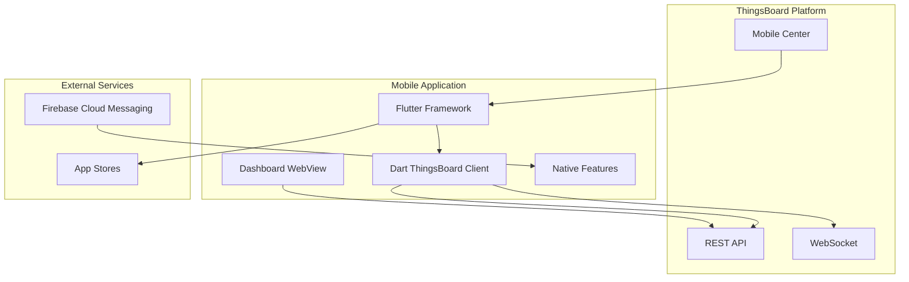
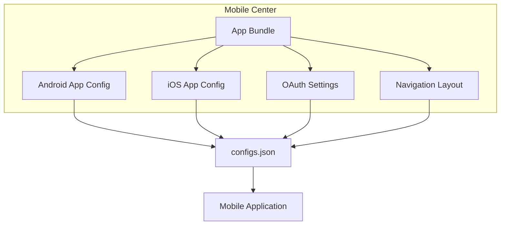
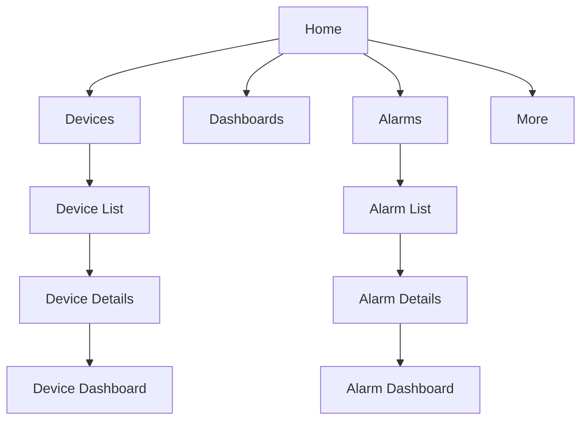
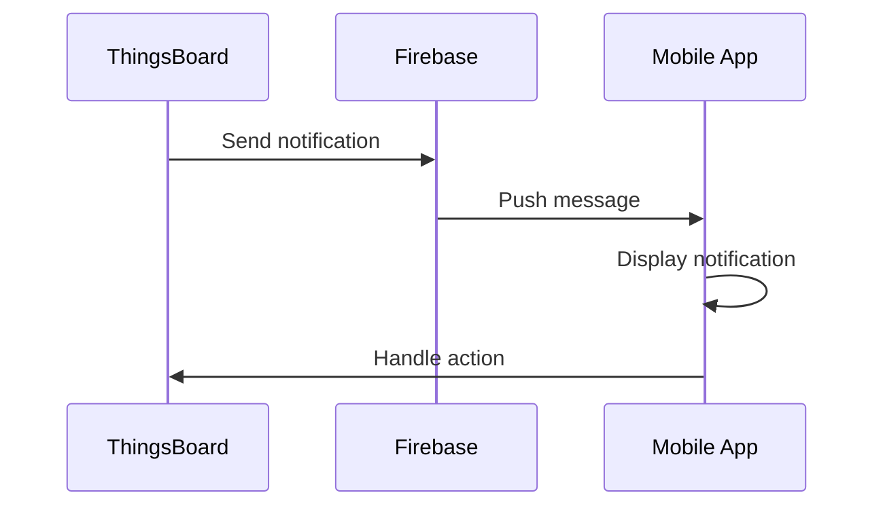
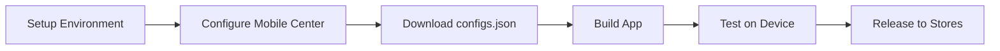

# ThingsBoard Mobile Application

## Overview

The ThingsBoard Mobile Application is an open-source Flutter-based mobile app that provides native iOS and Android access to ThingsBoard IoT platforms. It enables users to build custom IoT mobile applications with minimal coding, offering device management, dashboard viewing, alarm handling, and push notifications.

## Contents

| Document | Description |
|----------|-------------|
| [Customization](./mobile-app-customization.md) | UI customization, mobile actions, OAuth2 |
| [Development](./mobile-app-development.md) | Setup, build, release, Firebase integration |

## Architecture



## Key Features

| Feature | Description |
|---------|-------------|
| Dashboard Viewing | Native dashboard rendering via WebView |
| Device Management | Browse, search, and manage devices |
| Alarm Handling | View and acknowledge alarms |
| Push Notifications | Firebase-powered notifications |
| QR Code Scanning | Device claiming and navigation |
| Mobile Actions | Camera, GPS, phone integration |
| OAuth 2.0 | External authentication providers |
| White Labeling | Custom branding (PE only) |

## Technology Stack

| Component | Technology |
|-----------|------------|
| Framework | Flutter 3.x |
| Language | Dart |
| API Client | Dart ThingsBoard Client |
| Notifications | Firebase Cloud Messaging |
| Platform | iOS 12+, Android 5.0+ |

## Version Compatibility

The mobile app version must match your ThingsBoard platform version:

| ThingsBoard | Mobile App | Dart Client | Flutter |
|-------------|------------|-------------|---------|
| 4.0.0+ | 1.7.0 | 4.0.0 | 3.29.0 |
| 3.9.0 | 1.5.0 | 3.0.0 | 3.24.4 |
| 3.8.0+ | 1.3.0 | 1.3.0 | 3.22.2 |
| 3.6.3+ | 1.1.0 | 1.1.0 | 3.16 |

## Mobile Center

The Mobile Center in ThingsBoard provides centralized app configuration:



### Bundle Configuration

| Setting | Description |
|---------|-------------|
| Bundle Title | Application name |
| Application Package | Unique app identifier |
| Application Secret | Authentication secret |
| Store Links | Google Play / App Store URLs |
| OAuth Providers | External auth configuration |
| Navigation Layout | Menu structure |

## App Screens

### Main Navigation



### Device Management

| Screen | Features |
|--------|----------|
| Device List | Browse, search, filter devices |
| Device Details | Attributes, telemetry, relations |
| Device Dashboard | Custom device dashboard |
| Device Actions | Mobile actions integration |

### Alarm Management

| Screen | Features |
|--------|----------|
| Alarm List | Active and history alarms |
| Alarm Details | Alarm info, acknowledgment |
| Alarm Dashboard | Custom alarm dashboard |

## Mobile Actions

Mobile actions integrate device capabilities with dashboards:

| Action | Description | Returns |
|--------|-------------|---------|
| Take Photo | Camera capture | Base64 image |
| Take Picture from Gallery | Image picker | Base64 image |
| Scan QR Code | QR scanner | QR code value |
| Get Phone Location | GPS coordinates | Lat/Long |
| Make Phone Call | Phone dialer | - |
| Open Map Location | Map display | - |
| Open Map Directions | Navigation | - |
| Take Screenshot | Screen capture | Base64 image |

## Push Notifications



### Notification Setup

| Step | Description |
|------|-------------|
| 1 | Create Firebase project |
| 2 | Configure Cloud Messaging |
| 3 | Generate service account key |
| 4 | Upload key to ThingsBoard |
| 5 | Add Firebase to mobile app |

## Customization Options

### Without Code Changes

| Customization | Configuration Location |
|---------------|----------------------|
| Home screen | Mobile Center layout |
| Device icons | Device profile settings |
| Device dashboard | Device profile settings |
| Alarm dashboard | Mobile app settings |
| Navigation menu | Mobile Center layout |
| OAuth providers | Mobile Center OAuth |
| QR code settings | Mobile Center app config |

### With Code Changes

| Customization | Requires |
|---------------|----------|
| App icon | Asset replacement |
| Splash screen | Asset replacement |
| Color scheme | Theme modification |
| Custom screens | Flutter development |
| Additional features | Dart/Flutter code |

## Development Workflow



### Environment Setup

| Requirement | Purpose |
|-------------|---------|
| Flutter SDK | App framework |
| Dart SDK | Programming language |
| Android Studio | Android development |
| Xcode | iOS development |
| Firebase CLI | Push notifications |

## Build Commands

### Development

```bash
# Run app with configuration
flutter run --dart-define-from-file configs.json
```

### Release

```bash
# iOS release
flutter build ipa --no-tree-shake-icons --dart-define-from-file configs.json

# Android release
flutter build appbundle --no-tree-shake-icons --dart-define-from-file configs.json
```

## CE vs PE Features

| Feature | Community | Professional |
|---------|-----------|--------------|
| Basic app | Yes | Yes |
| Push notifications | Yes | Yes |
| Mobile actions | Yes | Yes |
| OAuth 2.0 | Yes | Yes |
| White labeling | No | Yes |
| Self registration | No | Yes |
| Custom branding | Limited | Full |

## Troubleshooting

| Issue | Common Cause | Solution |
|-------|--------------|----------|
| Sign-in fails | Version mismatch | Check compatibility matrix |
| Dashboard not loading | WebView communication | Check platform logs |
| Notifications not working | Firebase misconfigured | Re-run flutterfire configure |
| Build fails | Wrong Flutter version | Use FVM for version management |

## See Also

- [API Layer](../06-api-layer/README.md) - REST API used by mobile app
- [Security](../09-security/README.md) - Authentication methods
- [Frontend](../10-frontend/README.md) - Dashboard system
