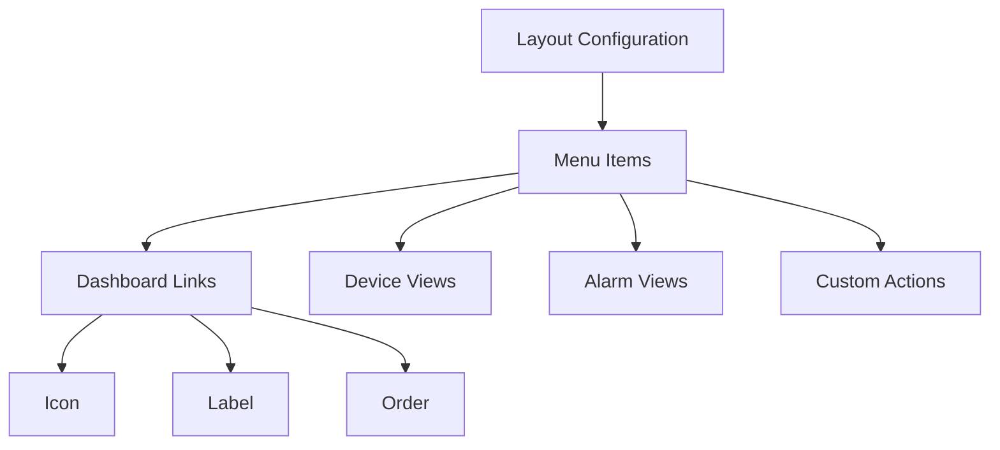
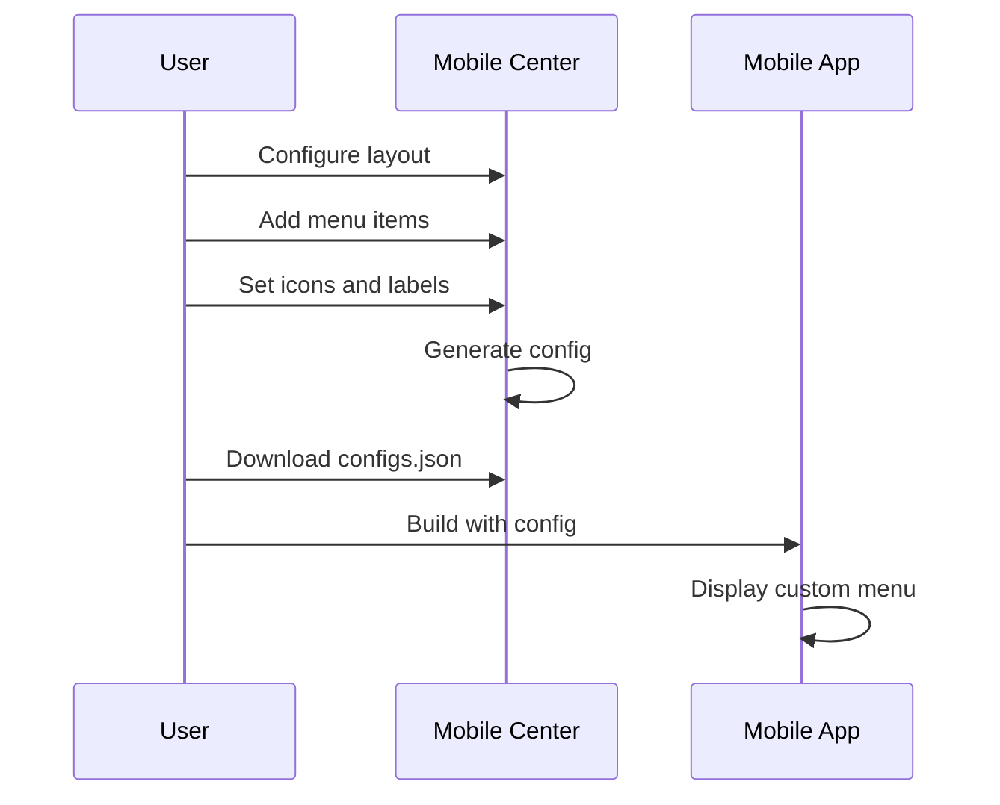
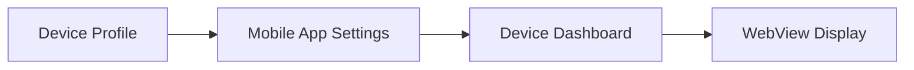
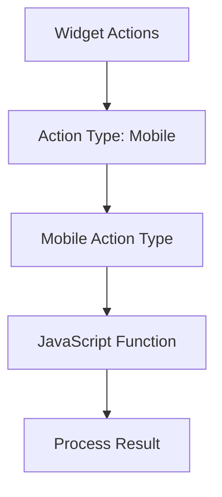
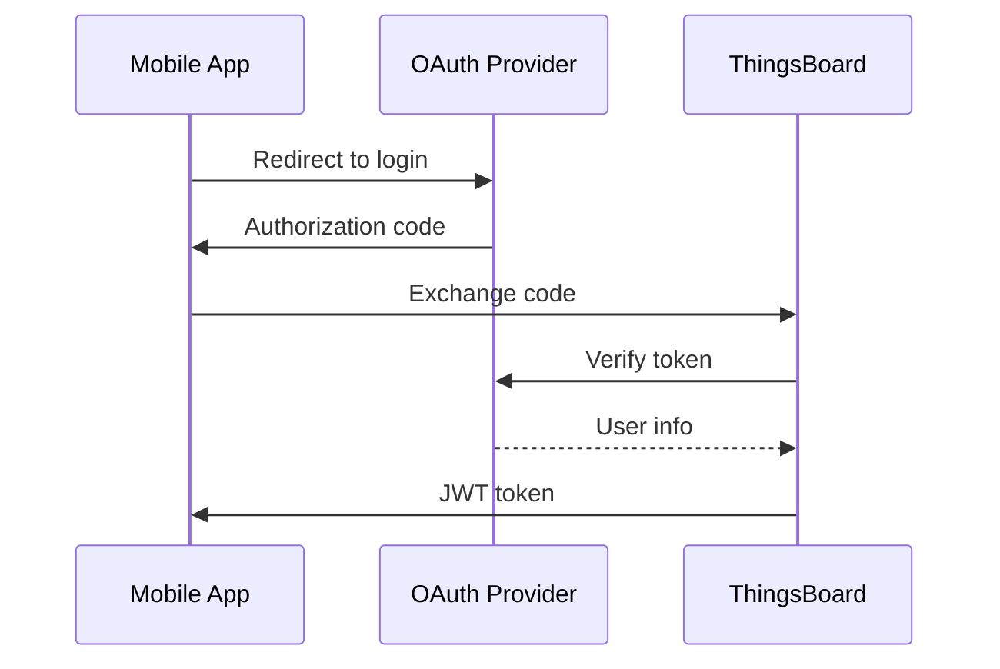
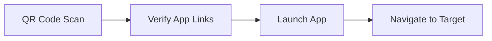

# Mobile App Customization

## Overview

ThingsBoard Mobile Application supports extensive customization without code changes through the Mobile Center configuration. This includes home screen layout, device/alarm dashboards, mobile actions, OAuth providers, and QR code settings.

## Customization Options

### No-Code Customizations

| Area | Configuration |
|------|---------------|
| Home screen | Mobile Center layout |
| Navigation menu | Mobile Center layout |
| Device icons | Device profile |
| Device dashboard | Device profile |
| Alarm dashboard | Mobile app settings |
| OAuth providers | Mobile Center OAuth |
| QR code launch | Mobile Center app config |

### Code-Required Customizations

| Area | Required Changes |
|------|------------------|
| App icon | Replace asset files |
| Splash screen | Replace asset files |
| Color theme | Modify theme files |
| Custom screens | Flutter development |

## Mobile Center Layout

### Navigation Configuration



### Menu Item Settings

| Setting | Description |
|---------|-------------|
| Type | Dashboard, Devices, Alarms, Custom |
| Icon | Material icon name |
| Label | Display text |
| Dashboard ID | Target dashboard (if type=Dashboard) |
| Order | Menu position |

### Layout Configuration Flow



## Device Customization

### Device Icons

Custom device icons are configured in device profiles:

| Setting | Location | Description |
|---------|----------|-------------|
| Icon | Device Profile | Material icon name |
| Icon Color | Device Profile | Hex color code |
| Image | Device Profile | Custom image URL |

### Device Dashboard



Configure the device details dashboard:

| Setting | Description |
|---------|-------------|
| Dashboard | Select from available dashboards |
| State Entity | Use device as state entity |
| Hide Toolbar | Remove dashboard toolbar |

## Alarm Dashboard

Configure alarm details dashboard:

| Setting | Description |
|---------|-------------|
| Dashboard | Select from available dashboards |
| State Entity | Use alarm as state entity |
| Hide Toolbar | Remove dashboard toolbar |

## Mobile Actions

Mobile actions integrate device capabilities with dashboard widgets.

### Action Types

| Action | Description | Process Function |
|--------|-------------|------------------|
| Take Photo | Camera capture | processImage |
| Take Picture from Gallery | Image picker | processImage |
| Scan QR Code | QR scanner | processQrCode |
| Get Phone Location | GPS coordinates | processLocation |
| Make Phone Call | Phone dialer | getPhoneNumber |
| Open Map Location | Show on map | getLocation |
| Open Map Directions | Navigation | getLocation |
| Take Screenshot | Screen capture | processImage |

### Configuration Flow



### Action Configuration

1. Edit dashboard widget
2. Go to **Actions** tab
3. Add new action with Type: **Mobile action**
4. Select **Mobile action type**
5. Configure JavaScript processing function

### Take Photo / Gallery Actions

```javascript
// processImage function
// imageUrl: base64 encoded image data

function processImage(ctx, imageUrl) {
    // Save image as device attribute
    var attributes = [{
        key: 'deviceImage',
        value: imageUrl
    }];
    ctx.attributeService.saveEntityAttributes(
        ctx.stateEntity.entityId,
        'SERVER_SCOPE',
        attributes
    ).subscribe();
}
```

### Scan QR Code Action

```javascript
// processQrCode function
// qrCode: scanned QR code value

function processQrCode(ctx, qrCode) {
    // Parse QR code for device claiming
    var claimData = JSON.parse(qrCode);
    // Use claimData.deviceName, claimData.secretKey
    ctx.deviceService.claimDevice(
        claimData.deviceName,
        claimData.secretKey
    ).subscribe();
}
```

### Get Location Action

```javascript
// processLocation function
// location: {latitude, longitude}

function processLocation(ctx, location) {
    // Save location as device attributes
    var attributes = [
        { key: 'latitude', value: location.latitude },
        { key: 'longitude', value: location.longitude }
    ];
    ctx.attributeService.saveEntityAttributes(
        ctx.stateEntity.entityId,
        'SERVER_SCOPE',
        attributes
    ).subscribe();
}
```

### Get Phone Number Action

```javascript
// getPhoneNumber function
// Return phone number to dial

function getPhoneNumber(ctx) {
    // Get phone number from entity attribute
    var phone = ctx.stateEntity.attributes.phoneNumber;
    return phone;
}
```

### Get Map Location Action

```javascript
// getLocation function
// Return location for map display

function getLocation(ctx) {
    return {
        latitude: ctx.stateEntity.attributes.latitude,
        longitude: ctx.stateEntity.attributes.longitude
    };
}
```

## OAuth 2.0 Configuration

### Supported Providers

| Provider | Configuration |
|----------|---------------|
| Google | Client ID, Client Secret |
| Apple | Service ID, Team ID, Key ID |
| Azure AD | Tenant ID, Client ID |
| Custom | OAuth 2.0 endpoints |

### OAuth Flow



### Configuration Steps

1. Configure OAuth provider in ThingsBoard
2. Enable provider in Mobile Center bundle
3. Map provider to mobile app
4. Download updated configs.json

## QR Code Settings

### QR Code Launch

Configure mobile app to launch from QR code scan:



### iOS Configuration

| Setting | Description |
|---------|-------------|
| App Site Association ID | TeamID.BundleID |
| Team ID | Apple Developer Team ID |
| Bundle ID | Application package name |

### Android Configuration

| Setting | Description |
|---------|-------------|
| SHA-256 Fingerprint | Signing certificate fingerprint |
| Package Name | Application package name |

### SHA-256 Fingerprint Sources

| Distribution | Source |
|--------------|--------|
| Google Play | Play Console > App Integrity > App Signing |
| Local APK | Signing keystore |

## App Icon and Splash Screen

### Icon Replacement

Replace icon files in:

| Platform | Location |
|----------|----------|
| Android | `android/app/src/main/res/mipmap-*` |
| iOS | `ios/Runner/Assets.xcassets/AppIcon.appiconset` |

### Icon Sizes

| Platform | Sizes Required |
|----------|----------------|
| Android | 48, 72, 96, 144, 192 dp |
| iOS | 20, 29, 40, 58, 60, 76, 80, 87, 120, 152, 167, 180, 1024 pt |

### Splash Screen

Replace splash screen assets:

| Platform | Location |
|----------|----------|
| Android | `android/app/src/main/res/drawable` |
| iOS | `ios/Runner/Assets.xcassets/LaunchImage.imageset` |

## White Labeling (PE Only)

### Available Customizations

| Element | Customization |
|---------|---------------|
| Logo | Custom logo image |
| Colors | Primary, accent colors |
| App Name | Display name |
| Domain | Custom API endpoint |

### Configuration

White labeling is configured per tenant in ThingsBoard PE:

1. Navigate to **White Labeling** settings
2. Configure mobile app settings
3. Upload custom assets
4. Apply to tenant

## Localization

### Supported Languages

The app supports multiple languages through Flutter's localization:

| Language | Code |
|----------|------|
| English | en |
| Spanish | es |
| German | de |
| French | fr |
| Portuguese | pt |
| Russian | ru |
| Chinese | zh |

### Adding Languages

1. Add locale to `lib/l10n/` directory
2. Create translation file (e.g., `app_ja.arb`)
3. Add translations for all keys
4. Rebuild app

## Best Practices

### Layout Design

| Practice | Benefit |
|----------|---------|
| Limit menu items | Cleaner navigation |
| Use clear icons | Better recognition |
| Consistent labels | Predictable UX |
| Test on devices | Verify appearance |

### Mobile Actions

| Practice | Benefit |
|----------|---------|
| Validate input | Error prevention |
| Handle errors | Better UX |
| Show feedback | User confidence |
| Test thoroughly | Reliability |

### OAuth Configuration

| Practice | Benefit |
|----------|---------|
| Use PKCE flow | Security |
| Test all providers | Reliability |
| Handle token refresh | Session continuity |
| Provide fallback | Access guarantee |

## See Also

- [Development](./mobile-app-development.md) - Build and release
- [Security](../09-security/README.md) - Authentication
- [Frontend](../10-frontend/README.md) - Dashboard widgets
