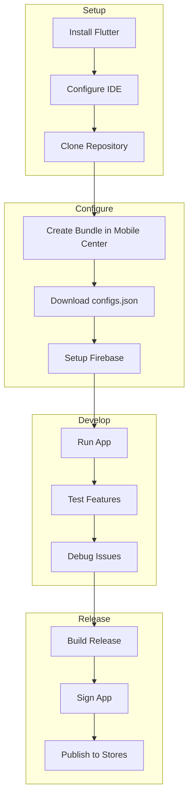
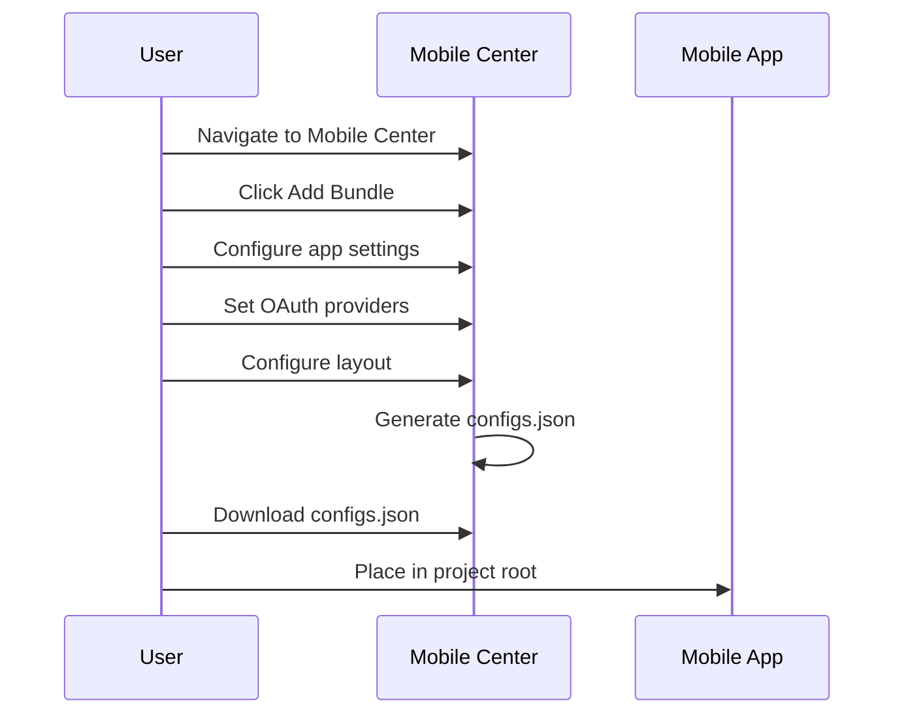
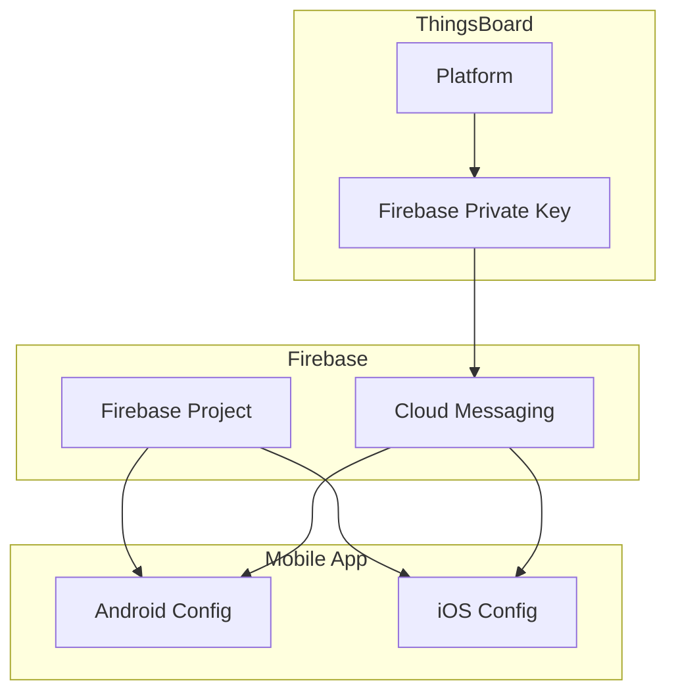
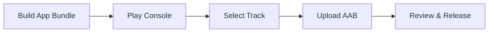
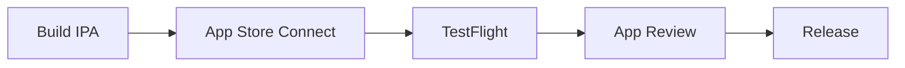

# Mobile App Development

## Overview

This guide covers setting up the development environment, configuring the mobile app through Mobile Center, integrating Firebase for push notifications, and building/releasing the app to app stores.

## Development Workflow



## Prerequisites

### Required Software

| Tool | Purpose | Installation |
|------|---------|--------------|
| Flutter SDK | App framework | flutter.dev/docs/get-started/install |
| Dart SDK | Included with Flutter | Bundled |
| Android Studio | Android development | developer.android.com |
| Xcode | iOS development (macOS only) | Mac App Store |
| VS Code | Recommended IDE | code.visualstudio.com |

### Flutter Version Management

Use FVM (Flutter Version Manager) to manage Flutter versions:

```bash
# Install FVM
dart pub global activate fvm

# Install required Flutter version
fvm install 3.29.0

# Use in project
fvm use 3.29.0

# Run commands with FVM
fvm flutter run
```

### Check Flutter Version

The required Flutter version is in `.fvmrc`:

```json
{
  "flutter": "3.29.0"
}
```

## Project Setup

### Clone Repository

```bash
# Community Edition
git clone https://github.com/thingsboard/flutter_thingsboard_app.git
cd flutter_thingsboard_app

# Professional Edition
git clone https://github.com/thingsboard/flutter_thingsboard_pe_app.git
cd flutter_thingsboard_pe_app
```

### Install Dependencies

```bash
flutter pub get
```

## Mobile Center Configuration

### Create Bundle



### Bundle Settings

| Tab | Settings |
|-----|----------|
| Basic | Bundle title, Android/iOS apps |
| OAuth | External authentication providers |
| Layout | Navigation menu configuration |
| Self Registration | Customer signup (PE only) |

### Application Settings

| Field | Description |
|-------|-------------|
| Application Package | Unique app identifier (e.g., com.company.iotapp) |
| Application Secret | Auto-generated authentication secret |
| Status | Published, Draft, Deprecated |
| Min Version | Minimum supported app version |
| Latest Version | Current release version |
| Store Link | Google Play / App Store URL |

### Android-Specific Settings

| Field | Description |
|-------|-------------|
| SHA-256 Fingerprints | Signing certificate fingerprints |
| Store Link | Google Play Store URL |

### iOS-Specific Settings

| Field | Description |
|-------|-------------|
| App ID | Apple App ID |
| App Site Association ID | TeamID.BundleID |
| Store Link | App Store URL |

## Firebase Integration

### Overview

Firebase Cloud Messaging (FCM) enables push notifications from ThingsBoard to the mobile app.



### Step 1: Create Firebase Project

1. Go to [Firebase Console](https://console.firebase.google.com/)
2. Click **Create a project**
3. Enter project name
4. Enable/disable Google Analytics
5. Click **Create project**

### Step 2: Enable Cloud Messaging

1. Navigate to **Project Settings** > **Cloud Messaging**
2. Ensure Firebase Cloud Messaging API is enabled

### Step 3: Generate Private Key

1. Go to **Project Settings** > **Service accounts**
2. Select **Java** in Admin SDK configuration
3. Click **Generate new private key**
4. Download and save the JSON file

### Step 4: Upload Key to ThingsBoard

1. Log in to ThingsBoard as System Administrator
2. Navigate to **Settings** > **Notifications**
3. Upload the private key file
4. Click **Save**

### Step 5: Add Firebase to Mobile App

Run FlutterFire CLI:

```bash
# Install FlutterFire CLI
dart pub global activate flutterfire_cli

# Configure Firebase
flutterfire configure
```

This generates:
- `lib/firebase_options.dart`
- `android/app/google-services.json`
- `ios/Runner/GoogleService-Info.plist`

### iOS-Specific: APNs Configuration

1. Create APNs authentication key in Apple Developer Portal
2. In Firebase Console, go to **Cloud Messaging** > **Apple app configuration**
3. Upload APNs authentication key
4. Enter Key ID and Team ID

## Running the App

### Development Mode

```bash
# Run with configuration
flutter run --dart-define-from-file configs.json

# Hot reload (press 'r' in terminal)
```

### Debug on Specific Device

```bash
# List available devices
flutter devices

# Run on specific device
flutter run -d <device_id> --dart-define-from-file configs.json
```

## Building for Release

### iOS Build

```bash
# Build IPA for App Store
flutter build ipa --no-tree-shake-icons --dart-define-from-file configs.json
```

Output: `build/ios/ipa/*.ipa`

### Android Build

```bash
# Build App Bundle for Google Play
flutter build appbundle --no-tree-shake-icons --dart-define-from-file configs.json

# Build APK for direct distribution
flutter build apk --no-tree-shake-icons --dart-define-from-file configs.json
```

Output:
- App Bundle: `build/app/outputs/bundle/release/*.aab`
- APK: `build/app/outputs/flutter-apk/*.apk`

### Build Flags

| Flag | Purpose |
|------|---------|
| `--no-tree-shake-icons` | Keep all icons for notifications |
| `--dart-define-from-file` | Load configuration from JSON |
| `--release` | Optimize for production |

## App Signing

### Android Signing

1. Create keystore:
```bash
keytool -genkey -v -keystore upload-keystore.jks -keyalg RSA -keysize 2048 -validity 10000 -alias upload
```

2. Create `android/key.properties`:
```properties
storePassword=<password>
keyPassword=<password>
keyAlias=upload
storeFile=<path-to-keystore>
```

3. Configure `android/app/build.gradle`

### iOS Signing

1. Open Xcode project
2. Select Runner target
3. Configure Signing & Capabilities
4. Select Development Team
5. Set Bundle Identifier

## Publishing

### Google Play Store



1. Create app in Google Play Console
2. Complete store listing
3. Upload app bundle to testing track
4. Test with internal/closed testing
5. Promote to production

### Apple App Store



1. Create app in App Store Connect
2. Upload IPA via Xcode/Transporter
3. Configure TestFlight for testing
4. Submit for App Review
5. Release to App Store

## Troubleshooting

### Common Issues

| Issue | Cause | Solution |
|-------|-------|----------|
| Build fails | Wrong Flutter version | Use FVM with correct version |
| Sign-in fails | Version mismatch | Check compatibility matrix |
| Notifications disabled | Firebase misconfigured | Re-run flutterfire configure |
| Dashboard not loading | WebView issue | Check platform logs |

### Flutter Version Issues

```bash
# Check current version
flutter --version

# Switch version with FVM
fvm use 3.29.0

# Verify .fvmrc
cat .fvmrc
```

### Firebase Issues

```bash
# Regenerate Firebase config
rm lib/firebase_options.dart
flutterfire configure
```

### Build Issues

```bash
# Clean build
flutter clean
flutter pub get
flutter build <platform> --dart-define-from-file configs.json
```

### iOS Specific

```bash
# Clean iOS build
cd ios
rm -rf Pods
rm Podfile.lock
pod install
cd ..
flutter build ios
```

### Android Specific

```bash
# Clean Android build
cd android
./gradlew clean
cd ..
flutter build apk
```

## Project Structure

```
flutter_thingsboard_app/
├── android/                 # Android native code
├── ios/                     # iOS native code
├── lib/
│   ├── core/               # Core utilities
│   ├── generated/          # Generated code
│   ├── l10n/               # Localization
│   ├── modules/            # Feature modules
│   ├── utils/              # Utilities
│   ├── widgets/            # Reusable widgets
│   ├── firebase_options.dart
│   └── main.dart           # App entry point
├── configs.json            # Mobile Center config
├── pubspec.yaml            # Dependencies
└── .fvmrc                  # Flutter version
```

## Environment Configuration

### Multiple Configurations

Maintain separate configs for different environments:

```bash
# Development
flutter run --dart-define-from-file configs-dev.json

# Staging
flutter run --dart-define-from-file configs-staging.json

# Production
flutter build appbundle --dart-define-from-file configs-prod.json
```

### Config File Structure

```json
{
  "thingsboardApiEndpoint": "https://your-instance.com",
  "appSecret": "your-app-secret",
  "bundleId": "your-bundle-id"
}
```

## Best Practices

### Development

| Practice | Benefit |
|----------|---------|
| Use FVM | Consistent Flutter versions |
| Test on real devices | Accurate behavior |
| Use debug builds | Faster iteration |
| Log extensively | Easier debugging |

### Release

| Practice | Benefit |
|----------|---------|
| Test all features | Quality assurance |
| Use staged rollout | Risk mitigation |
| Monitor crashes | Quick response |
| Version properly | Clear tracking |

### Security

| Practice | Benefit |
|----------|---------|
| Never commit secrets | Security |
| Use environment configs | Flexibility |
| Enable ProGuard/obfuscation | Code protection |
| Sign releases properly | Store requirements |

## See Also

- [Customization](./mobile-app-customization.md) - UI customization
- [Security](../09-security/README.md) - Authentication
- [API Layer](../06-api-layer/README.md) - REST API
