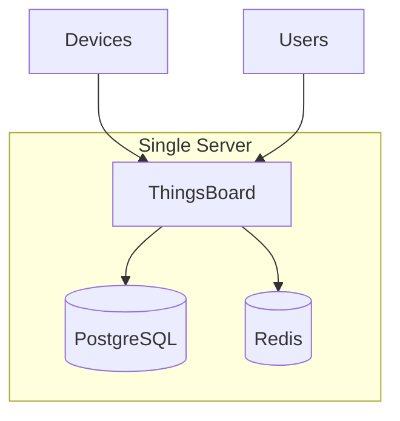
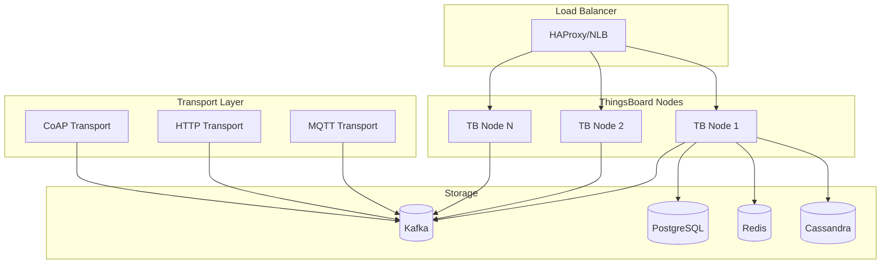
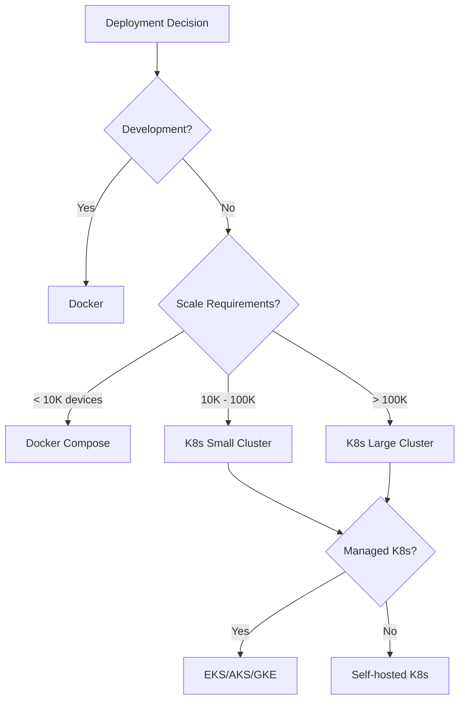
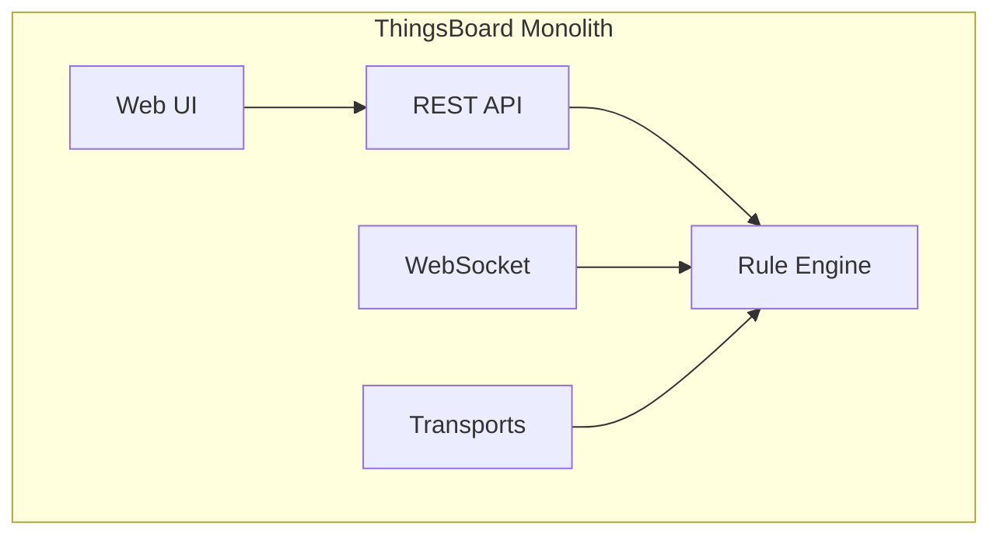
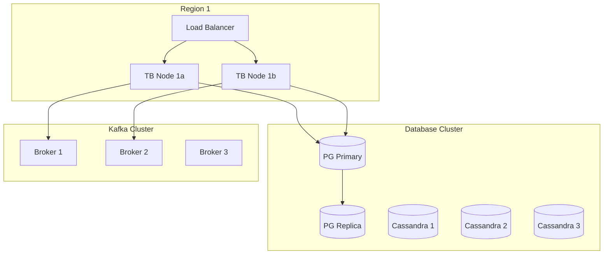
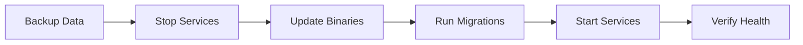

# Deployment & Operations

## Overview

ThingsBoard supports multiple deployment options from single-node Docker containers to large-scale Kubernetes clusters. This section covers installation options, configuration management, and operational monitoring.

## Contents

| Document | Description |
|----------|-------------|
| [Installation Options](./installation-options.md) | Deployment methods, cloud platforms, cluster setup |
| [Configuration](./configuration.md) | Environment variables, service parameters |
| [Monitoring & Operations](./monitoring-operations.md) | Health checks, metrics, troubleshooting |

## Deployment Architecture

### Single Node (Monolithic)

### Cluster (Microservices)

## Installation Options

### By Environment

| Option | Description | Use Case |
|--------|-------------|----------|
| Docker | Single container | Development, testing |
| Docker Compose | Multi-container stack | Small deployments |
| Kubernetes | Orchestrated cluster | Production at scale |
| Bare Metal | Direct installation | Maximum control |

### By Cloud Platform

| Platform | Deployment Method |
|----------|-------------------|
| AWS | EKS, EC2, Self-hosted |
| Azure | AKS, VMs, Self-hosted |
| GCP | GKE, Compute Engine |
| Digital Ocean | Kubernetes, Droplets |
| Alibaba Cloud | Container Service |

### Deployment Decision Matrix

## Configuration Overview

### Configuration Methods

| Method | Location | Use Case |
|--------|----------|----------|
| Environment Variables | Shell/Docker | Recommended |
| YAML Files | conf/thingsboard.yml | Windows |
| Kubernetes ConfigMaps | K8s manifests | K8s deployments |

### Configuration Categories

| Category | Examples |
|----------|----------|
| Server | HTTP port, SSL, WebSocket |
| Database | PostgreSQL, Cassandra connections |
| Queue | Kafka brokers, partitions |
| Transport | MQTT, CoAP, HTTP settings |
| Security | JWT, rate limits, tenant isolation |
| Cache | Redis configuration |

## Service Architecture

### Monolithic Services

### Microservices

| Service | Purpose | Scalable |
|---------|---------|----------|
| tb-node | Core processing | Yes |
| tb-mqtt-transport | MQTT protocol | Yes |
| tb-http-transport | HTTP protocol | Yes |
| tb-coap-transport | CoAP protocol | Yes |
| tb-lwm2m-transport | LwM2M protocol | Yes |
| tb-snmp-transport | SNMP protocol | Yes |
| tb-rule-engine | Rule processing | Yes |
| tb-web-ui | Frontend serving | Yes |

## Infrastructure Requirements

### Minimum (Development)

| Resource | Requirement |
|----------|-------------|
| CPU | 2 cores |
| RAM | 4 GB |
| Storage | 20 GB SSD |
| Database | PostgreSQL |

### Recommended (Production)

| Resource | Single Node | Cluster Node |
|----------|-------------|--------------|
| CPU | 8+ cores | 4+ cores |
| RAM | 16+ GB | 8+ GB |
| Storage | 100+ GB SSD | 50+ GB SSD |
| Network | 1 Gbps | 1 Gbps |

### Database Requirements

| Database | Use | Storage Estimate |
|----------|-----|------------------|
| PostgreSQL | Entities, relations | 1 GB per 100K entities |
| Cassandra | Time series | 10 GB per 1M data points |
| Redis | Cache, sessions | 1 GB per 100K sessions |
| Kafka | Message queue | Based on retention |

## High Availability

### HA Architecture

### HA Considerations

| Component | HA Strategy |
|-----------|-------------|
| ThingsBoard | Multiple nodes behind LB |
| PostgreSQL | Primary-replica replication |
| Cassandra | Multi-node cluster |
| Kafka | Multi-broker cluster |
| Redis | Cluster or Sentinel |

## Security Hardening

| Area | Recommendations |
|------|-----------------|
| Network | VPC, security groups, firewall |
| TLS | Enable SSL for all endpoints |
| Authentication | Strong passwords, MFA |
| Authorization | Least privilege, tenant isolation |
| Secrets | Use secret management (Vault, K8s secrets) |
| Updates | Regular security patches |

## Backup Strategy

| Component | Backup Method | Frequency |
|-----------|---------------|-----------|
| PostgreSQL | pg_dump, streaming replication | Daily + continuous |
| Cassandra | Snapshots, incremental | Daily |
| Configuration | Version control | On change |
| Kafka | Topic mirroring | Continuous |

## Upgrade Process

### Upgrade Steps

1. Review release notes
2. Backup all databases
3. Stop ThingsBoard services
4. Update application files
5. Run database migrations
6. Start services
7. Verify functionality

## Monitoring Overview

### Key Metrics

| Category | Metrics |
|----------|---------|
| System | CPU, memory, disk, network |
| Application | Requests, errors, latency |
| Database | Connections, queries, replication lag |
| Queue | Consumer lag, throughput |
| Devices | Connected, messages/sec |

### Health Endpoints

| Endpoint | Purpose |
|----------|---------|
| `/health` | Overall health |
| `/ready` | Readiness probe |
| `/metrics` | Prometheus metrics |

## See Also

- [Architecture](../01-architecture/README.md) - System design
- [Message Queue](../08-message-queue/README.md) - Kafka configuration
- [Microservices](../11-microservices/README.md) - Service types
- [Security](../09-security/README.md) - Security configuration
