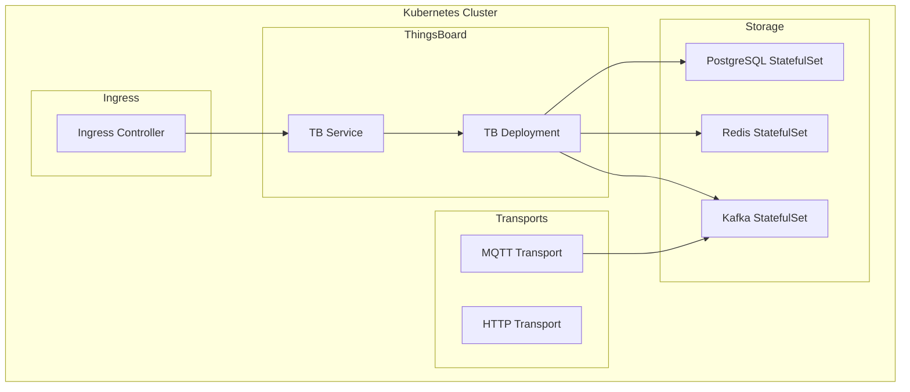
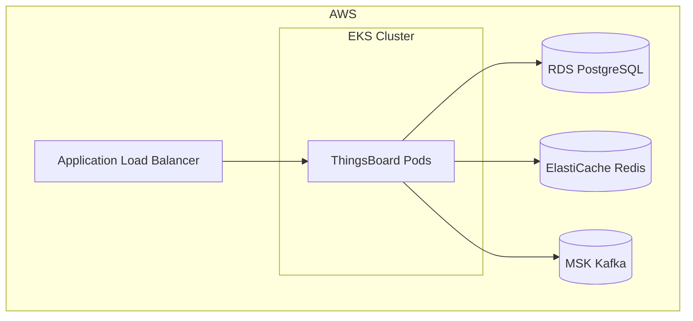
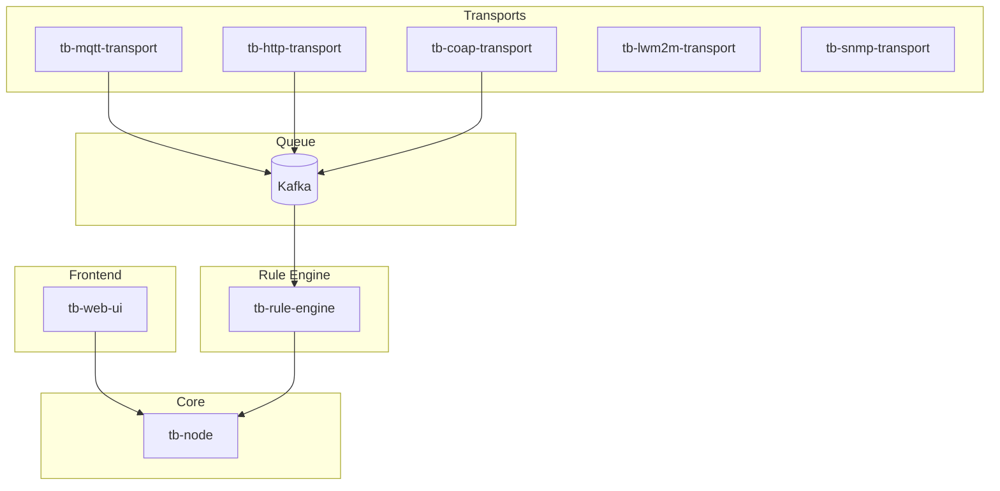
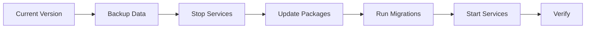

# Installation Options

## Overview

ThingsBoard can be deployed using various methods depending on scale requirements, infrastructure preferences, and operational expertise. This guide covers all deployment options from development environments to production clusters.

## Deployment Methods

### Quick Comparison

| Method | Complexity | Scale | Best For |
|--------|------------|-------|----------|
| Docker | Low | Dev/Test | Quick start, development |
| Docker Compose | Low | Small | < 10K devices |
| Kubernetes | Medium | Large | Production at scale |
| Bare Metal | High | Any | Maximum control |

## Docker Deployment

### Single Container

Simplest deployment for development and testing:

```bash
# Pull and run ThingsBoard
docker run -it -p 8080:8080 -p 1883:1883 \
  -v ~/.tb-data:/data \
  --name thingsboard \
  thingsboard/tb-postgres
```

### Docker Images

| Image | Database | Use Case |
|-------|----------|----------|
| `thingsboard/tb-postgres` | PostgreSQL | Most common |
| `thingsboard/tb-cassandra` | Cassandra | High-volume time series |
| `thingsboard/tb` | External DB | Custom database |

### Volumes

| Path | Purpose |
|------|---------|
| `/data` | Database, logs, extensions |
| `/var/log/thingsboard` | Application logs |

### Environment Variables

```bash
docker run -e TB_QUEUE_TYPE=kafka \
  -e TB_KAFKA_SERVERS=kafka:9092 \
  -e SPRING_DATASOURCE_URL=jdbc:postgresql://postgres:5432/thingsboard \
  thingsboard/tb-postgres
```

## Docker Compose Deployment

### Basic Stack

```yaml
version: '3.0'
services:
  thingsboard:
    image: thingsboard/tb-postgres
    ports:
      - "8080:8080"
      - "1883:1883"
      - "7070:7070"
      - "5683-5688:5683-5688/udp"
    environment:
      TB_QUEUE_TYPE: in-memory
    volumes:
      - tb-data:/data
      - tb-logs:/var/log/thingsboard

volumes:
  tb-data:
  tb-logs:
```

### Production Stack with External Services

```yaml
version: '3.0'
services:
  postgres:
    image: postgres:15
    environment:
      POSTGRES_DB: thingsboard
      POSTGRES_USER: thingsboard
      POSTGRES_PASSWORD: password
    volumes:
      - postgres-data:/var/lib/postgresql/data

  redis:
    image: redis:7-alpine
    volumes:
      - redis-data:/data

  kafka:
    image: bitnami/kafka:3.5
    environment:
      KAFKA_CFG_ZOOKEEPER_CONNECT: zookeeper:2181
      ALLOW_PLAINTEXT_LISTENER: "yes"
    depends_on:
      - zookeeper

  zookeeper:
    image: bitnami/zookeeper:3.8
    environment:
      ALLOW_ANONYMOUS_LOGIN: "yes"

  thingsboard:
    image: thingsboard/tb-postgres
    depends_on:
      - postgres
      - redis
      - kafka
    environment:
      TB_QUEUE_TYPE: kafka
      TB_KAFKA_SERVERS: kafka:9092
      SPRING_DATASOURCE_URL: jdbc:postgresql://postgres:5432/thingsboard
      SPRING_DATASOURCE_USERNAME: thingsboard
      SPRING_DATASOURCE_PASSWORD: password
      CACHE_TYPE: redis
      REDIS_HOST: redis
    ports:
      - "8080:8080"
      - "1883:1883"
```

## Kubernetes Deployment

### Deployment Architecture



### Helm Chart

```bash
# Add ThingsBoard Helm repo
helm repo add thingsboard https://thingsboard.github.io/helm

# Install ThingsBoard
helm install thingsboard thingsboard/thingsboard \
  --namespace thingsboard \
  --create-namespace \
  --values values.yaml
```

### Sample values.yaml

```yaml
replicaCount: 3

image:
  repository: thingsboard/tb-node
  tag: "3.6.0"

resources:
  requests:
    memory: "2Gi"
    cpu: "1000m"
  limits:
    memory: "4Gi"
    cpu: "2000m"

postgresql:
  enabled: true
  primary:
    persistence:
      size: 50Gi

redis:
  enabled: true
  architecture: standalone

kafka:
  enabled: true
  replicaCount: 3
```

### Managed Kubernetes

| Platform | Service | Deployment |
|----------|---------|------------|
| AWS | EKS | Helm + ALB Ingress |
| Azure | AKS | Helm + Azure Ingress |
| GCP | GKE | Helm + GCE Ingress |

## Bare Metal Installation

### Ubuntu/Debian

```bash
# Add repository
sudo apt-get install -y gnupg2
wget -O - https://repo.thingsboard.io/debian/KEYS | sudo apt-key add -
echo "deb https://repo.thingsboard.io/debian thingsboard main" | \
  sudo tee /etc/apt/sources.list.d/thingsboard.list

# Install
sudo apt-get update
sudo apt-get install thingsboard

# Configure
sudo nano /etc/thingsboard/conf/thingsboard.conf

# Initialize database
sudo /usr/share/thingsboard/bin/install/install.sh

# Start service
sudo systemctl start thingsboard
sudo systemctl enable thingsboard
```

### RHEL/CentOS

```bash
# Add repository
cat <<EOF | sudo tee /etc/yum.repos.d/thingsboard.repo
[thingsboard]
name=ThingsBoard Repository
baseurl=https://repo.thingsboard.io/rpm/
gpgcheck=0
enabled=1
EOF

# Install
sudo yum install thingsboard

# Configure and start
sudo /usr/share/thingsboard/bin/install/install.sh
sudo systemctl start thingsboard
```

### Windows

1. Download installer from thingsboard.io
2. Run installer as Administrator
3. Configure database connection
4. Run database installation script
5. Start ThingsBoard service

## Cloud Platform Deployments

### AWS



| Service | AWS Resource |
|---------|--------------|
| Compute | EKS, EC2 |
| Database | RDS PostgreSQL |
| Cache | ElastiCache Redis |
| Queue | MSK (Kafka) |
| Storage | EBS, S3 |
| Load Balancer | ALB, NLB |

### Azure

| Service | Azure Resource |
|---------|----------------|
| Compute | AKS, VMs |
| Database | Azure Database for PostgreSQL |
| Cache | Azure Cache for Redis |
| Queue | Event Hubs (Kafka API) |
| Storage | Managed Disks |
| Load Balancer | Azure Load Balancer |

### GCP

| Service | GCP Resource |
|---------|--------------|
| Compute | GKE, Compute Engine |
| Database | Cloud SQL |
| Cache | Memorystore |
| Queue | Cloud Pub/Sub |
| Storage | Persistent Disks |
| Load Balancer | Cloud Load Balancing |

## Microservices Deployment

### Service Components



### Scaling Services

| Service | Scaling Factor |
|---------|----------------|
| tb-node | Concurrent users, API calls |
| tb-mqtt-transport | MQTT connections |
| tb-http-transport | HTTP requests |
| tb-rule-engine | Message throughput |

### Docker Compose Microservices

```yaml
services:
  tb-node:
    image: thingsboard/tb-node
    deploy:
      replicas: 2
    environment:
      TB_SERVICE_TYPE: tb-node
      TB_QUEUE_TYPE: kafka

  tb-mqtt-transport:
    image: thingsboard/tb-mqtt-transport
    deploy:
      replicas: 2
    ports:
      - "1883:1883"

  tb-http-transport:
    image: thingsboard/tb-http-transport
    deploy:
      replicas: 2
    ports:
      - "8081:8080"

  tb-rule-engine:
    image: thingsboard/tb-rule-engine
    deploy:
      replicas: 2
    environment:
      TB_SERVICE_TYPE: tb-rule-engine
```

## Database Options

### PostgreSQL (Required)

Used for entity storage, authentication, configuration:

| Deployment | Setup |
|------------|-------|
| Docker | PostgreSQL container |
| Kubernetes | StatefulSet or managed |
| Bare Metal | PostgreSQL installation |
| Cloud | RDS, Cloud SQL, Azure DB |

### Cassandra (Optional)

Used for high-volume time series data:

| When to Use | Description |
|-------------|-------------|
| > 1M data points/day | High write throughput |
| Long retention | Efficient storage |
| Horizontal scaling | Linear scalability |

### Redis (Recommended)

Used for caching and sessions:

| Benefit | Description |
|---------|-------------|
| Performance | Faster data access |
| Session sharing | Multi-node support |
| Rate limiting | Request throttling |

## Post-Installation

### Database Initialization

```bash
# Run installation script
sudo /usr/share/thingsboard/bin/install/install.sh

# Or with specific database type
sudo /usr/share/thingsboard/bin/install/install.sh --loadDemo
```

### Verify Installation

```bash
# Check service status
sudo systemctl status thingsboard

# Check logs
sudo journalctl -u thingsboard -f

# Test HTTP endpoint
curl http://localhost:8080/api/v1/status
```

### Initial Login

| URL | Default Credentials |
|-----|---------------------|
| `http://localhost:8080` | sysadmin@thingsboard.org / sysadmin |

## Upgrade Considerations

### Upgrade Path



### Pre-Upgrade Checklist

| Step | Action |
|------|--------|
| 1 | Review release notes |
| 2 | Backup PostgreSQL database |
| 3 | Backup Cassandra (if used) |
| 4 | Backup configuration files |
| 5 | Test in staging environment |

## See Also

- [Configuration](./configuration.md) - Configuration parameters
- [Monitoring](./monitoring-operations.md) - Operations and monitoring
- [Architecture](../01-architecture/README.md) - System design
