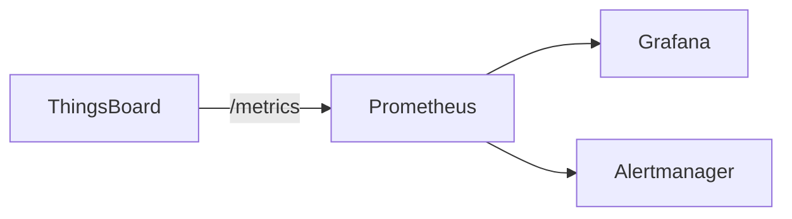
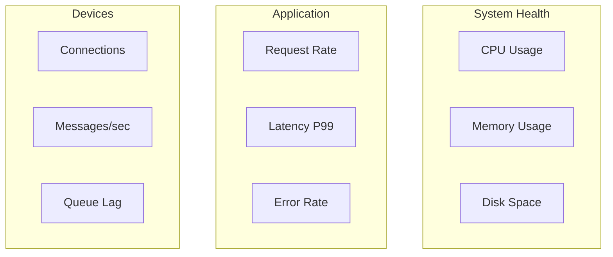
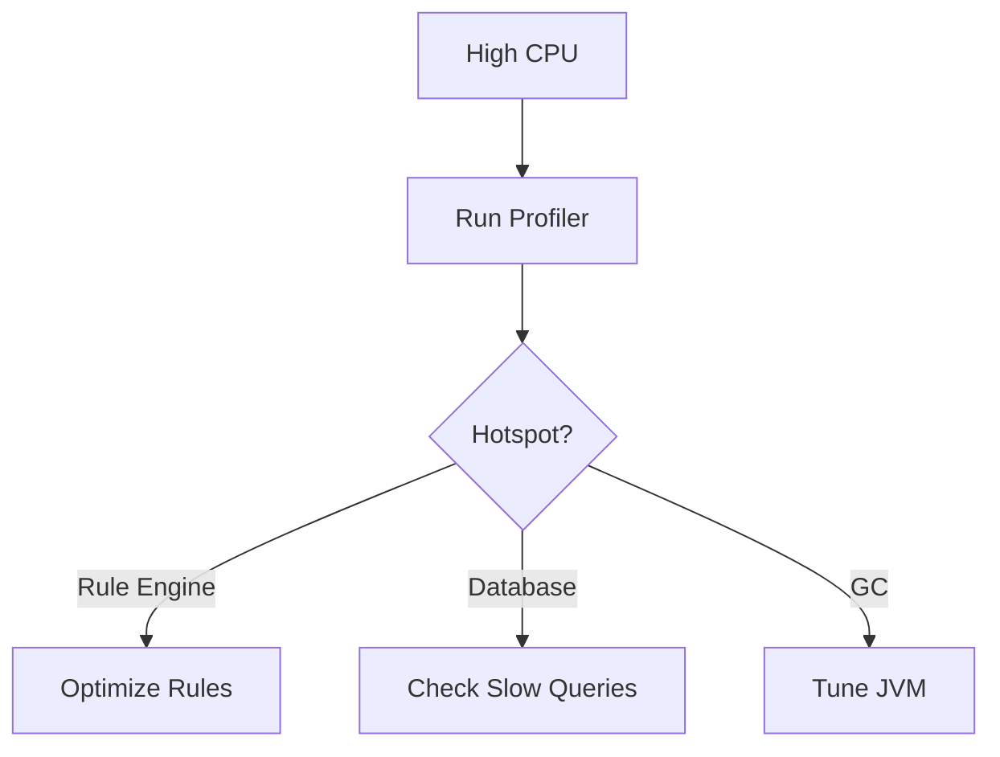
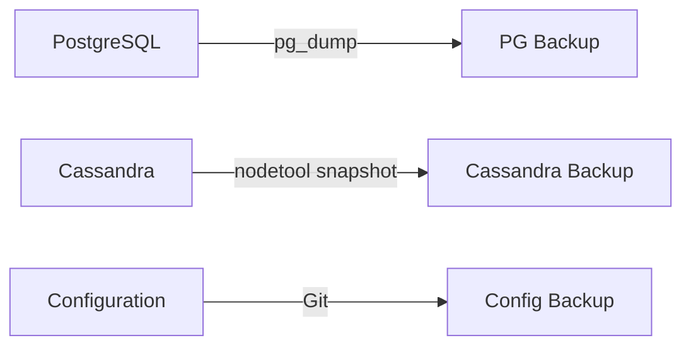

# Monitoring & Operations

## Overview

Effective monitoring and operations are critical for maintaining a healthy ThingsBoard deployment. This guide covers health checks, metrics collection, log management, and troubleshooting procedures.

## Health Endpoints

### Available Endpoints

| Endpoint | Purpose | Response |
|----------|---------|----------|
| `/health` | Overall health | UP/DOWN |
| `/ready` | Readiness probe | Ready/Not Ready |
| `/metrics` | Prometheus metrics | Metrics data |

### Health Check Configuration

```yaml
# Kubernetes liveness probe
livenessProbe:
  httpGet:
    path: /health
    port: 8080
  initialDelaySeconds: 120
  periodSeconds: 30
  failureThreshold: 3

# Kubernetes readiness probe
readinessProbe:
  httpGet:
    path: /ready
    port: 8080
  initialDelaySeconds: 60
  periodSeconds: 10
```

### Health Response

```json
{
  "status": "UP",
  "components": {
    "db": {"status": "UP"},
    "diskSpace": {"status": "UP"},
    "ping": {"status": "UP"}
  }
}
```

## Metrics

### Prometheus Integration



### Key Metrics Categories

| Category | Metrics |
|----------|---------|
| JVM | Memory, GC, threads |
| HTTP | Requests, latency, errors |
| Database | Connections, queries |
| Queue | Consumer lag, throughput |
| Devices | Connections, messages |
| Rule Engine | Processing rate, errors |

### JVM Metrics

| Metric | Description |
|--------|-------------|
| `jvm_memory_used_bytes` | Memory usage |
| `jvm_memory_max_bytes` | Maximum memory |
| `jvm_gc_pause_seconds` | GC pause duration |
| `jvm_threads_current` | Thread count |

### HTTP Metrics

| Metric | Description |
|--------|-------------|
| `http_server_requests_seconds` | Request latency |
| `http_server_requests_total` | Request count |
| `http_server_errors_total` | Error count |

### Device Metrics

| Metric | Description |
|--------|-------------|
| `tb_transport_sessions` | Active sessions |
| `tb_transport_messages_received` | Messages received |
| `tb_transport_messages_sent` | Messages sent |

### Rule Engine Metrics

| Metric | Description |
|--------|-------------|
| `tb_rule_engine_queue_size` | Queue depth |
| `tb_rule_engine_messages_processed` | Processed messages |
| `tb_rule_engine_processing_time` | Processing duration |

## Grafana Dashboards

### Recommended Panels



### Sample Dashboard JSON

```json
{
  "panels": [
    {
      "title": "Active Device Sessions",
      "type": "stat",
      "targets": [{
        "expr": "sum(tb_transport_sessions)"
      }]
    },
    {
      "title": "Messages per Second",
      "type": "graph",
      "targets": [{
        "expr": "rate(tb_transport_messages_received[1m])"
      }]
    }
  ]
}
```

## Logging

### Log Locations

| Deployment | Location |
|------------|----------|
| Linux | `/var/log/thingsboard/` |
| Docker | Container stdout/stderr |
| Kubernetes | Pod logs |

### Log Files

| File | Content |
|------|---------|
| `thingsboard.log` | Application logs |
| `gc.log` | JVM garbage collection |
| `install.log` | Installation logs |

### Log Configuration

```bash
# Set log level via environment
export LOGGING_LEVEL_ORG_THINGSBOARD=INFO
export LOGGING_LEVEL_ROOT=WARN

# Log file location
export LOGS_FOLDER=/var/log/thingsboard
```

### Structured Logging

```json
{
  "timestamp": "2024-01-15T10:30:00.000Z",
  "level": "INFO",
  "logger": "o.t.s.c.r.RuleChainActorMessageProcessor",
  "message": "Processing message",
  "tenantId": "abc123",
  "ruleChainId": "def456"
}
```

### Log Aggregation


## Alerting

### Critical Alerts

| Alert | Condition | Severity |
|-------|-----------|----------|
| Service Down | health != UP | Critical |
| High CPU | CPU > 90% for 5m | Warning |
| High Memory | Memory > 85% | Warning |
| Database Connection | Connections = 0 | Critical |
| Queue Lag | Lag > 10000 for 5m | Warning |

### Prometheus Alert Rules

```yaml
groups:
  - name: thingsboard
    rules:
      - alert: ThingsBoardDown
        expr: up{job="thingsboard"} == 0
        for: 1m
        labels:
          severity: critical
        annotations:
          summary: "ThingsBoard instance is down"

      - alert: HighMemoryUsage
        expr: jvm_memory_used_bytes / jvm_memory_max_bytes > 0.85
        for: 5m
        labels:
          severity: warning
        annotations:
          summary: "High memory usage detected"

      - alert: QueueLagHigh
        expr: kafka_consumer_lag > 10000
        for: 5m
        labels:
          severity: warning
        annotations:
          summary: "Kafka consumer lag is high"
```

## Performance Tuning

### JVM Settings

```bash
# Recommended JVM settings for production
export JAVA_OPTS="-Xms2g -Xmx4g \
  -XX:+UseG1GC \
  -XX:MaxGCPauseMillis=200 \
  -XX:+HeapDumpOnOutOfMemoryError \
  -XX:HeapDumpPath=/var/log/thingsboard"
```

### Database Tuning

| Parameter | Recommendation |
|-----------|----------------|
| Connection pool | Match node count × threads |
| Statement timeout | 30-60 seconds |
| Vacuum | Regular autovacuum |
| Indexes | Monitor slow queries |

### Kafka Tuning

| Parameter | Recommendation |
|-----------|----------------|
| Partitions | Match consumer count |
| Replication | 3 for production |
| Retention | Based on recovery needs |
| Consumer threads | Match partition count |

## Troubleshooting

### Common Issues

#### High CPU Usage



**Diagnostic Steps:**
1. Check thread dumps: `jstack <pid>`
2. Review rule chain complexity
3. Check for blocking database queries
4. Monitor GC activity

#### High Memory Usage

**Diagnostic Steps:**
1. Generate heap dump: `jmap -dump:format=b,file=heap.hprof <pid>`
2. Analyze with Eclipse MAT
3. Check for memory leaks
4. Review cache settings

#### Connection Issues

| Symptom | Possible Cause | Solution |
|---------|----------------|----------|
| Can't connect | Firewall | Check security groups |
| Timeout | Network latency | Increase timeouts |
| Connection refused | Service down | Check service status |
| SSL errors | Certificate | Verify certificate chain |

### Diagnostic Commands

```bash
# Check service status
sudo systemctl status thingsboard

# View logs
sudo journalctl -u thingsboard -f --since "1 hour ago"

# Check connections
netstat -an | grep 8080

# Test endpoint
curl -v http://localhost:8080/api/v1/status

# JVM info
jinfo <pid>

# Thread dump
jstack <pid> > threads.txt

# Heap dump
jmap -dump:format=b,file=heap.hprof <pid>
```

### Debug Mode

Enable debug logging temporarily:

```bash
# Via environment variable
export LOGGING_LEVEL_ORG_THINGSBOARD=DEBUG

# Via REST API (admin only)
curl -X POST "http://localhost:8080/api/admin/logs/debug" \
  -H "X-Authorization: Bearer $TOKEN"
```

## Backup and Recovery

### Backup Strategy



### PostgreSQL Backup

```bash
# Full backup
pg_dump -h localhost -U thingsboard thingsboard > backup.sql

# Compressed backup
pg_dump -h localhost -U thingsboard thingsboard | gzip > backup.sql.gz

# Restore
psql -h localhost -U thingsboard thingsboard < backup.sql
```

### Cassandra Backup

```bash
# Create snapshot
nodetool snapshot thingsboard

# Find snapshots
find /var/lib/cassandra/data -name snapshots

# Restore from snapshot
# Copy snapshot files to data directory
# Run nodetool refresh
```

### Recovery Procedure

1. Stop ThingsBoard services
2. Restore database backups
3. Verify configuration
4. Start services
5. Validate data integrity

## Operational Runbooks

### Service Restart

```bash
# Linux
sudo systemctl restart thingsboard

# Docker
docker restart thingsboard

# Kubernetes
kubectl rollout restart deployment/thingsboard
```

### Scale Operations

```bash
# Docker Compose
docker-compose up -d --scale tb-node=3

# Kubernetes
kubectl scale deployment thingsboard --replicas=3
```

### Certificate Renewal

1. Obtain new certificate
2. Update certificate files
3. Restart service
4. Verify SSL connection

## Capacity Planning

### Sizing Guidelines

| Devices | CPU | Memory | Storage |
|---------|-----|--------|---------|
| 1K | 2 cores | 4 GB | 20 GB |
| 10K | 4 cores | 8 GB | 100 GB |
| 100K | 8 cores | 16 GB | 500 GB |
| 1M | 16+ cores | 32+ GB | 2+ TB |

### Growth Indicators

| Metric | Action Threshold |
|--------|------------------|
| CPU utilization | > 70% sustained |
| Memory usage | > 80% |
| Disk usage | > 75% |
| Queue lag | > 5000 |
| Response time P99 | > 2 seconds |

## See Also

- [Configuration](./configuration.md) - Configuration parameters
- [Installation](./installation-options.md) - Deployment options
- [Architecture](../01-architecture/README.md) - System design
- [Message Queue](../08-message-queue/README.md) - Queue monitoring
