# Glossary

Terminology used throughout this documentation. This glossary is organized by concept domain to help you understand how the terms relate to each other.

---

## How Concepts Connect

Before diving into definitions, here's how the major concepts relate:

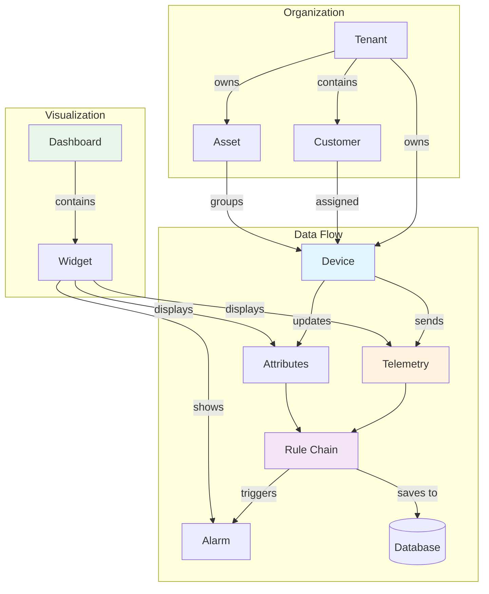

---

## IoT Fundamentals

These are the core concepts you'll encounter in any IoT platform.

### Telemetry

Time-series data sent from devices to the platform. Think of it as "what the device is measuring right now."

**Characteristics:**
- High-volume, append-only data
- Always has a timestamp
- Stored in time-series optimized storage
- Examples: temperature readings, GPS coordinates, power consumption, sensor values

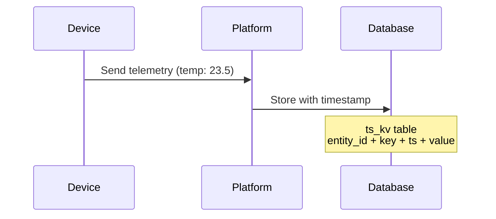

**Example payload:**
```json
{
  "ts": 1609459200000,
  "values": {
    "temperature": 23.5,
    "humidity": 65.2
  }
}
```

### Attributes

Key-value pairs that describe device state or configuration. Unlike telemetry, attributes represent "current state" rather than "measurements over time."

**Three types exist:**

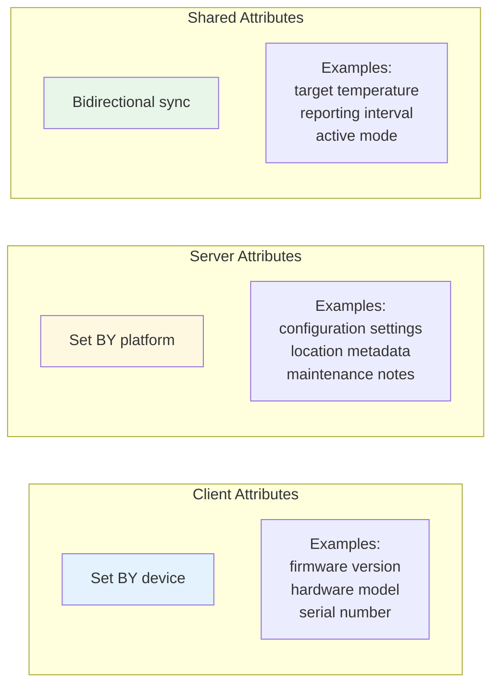

| Type | Set By | Read By | Use Case |
|------|--------|---------|----------|
| Client | Device | Platform | Report device info (firmware version) |
| Server | Platform | Platform | Store metadata (installation date) |
| Shared | Either | Both | Sync settings (reporting interval) |

### RPC (Remote Procedure Call)

Commands sent between the platform and devices. RPC enables bidirectional control.

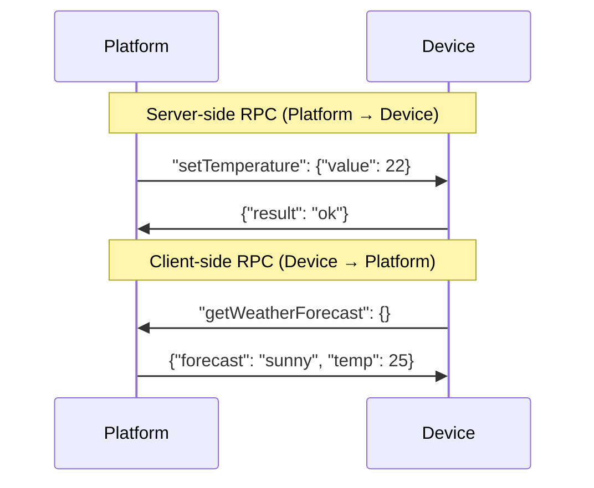

**Two types:**
- **Server-side RPC**: Platform sends command to device, optionally waits for response
- **Client-side RPC**: Device initiates request to platform (less common)

### Provisioning

The process of registering a new device with the platform. This includes:

1. Device authentication setup
2. Credential assignment
3. Initial configuration
4. Profile association

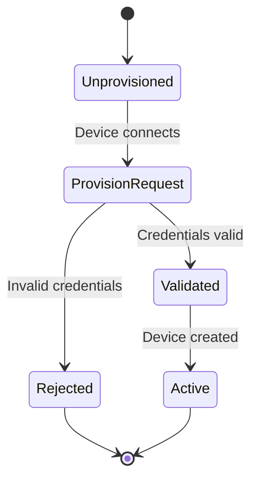

### OTA (Over-the-Air)

Remote firmware or software updates pushed to devices without physical access.

**Process:**
1. Upload package to platform
2. Assign to device profile or individual device
3. Device downloads and applies update
4. Device reports update status

### Gateway

A device that acts as a bridge between the platform and other devices that cannot connect directly.

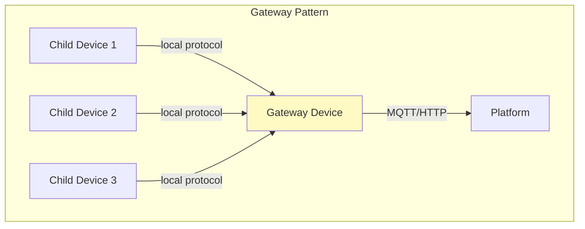

Use cases:
- Bluetooth devices connecting through a WiFi gateway
- Modbus sensors connecting through an industrial gateway
- LoRaWAN devices connecting through a LoRa gateway

### Edge

Computing resources deployed close to devices (on-premises or at network edge) that process data locally before sending to the cloud.

Benefits:
- Reduced latency for time-critical decisions
- Continued operation during network outages
- Reduced bandwidth by filtering/aggregating data locally

---

## Communication Protocols

How devices talk to the platform.

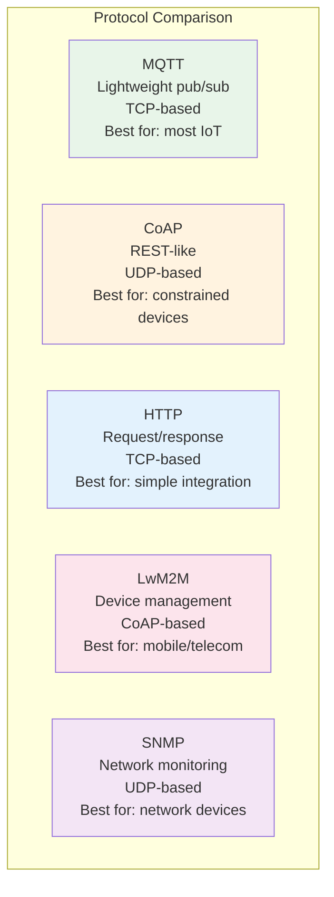

### MQTT

**Message Queuing Telemetry Transport**. Lightweight publish/subscribe protocol designed for IoT.

- Uses topics (like channels) for message routing
- Supports 3 QoS levels (0: at most once, 1: at least once, 2: exactly once)
- Persistent sessions for offline message delivery
- Low bandwidth overhead

**Topic examples:**
```
v1/devices/me/telemetry          # Send telemetry
v1/devices/me/attributes         # Send attributes
v1/devices/me/rpc/request/+      # Receive RPC requests
```

### CoAP

**Constrained Application Protocol**. REST-like protocol for resource-constrained devices.

- Uses UDP instead of TCP (lower overhead)
- RESTful (GET, PUT, POST, DELETE)
- Built-in discovery and observation
- Designed for low-power devices

### LwM2M

**Lightweight Machine-to-Machine**. Device management protocol built on CoAP.

- Standardized object model (device info, connectivity, firmware)
- Bootstrap and registration flows
- Firmware update management
- Used heavily in mobile/telecom IoT

### SNMP

**Simple Network Management Protocol**. Used for monitoring network devices.

- **Polling (GET)**: Platform requests data from device
- **Traps**: Device sends unsolicited alerts to platform
- OID-based data addressing
- Common for routers, switches, printers

---

## Platform Concepts

How the platform organizes data and access.

### Tenant

An isolated organization within the platform. Think of it as a completely separate "account" or "company."

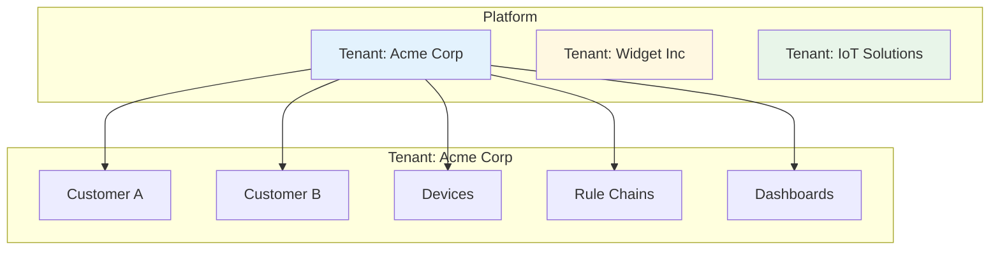

**Key properties:**
- Complete data isolation (tenants cannot access each other's data)
- Separate quotas and limits
- Independent rule chains and dashboards
- Managed by Tenant Admin users

### Customer

A sub-division within a tenant. Tenants can create customers and assign devices/dashboards to them.

**Use cases:**
- End customers in a B2B2C model
- Departments within an organization
- Geographic regions or sites

**Permissions:** Customers have limited permissions compared to tenant administrators.

### Device Profile

A template that defines how devices of a certain type behave:

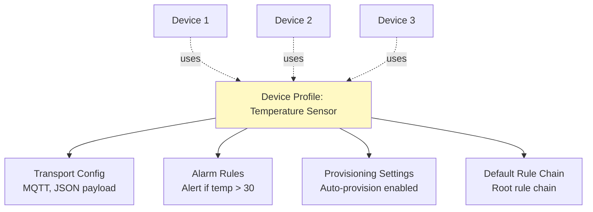

### Asset

A logical entity representing physical or virtual objects (buildings, production lines, vehicles). Assets can:
- Have telemetry and attributes (aggregated from devices)
- Relate to devices via entity relations
- Group devices for organizational purposes

### Entity

Generic term for any first-class object in the platform:
- Device, Asset, Tenant, Customer, User
- Dashboard, Rule Chain, Alarm
- Widget Bundle, OTA Package

Each entity has a unique ID in the format: `{entityType}/{uuid}`

### Entity Relation

A directed connection between two entities.

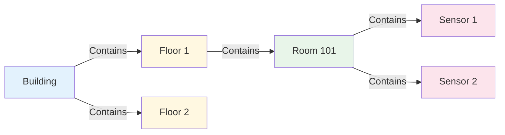

**Common relation types:**
- `Contains`: Parent contains child
- `Manages`: Gateway manages device
- `Uses`: Entity uses another entity

### Dashboard

A container for widgets that visualize data.

- Assigned to customers for controlled access
- Supports real-time updates via WebSocket
- Multiple states (views) within one dashboard
- Mobile-optimized layouts

### Widget

A visualization component within a dashboard.

Types:
- **Charts**: Line, bar, pie, gauge
- **Maps**: Device locations, geofencing
- **Tables**: Telemetry history, alarms
- **Controls**: Buttons, sliders, switches

---

## Rule Engine

The "business logic" layer that processes all incoming data.

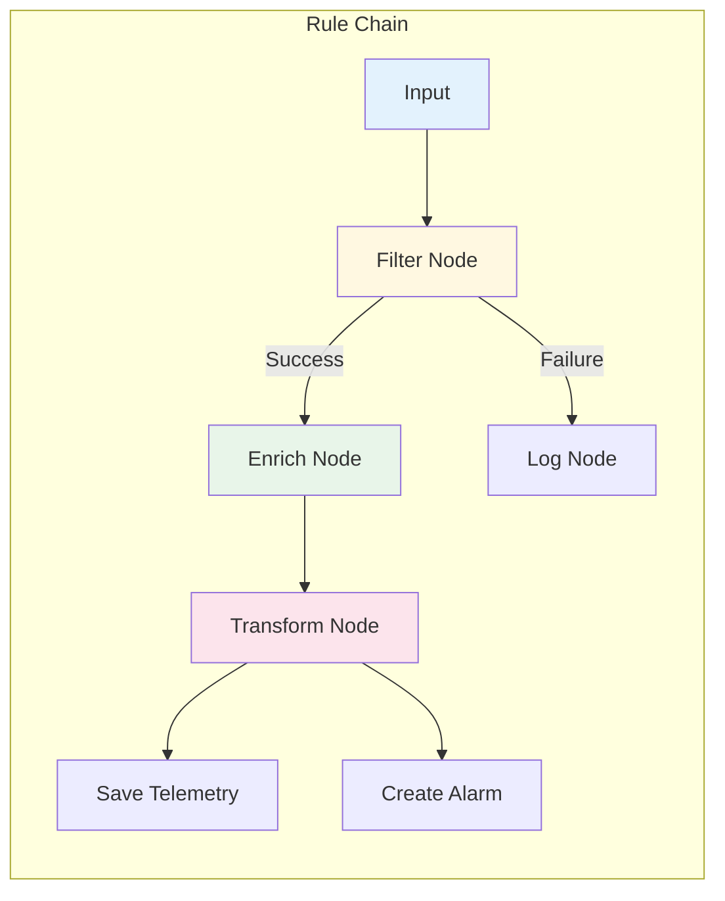

### Rule Chain

A directed graph of processing nodes that handle incoming messages.

- Each tenant has a "root" rule chain (processes all device data by default)
- Can create additional chains for specific device types
- Supports sub-chain invocation (chain calls chain)

### Rule Node

A single processing step in a rule chain.

**Node categories:**
| Category | Purpose | Examples |
|----------|---------|----------|
| Filter | Route messages | Device type filter, script filter |
| Enrichment | Add context | Customer attributes, device metadata |
| Transform | Modify data | Script transform, change originator |
| Action | Perform operations | Save telemetry, create alarm, send email |
| External | Integrate | REST call, Kafka publish, Azure IoT |

### TbMsg

The internal message format that flows through rule chains.

```json
{
  "type": "POST_TELEMETRY_REQUEST",
  "originator": {
    "entityType": "DEVICE",
    "id": "784f3940-2f04-11ec-8f2e-4d7a8c12df56"
  },
  "metadata": {
    "deviceName": "Sensor-001",
    "deviceType": "Temperature Sensor",
    "ts": "1609459200000"
  },
  "data": "{\"temperature\": 23.5}"
}
```

### Message Type

Classification of what triggered a message. Common types:

| Type | Trigger |
|------|---------|
| `POST_TELEMETRY_REQUEST` | Device sent telemetry |
| `POST_ATTRIBUTES_REQUEST` | Device updated attributes |
| `RPC_CALL_FROM_SERVER_TO_DEVICE` | Server-initiated RPC |
| `ACTIVITY_EVENT` | Device connected/disconnected |
| `ALARM` | Alarm created or updated |
| `ENTITY_CREATED` | New entity created |

---

## Runtime Concepts

How the platform executes at runtime.

### Actor

A concurrent processing unit that handles messages sequentially.

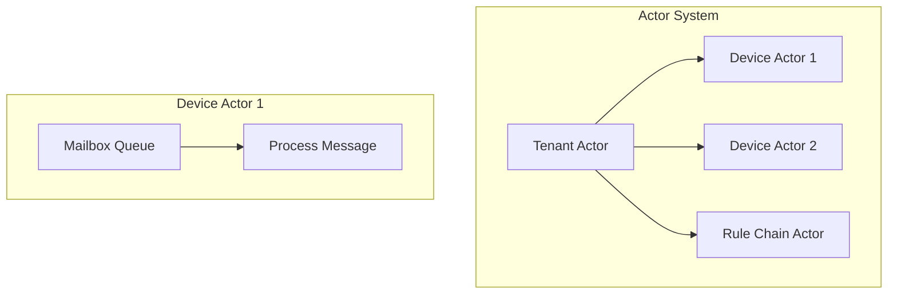

**Key properties:**
- Each device and rule chain has its own actor
- Messages processed one at a time (no race conditions)
- Actors can be distributed across cluster nodes
- Automatic failover and recovery

### Actor Mailbox

The queue of pending messages for an actor. Messages are processed one at a time in order.

### Partition

A subset of data or processing assigned to a specific node in a cluster.

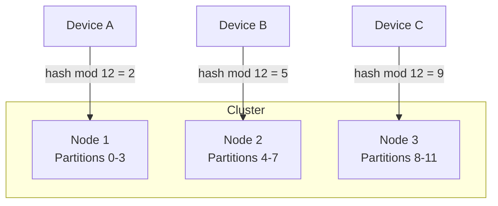

Partitioning enables horizontal scaling by distributing load across nodes.

---

## Data Storage

How data is persisted.

### Time-Series Database

Storage optimized for timestamped data.

**Optimizations:**
- Efficient range queries (e.g., "last 24 hours of temperature data")
- Compression for similar consecutive values
- Automatic partitioning by time
- TTL-based data expiration

### Key-Value Store

Storage for attributes and entity metadata.

**Characteristics:**
- Point queries (e.g., "get device firmware version")
- Low-latency reads
- Optimistic locking for concurrent updates

### TTL (Time-to-Live)

Automatic expiration of old data.

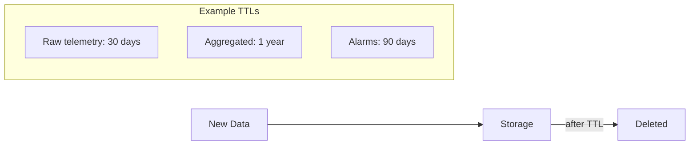

---

## API Concepts

How external systems interact with the platform.

### JWT (JSON Web Token)

Authentication token containing encoded user identity and permissions.

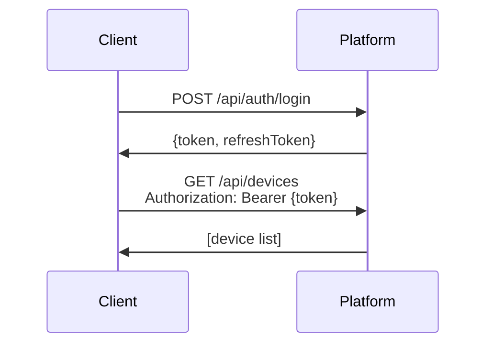

**Token structure:**
- Header: Algorithm and type
- Payload: User ID, tenant, permissions, expiration
- Signature: Verification hash

### WebSocket Subscription

A persistent connection for real-time data updates.

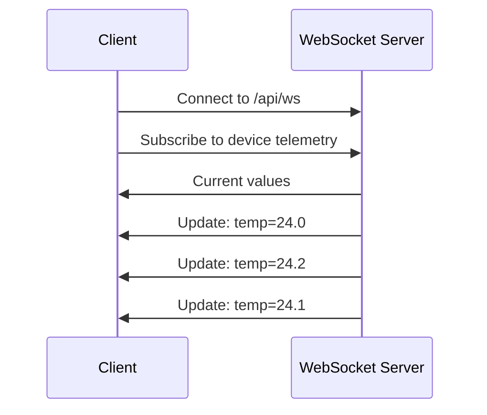

Benefits:
- No polling required
- Immediate updates
- Efficient for dashboards

### Page Link

Pagination mechanism for list queries.

```json
{
  "pageSize": 20,
  "page": 0,
  "sortProperty": "createdTime",
  "sortOrder": "DESC",
  "textSearch": "sensor"
}
```

---

## Quick Reference

### Data Types Summary

| Concept | Volume | Storage | Query Pattern |
|---------|--------|---------|---------------|
| Telemetry | High | Time-series | Range queries |
| Attributes | Low | Key-value | Point queries |
| Alarms | Medium | Relational | Filter + time |
| Relations | Low | Relational | Graph traversal |

### Entity Hierarchy

```
System
└── Tenant
    ├── Tenant Admin (user)
    ├── Customer
    │   └── Customer User
    ├── Device (assigned to customer optional)
    ├── Asset (assigned to customer optional)
    ├── Dashboard (assigned to customer optional)
    ├── Rule Chain
    └── ... other entities
```

---

## See Also

- [System Overview](./01-architecture/system-overview.md) - How these concepts fit together
- [Device Entity](./02-core-concepts/entities/device.md) - Deep dive on devices
- [Telemetry Data Model](./02-core-concepts/data-model/telemetry.md) - Telemetry details
- [Rule Engine](./04-rule-engine/) - Rule chain documentation
- [Entity Types Overview](./02-core-concepts/entities/entity-types-overview.md) - All entity types
